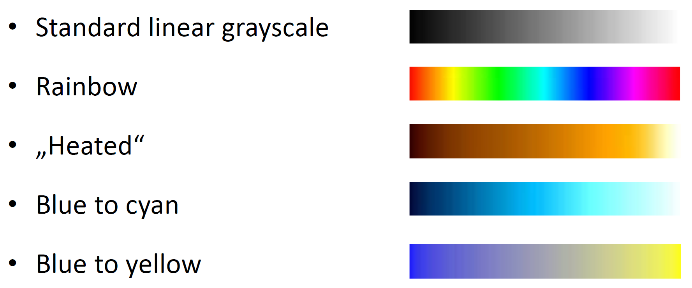
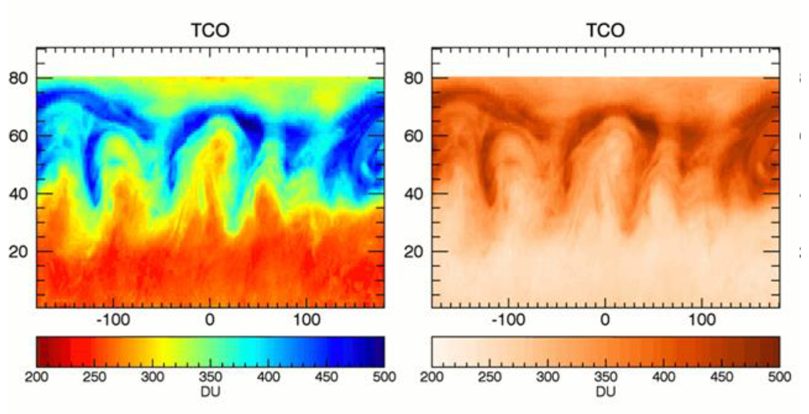
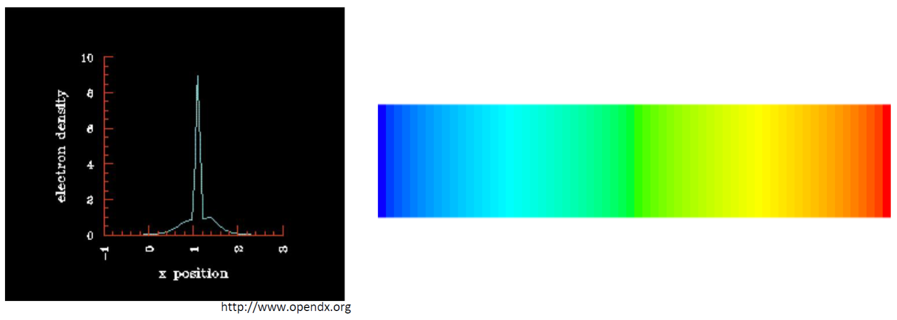
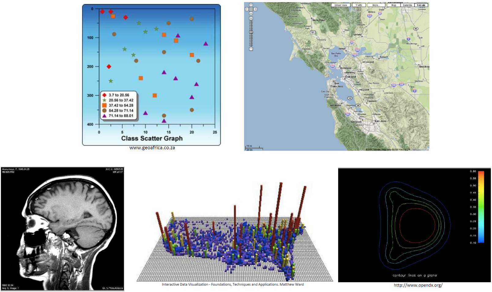
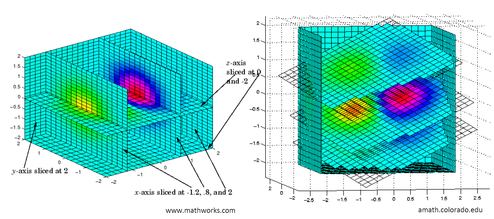
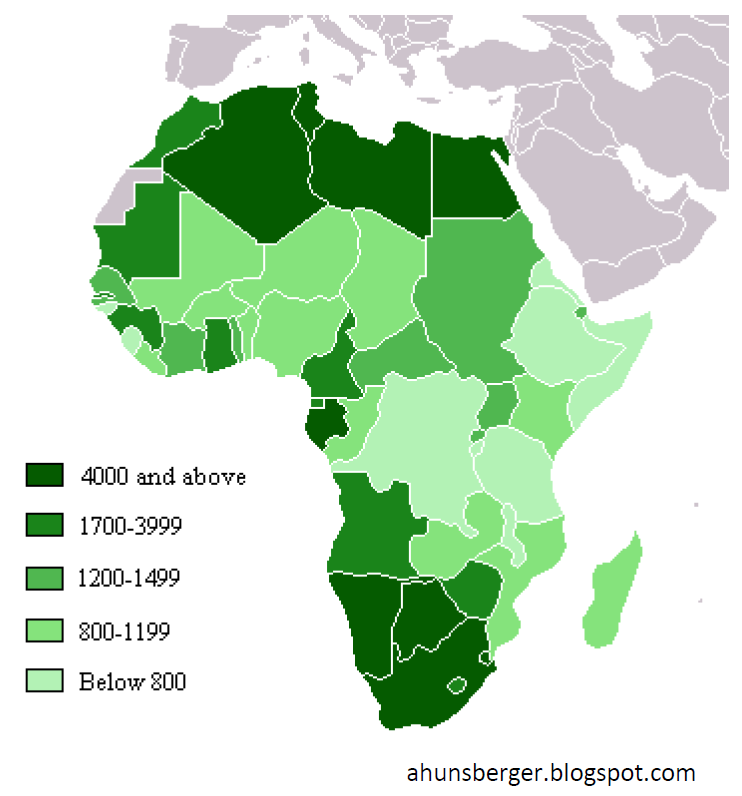
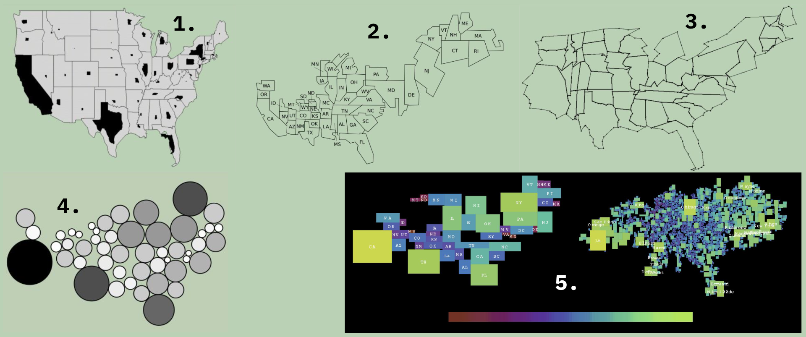

# Základy vizualizace

> [!NOTE]
> Základní metriky pro hodnocení kvality vizualizace, vizuální proměnné. Základní vizualizační techniky pro 1D, 2D, 3D a 4D data. Objemová data – vizualizace explicitních a implicitních povrchů. Geovizualizace – choropletové mapy, kartogramy.
>  
> _PV251, PA214_

Neexistuje jednotná definice vizualizace, ale může to být například "Proces předávání dat grafickou formou", nebo "Nástroj, který umožňuje uživateli vhled do dat".

## Základní metriky pro hodnocení kvality vizualizace

Pro hodnocení kvality vizualizace můžeme použít následující metriky, které se snažíme maximalizovat.

### Efektivita (Effectiveness)

Efektivita je vysoká, pokud je

1. Správně a rychle interpretována
2. Rychle vyrenderována

$M_{eff} = \frac{1}{1 + \text{interpret} + \text{render}}$, kde $0 \leq M_{eff} \leq 1$.

Pokud je $M_{eff} \sim 1$, pak je čas na interpretaci a renderování krátký.

### Expresivita (Expressiveness)

$M_{exp} = \frac{\text{displayed information}}{\text{information to be expressed}}$, kde $0 \leq M_{exp} \leq 1$.

- Pokud je $M_{exp} = 1$, pak je expresivita ideální.
- Pokud je $M_{exp}  < 1$, pak zobrazujeme méně informací, než jsme zamýšleli.
- Pokud je $M_{exp} > 1$, pak zobrazujeme více informací, než bychom měli.

## Vizuální proměnné

Vizuální proměnné se snaží maximalizovat efektivitu a expresivitu vizualizace. Základní vizuální proměnné definuje Bertin a jsou to:

### Pozice

Best case: Každý bod má jednoznačnou pozici.\
Worst case: Všechny body se překrývají.

Lineární vs. logaritmická škála

### Velikost

Bývá problematické rozlišit velikost, pokud je rozdíl malý.

### Tvar

Může být použit pro kategorické proměnné. Tvar zahrnují i písmena, typy čar, atd.

### Jas (value)

Podobně, jako u velikosti je obtížné rozlišit jas, pokud je rozdíl malý.

### Barva (hue)

Lze použít pro kategorické i numerické proměnné.

**Numerické proměnné:**

Je důležité vybrat správnou barevnou škálu. Důležité je myslet na čitelnost i pro barvoslepé.

Ve zdravotnictví se často používá "Rainbow color scale", která ale může vytvářet neexistující rozhraní kolem některých barev, neboť není "perceptually uniform".

**Kategorické proměnné:**

Je důležité vybrat vhodnou paletu barev, která bude snadno rozlišitelná. Více, jak cca 12 barev je v podstatě nemožné spolehlivě rozlišit.

### Orientace

### Textura

### Pohyb

Někdy se přidává k základním 7 vizuálním proměnným. Lze ho připojit k jakékoli z vizuálních proměnných.

## Základní vizualizační techniky prostorových dat

> [!TIP]
> V téhle otázce se autor pravděpodobně maličko jinak kouká na to, co znamená dimenze dat, než je uvedeno ve slidech z PV251. Zde se dimenze dat chápe jako počet proměnných, nikoliv jako počet prostorových dimenzí. Zde uvedená 1D prostorová data mají tedy 2 a více dimenzí, 2D prostorová data mají 3 a více dimenzí a 3D prostorová data mají 4 a více dimenzí.

### 0D (neprostorová) data

Množina hodnot, které nemají žádnou prostorovou interpretaci.

**Numerické proměnné:**

- **Histogram** (seskupíme hodnoty do intervalů a zobrazíme počet hodnot v každém intervalu)

**Kategorické proměnné:**

- **Bar chart** (každá kategorie má svůj sloupec, nebo pruh)
- **Pie chart** (kruhový graf, kde každá kategorie má svůj podíl na celku)

### 1D prostorová data

Sekvence jednodimenzionálních dat s jednou proměnnou.

- **Graf**
- **Barevný pruh**

Pro více proměnných lze použít **Juxtapositioning = Postavení vedle sebe** (více grafů vedle sebe, např. více barevných pruhů pod sebou) a **Superimpositioning = Překrývání** (více dat v jednom grafu, např. více různobarevných čar v jednom grafu).

### 2D prostorová data

- **Scatter plot** (body rozmístěné ve 2D prostoru, proměnné zobrazujeme barvou, tvarem, velikostí, ...)
- **Mapa** (podobně, jako scatterplot, jen používáme jako podklad mapu a skutečné geografické souřadnice, navíc může používat nejen body, ale i čáry a plochy)
- **Obrázek** (proměnné se mapují na barvu / jas v obrázku, hodnoty mezi datovými body interpolujeme)
- **Cityscape** (3D bar chart, kde výška sloupce reprezentuje hodnotu proměnné)
- **Vrstevnice, izobary** (pro zobrazování 2D povrchů)

Pro více proměnných:

- Juxtapositioning: naskládáme na sebe více 2D vizualizací, takže vytvoříme 3D vizualizaci
- Superimpositioning: Překrýváme 2D vizualizace, např. pomocí barvy

2D data je často třeba zjednodušit, např. pomocí agregace, nebo pomocí vizualizace hustoty (histogram).

### 3D prostorová data

- Vizualizace explicitních povrchů (seznam vrcholů, hran a ploch)
- Implicitní povrchy (zero-contour funkce, která definuje, kde je "uvnitř" a "vně" objektu, chceme vykreslit povrch tam, kde je funkce nulová)
- Volumetrické vizualizace

## Volumetrické vizualizace

Využíváme voxely (3D datové body), kde každý voxel má hodnotu (nebo více hodnot).

Pokud nejsou datové body na mřížce, použijeme tzv. **Resampling** (převzorkování) - interpolace hodnot mezi body.

### Slicing

Použijeme rovinu (nebo více rovin), pomocí které provedeme řez objektem. Efektivně tím snižujeme počet dimenzí. Jednotlivé řezy potom můžeme znovu zobrazit ve 3D, připadně umožnit uživateli s nimi interagovat.

### Isosurface

Vytvoříme povrch, kde hodnota je konstantní. Na vytvoření isosurface můžeme použít algoritmy jako Marching Cubes.

### Direct volume rendering

Vykreslíme objemová data přímo. Můžeme použít různé techniky, jako např. ray casting, nebo splatting.
Detailní fungování je popsané v otázce [PGV06](../pgv06_vykreslovani_objemovych_dat).

## Geovizualizace

Mohou zobrazovat nejen body, ale i čáry a plochy.

### Choropletové mapy

Zobrazení hodnoty pro jednotlivé plochy (státy, okresy, ...). Barva plochy reprezentuje hodnotu proměnné. Barva může být buď numerická, nebo kategorická (i kategorizovaná numerická).

Problémem mohou být malé oblasti, které jsou na výsledné mapě tak malé, že z nich nic nevyčteme (například hustě osídlené oblasti).

### Kartogramy

Snaha potlačit problémy choroletových map. Měníme velikost regionu v závislosti na hodnotě proměnné.

Kartogramy jsou několika typů:

1. **Nekontinuální (Noncontinuous) kartogramy** - Nezachovávají topologii, regiony jsou naškálované uvnitř původních oblastí, které omezují maximální zvětšení
2. **Nesouvislé (Noncontiguous) kartogramy** - Škálujeme polygony na požadovanou velikost, polygony tak nezachovávají globální topologii a sousednost
3. **Kontinuální (Continuous) kartogramy** - Zachovávají topologii, mění tvar regionů, ale zachovávají sousednost. Ze všech kartogramů nejlépe zachovávají globální topologii.
4. **Kruhové (Circular) kartogramy** - Každý region je nahrazen kruhem, jehož velikost reprezentuje hodnotu proměnné
5. **Obdélníkové (Rectangular) kartogramy** - Každý region je nahrazen obdélníkem, jehož velikost reprezentuje hodnotu proměnné, snaha umístit obdélník co nejblíž původní pozici.

