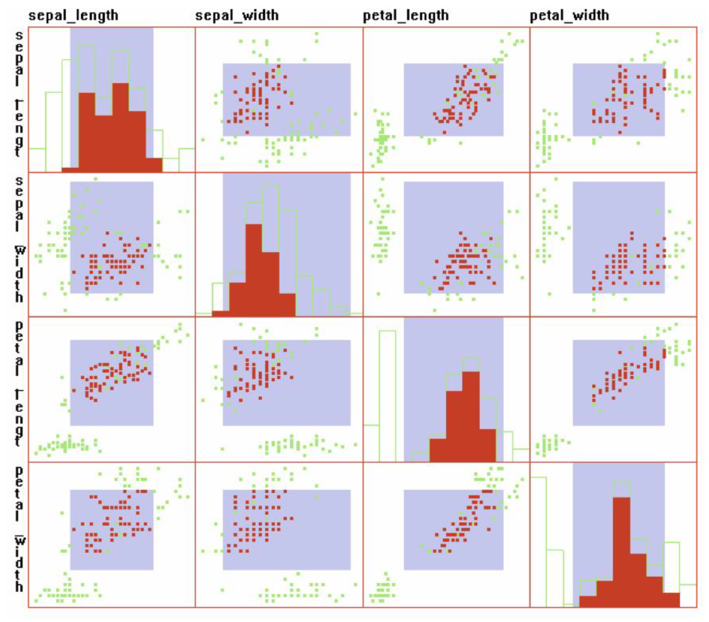
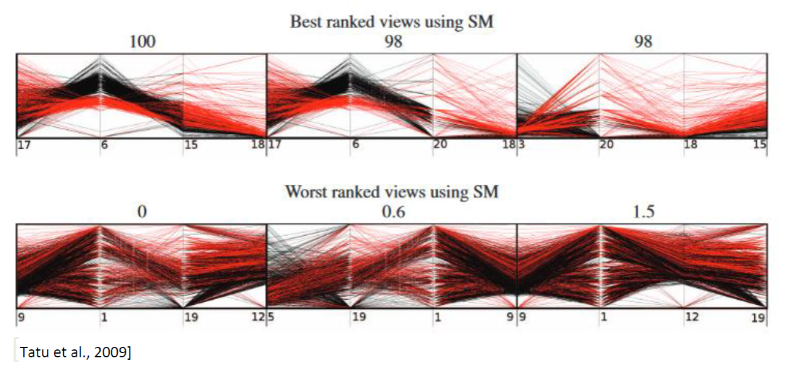
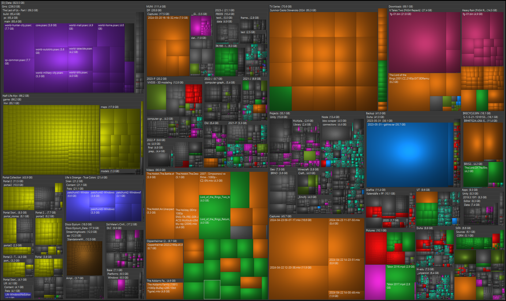
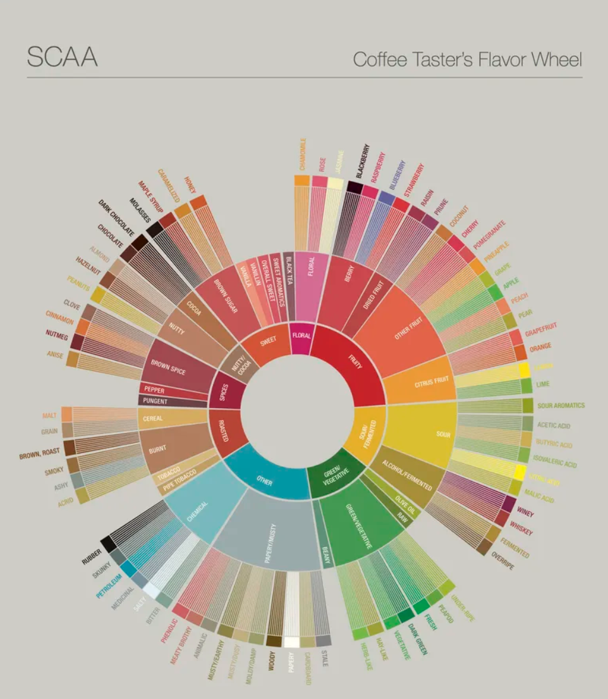

> [!NOTE]
> Vizualizace multidimenzionálních dat – scatterplot matrix, paralelní souřadnice, skládání dimenzí. Vizualizace hierarchických struktur – treemaps, radiální techniky. Základní třídy interakčních technik, techniky používané v prostoru obrazovky, objektu, dat, datových struktur.
>  
> _PV251, PA214_

## Vizualizace multidimenzionálních dat

Vizualizace multidimenzionálních dat řeší, jak vizualizovat data, která pro jediný datový záznam obsahují více informací (např. výška, váha, velikost bot).

### Scatterplot matrix

Scatterplot matrix zobrazuje scatterplot pro každé dva zaznamenané parametry v tabulce.

Scatterplot je graf, který zobrazuje hodnoty dvou proměnných v souřadnicovém systému. Na diagonále jsou typicky zobrazeny histogramy jednotlivých proměnných, nebo jejich popis. Ve scatterplot matrixu je každý scatterplot zobrazený dvakrát, pouze překlopený podle hlavní diagonály.

### Paralelní souřadnice

Paralelní souřadnice je vizualizační technika, která umožňuje zobrazit vícerozměrná data v rovině. Jednotlivé dimenze jsou zobrazeny jako osy, které jsou rovnoběžné. Jednotlivé záznamy jsou zobrazeny jako čáry, které spojují hodnoty jednotlivých dimenzí.

U paralelních souřadnic je důležité seřazení dimenzí. Při špatném seřazení jsou data velmi špatně čitelná. Chceme co nejvíce clusterů čar, které vedou podobným směrem.

### Skládání dimenzí

Skládání dimenzí je technika, která umožňuje zobrazit vícerozměrná data v rovině. Při skládání dimenzí vybereme dvě dimenze, které položíme v mřížce na osy X a Y. Do každého pole v této mřížce nyní provedeme stejnou operaci pro další dvě dimenze. Tento proces opakujeme, dokud nejsou zobrazeny všechny dimenze (vyjma jedné závislé). Poslední závislá dimenze je zobrazena jako barva.

## Vizualizace hierarchických struktur

Některá data mohou být hierarchicky uspořádána. Vizualizace hierarchických struktur se snaží zobrazit tuto hierarchii. (např. souborový strom, kategorie a podkategorie).

### Treemaps

Rekurzivně rozdělujeme obdélník střídavě horizontálními a vertikálními čarami podle hodnoty daného parametru. Obdélníky v treemapách je možné "zhranatit", nebo nechat podlouhlé.

### Sunburst

Způsob zobrazení hierarchie, kde uprostřed jsou kořenové prvky a okolo nich jsou zanořené prvky. Každé úroveň je zobrazena jako nezikruží rozsekané na menší kousky. "Tloušťka" každé výseče určuje hodnotu parametru.

### Další techniky

Node-link diagram, Tree (Klasické zobrazení), Radial Tree (Sunburst, ale strom), Cone Tree (3D), ...

## Interakční techniky

### Základní kategorie

- **Navigace**\
  změna pozice kamery, škálování, rotace; automatická, nebo ovládaná uživatelem
- **Výběr**\
  výběr objektů, oblasti (laso, klikání, vyhledávání) a následná interakce (zvýraznění, smazání, skrytí)
- **Filtrování**\
  redukce množství zobrazených objektů (slidery, skrývání sloupců, ...); filtrace je nepřímá (před vykreslením dat), výběr je přímý (přímo ve vizualizaci)
- **Rekonfigurace**\
  změna mapování dat na grafické atributy (řazení sloupců); snížení počtu dimenzí pomocí PCA (principal component analysis), MDS (multidimensional scaling), ...; Snaha zachovat vztahy mezi daty při snížení dimenzí
- **Změna kódování**\
  tweaking grafických atributů atributů (barvy, velikosti, tvaru, ...); více pohledů na stejná data
- **Spojení**\
  interakce napříč více pohledy (společný výběr pro více vizualizací, filtrování napříč vizualizacemi, ...)
- **Abstrakce/specifikace**\
  změna detailnosti zobrazení (lupa na specifickou část dat, zkreslení [distortion])
- **Hybridní techniky**\
  kombinace více technik

Tyto interakce můžeme aplikovat na různé operandy. Operand interakce je prostor, na který interakci aplikujeme.

> [!TIP]
> Rozdělení mi není úplně 100% jasné, takže budu rád za opravy. Celé slidy čerpají z knihy Interactive Data Visualization: Foundations, Techniques, and Applications, Second Edition (dostupné z [Anna's Archive](https://annas-archive.org/md5/0bf49e061a8b82167d0e05a5d2b50476))

### Techniky pro prostor obrazovky (Pixely)

- **Výběr pixelů**\
  Vybíráme jednotlivé body obrazovky (obdélník, laso, ...)
- **Zkreslení**\
  Mapování pixelů na jiné pixely (zoom, lupa, ...) $(x', y') = f(x, y)$. Zkreslení mohou způsobit kolizi pixelů, nebo naopak díry, které musíme vyřešit interpolací.
  - **Rybí oko**\
    Zvětšení jednoho místa na obrazovce, v podstatě "odstrkujeme pixely" od vybraného bodu $(c_x, c_y)$ logaritmicky podle vzdálenosti od tohoto bodu a síly zkreslení $d$.

### Techniky pro prostor hodnot

Aplikujeme transformaci hodnot na jednotlivé proměnné.

- **Filtrování**\
  Skrývání některých datovách záznamů, nebo celých dimenzí.
- **Řazení**
- **Zkreslení (transformace)**\
  Například škálování, posun. $(d_0', d_1', \dots, d_n') = (j_0(d_0), j_1(d_1), \dots, j_n(d_n))$

### Techniky pro datové struktury (Organizace dat)

Měníme pouze organizaci dat, nikoliv data samotná.

- **Zoom**\
  Načtení detailnějších dat místo manipulace s pixely.
- **Výběr**\
  Výběr celých sekcí (např. jedna větev)
- **Filtrování**\
  Podle struktury dat (jen konkrétní větev stromu, konkrétní čas, ...)
- **Řazení**\
  Typicky problematické u paralelních souřadnic, kde špatné řazení může způsobit, že data nebudou čitelná. Může být buď plně manuální, nebo algoritmické (pak je třeba najít měřítko vhodnosti).

### Techniky pro prostor atributů

- **Filtrování**\
  Skrývání některých atributů, nebo jejich zvýraznění
- **Změna kódování**\
  Úprava barevné škály, barev, ...

### Techniky pro objekt (3D povrch)

- **Navigace**\
  Otáčení, kamera, ...
- **Perspective walls**\
  Vizualizační metoda pro navigaci ve velkém množství dat.
