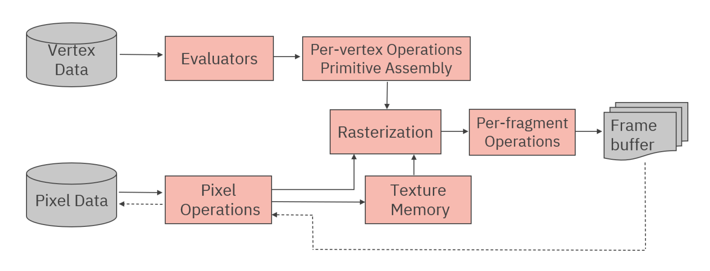
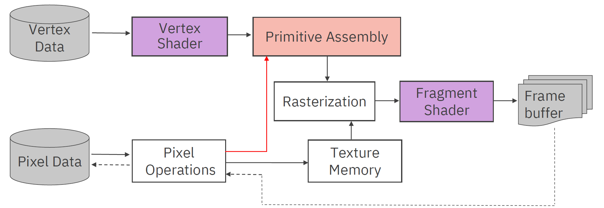
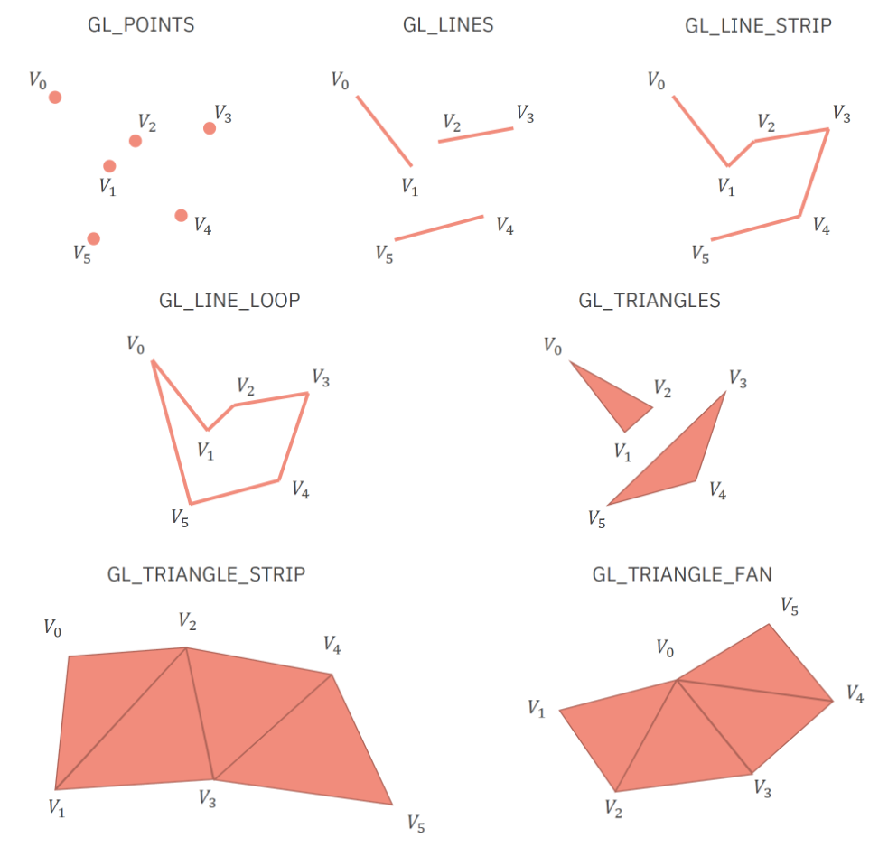
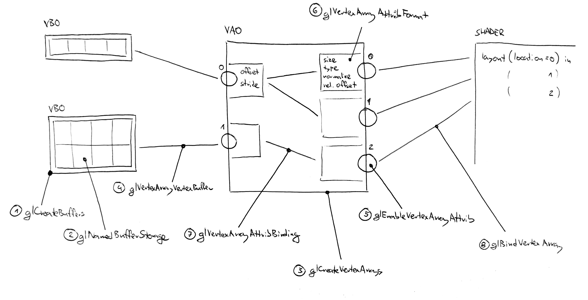
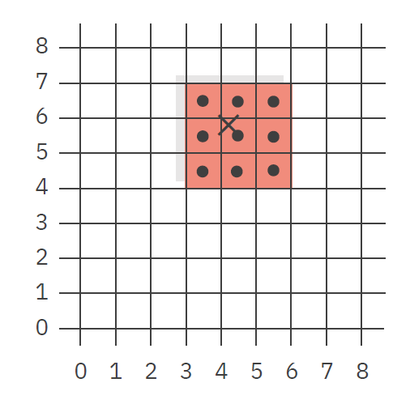
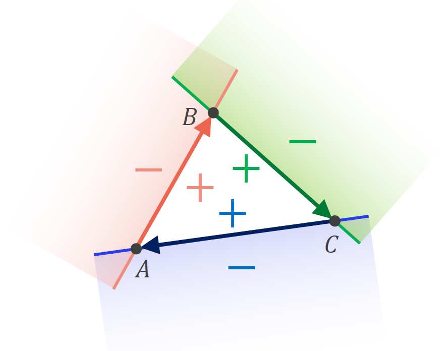
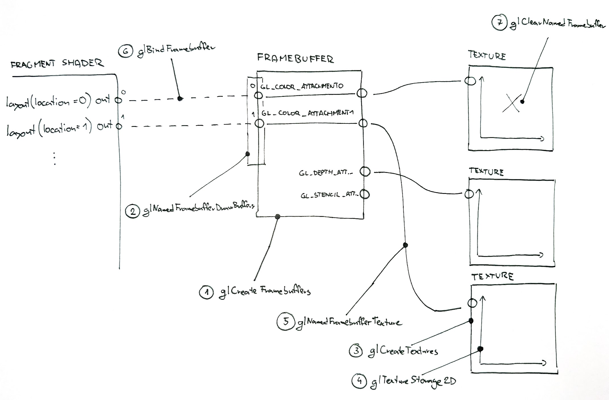

<dl><dt><strong>📌 NOTE</strong></dt><dd>

OpenGL blokový diagram, GLSL – vertex a fragment shader. Vytvoření GLSL programu. Základní typy vstupních a výstupních proměnných. Druhy grafických primitiv. Vertex Buffer Objects a Vertex Array Objects. Princip rasterizace, framebuffer. Textury: mapování, filtrování, syntéza.

_PB009, PA010, PV112, PV227_

</dd></dl>

## OpenGL blokový diagram



Blokový diagram je abstraktní, high-level popis fungování OpenGL [pv112](#pv112).

- **_Evaluators_** - aproximace křivek a povrchů
- **_Per-vertex operations_** - operace prováděné nad každým vrcholem - transformace, projekce z [model space do camera space](../modelovani-a-projekce), osvětlení jednotlivých vrcholů
- **_Primitive assembly_** - sestavení primitiv (body, čáry, trojúhelníky) z vrcholů, projekce do screen space a ořezání
- **_Rasterization_** - převod primitiv na fragmenty (2D obdélníky s informací o barvě, hloubce, ...) a interpolace hodnot mezi vrcholy
- **_Per-fragment operations_** - operace prováděné nad každým fragmentem a jejich uložení do frame bufferu - osvětlení, texturování, blending, testy (scissor, alpha, stencil, depth)
- **_Pixel operations_** - operace nad pixely (škálování, konverze barev, ...), typicky se neprovádí při samotném renderu, ale při přípravě textur
- **_Texture memory_** - po provedení pixel operations se výsledek uloží sem

Operace se provádějí paralelně na GPU a využívá se tzv. pipeliningu, kdy se jednotlivé operace provádějí postupně a nezávisle na sobě (_jakmile se uvolní místo v některém okýnku, můžou do něj přijít další data_).

## GLSL - vertex a fragment shader



Části původní pipeline můžeme nahradit Vertex a Fragment shadery. Shader je malý program, který se kompiluje a spouští na GPU. Výsledkem je, že můžeme upravit chování OpenGL pipeline podle svých potřeb.

- **_Vertex shader_** - program, který se spouští nad každým vrcholem. Můžeme zde provádět transformace, osvětlení, deformace, ...
- **_Fragment shader_** - program, který se spouští nad každým fragmentem. Můžeme zde provádět osvětlení, texturování, blending, ...

GLSL shadery dohromady tvoří GLSL program, který se kompiluje a spouští na GPU. Paralelně lze spustit pouze jeden program na více vrcholech nebo fragmentech.

Každý shader může odsahovat jedinou funkci `main`, která se spustí nad každým vrcholem nebo fragmentem.

## Vytvoření GLSL programu

Vytvoření GLSL programu se skládá z několika kroků:

1. Vytvoření shaderových objektů
   - `glCreateShader`
   - Specifikujeme typ shaderu (`GL_VERTEX_SHADER`, `GL_FRAGMENT_SHADER`, `GL_GEOMETRY_SHADER`, `GL_TESS_CONTROL_SHADER`, `GL_TESS_EVALUATION_SHADER`, `GL_COMPUTE_SHADER`)
   - Dostaneme identifikátor shaderu
   - _Koupíme si flashdisk_
2. Načtení zdrojového kódu shaderů
   - `glShaderSource`
   - Předáme identifikátor shaderu a zdrojový kód
   - _Nahrajeme zdrojáky na flashdisk_
3. Kompilace shaderů
   - `glCompileShader`
   - Předáme identifikátor shaderu
   - _Zkompilujeme zdrojáky na flashdisku_
4. Vytvoření programu
   - `glCreateProgram`
   - Dostaneme identifikátor programu
   - _Koupíme si počítač_
5. Připojení shaderů k programu
   - `glAttachShader`
   - Předáme identifikátor programu a identifikátor shaderu
   - _Připojíme flashdisk k počítači_
6. Linkování programu
   - `glLinkProgram`
   - Předáme identifikátor programu
   - _Nakopírujeme zkompilované programy ze všech připojených flashdisků na počítač_
7. Cleanup
   - Po tomhle kroku už můžeme odpojit a smazat shadery
   - `glDetachShader`, `glDeleteShader`
   - _Odpojíme flashdisky a smažeme je_
8. Informování OpenGL, že chceme použít tento program
   - `glUseProgram`
   - Předáme identifikátor programu
   - _Spustíme program na počítači_


## Základní typy vstupních a výstupních proměnných

### Podle způsobu předávání dat

- **_Vertex shader_**
- `in` - vstupní proměnné, které se předávají z aplikace do shaderu
- `out` - výstupní proměnné, které se předávají z vertex shaderu do fragment shaderu
- `uniform` - konstantní proměnné, které se předávají z aplikace do shaderu
- **_Fragment shader_**
- `in` - vstupní proměnné, které se předávají z vertex shaderu do fragment shaderu
- `out` - výstupní proměnné, které se předávají z fragment shaderu do framebufferu
- `uniform` - konstantní proměnné, které se předávají z aplikace do shaderu

### Podle datového typu

- `float`, `double`, `int`, `uint`, `bool` - skalární typy
- `vec2`, `vec3`, `vec4` - vektorové typy
- `$vec2`, `§vec3`, `$vec4` - kde `$` je `b`, `i`, nebo `u` - vektory s boolean / celočíselnými / uint složkami
- `mat2`, `mat3`, `mat4` - matice
- `sampler1D`, `sampler2D`, `sampler3D`, `samplerCube` - textury
- struktury, pole, ...
- **Přístup k jednotlivým složkám vektoru**
- `v.x`, `v.y`, `v.z`, `v.w`
- `v.r`, `v.g`, `v.b`, `v.a`
- `v.s`, `v.t`, `v.p`, `v.q`
- `v[0]`, `v[1]`, `v[2]`, `v[3]`

Můžeme použít také tzv. swizzling, kdy můžeme vytvořit nový vektor z existujícího

`v.xy`, `v.zw`, `v.xxyy`, `v.zzzz`, ...

- **Struktury**

```glsl
struct Light {
    vec3 position;
    vec3 color;
    float intensity;
};
```

Pozor na zarovnání struktur, které může způsobit problémy při předávání dat z CPU na GPU. Vždy definujeme standard, kterým se struktury zarovnávají:

```glsl
struct Light {
    vec3 position;
    vec3 color;
    float intensity;
};

layout(binding = 0, std140) uniform Lights {
    Light lights[10];
};
```

- **Pole**

```glsl
float data[10];
```

## Druhy grafických primitiv

- **_Body_** - `GL_POINTS`
- **_Čáry_** - `GL_LINES`, `GL_LINE_STRIP`, `GL_LINE_LOOP`
- **_Trojúhelníky_** - `GL_TRIANGLES`, `GL_TRIANGLE_STRIP`, `GL_TRIANGLE_FAN`



Typ primitivu nastavíme funkcí `glDrawArrays` nebo `glDrawElements` až při renderu.

## Vertex Buffer Objects a Vertex Array Objects



### Vertex Buffer Object (VBO)

VBO je místo v paměti GPU, kam ukládáme data vrcholů. VBO sám o sobě neobsahuje informace o struktuře dat, ale pouze data samotná.

### Vertex Array Object (VAO)

VAO je objekt, který obsahuje informace o struktuře dat v paměti GPU. VAO propojuje 1..n VBO a určuje, jak se mají data z VBO interpretovat. _VAO je tedy taková vazební tabulka m..n mezi daty uloženými ve VBO a binding pointy ve Vertex shaderu. Každé VBO může být napojené na libovolné množství VAO, ale každý binding point musí mít právě jeden VBO._

Na "vstupu" VAO (binding point) můžeme mít několik VBO, které obsahují různé atributy vrcholů (pozice, normály, barvy, ...). U každého vstupu nastavujeme offset a stride, které nás vždy odkáží na začátek dat pro každý jeden vrchol.

- **Příklad 1**

Naše data vypadají takto:

```
Buffer 1:

Vertex 1                 Vertex 2                 Vertex 3
+---+---+---+---+---+---++---+---+---+---+---+---+
| X | Y | Z | R | G | B || X | Y | Z | R | G | B | ...
+---+---+---+---+---+---++---+---+---+---+---+---+
```

Pak chceme napojit naši strukturu na VBO takto:

```
- Binding 0
    - Buffer: &buffer1
    - Offset: 0
    - Stride: 6 * sizeof(float)

* Attribute 0
* Size: 3
* Type: GL_FLOAT
* Normalized: GL_FALSE
* Offset: 0
* Attribute 1
* Size: 3
* Type: GL_FLOAT
* Normalized: GL_FALSE
* Offset: 3 * sizeof(float)

Binding 0 => Attribute 0 (pozice)
Binding 0 => Attribute 1 (barva)
```

- **Příklad 2**

Naše data vypadají takto:

```
Buffer 1:

Vertex 1     Vertex 2           Vertex n     Vertex 1     Vertex 2
+---+---+---++---+---+---+      +---+---+---++---+---+---++---+---+---+
| X | Y | Z || X | Y | Z | ...  | X | Y | Z || R | G | B || R | G | B | ...
+---+---+---++---+---+---+      +---+---+---++---+---+---++---+---+---+

Buffer 2:

Vertex 1 Vertex 2
+---+---++---+---+
| U | V || U | V | ...
+---+---++---+---+
```

Pak chceme napojit naši strukturu na VBO takto:

```
- Binding 0
    - Buffer: &buffer1
    - Offset: 0
    - Stride: 3 * sizeof(float)

* Binding 1
* Buffer: &buffer1
* Offset: 3 * sizeof(float) * n (number of vertices)
* Stride: 3 * sizeof(float)
* Binding 2
* Buffer: &buffer2
* Offset: 0
* Stride: 2 * sizeof(float)
* Attribute 0
* Size: 3
* Type: GL_FLOAT
* Normalized: GL_FALSE
* Offset: 0
* Attribute 1
* Size: 3
* Type: GL_FLOAT
* Normalized: GL_FALSE
* Offset: 0
* Attribute 2
* Size: 2
* Type: GL_FLOAT
* Normalized: GL_FALSE
* Offset: 0

Binding 0 => Attribute 0 (pozice)
Binding 1 => Attribute 1 (barva)
Binding 2 => Attribute 2 (uv souřadnice)
```

## Princip rasterizace

Z Primitive assembly dostáváme bod, čáru, nebo trojúhelník, který potřebujeme převést na fragmenty (pixely, typicky čtvercové). Každému fragmentu přidělíme barvu a hloubku (Z-value) = fragment’s associated data. Fragment definujeme integerovými souřadnicemi jeho levého dolního bodu (pozor na 0.5 offset).

- **Bod**\
  Při rasterizaci bodu vykreslíme čtverec o hraně `gl_PointSize` zaokrouhlený na celé pixely.



- **Úsečka**\
  Při rasterizaci úsečky použijeme Bresenhamův algoritmus [pb009](#pb009). Poslední bod úsečky zůstane nevykreslený (half-open) kvůli návaznosti na další úsečky.

```cpp
// From the solution of PB009

void Application::bresenham(glm::vec2 start, glm::vec2 end, Raster& raster, Color color) {
    // delta of exact value and rounded value of the dependent variable
    int D = 0;

    // slopes
    const int dx = static_cast<int>(fabs(end.x - start.x));
    const int dy = static_cast<int>(fabs(end.y - start.y));

    // slope scaling factors to avoid floating points
    const int dx2 = 2 * dx;
    const int dy2 = 2 * dy;

    // increment direction
    const int ix = start.x < end.x ? 1 : -1;
    const int iy = start.y < end.y ? 1 : -1;

    int x = static_cast<int>(start.x);
    int y = static_cast<int>(start.y);

    if (dx >= dy) {
        while (true) {
            raster.set_pixel_color(x, y, color);
            if (x == end.x)
                break;
            x += ix;
            D += dy2;
            if (D > dx) {
                y += iy;
                D -= dx2;
            }
        }
    } else {
        while (true) {
            raster.set_pixel_color(x, y, color);
            if (y == end.y)
                break;
            y += iy;
            D += dx2;
            if (D > dy) {
                x += ix;
                D -= dy2;
            }
        }
    }
}
```

- **Trojúhelník**

Při rasterizaci trojúhelníku můžeme použít Pinedaův algoritmus [pb009](#pb009). Pro každý trojúhelník zjistíme jeho bounding box a pro každý pixel v bounding boxu pomocí edge function zjistíme, zda leží uvnitř trojúhelníku.

Edge function využívá vlastností dot-productu: $E_{ABP} = (A - B).x * (P - B).y - (A - B).y * (P - B).x$. Výsledek funkce může být kladný, záporný, nebo nulový. Pokud je výsledek kladný, bod leží vlevo od úsečky AB, pokud je záporný, bod leží vpravo od úsečky AB, pokud je nulový, bod leží na úsečce AB. Edge funkci můžeme zkontrolovat pro všechny hrany trojúhelníka a pokud se znaménka rovnají (akceptujeme 0 pro kladná i záporná), bod leží uvnitř trojúhelníka a vykreslíme ho.



## Framebuffer



Framebuffer definuje, kam se ukládají výsledné pixely. Framebuffer může obsahovat více barevných bufferů, hloubkový buffer, stencil buffer, ... Každý buffer může mít svůj vlastní formát a velikost. Místo framebufferu můžeme nabindovat přímo obrazovku (defaultní framebuffer).

Framebuffer vypadá navenek velice podobně, jako VAO. Můžeme propojovat binding pointy z fragment shaderu s jednotlivými texturami (tentokrát ale 1..1 [ref?]).

## Textury

Textura je obraz, který se aplikuje na povrch objektu. Textura může být 1D, 2D, 3D, nebo cube map. Textura se skládá z texelů (=pixelů textury). U 2D textur se texely souřadnicují pomocí (u, v) souřadnic, kde hodnoty u a v jsou v intervalu [0, 1].

- **Problémy**
- **_Aliasing_** - pokud se texel textury nepřesně mapuje na fragment, může dojít k aliasingu
- **_Paměťová náročnost_** - textury mohou být velké a mohou zabírat hodně paměti

### Mapování

Textura se mapuje na objekt pomocí texturovacích souřadnic (UV), které se interpolují mezi vrcholy trojúhelníku. Mapování provádíme typicky ve fragment shaderu (interpolace probíhá při rasterizaci).

### Filtrování

- `GL_NEAREST` - nejbližší texel, zachovává pixelizaci
- `GL_LINEAR` - lineární interpolace mezi texely, vyhlazuje pixelizaci
- `GL_$1_MIPMAP_$2` - kde `$1` určuje chování v rámci jedné mipmapy a `$2` chování mezi mipmapami (obě mohou být `NEAREST` nebo `LINEAR`)

Pokud nepracujeme s pixel-artovou grafikou je ideální použít `GL_LINEAR_MIPMAP_LINEAR`.

Mipmapy jsou snížené verze textury. Mipmapy zrychlují vykreslování textur a zlepšují kvalitu textur při velkém zmenšení. Lze je vytvořit automaticky (`glGenerateMipmap`) nebo ručně nahráním menších verzí textury.


### Syntéza

Textury lze nahrávat ručně, nebo je generovat "on the fly" pomocí fragment shaderu. Pro generování lze použít např. Perlinův šum, Voronoi diagram, ...

Výhodami syntetizovaných textur je:

- malá paměťová náročnost
- dobrá návaznost na hranách geometrie, pokud syntetizujeme 3D texturu
- parametrizovatelnost

<dl><dt><strong>📌 NOTE</strong></dt><dd>

Není na první pohled jasné, co je zamýšleno pod pojmem "syntéza textur". Pravděpodobně jsou myšleny popsané techniky generování textur pomocí shaderů. Jak ale podotknul Honza Byška, syntéza textur z definice popisuje proces vytváření velké textury z malých fragmentů jiných textur (listnatou louku z jednotlivých listů, kamenou dlažbu z kamenů, ...). Pro více informací koukněte na [synthesis1](#synthesis1) a [synthesis2](#synthesis2).

</dd></dl>

## Zdroje

- [[[pv112,1]]] Byška: PV112 Computer Graphics API
- [[[pb009,2]]] Byška: PB009 Principles of Computer Graphics
- [[[glsl_tutorial,3]]] https://cgvr.cs.uni-bremen.de/teaching/cg2_07/literatur/glsl_tutorial/index.html
- [[[synthesis1,4]]] https://en.wikipedia.org/wiki/Texture_synthesis
- [[[synthesis2,5]]] https://diglib.eg.org:8443/server/api/core/bitstreams/90ad4c13-45b1-4ec0-8ef2-76075b2c73ae/content
