<dl><dt><strong>📌 NOTE</strong></dt><dd>

Konvexní obaly, konstrukce ve 2D a 3D. Voroného diagramy, Delaunayova triangulace, dualita, triangulace, triangulace s omezením. Prostorové vyhledávání (datové struktury, algoritmy).

_MA017, PA093_

</dd></dl>

<dl><dt><strong>💡 TIP</strong></dt><dd>

Většina algoritmů je výborně popsaná na webu předmětu [MA017 Geometrické algoritmy](https://is.muni.cz/auth/do/sci/UMS/el/geometricke-alg/index.html) včetně interaktivních animací a ukázek.

</dd></dl>

## Konvexní obaly

Konvexní obal je nejmenší konvexní mnohoúhelník, který obsahuje všechny body z dané množiny bodů.

### Naivní algoritmus

Pokud hledáme konvexní obal, pak můžeme postupně vyzkoušet všechny dvojice bodů $(p, q)$ a pro každou ověřit, že vlevo od ní (pomocí [edge funkce](../zaklady_pocitacove_grafiky)) neleží žádný bod. Úsečky, pro které toto platí jsou poté součástí konvexního obalu.

Tento algoritmus je velice hloupý a má složitost $O(n^3)$, kde n je počet bodů.

### Sweep Line

Pro hledání konvexního obalu existují efektivnější algoritmy. Jeden z nich je postaven na principu hledání horní a dolní hranice konvexního obalu.

Seřadíme si všechny body podle vzrůstající souřadnice X. Poté řešíme horní a dolní obálku zvlášť. Oba algoritmy jsou obdobné, proto popíšu postup pouze pro horní obálku:

Pro horní obálku si vytvoříme prázdný zásobník. Postupně procházíme body a pro každý bod uděláme následující:

1. Přidáme bod na zásobník.
2. Dokud na zásobníku máme alespoň 3 body a tyto tři body netvoří "zatáčku vpravo", odstraníme prostřední bod ze zásobníku. Toto ověříme opět pomocí [edge funkce](../zaklady_pocitacove_grafiky).

image::./img/pgv04_hull_upperlower_invalid.png[width=400]

Tento algoritmus má složitost $O(n \log n)$, kde n je počet bodů.

### Gift wrapping

Další algoritmus pro hledání konvexního obalu je tzv. _gift wrapping_ (obalování dárku). Algoritmus je založen na tom, že postupně "obalujeme" body konvexním obalem.

Vybereme bod s nejmenší souřadnicí X a přidáme ho do konvexního obalu. Poté postupně procházíme všechny body a pro každý bod uděláme následující:

1. Spočítáme úhel mezi posledním bodem v konvexním obalu a všemi zbývajícími body.
2. Vybereme bod s největším úhlem (vůči ose Y) a přidáme ho do konvexního obalu.
3. Opakujeme, dokud se nevrátíme zpět na začátek.

Tento algoritmus má složitost $O(n h)$, kde n je počet bodů a h je počet bodů v konvexním obalu. V nejhorším případě může mít složitost $O(n^2)$. Tento algoritmus je výhodný, pokud očekáváme, že konvexní obal bude mít málo bodů (méně, než $O(\log n)$).

### Další 2D algoritmy

- **Graham scan** (podobný, jako sweepline, jen seřadíme body podle úhlu, nikoliv podle souřadnice X)
- **Incremental algorithm** (na začátku vybereme trojúhelník a ten postupně rozšiřujeme o body, které jsou vně)
- **Divide and conquer** (rozdělíme na dvě části, najdeme konvexní obaly pro obě části a spojíme je pomocí společných horních a dolních tečen)

### Konvexní obal v 3D

Problém konvexního obalu ve 3D je výrazně komplikovanější (a popravdě se na FI ani v jednom předmětu neučí...). Pro jeho konstrukci můžeme použít například algoritmus _QuickHull_ [so_hull_3d](#so_hull_3d).

1. Zvolíme trojúhelník 3 bodů
   - Bod s minimálními souřadnicemi $(x, y, z)$
   - Nejvzdálenější bod od tohoto bodu
   - Nejvzdálenější bod od této hrany
2. Zbytek algoritmu opět řešíme pro "horní a dolní obálku" zvlášť (body na přední a zadní straně trojúhelníka).
3. Najdeme nejvzdálenější bod od aktuálního obalu a pro něj provedeme:
   - Odstraníme všechny stěny viditelné z daného bodu
   - Nahradíme je novými stěnami mezi novým bodem a _horizon ridge_ (hranice viditelných stěn)
4. Opakujeme, dokud nejsou všechny body uvnitř obalu.

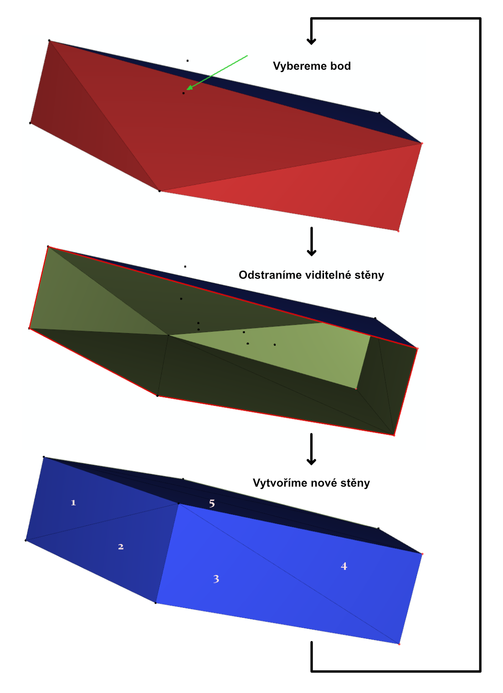

Tento algoritmus má složitost $O(n \log n)$, kde n je počet bodů.

## Voroného diagramy

Voroného diagram je rozdělení roviny na oblasti podle nejbližších bodů. Každá oblast obsahuje jeden bod a všechny body v této oblasti jsou mu nejbližší.

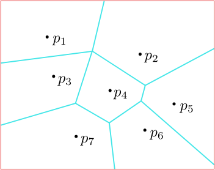

### Naivní algoritmus

Oblast kolem každého bodu můžeme získat, jako průnik polorovin vytvořených přímkou uprostřed mezi tímto bodem a všemi ostatními body. Složitost nalezení jedné takové oblasti je $O(n \log n)$ (kvůli hledání průniku) a celková složitost je $O(n^2 \log n)$.

### Inkrementální algoritmus

Tento algoritmus je založen na postupném přidávání bodů (Doporučuji kouknout na [toto video](https://www.youtube.com/watch?v=By_VJMXKVXk)). Vybereme počáteční bod a postupně přidáváme body. Pro každý bod uděláme následující:

1. Najdeme polygon, do kterého bod patří.
2. Původní polygon rozdělíme na dva podle příčky mezi původním bodem a novým bodem.
3. Pro všechny polygony sousedící s novým polygonem uděláme totéž.
4. Opakujeme, dokud nejsou všechny body přidány.

Tento algoritmus má složitost $O(n^2)$.

### Divide and conquer

Další možností je rozdělit rovinu na dvě části a pro každou část udělat Voroného diagram. Poté spojit obě části pomocí společné hrany.

Poloviny určíme podle souřadnice X. Při spojování poté najdeme tzv _separating chain_. Všechny hrany z Vor(L) na pravé straně separating chain a všechny hrany z Vor(R) na levé straně separating chain zahodíme.

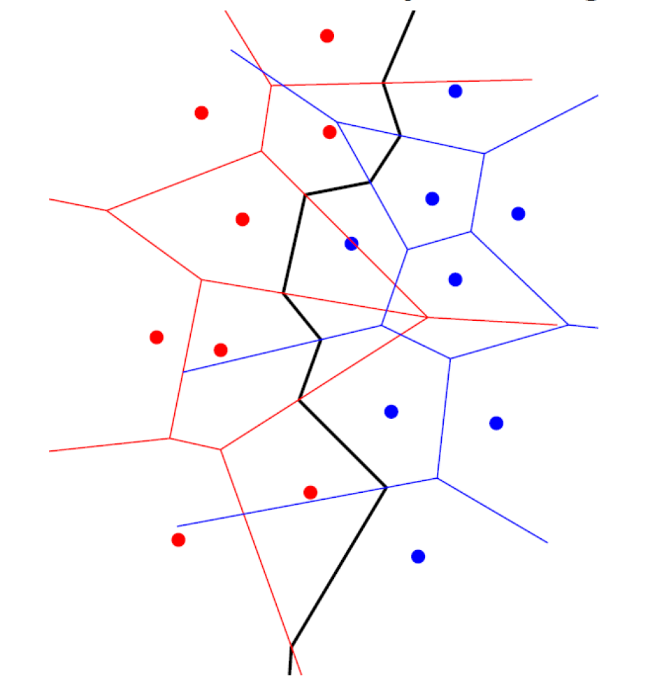

Separating chain vytvoříme následovně:

1. Najdeme convex hull pro body z obou polovin.
2. Najdeme horní a dolní tečny pro oba konvexní obaly.
3. Začneme horní tečnou, vytvoříme kolmici jejím středem směrem dolů a postupujeme, dokud nenarazíme na hranu konvexního obalu.
4. Na této hraně zjistíme dva body, v jejichž oblastech budeme pokračovat a vytvoříme další kolmici.
5. Opakujeme, dokud se nedostaneme na konec.

Tento algoritmus má složitost $O(n \log n)$.

### Sweep Line

Nejznámnějším algoritmem je Sweep Line. V algoritmu využíváme tzv. Beach line, což je křivka složená z parabol, která se nachází na sweeplinou.

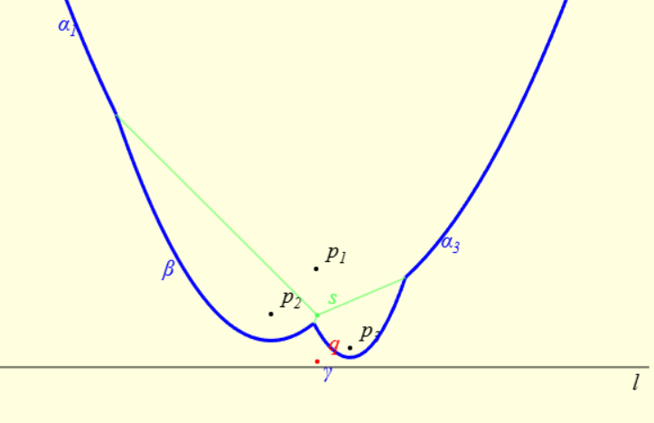

Při pohybu sweepline může dojít ke dvěma druhům událostí:

- **Site event (přechod bodu)**
  - K této události dojde, pokud sweepline narazí na nový bod
  - Na beach line vznikne nová parabola, který může rozdělit některé paraboly na dvě křivky
- **Circle event (zánik křivky)**
  - K této události dojde, pokud zaniká jeden ze segmentů paraboly
  - Pokud se 3 segmenty paraboly protínají v jednom bodě
  - V tomto bodě vzniká nový vrchol Voroného diagramu

Detailní popis algoritmu je na webu [Geometrických algoritmů](https://is.muni.cz/auth/do/sci/UMS/el/geometricke-alg/pages/09-diagramy.html). Tento algoritmus má složitost $O(n \log n)$.

### Převod Delaunayovy triangulace na Voroného diagram

Pokud již máme k dispozici Delaunayovu triangulaci, můžeme snadno získat Voroného diagram. Stačí pro každů trojúhelník najít střed kružnice opsané a spojit středy těchto kružnic podle sousednosti trojúhelníků.

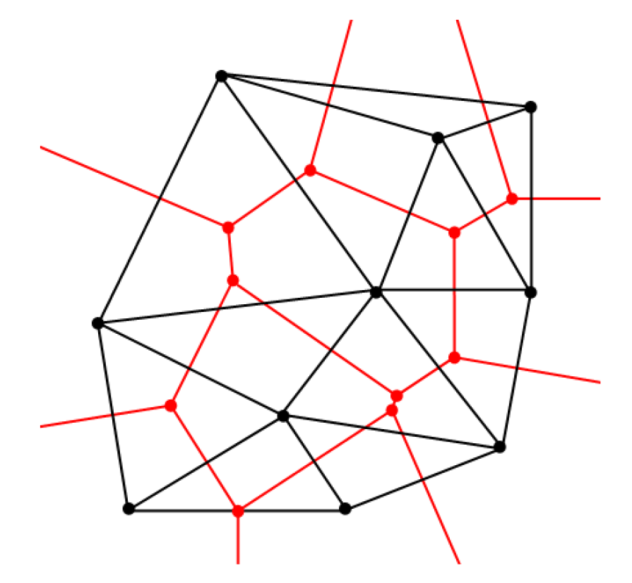

## Delaunayova triangulace

Delaunayova triangulace je taková triangulace, kde pro každý trojúhelník platí, že kružnice opsaná kolem něj neobsahuje žádný jiný bod, tedy trojúhelníky jsou co nejrovnostrannější. Existuje právě jedna Delaunayova triangulace pro každou množinu bodů.

Pro ukládání Delaunayovy triangulace se používá tzv. _Active Edge List (AEL)_, kde jsou uložené jednotlivé half edges, jejich následníci a předchůdci, sousedé a sousední rovina.

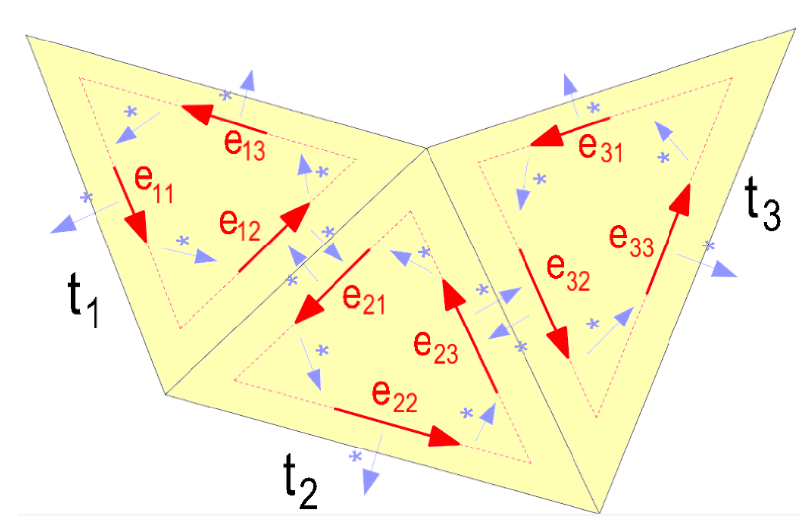

### Lokální výměna

Můžeme zvolit libovolnou korektní triangulaci a poté se zbavit "ilegálních" hran tzv. lokální výměnou v zámci konvexních čtyřúhelníků.

Opakujeme, dokud dochází ke změnám:

1. Najdeme dva trojúhelníky, které tvoří konvexní čtyřúhelník a jejichž společná hrana je ilegální (kružnice opsaná libovolnému z těchto trojúhelníků obsahuje chybějící čtvrtý bod).
2. Legalizujeme tuto hranu (_edge flip_) (odstraníme ji a přidáme novou hranu mezi druhými dvěma body).

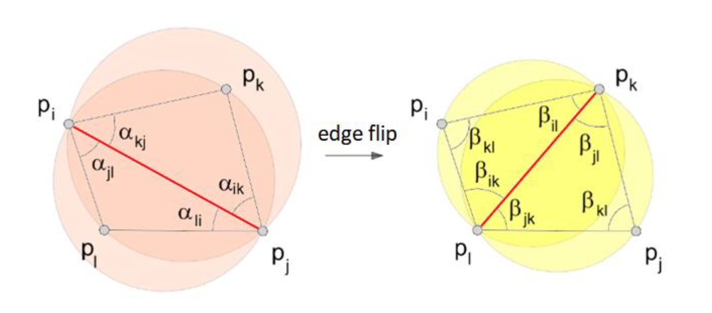

Tento algoritmus má složitost $O(n^2)$.

### Inkrementální konstrukce

Další možností je inkrementální konstrukce. Iniciálně zvolíme jednu hranu a postupně přidáváme body. Vždy provedeme následující:

1. Pro existující hranu najdeme pod s nejnižší Delaunayovou vzdáleností od této hrany (viz dále). Tento bod musí být nalevo od této orientované hrany.
2. Tento bod přidáme do triangulace.
3. Pokud takový bod neexistuje (jsme na hraně konvexního obalu), obrátíme half-edge a pokračujeme.

Delaunayova vzdálenost se vypočítá, jako

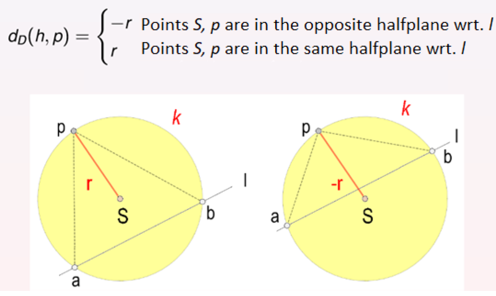

Tento algoritmus má složitost $O(n^2)$.

### Inkrementální inserce

Další možností je postupné dělení trojúhelníka. Vytvoříme obrovský trojúhelník, který obsahuje všechny body a postupně ho dělíme na menší trojúhelníky. Vždy vybereme jeden bod a ten do triangulace přidáme. Bod může ležet buď uvnitř trojúhelníku nebo na jeho hraně. Pokud leží uvnitř, vznikají z daného trojúhelníku tři nové trojúhelníky. Pokud leží na hraně, vznikají čtyři nové trojúhelníky. Po vytvoření nových hran musíme všechny hrany rekurzivně zlegalizovat (tedy každou hranu a pokud je potřeba i všechny její sousedy).

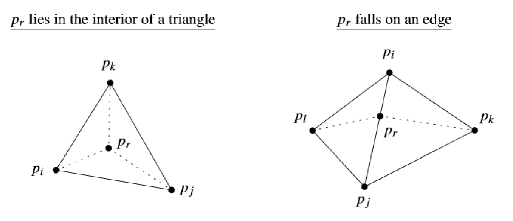

### Další algoritmy

- **Divide and conquer**
- **Walking method**

## Dualita

Delaunayova triangulace a Voroného diagramy jsou (grafově) duální. Mnohoúhelník v jedné struktuře reprezentuje vrchol ve struktuře druhé a naopak. Hrany jsou na sebe tedy "kolmé" (v logickém slova smyslu, nikoli geometrickém).

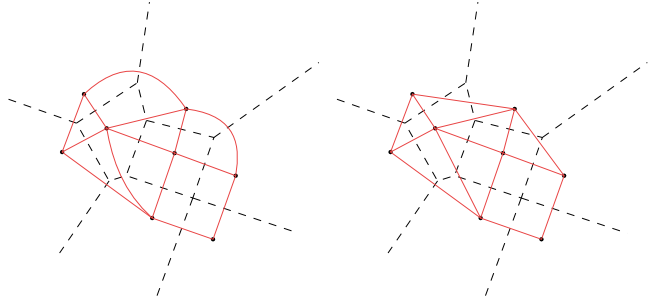

## Triangulace

Při triangulaci chceme převést mnohoúhelník na množinu nepřekrývajících se trojúhelníků, které dohromady dávají původní mnohoúhelník.

### Triangulace konverxního mnohoúhelníka

Pro konvexní mnohoúhelník můžeme triangulaci provést jednoduše. Stačí vybrat jeden bod a spojit ho s každým dalším bodem.

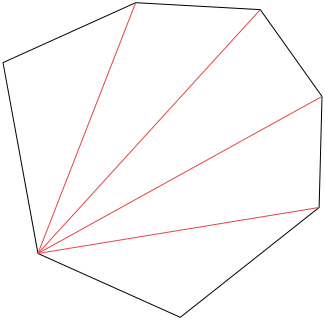

### Triangulace monotónního mnohoúhelníka

Monotónní mnohoúhelník je takový mnohoúhelník, který v dané ose (např. Y) má pouze jeden extrém (maximální nebo minimální hodnotu). Pro triangulaci takového mnohoúhelníka postupujeme následovně:

1. Rozdělíme hrany mnohoúhelníka na levou a pravou cestu.
2. Seřadíme body podle osy Y.
3. Vložíme první dva body do zásobníku.
4. Pro každý další bod
   - Pokud je bod na opačné cestě, než je vrchol zásobníku, odebereme ze zásobníku všechny body a vytvoříme ke každému z nich hranu od nového bodu. Vložíme poslední bod zásobníku a nový bod.
   - Pokud je bod na stejné cestě, odebíráme ze zásobníku body, dokud je lze spojovat s novým bodem (jsou uvnitř mnohoúhelníka), nebo dokud nám nedojdou body. Poslední vyjmutý bod vložíme zpět na zásobník a vložíme nový bod.
5. U posledního bodu vytvoříme hrany ke všem bodům na zásobníku.

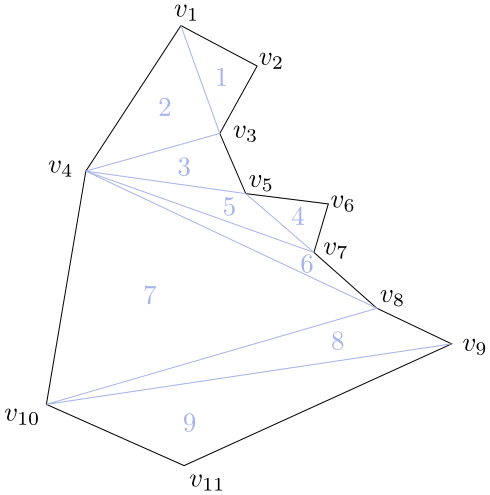

### Triangulace obecného mnohoúhelníka

Obecný trojúhelník triangulujeme rozdělením tohoto mnohoúhelníka na mnohoúhelníky monotónní a následnou triangulací těchto jeho částí pomocí algoritmu pro triangulaci monotónního trojúhelníka.

Vrcholy v libovolném mnohoúhelníku se dělí na 5 typů:

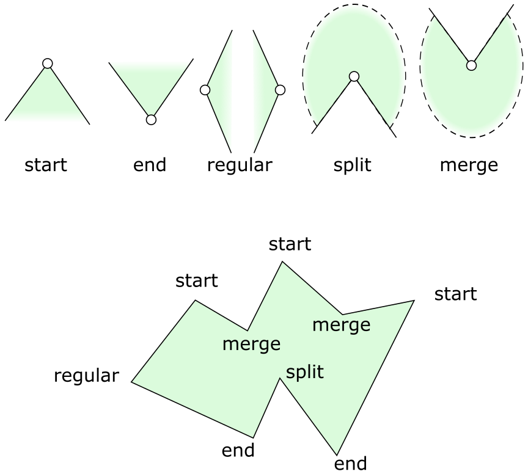

Abychom získali monotónní mnohoúhelník, potřebujeme se zbavit vrcholů typu Merge a Split. Pro to použijeme sweep line algoritmus (Po Y směrem dolů).

Pro každou hranu, kterou právě protíná sweepline máme uložený tzv. helper vrchol. Jedná se o nejnižší merge vrchol vpravo od jeho hrany takový, že horizontální spojnice mezi hranou a tímto bodem leží celá uvnitř mnohoúhelníka. Tyto helpery spolu s hranami si držíme vy binárním vyhledávacím stromě.

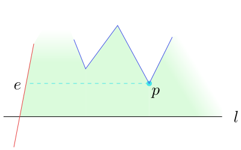

Vrcholy typu split odstraňujeme v okamžiku. kdy jimi prochází zametací přímka. V tomto případě spojíme tento vrchol s pomocníkem zleva nejbližší strany mnohoúhelníka (najdeme pomocí binárního stromu).

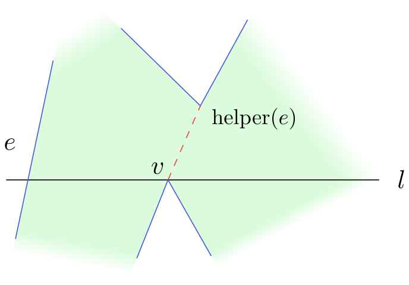

Odstranění vrcholů typu merge je složitější. Tyto vrcholy neodstraníme, když jimi zametací přímka prochází, neboť v tomto okamžiku neznáme „situaci“ pod zametací přímkou a nemůžeme vrchol spojovat s vrcholy pod ním. K odstranění merge vrcholů dochází zpětně. V každém z procházených vrcholů testujeme, zda pomocník jeho nejbližších stran je typu merge. Pokud ano, spojíme s ním daný vrchol.

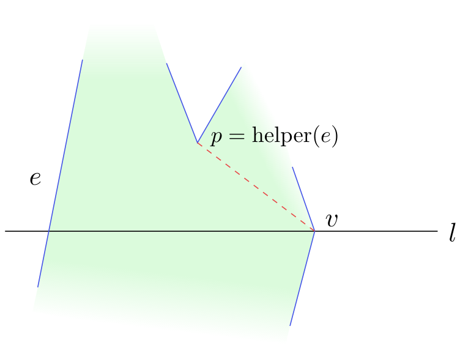

Po dokončení tohoto algoritmu bychom měli mít samé monotónní trojúhelníky, které dokážeme "dotriangulovat".

## Prostorové vyhledávání

### k-D stromy

k-D strom střídavě dělí prostor (2D nebo 3D) na dvě poloviny podle střídajících se os. Ve uzlech jsou uloženy (typicky) dělící čáry a v listech samotné body.

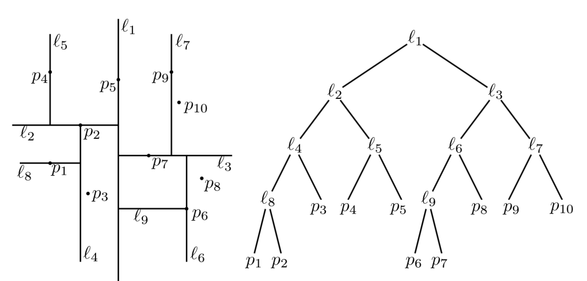

Složitost postavení k-D stromu je $O(n \log n)$.

Vyhledávání v k-D stromě je maličko zajímavější. Rekurzivně sestupujeme stromem a

- zahazujeme všechny větve, které jsou mimo náš interval
- akceptujeme všechny větve, které jsou uvnitř našeho intervalu
- pro větve, které hraničí s intervalem sestupujeme dál, případně musíme ověřit všechny prvky

Složitost vyhledávání v k-D stromě je $O(n^{1-\frac{1}{d}} + k)$, kde $d$ je dimenze a $k$ je počet prvků v dané oblasti.

### Range Trees

Tyto jsou značně méně probírány, proto jen obecně myšlenka:

Vytvoříme binární vyhledávácí strom $T$ pro vrcholy podle souřadnice X. Pro každý vrchol $v$ vytvoříme asociovaný vyhledávací strom $T_{ass}(v)$ obsahující pouze vrcholy z podstromnu tohoto bodu $T(v)$. $T_{ass}$ je binární vyhledávací strom podle souřadnice Y.

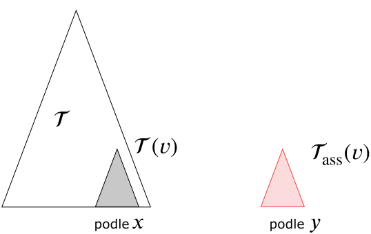

Při vyhledávání v tomto stromě nejprve vyhledáme podle jedné souřadnice a pak pro všechny vhodné podstromy provedeme vyhledávání podle souřadnice druhé.

Range trees jsou paměťově náročnější, zato jsou rychlejší.

- Paměť: $O(n \log^{d-1} n)$
- Konstrukce: $O(n \log^{d-1} n)$
- Vyhledávání: $O(\log^{d} n + k)$

## Zdroje

- [[[so_hull_3d,1]]] https://stackoverflow.com/a/74968910/22953817
