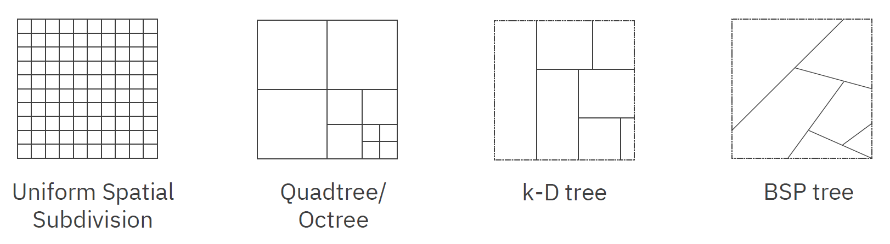
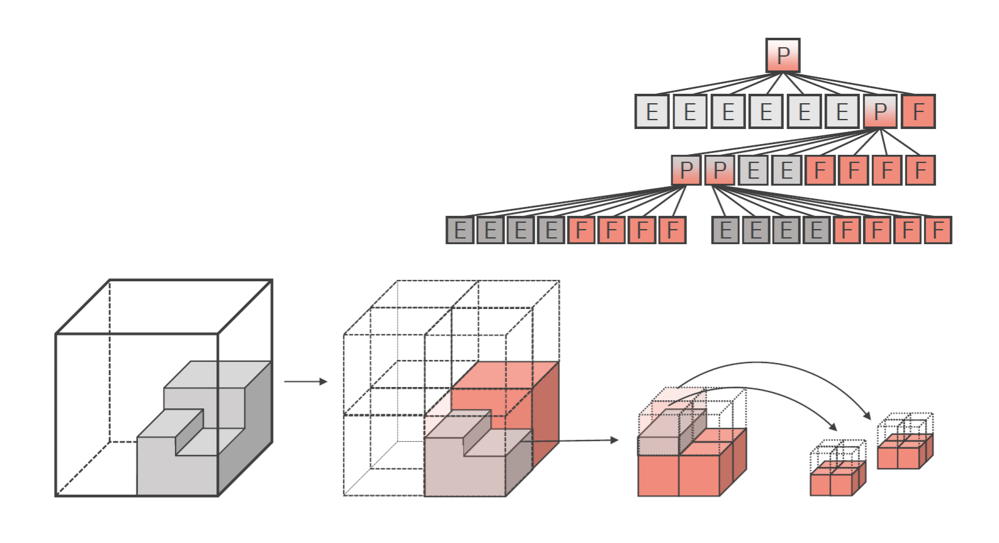
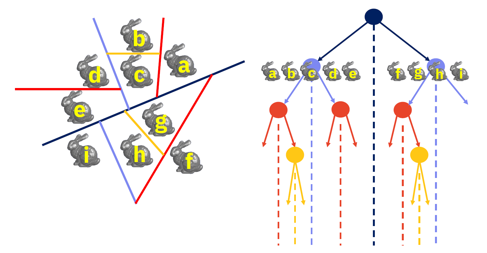
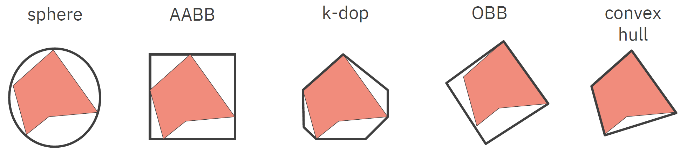
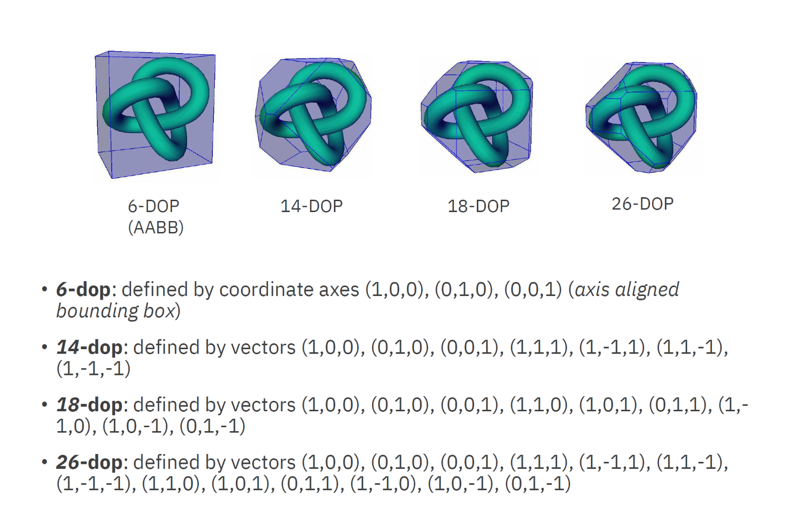
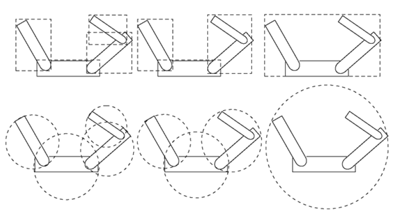
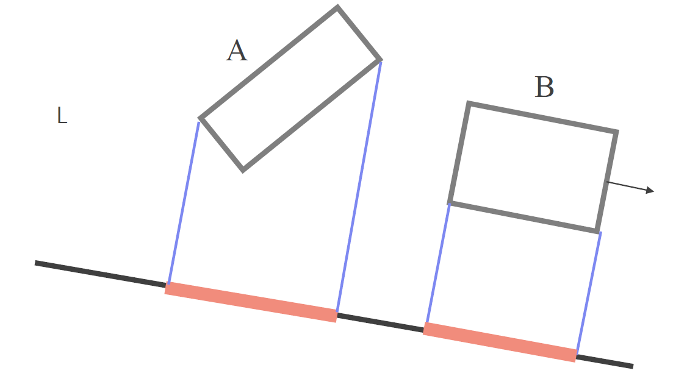
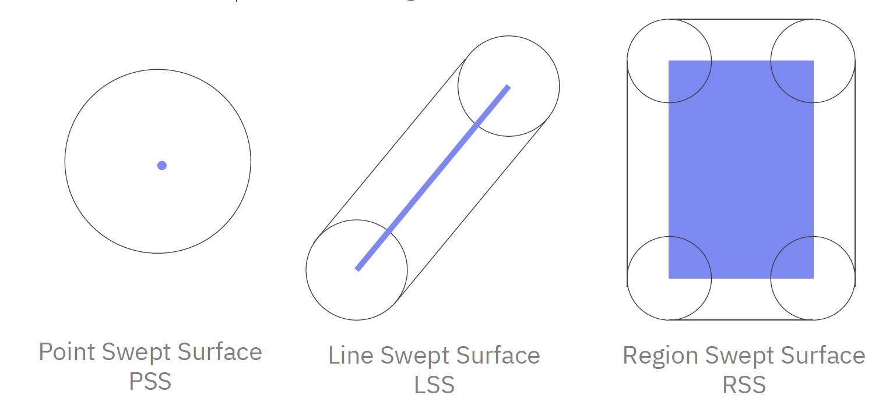

<dl><dt><strong>📌 NOTE</strong></dt><dd>

Datové struktury (oct-, quad-, BSP-, k-d stromy), jejich konstrukce a údržba, používané heuristiky. Objemem ohraničující tělesa a jejich hierarchie, způsob konstrukce a použití. Detekce kolizí, vykreslování.

_MA017, PA010, PA213_

</dd></dl>

Hierarchické reprezentace scény se snaží zefektivnit výpočty kolizí pomocí rozdělení scény na menší části. Díky tomu je možné testovat kolize na méně objektech a navíc na takových, kde je tento výpočet jednodušší.

Hierarchické reprezentace zjednodušují výpočet, pokud jsou dva objekty daleko od sebe (trivial reject), ale naopak zneefektivňují výpočet, pokud jsou objekty velice blízko sebe.

Existují dva základní přístupy k tomuto problému:

## Prostorové dělení scény (Spatial decomposition of the scene)

_Space-centric:_ Rozdělujeme prostor scény na menší části a udržujeme informace o objektech v těchto částech. Většina těchto algoritmů se používá pro statické scény, neboť jejich aktualizace je velice drahá.

### Uniformní dělení prostoru

Rozdělíme prostor na pravidelnou mřížku stejně velkých buněk. Každá buňka obsahuje informace o objektech, které se v ní nacházejí.

- **Detekce kolizí**\
  Zkontrolujeme, že jednu buňku sdílejí dva objekty.
- **Prostorová složitost**\
  Pro 3D scénu s rozlišením $n$ v každé dimenzi potřebujeme $n^3$ buněk.
- **Přesnost**\
  Některé buňky obsahují jen části objektů, při nízkém rozlišení nezjednodušuje výpočet.

### Octree, Quadtree

Octree a Quadtree jsou stromové struktury, které rekurzivně dělí prostor na menší části. Octree dělí prostor na osm stejně velkých krychlí, Quadtree na čtyři stejně velké čtverce.

Každou krychli/čtverec dělíme tak dlouho, dokud není každá krychle/čtverec celý plný/prázdný, nebo není dosažen maximální počet iterací.

Složitost vytvoření Octree/Quadtree je $O(n \log n)$. Složitost vyhledávání je $O(\log n)$ (jako v libovolném stromu). Složitost detekce kolizí je v nejhorším případě $O(n)$.

### k-D stromy

(Převzato z PGV04 [pgv04](#pgv04)) k-D strom střídavě dělí prostor (2D nebo 3D) na dvě poloviny podle střídajících se os. Ve uzlech jsou uloženy (typicky) dělící čáry a v listech samotné body.

Složitost postavení k-D stromu je $O(n \log n)$.

Vyhledávání v k-D stromě je maličko zajímavější. Rekurzivně sestupujeme stromem a

- zahazujeme všechny větve, které jsou mimo náš interval
- akceptujeme všechny větve, které jsou uvnitř našeho intervalu
- pro větve, které hraničí s intervalem sestupujeme dál, případně musíme ověřit všechny prvky

Složitost vyhledávání v k-D stromě je $O(n^{1-\frac{1}{d}} + k)$, kde $d$ je dimenze a $k$ je počet prvků v dané oblasti.

### BSP stromy

BSP stromy (Binary Space Partitioning) dělí prostor na poloprostory podle rovin. Každý uzel stromu obsahuje rovinu a dva podstromy, které jsou vytvořeny dělením prostoru touto rovinou.

Roviny jsou v BSP stromě vybírány tak, aby co nejvíce balancovaly počet objektů v obou podstromech a zároveň co nejvíce snižovaly počet průsečíků s objekty.

Jedno z využití BSP stromů je pro vykreslování objektů ve scéně správném pořadí. Vždy zkontrolujeme úhel dělící roviny vůči kameře a pak s jistotou víme, který podstrom je celý před kterým.

Co se týče složitosti, v nejhorším případě může mít jejich konstrukce složitost až $O(n^3)$. Při konstrukci je možné, že dojde k rozdělení jednoho objektu na mnoho menších, což může způsobit exponenciální nárůst počtu objektů (opět až $O(n^3)$).

## Objemem ohraničující tělesa a jejich hierarchie (Bounding volume hierarchies)

_Object-centric:_ Každý objekt je aproximován jednodušším objektem (koulí, kvádrem, ...) s jednodušším výpočtem kolizí. Tyto aproximace jsou dále hierarchicky uspořádány. Tento přístup je vhodný pro dynamické scény, kde se objekty pohybují a mění svou pozici.

- Koule, AABB: rychlý test + horší aproximace → ideální pro rapid prototyping
- k-dop, OBB OBB, konvexní obal: pomalejší test + lepší aproximace → používané v praxi

### Sphere Bounding Volume

- Velice jednoduchý a rychlý test kolizí ($(c_1 - c_2) \cdot (c_1 - c_2) \leq (r_1 + r_2)^2$).
- Hůře zachytává tvar objektu.
- Může být problematické najít správnou kouli pro daný objekt. Jednoduchý (ne optimální, ale rychlý) algoritmus:
  - Vybereme náhodný bod A
  - Vybereme nejvzdálenější bod B od bodu A
  - Vybereme nejvzdálenější bod C od bodu B
  - Položíme kouli tak, aby procházela body B a A a její poloměr byl $\frac{B-C}{2}$
  - Pro každý bod v objektu upravíme kouli tak, aby obsahovala i tento bod

### Axis-Aligned Bounding Box (AABB)

- Velice jednoduchý a rychlý test kolizí (porovnání souřadnic).
- Velice rychlá konstrukce (minimum a maximum pro každou souřadnici).
- Pro objekty položené "na koso" může být velice neefektivní.

### k-DOP (Discrete Oriented Polytope)

- Konvexní mnohostěn, který je definován jako průnik pevně otočenými podprostory.
- k znamená maximální počet hran mnohoúhelníka / stěn mnohostěnu (= počet různě otočených poloprostorů / polorovin).
- Ve 2D 8-dop znamená 8 hran oročených +/- {45, 90, 135, 180} stupňů.

### Oriented Bounding Box (OBB)

- Obdélník, který je otočený v prostoru, aby lépe vystihoval tvar objektu.
- Pro vytvoření využijeme vlastní vektory (PCA), což je výpočetně maličko náročnější ($O(n \log n)$ pro jeden objekt, $O(n \log^2 n)$ pro celý strom).
- Test kolizí je složitější, ale stále rychlý.

### Konvexní obaly

- Nejmenší konvexní mnohostěn, který obaluje daný objekt.
- Pro vytvoření využijeme algoritmus QuickHull (složitost $O(n \log n)$).

### Hierarchie objemových ohraničení

Myšlenka je vytvořit hierarchii, ve které můžeme vyhledávat. Vytvoříme nějaký obal pro celý objekt, pak pro jeho části a takhle ho postupně dělíme až se dostaneme na jednotlivé trojúhelníky.

Hierarchie jsou vhodné pro detekci kolizí, neboť můžeme provést trivial reject na vyšší úrovni a nemusíme tak testovat kolize na všech objektech (především na všech trojúhelnících).

Snažíme se konstruovat hierarchie tak, aby:

- pasovaly na objekty co nejpřesněji
- testování kolizí bylo co nejrychlejší
- bylo třeba je co nejméně aktualizovat

## Detekce kolizí

Detekce kolizí je proces, kdy testujeme, zda se dva objekty v prostoru dotýkají. Pro jednoduché objekty (koule, AABB) je tento proces velice rychlý, pro složitější objekty (trojúhelníky) je tento proces složitější.

- **SAT (Separating Axis Theorem)**\
  Pro konvexní objekty platí, že pokud existuje osa, podél které se objekty neprotínají, tak se neprotínají vůbec. Pro hledání takové osy se používají normály stěn objektů. Pro zábavnou a hezkou vizualizaci v Minecraftu můžeš kouknout na [SethBlingovo video](https://www.youtube.com/watch?v=EB6NY5sGd08).

- **Detekce kolizí v praxi**\
  Pro jednoduché objekty (koule, AABB) se používají jednoduché vzorce. Pro složitější objekty typicky střelíme několik paprsků uvnitř objektu a pokud se některý z nich dotkne stěny, tak se objekty dotýkají. Tento přístup je méně přesný, ale značně rychlejší.
- **Swept sphere volumes**\
  Po celém povrchu objektu "potáhneme" kouli, která nám vytvoří objem, který můžeme použít pro detekci kolizí. Tento objem je větší než objekt, ale je rychlejší na výpočet.

## Vykreslování

Pro určení pořadí vykreslovaných objektů můžeme také využít hierarchické reprezentace scény. Typicky se pro tento problém využívá BSP stromů.

## Zdroje

- [[[pgv04,1]]] ../geometricke_algoritmy/
