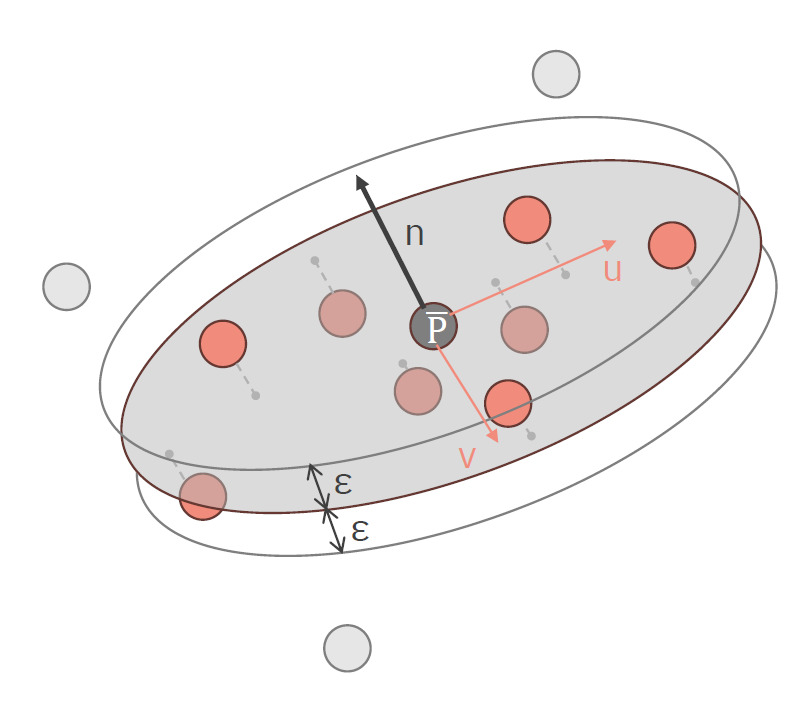
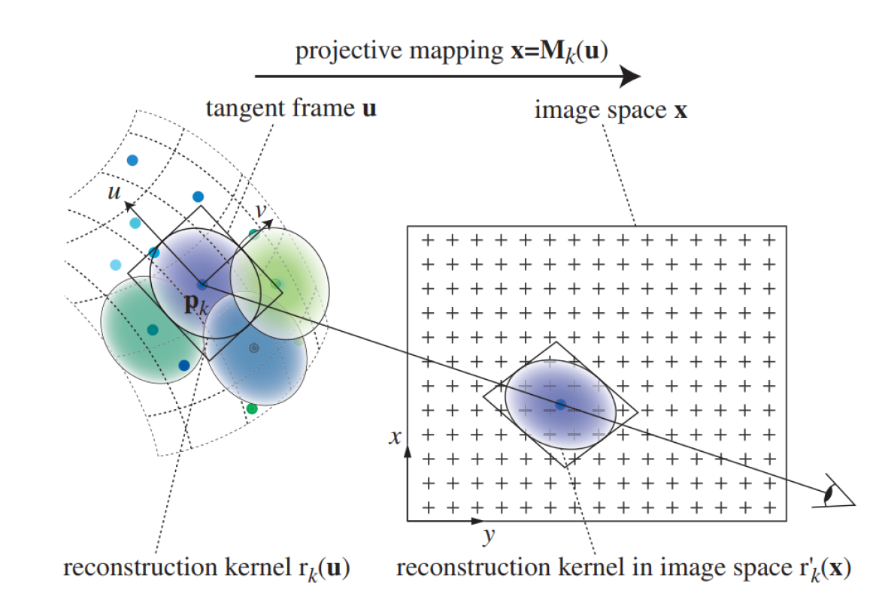
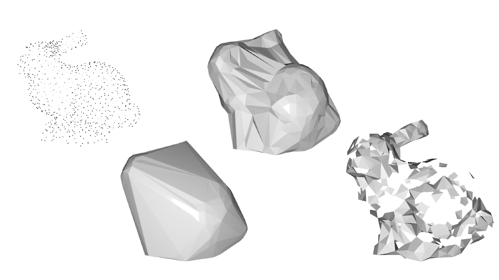
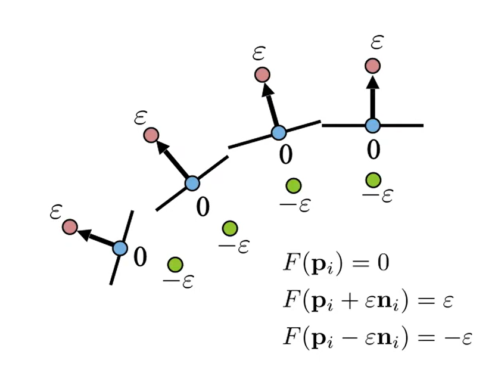
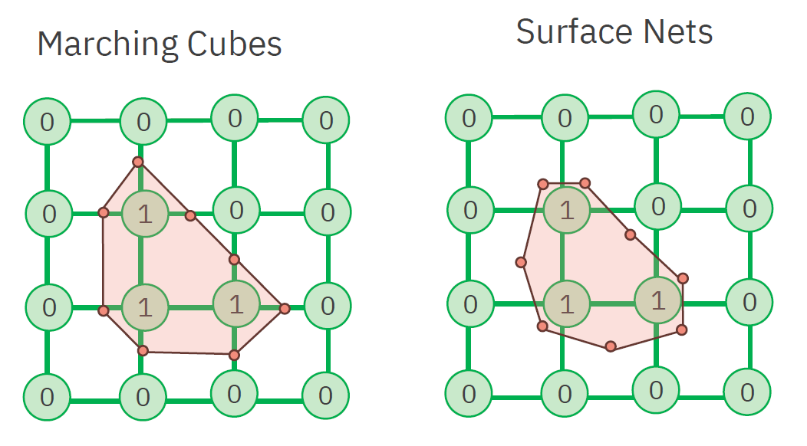
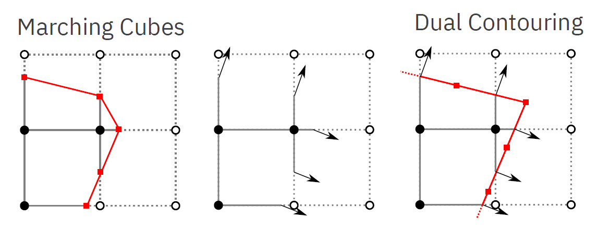

<dl><dt><strong>📌 NOTE</strong></dt><dd>

Rekonstrukce povrchu - kontury, objem, bodový mrak. Algoritmus pochodujících kostek. Přímé vykreslování objemových dat.

_PB009, PA010, PA213_

</dd></dl>

<dl><dt><strong>💡 TIP</strong></dt><dd>

Většina obsahu převzata z původní otázky VPH01 Pokročilá počítačová grafika

</dd></dl>

## Bodový mrak (point cloud)

Množina bodů v prostoru, které nemají žádnou strukturu. Nejjednodušší přístup k renderování objemu, kdy se nepokoušíme o žádnou rekonstrukci povrchu. Body však mohou mít různé barvy a průhlednost.

Při renderování bodových mraků je třeba vyřešit několik souvisejících problémů s daty:

- Data s neuniformním vzorkem.
- Chybějící data.
- Šum a outlieři.

Kromě pozic mohou surová data obsahovat také normály, barvy, apod.

### Vykreslování bodových mraků

Ze získaných dat se snažíme vytvořit mesh. Ten lze vyrenderovat tradičním způsobem.

Před samotnou rekonstrukcí je často potřeba provézt ještě předzpracování:

- Registration - spojení dat z více pohledů dohromady
- Filtering - odstranění šumu a outlierů
- Segmentation - rozdělení objektů na jednotlivé části

  - **Billboarding**\
    Vykreslujeme pouze body, nebo obdélníky na místech, kde se body nacházejí. Body mohou být billboardované (otočené ke kameře), nebo využít normálnových dat v bodech (= Splatting).
  - **Surface Splatting**\
    Normála povrchu odpovídá normále tečné plochy v každém bodě. Pro každý bod najdeme k bodů v okolí, které minimalizuje vzdálenost těchto bodů od naší roviny $n = \arg \min*{|n| = 1} \sum*{i=1}^k ((p_i - p) \cdot n)^2 $. [pa213](#pa213)

    Pro nalezení normál využijeme PCA (Principal Component Analysis), normála poté odpovídá vlastnímu vektoru s nejmenší vlastní hodnotou. PCA však vrátí nekonzistentně otočené normály, které můžeme opravit buď otočením všech normál ke kameře, nebo iterativně opravováním sousedství.

    

    Při samotném vykreslování vytvoříme pro každý takový bod elipsu (podle PCA), která bude průhlednější čím dál od středu. S dostatečným množstvím takových elips můžeme vytvořit dojem plochy. Elipsy můžou být stínované podle vypočítané normály, nebo plynule podle normál jednotlivých bodů.

    

### Rekonstrukce povrchu

- **Delaunay triangulation**\
  Vytváří trojúhelníkovou síť, tak že žádný bod se nenáchází ve vepsané kružnici žádného trojúhelníku. Maximalizuje nejmenší úhel trojúhelníků. [delaunay-triangulation](#delaunay-triangulation)

  

  Lze použít ve 3D pro rekonstrukci povrchu, ale je třeba odstranit body, které nejsou součástí povrchu. Zároveň delaunay nedovolí vytvořit díry ve výsledném meshi.

- **Alpha shapes**\
  Obecnější metoda než delaunay triangulation, která umožňuje vytvářet i díry ve výsledném meshi. Alpha shapes jsou definovány pomocí parametru alpha, který určuje, jak moc se mohou body "vytahovat" z objemu.

  [pa213](#pa213) má hezkou metaforu se zmrzlinou s čokoládovými kousky a sférickou naběračkou. Hodnota parametru alpha určuje, jak velká je naběračka, kterou se snažíme vybírat zmrzlinu tak, abychom se nedotkli čokoládových kousků.

  V podstatě zobecnění delaunay triangulation, kde akceptujeme pouze takové trojúhelníky, které mají opsanou kružnici s poloměrem menším než alpha. [pa213](#pa213)

  **Příklady meshe pro různé hodnoty Alpha**

  

- **Aproximace implicitní funkcí**\
  Uvažujme implicitní funkci $f(x, y, z)$, která je signed-distance funkcí od našeho daného povrchu (na povrchu = 0, uvnitř &lt; 0, venku > 0). Taková funkce popisuje povrch jako nulovou hladinu.

  Pro definici takové funkce by nám teoreticky stačily body našeho pointcloudu, které všechny nadefinujeme na nulovou hodnotu. Tímto způsobem má však naše funkce trivalní řešení, protože bychom mohli zvolit funkci, která pro všechny body vrací 0. Abochom tomu zabránili, přidáme pro každý bod dva nové body (1 uvnitř a jeden venku) posunuté podél normály. Tímto způsobem získáme funkci, která je nulová na povrchu a má správné znaménko uvnitř a venku.

  

## Objemová data

- **Voxel**\
  Voxel je 3D analogií pixelu -- bod v prostoru, který má určitou hodnotu (např. barvu, intenzitu, ...). Voxelová data mohou být získána (např. pomocí CT, MRI, PET, atd.) nebo být také výsledkem simulace (např. simulace proudění tekutin).
- **Objemová data**\
  Objemová data jsou definována nejčastěji jako mřížka voxelů. Mřížky můžou mít různý tvar (pravidelné, nepravidelné, lineární, radiální, ...)

### Vykreslování objemových dat

- **Slicing**\
  Vykreslujeme řezy objemem. Pro každý řez vykreslíme všechny voxely, které řez protíná. Výsledkem je 2D obrazec, který můžeme vykreslit tradičním způsobem. Pro jeden objekt můžeme vytvořit několik řezů a ty pak vykreslit dohromady.

### Rekonstrukce povrchu (indirect volume rendering)

- **Iso-kontury**\
  Na každé vrstvě najdeme kontury 2D obrazců, ty pak mezi vrstvami spojíme. Výsledkem je 3D mesh. Pro nalezení kontur použijeme algoritmy ze zpracování obrazu. Spojení je triviální, pokud provádíme spojení 1:1 (jedna kontura na jedné vrstvě se spojí s jednou konturou na druhé vrstvě). Je třeba speciálně řešit nekonvexní oblasti.

  Pokud chceme provést spojení M:N, je třeba vytvořit mezivrstvu, která bude mít 1 konturu vytvořenou ze všech kontur okolních vrstev spojených dohromady. Tím zajistíme korektní aproximaci této situace.

- **Marching cubes**\
  Uvažme prostor, kde každý voxel obsahuje nějakou hodnotu a my chceme vytvořit povrch pro specifickou hodnotu (typicky 0). Pro tento problém můžeme využít následující algoritmy.

  V každém voxelu určí, které jeho rohy jsou uvnitř povrchu a které jsou vně. Takových kombinací existuje 256, ale pouze 16 je unikátních

  **Marching cubes by [Ryoshoru](https://commons.wikimedia.org/wiki/File:MarchingCubesEdit.svg) (16. varianta je, pokud všechny body leží uvnitř)**

  

  Díky tomu jsme schopní tyto kombinace předpočítat a pro každý voxel vykreslit odpovídající trojúhelníky. Výsledkem je mesh, který reprezentuje povrch objemu. [marching-cubes](#marching-cubes)

  Je možné tyto předpočítané body interpolovat podél hran, na kterých leží a tím zlepšit výsledný mesh.

  Nevýhodou je tzv. Schodišťový efekt, kdy je výsledný mesh velmi hranatý. Zároveň výsledná mesh obsahuje obrovské množství trojúhelníků, což může být neefektivní.

- **Marching tetrahedra**\
  Analogický k marching cubes, ale používá místo krychlí čtyřstěny. Řeší problém s některými nejednoznačnými konfiguracemi v marching cubes, a taky nikdy nebyl patentován (kdežto marching cubes ano). [marching-tetrahedra](#marching-tetrahedra)
- **Flying edges**\
  Optimalizovaný algoritmus pro marching cubes, který prochází každou hranu pouze jednou.
- **Surface nets**\
  Narozdíl od MC vykresluje vrcholy uvnitř voxelů, čímž odstraňuje problém ostrých hran. Výsledný mesh je tedy mnohem hladší.

  

- **Dual contouring**\
  Z voxelů se stanou vrcholy (tedy využíváme dualního grafu). Tyto vrcholy jsou ale posunuty tak, že povrch může obsahovat jak ostré hrany tak zaoblené plochy. [dual-contouring](#dual-contouring)

  

### Direct volume rendering (přímé renderování objemu)

Nerekonstruujeme povrch, ale mapujeme data na _optické_ vlastnosti jako je barva a průhlednost. Během renderování se pak využívá path tracing, a tyto vlastnosti se akumulují podél jednotlivých paprsků. [gpugems](#gpugems)

V realitě tohle chování paprsku popisujeme integrály. V počítačové grafice se ale využívá aproximace pomocí sumy.

**The Process of Volume Rendering [gpugems](#gpugems)**


- **Emmission-absorption model**\
  Paprsek vstupuje do objemu, kde je absorbován a emitován. Výsledná barva je pak výsledkem akumulace těchto vlastností. V notaci používáme: [pa213](#pa213)

  - $\kappa$ je funkce absorpce,
  - $q$ je emise.

- **Optická hloubka / optical depth**\
  Bezrozměrná veličina $\tau$, která popisuje, jak moc jde "vidět skrz" něco, třeba plyn. Čím větší, tím méně vidíme.

  Z jiné perspektivy je to akumulovaná absorpce na paprsku. Optická hloubka mezi dvěma body $s_1$ a $s_2$ na paprsku je dána jako:

  ```math
  \tau(s_1, s_2) = \int_{s_1}^{s_2} \kappa(s) ds
  ```

- **Průhlednost / transparency**\
  Průhlednost popisuje, jak dobře vidíme skrz objem. Upadá exponenciálně s růstem optické hloubky.

  Průhlednost mezi dvěma body $s_1$ a $s_2$ na paprsku je dána jako:

  ```math
  \theta(s_1, s_2) = e^{-\tau(s_1, s_2)}
  ```

- **Volume rendering integral**\
  Intenzitu světla $I$ v místě paprsku $s$ počítáme pomocí: [pa213](#pa213)

  ```math
  \begin{aligned}

  I(s) &= I(s_0) \cdot \theta(s_0, s) + \int_{s_0}^s q(s') \cdot \theta(s', s) ds' \\

  &= I(s_0) \cdot e^{-\tau(s_0, s)} + \int_{s_0}^s q(s') \cdot e^{-\tau(s', s)} ds'

  \end{aligned}
  ```

  kde:

  - $s_0$ je místo, kde se paprsek dostal dovnitř nějakého světlo-vyzařujícího objemu,
  - $I(s_0)$ je boundary light, tedy světlo na hranici objemu,
  - $q(s')$ je emise v bodě $s'$.

  

- **Back-to-front**\
  Přístup k počítání $I$, kdy paprsky vyhodnocujeme od hranice objemu **dále** od kamery směrem **ke kaměře**.

  Výhoda je, že nemusíme udržovat proměnnou pro průhlednost. Nevyhoda je, že musíme vyhodnotit všechny voxely v cestě paprsku, protože "přepisují" výsledek.

- **Front-to-back**\
  Přístup k počítání $I$, kdy paprsky vyhodnocujeme od hranice objemu **blíže** ke kameře směrem **od kamery**.

  Dá se utnout dřív, když víme jistě, že už je výsledek neprůhledný a tedy už se nic nezmění.

- **Transfer function**\
  Funkce $T$, která mapuje hodnoty voxelů na barvu a průhlednost. Klasifikuje voxely. [pa213](#pa213)

## Zdroje

- [[[pa010-2020,1]]] Sochor: PA010 Intermediate Computer Graphics (podzim 2020)
- [[[pa213, 2]]] PA213 Advanced Computer Graphics
- [[[marching-cubes,3]]] [Marching cubes: A high resolution 3D surface construction algorithm](https://dl.acm.org/doi/10.1145/37402.37422)
- [[[marching-tetrahedra,4]]] [Wikipedia: Marching tetrahedra](https://en.wikipedia.org/wiki/Marching_tetrahedra)
- [[[dual-contouring,5]]] [Dual Contouring Tutorial](https://www.boristhebrave.com/2018/04/15/dual-contouring-tutorial/)
- [[[delaunay-triangulation,6]]] [Wikipedia: Delaunay triangulation](https://en.wikipedia.org/wiki/Delaunay_triangulation)
- [[[gpugems,7]]] [GPU Gems: Volume Rendering Techniques](https://developer.nvidia.com/gpugems/gpugems/part-vi-beyond-triangles/chapter-39-volume-rendering-techniques)
