<dl><dt><strong>📌 NOTE</strong></dt><dd>

Blinn-Phongův osvětlovací model, BRDF, sledování paprsků, radiosita, fotonové mapy, participující média. Vykreslování založené na fyzikálních modelech (PBR). Osvětlení založené na obrázku (IBL).

_PB009, PV227, PA010, PA213_

</dd></dl>

- **Lokální osvětlení (local illumination) / direct lighting**\
  Berou v úvahu jen světlo, které dopadá přímo na daný bod/objekt. Neřeší okolní objekty, ani nepřímé osvětlení. Je založený na empirických znalostech o chování světla, spíš než simulaci fyzikálních zákonů.

  Patří sem Blinn-Phong, pomineme-li jeho ambientní složku.

- **Globální osvětlení (global illumination)**\
  Řeší nejen přímé osvětlení, ale i odrazy, lomy, průhlednost, stíny, atd.
- **Ambient illumination**\
  Aproximace globálního osvětlení pomocí konstantní ambientní barvy.

## Blinn-Phongův osvětlovací model

Blinn-Phongův osvětlovací model je velice jednoduchý model osvětlení, který se skládá ze tří složek: ambientní, difuzní a spekulární. [pb009-io](#pb009-io)


### Ambientní osvětlení

Ambientní světlo dopadá na celý povrch rovnoměrně nerávisle na jeho pozici a orientaci. Pokud vykreslíme pouze ambient, dostáváme siluetu objektu.

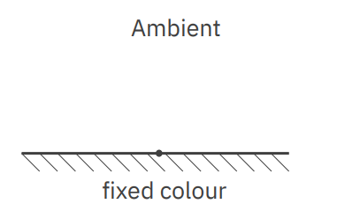
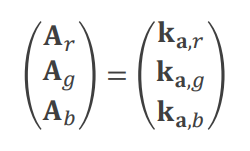

### Difuzní osvětlení

Difuzní osvětlení je závislé na úhlu $\alpha$ mezi normálou povrchu a vektorem ke světlu (ne na pozici kamery). Čím více je objekt kolmý na světlo, tím je v daném bodě jasnější (tím více světla absorbuje).

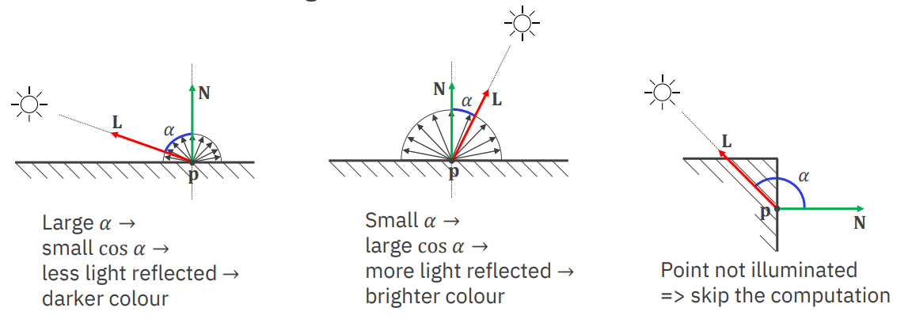
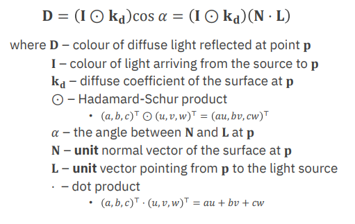
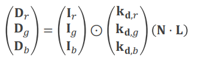

### Spekulární osvětlení

Spekulární osvětlení vytváří odlesky na povrchu objektu. Je závislé na úhlu $\beta$ mezi vektorem ke světlu a vektorem ke kameře.

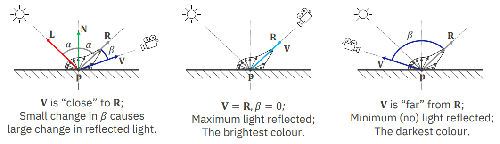
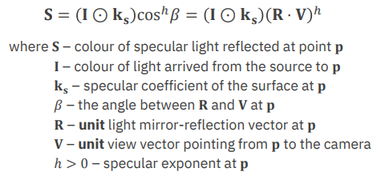
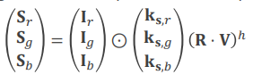

### Všechno dohromady

Pokud spojíme dohromady ambientní složku a pro každé světlo i difuzní a spekulární složku, dostaneme výslednou barvu pixelu.

$C=A+\sum_{i=1}^{n} (D_i + S_i)$

A pokud dosadíme i konkrétní vzorce dostaneme následující rovnici:

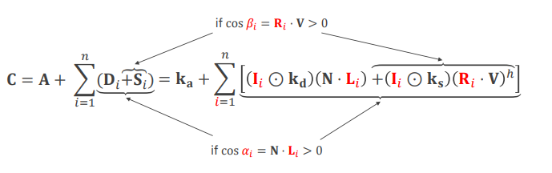

Uvedené podmínky jsou v rovnici pro odstranění odlesků na zadní straně objektu.

## Bidirectional Reflectance Distribution Function (BRDF)

Funkce popisující poměr mezi dopajícím a odraženým světlem na povrchu objektu.

```math
f(\vec{l}, \vec{v}) = \frac{\partial L_o(\vec{v})}{\partial E_i(\vec{l})}
```

_Povrch je nasvícen ze směru $\vec{l}$ s ozářením $\partial E(\vec{l})$. $\partial(L_o(\vec{v}))$ je odražená zář ve směru $\vec{v}$._

Udává pravděpodobnost, že světlo dopadající na povrch ze směru $\vec{l}$ bude odraženo ve směru $\vec{v}$.

Z pohledu teorie pravděpodobnosti / statistiky to ale není distribuční funkce ale spíš hustota pravděpodobnosti.

BRDF je řešena pomocí ray tracingu, radiosity, nebo nějakým hybridním řešením.

## Ray tracing (sledování paprsků)

Metoda, kdy simulujeme paprsky světla vycházející ze zdroje světla a dopadající na scénu. Používá se jak k lokální tak globální iluminaci. Počítáme však jen to, co vidí kamera, jelikož posíláme paprsky skrze pixely. Pokud se kamera pohne, musíme znovu paprsky zpravidla počítat znovu.

Obecný postup:

1. Vystřelíme paprsek z kamery do scény (_primary ray_).
2. Detekujeme kolizi s objektem ve scéně.
3. V daném bodě vystřelíme paprsky ke každému světlu ve scéně (_shadow ray_).
4. Pro každý paprsek zjistíme, jestli protnul nějaký objekt (stín), nebo ne (spočítáme osvětlení, např. pomocí Blinn-Phonga a připočteme ho k akumulovanému světlu, co už máme).
5. Z bodu vystřelíme odražený a refraktovaný paprsek (_secondary rays_) a rekurzivně pokračujeme od bodu 2.

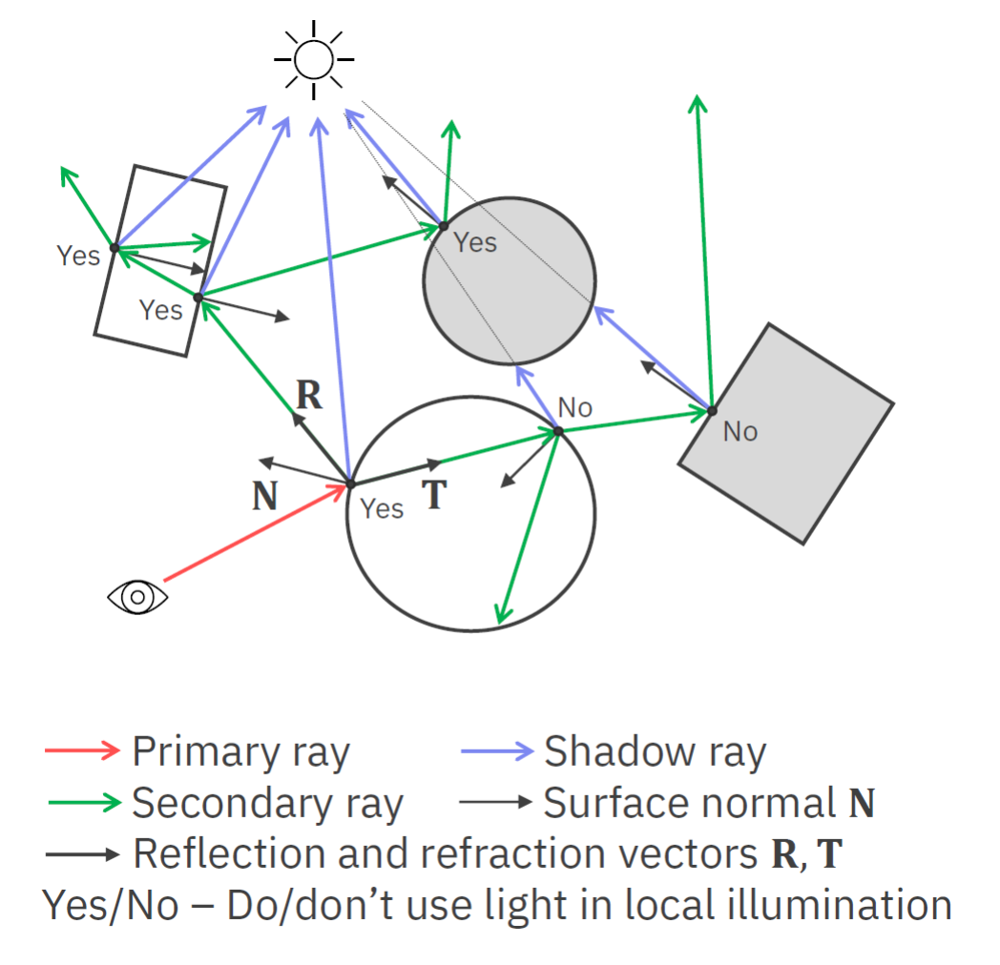

Typicky se pro realističnost hodnoty po prvním odražení zmenšují. Využívá se k tomu tzv. Fresnel-Schlickova aproximace (viz. dál).

- **Snellův zákon**\
  Když světlo přechází z jednoho prostředí do druhého, mění se jeho rychlost a tím i směr. Snellův zákon popisuje, jak se mění úhel světla při průchodu mezi dvěma prostředími.

  Index refrakce $n$ je poměr rychlosti světla ve vakuu a rychlosti světla v daném prostředí. Pro vzduch je to 1, pro vodu 1.33, pro sklo 1.5, atd.

  $frac{\sin \alpha'}{\sin \alpha} = \frac{n_1}{n_2}$

  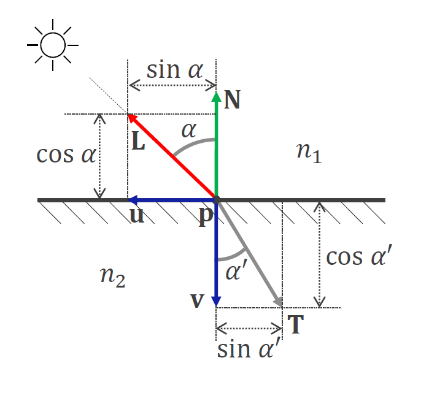

## Radiosity (metoda osvětlení)

Metoda, kdy scénu rozdělíme na malé segmenty plochy a simulujeme "přelévání" světla mezi segmenty. Je vypočetně náročné, ale nezávisí na pozici a směru kamery. Počítáme pouze difuzní osvětlení. Řešíme pomocí soustavy lineárních rovnic iterativně (např. Gauss-Seidel).

$KB = E$

Vytvoříme matici $K$, kde $K_{ij}$ je množství světla, které se přelilo z segmentu $i$ do segmentu $j$ (form faktor $K_{ij} = F_{ij}$). Zároveň máme vektor $E$, který určuje emitované světlo v každém segmentu. Výsledný vektor $B$ je vektor světla v každém segmentu.

Výhodou je, že se dá použít pro scény, kde se pohybuje kamera bez nutnosti přepočítávat. Zároveň funguje pro plošné světelné zdroje. Nevýhodou je obrovská paměťová náročnost a složitost výpočtu. Zároveň vypočítáváme pouze difuzní osvětlení.

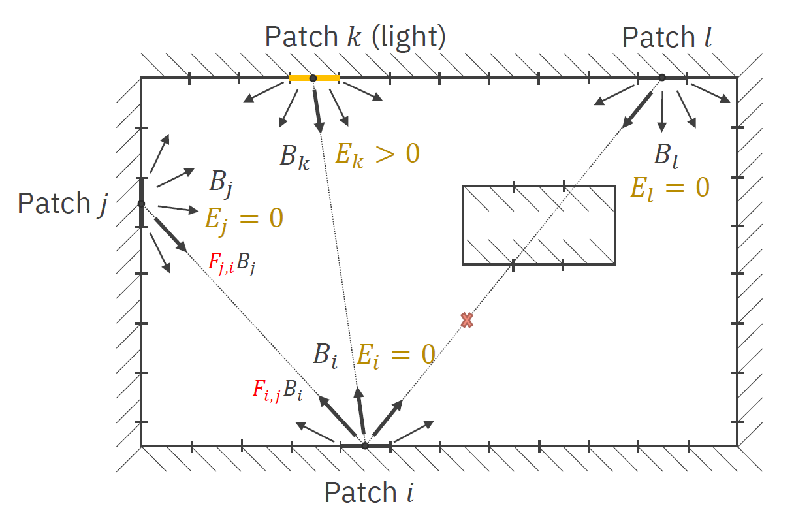

## Fotonové mapy

Fotonová mapa je kombinace dvou předchozích metod: ray tracing a radiosity. Nejprve trasujeme fotony od světla (náhodný směr, součet energií by měl odpovídat energii světla) na objekty ve scéně a ukládáme informace o dopadu (_radiosity map_). Poté trasujeme paprsky od kamery, pro každý paprsek hledáme nejbližší foton a podle něj určujeme barvu pixelu.

Narozdíl od Raytracingu a Radiosity dokáže Photon maping simulovat i náročné efekty, jako je color bleed, nebo _caustics_ (efekt, kdy se svělo lomí typicky na hladině vody, nebo ve sklenici a vytváří místa s intenzivnějším a méně intenzivním světlem).

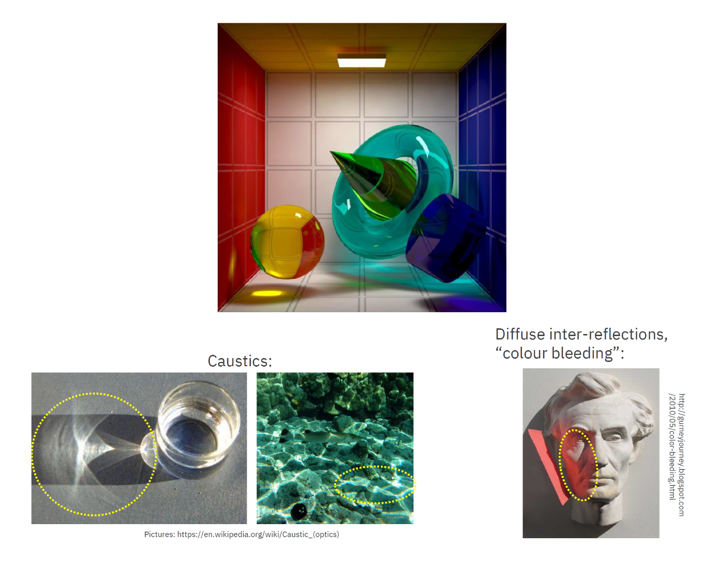

## Participující média

Participující média jsou média, která nejsou zcela průhledná, ale nejsou ani zcela matná. Jsou to např. mlha, kouř, nebo atmosféra. Osvětlení v participujících médiích je založeno na tom, že světlo se rozptyluje a absorbuje. Výsledná barva je tedy kombinací barvy objektu a barvy média.

## Physically based rendering (PBR)

Physically based rendering (PBR) je způsob renderování, který se snaží co nejvíce aproximovat realitu pomocí fyzikálních modelů světla, stínů, materiálů, očí, atd. [pv227-2022](#pv227-2022) Aproximuje efekty jako absorpci světla nebo jeho rozptyl pod povrchem objektů.

- **Absorption and scattering / absorpce a rozptyl**\
  Materiály mohou světlo buď absorbovat (v takovém případě jsou alespoň částěčně průhledné) nebo odrážet a rozptylovat (objekty jsou matné). Většina materiálů kombinuje oba efekty. Světlo se může rozpylovat i pod povrchem (subsurface scattering).
- **Reflection / odraz světla**\
  V nejjednodušším případě se úhel odrazu rovná úhlu dopadu. V realitě úhel odrazu však záleží na mnoha faktorech jako je i vlnová délka světla. Toto chování popisují Fresnelovy rovnice. Znamená to, že odraz má barvu. V praxi používáme Schlickovu aproximaci:

  ```math
  F_\text{Schlick}(F_0, L, N) = F_0 + (1 - F_0) \cdot (1 - L \cdot N)^5
  ```

  kde:

  - $F_0$ je Fresnelův odraz při úhlu 0 (dá se dohledat pro daný materiál),
  - $L$ je vektor směru světla,
  - $N$ je vektor normály povrchu.

  **Z určitého úhlu se povrchy, které normálně světlo odráží špatně, jeví jako zrcadla ([tanakawho](https://commons.wikimedia.org/w/index.php?curid=2138545))**

  

- **Refraction / lom světla**\
  Kovy světlo absorbují, v homogenních materiálech (např. sklo) pokračuje v jiném směru, a v heterogenních materiálech (např. kůži) se světlo rozptýlí a pak absorbuje. Lom světla popisuje Snellův zákon:

  ```math
  \frac{\sin \alpha_1}{\sin \alpha_2} = \frac{v_1}{v_2} = \frac{n_2}{n_1}
  ```

  kde:

  - $\alpha_1$ je úhel dopadu (angle of incidence),
  - $\alpha_2$ je úhel lomu (angle of refraction),
  - $v_1$ je rychlost šíření vlnění ve vnějším prostředí,
  - $v_2$ je rychlost šíření vlnění v prostředí objektu,
  - $n_1$ je index lomu vnějšího prostředí,
  - $n_2$ je index lomu prostředí objektu.

    

- **Diffuse lighting**\
  Když všechno (neabsorbované) světlo opustí objekt ze stejného místa, kam dopadlo.

  

- **Subsurface scattering**\
  Když neabsorbované světlo opustí objekt z jiného místa, než kam dopadlo.

  

- **Microfacets / mikro-plošky**\
  Ne všechny objekty jsou ploché. Většina má nerovnosti, které jsou menší než pixel, ale větší než vlnová délka dopadajícího světla, proto je modelujeme nějakou pravděpodobností distribucí (např. Gaussovou).

  

  Existuje řada modelů chování microfacet, např. Cook-Torrance, Oren-Nayar, Ashnikmin-Shirley, Normalized Blinn-Phong, atd.

- **Cook-Torrance model**\
  Cook-Torrance je osvětlovací model založený na mikrofacetách. Materiál má jeden parametr, který určuje, jak moc je povrch hrubý ($0 \leq m \leq 1$).
- **Geometrická atenuace**\
  Postupná ztráta "intenzity" paprsku v důsledku geometrie objektu.

  - **Shadowing** -- facety zastiňují jiné facety.
  - **Masking** -- facet nejde vidět, protože ho zastiňuje jiný facet.
  - **Interreflection** -- světlo se odráží mezi facety, než je odraženo zpátky ke kameře.

### Fyzikální věličiny radiometrie

- **Radiant energy / energie záření (Q)**\
  "Energy per one photon."

  Jednotka: Joule (J)

- **Radiant flux, radiant power / zářivý tok ($\Phi$)**\
  "Energy per second." Bezva na popisování síly světel jako jsou žárovky, plošná světla, atd.

  ```math
  \Phi = \frac{\partial Q}{\partial t}
  ```

  Jednotka: Watt (W) = J/s

- **Irradiance / ozářenost, ozáření (E)**\
  "Flux through area." Světlo dopadající na jednotku plochy. Kvadraticky se zmenšuje s rostoucí vzdáleností od zdroje. Bezva na popis vzdálených zdrojů jako je slunce.

  ```math
  E = \frac{\partial \Phi}{\partial A}
  ```

  Jednotka: Watt per square meter ($\frac{W}{m^2}$)

- **Radiosity / radiozita (radiometrická veličina) (J)**\
  Jako irradiance, ale je to světlo _vycházející_ z jednotky plochy.
- **Radiance / zář (L)**\
  "Flux through a cone of directions from an area." a nebo "Flux through an area from a cone of directions." Nezmenšuje se se zvětšující se vzdáleností od zdroje. Tohle měří senzory.

  ```math
  L = \frac{\partial^2 \Phi}{\partial A_\text{proj} \partial \omega}
  ```

  Jednotka: Watt per square meter per steradian ($\frac{W}{m^2 \cdot sr}$)

## Image-based lighting (IBL)

<dl><dt><strong>📌 NOTE</strong></dt><dd>

Tahle část otázky by si možná zasloužila rozšířit, ale bohužel tomu víc nerozumím :D

</dd></dl>

IBL využívá envitornmentálních textur (HDR CubeMap, ...) pro vyhodnocení světla z každého směru scény.

Pro výpočet difuzního osvětlení musíme matematicky spočítat integrál nad celým povrchem sféry (hemisféry) okolo bodu, který chceme osvětlit a pro každý směr světla z envitornmentální textury spočítat osvětlení. V praxi to provedeme výpočtem několika vzorků a jejich průměrem.

Pro výpočet spekulárního osvětlení se používá zrcadlový vektor a Fresnelova rovnice. Chování materiálu popisuje Cook-Torrance model materiálu.

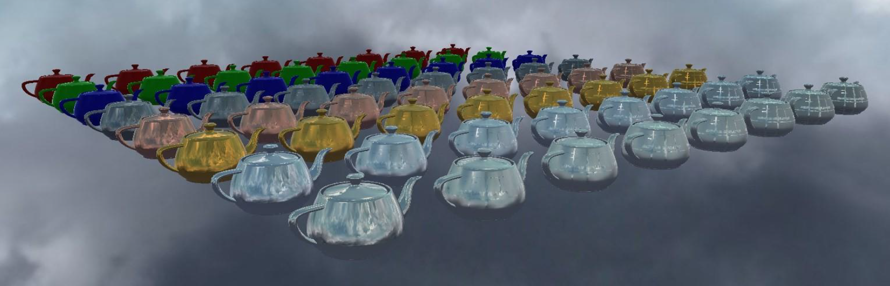

## Zdroje

- [[[pv227-2022, 1]]] [PV227 GPU Rendering (podzim 2022)](https://is.muni.cz/auth/el/fi/podzim2022/PV227/)
- [[[pb009-io, 2]]] [Interaktivní osnova PB009 by xrosecky](https://is.muni.cz/auth/el/fi/jaro2023/PB009/index.qwarp)
