> [!NOTE]
> Ořezávání, techniky založené na viditelnosti, vykreslování s různou úrovní detailů (LOD rendering), vykreslování terénu. Stíny: tvrdé stíny, měkké stíny, techniky vykreslování stínů v prostoru scény a v obrazovém prostoru.
>  
> _PA010, PA213_

- **Real time rendering**\
  Snažíme se zlevnit a zrychlit vyrenderování jednoho snímku scény. Můžeme toho docílit typicky zahozením částí, které nejsou vidět a nahrazením drahého renderování vzdálených objektů levnějším.

## Ořezávání (Culling)

Snažíme se najít množinu objektů, které můžeme vyřadit z renderování aniž by to (zásadně) snížilo kvalitu renderu.

### Back Face Culling

Ořízneme pryč trojúhelníky, které jsou k nám otočené "zády" (tedy jejich trojúhelníky mají normálu od kamery)

### View Frustum Culling

Ořízneme pryč objekty, které se nemají šanci nacházet ve view frustu. Využíváme k tomu AABBs jednotlivých objektů, kde testujeme průnik tohoto AABB s view frustem.

## Analýza viditelnosti

- **Offline**\
  Viditelnost je předpočítaná, v každém snímku se pouze podíváme do paměti, které objekty jsou z aktuálního místa kamery viditelné.

  Offline analýzu lze aplikovat pouze na statické scény, je paměťově náročná.

- **Online**\
  Viditelnost počítáme v každém snímku.

  Je možné ji používat na dynamické scény, je časově náročná.

- **Hybridní**\
  Kombinace předchozích přístupů. Předpočítáme část podpůrných dat pro algoritmus a zbytek počítáme každý snímek.

### Portal Culling

Uvažme graf, kde jednotlivé logické celky (například místnosti) představují vrcholy a portály (dveře) mezi těmito místnostmi představují vrcholy, které místnosti propojují. Každý portál má asociovanou geometrii, která odpovídá viditelnému průchodu.

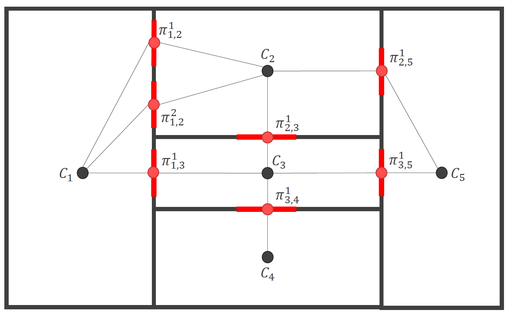

geometrie $\pi_{i,j} = \pi_{j,i}$

Toto všechno je předpočítané.

**_V každém snímku:_**

1. Spočítáme, ve které místnosti se nachází kamera
2. Vyrenderujeme tuto místnost
3. Promítneme všechny portály této místnosti na obrazovku
4. Aproximujeme tyto projekce AA bounding obdélníky
5. Vypočítáme, které obdélníky protínají obrazovku a zjistíme, kam vedou
6. V nových místnostech opět promítneme všechny portály a aproximujeme je
7. Zjistíme, které obdélníky protínají předchozí portál a zjistíme, kam vedou
8. Opakujeme, dokud máme kam postupovat, nebo jsme dosáhli maximálního počtu iterací.

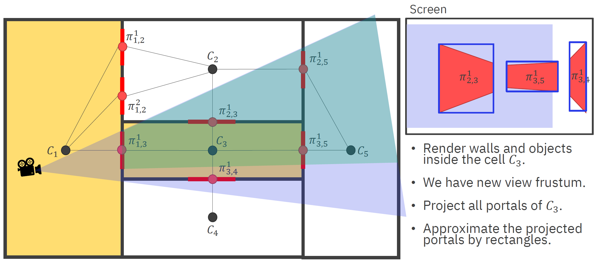

Je možné použít vyhledávací struktury, jako je Octree jak na objekty v místnostech, tak na místnosti samotné (kvůli lokalizaci kamery).

Pokud je něco na hraně (v portálu), musíme řešit specificky. Je možné rozšířit i o zrcadla, "portály" atd.

### Occlusion Culling

Chceme ořezat objekty, které jsou z pohledu kamery určitě celé zakryté ostatními objekty (dohromady = _cumulative oclusion_). Potřebujeme nějakou strukturu, která si bude ukládat kumulativní okluzi: _CumulativeOclusionRep_ -> Typicky Z-buffer.

Můžeme využívat tzv. Hardware Occlusion Query - tedy toho, že nám GPU řekne, kolik pixelů z daného objektu vyrenderovalo. Pokud je toto číslo pod hranicí viditelnosti víme, že daný objekt nemusíme renderovat. V takovém případě můžeme místo tohoto objektu renderovat pouze jeho bbox (lacinější) a u toho detekovat, když je zase vidět.

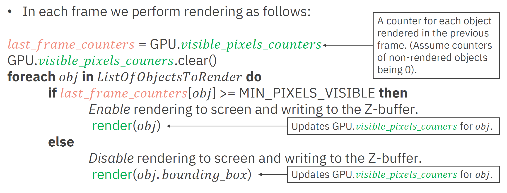

Problémy při přechodu jsou typicky zanedbatelné. Může nastat "blikání" tam a zpátky, taky zanedbatelné.

- **Hierarchický Z-buffer**\
  Je možné vytvořit hierarchii depth map ze Z-bufferu (podobnou, jako jsou mipmapy) a v té potom vyhledávat. Jen tam místo průměru uložíme nejzazší hodnotu. Při kontrole pak můžeme porovnat, jestli bbox vykreslovaného objektu je za (určitě schovaný), nebo před (sestupujeme hlouběji).

## Detail Culling

3D objekty mohou být definované mnoha miliony polygony či výpočetně náročnými matematickými funkcemi. Při renderování není třeba je vždy zobrazovat v té největší kvalitě. Pokud jsou objekty typicky daleko, je zbytečné na objektu renderovat tisíce polygonů, když daný objekt zabírá dva pixely obrazovky. K tomu využíváme LOD (level-of-detail)

Kroky LOD algoritmu:

1. **Generování** -- Musíme vytvořit jednotlivé modely s různými úrovněmi detailů
2. **Výběr** -- Metrika, která určuje, jak moc daný model přispívá celkovému obrazu
3. **Přepínání** -- Metoda změny z jednoho modelu na druhý (snažíme se zamezit náhlým změnám)

### Generování

Typicky z detailnějšího modelu vytváříme méně detailní

- Snižováním počtu trojúhelníků (High-poly -> Low-poly -> Billboard -> Prázdný model)
- Snižováním kvality osvětlení (Phong -> Gouraud -> Ambient)
- Snižováním kvality textur (Všechny textury -> Jen difuzní -> Jen barvy vrcholů)

### Výběr

- **Podle vzdálenosti**\
  Čím dále, tím nižší LOD. Můžeme přidat dead-zones, kde se LOD nemůže měnit -- zabráníme tak častým změnám na určitém místě.
- **Podle projekční plochy**\
  Promítneme objekt, nebo (častěji) nějaký obalující objem (AABB, kouli, ...) na obravovku a zjistíme plochu (nebo třeba průměr koule).
- **Další metody výběru**\
  Podle důležitosti, pohyb, focus, ...

### Přepínání

- **Diskrétní modely**\
  Přepínání mezi třemi nezávislými diskrétními modely je rychlé a efektivní, ale způsobuje "Popping efekt" (kdy se nám objekt náhle změní před očima -- ruší to)
- **Alfa LOD**\
  Jedna úroveň detailů, objekt je čím dál průhlednější až pak v jednu chvíli zmizí a nerenderujeme ho vůbec. Ne příliš efektivní (pořád renderujeme složitý objekt) a navíc potřebuje blending! Nemá ale popping efekt vůbec.
- **Blending LODs**\
  Při přepínání LOD renderujeme chvíli dva modely zároveň, jednomu zvyšujeme průhlednost a druhému snižujeme. Redukujeme tím popping efekt, ale zase neefektivní, protože chvíli renderujeme dva modely místo jednoho, taky blending!
- **Kontinuální LODs**\
  Dynamicky generujeme modely s méně polygony (edge collapse) podle aktuální úrovně. Toto redukuje popping efekt, ale je to velice náročné na implementaci a taky ne každý collapse vypadá dobře (je těžký problém vybrat správné hrany, možná je třeba nadefinovat manuálně).
- **Geomorfní LODs**\
  Nejen, že dynamicky smršťuje hrany, ale dělá to postupně a plynule. Toto úplně potlačuje popping efekt, ale objekty vypadají, že se konstantně mění. Zároveň je implementace velice náročná.

  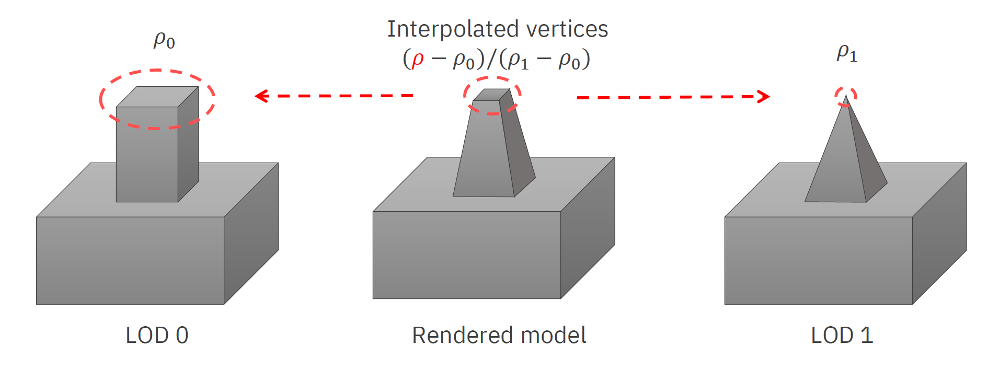

## Vykreslování terénu

Terén může být reprezentován

- **dlaždicemi (2D, 3D)** -- pro pravidelnou mřížku určují co se nachází na jednotlivých polích
- **síťí (mesh)** -- 3D model složený typicky z trojúhelníků
- **výškovou mapou (heightmap)** -- 2D obraz, kde barva určuje výšku terénu; nepodporuje převisy, jeskyně, ...
- **digitálními vrstevnicemi (digital contours)** -- kontrolní body splajn, za runtime snadno vytvoříme triangle strips
- **voxely** -- 3D krychle (typicky), které určují, co se nachází na daném místě

### Dlaždice

Často výrazné tvrdé přechody mezi dlaždicemi - můžeme smíchat dohromady více textur na hranách dlaždic.

- **Texture splatting**\
  Pro každou dlaždici máme několik textur, které se na ní mohou vyskytovat. Použijeme _alpha mask_, kterou pronásobíme každou texturu a pak je sečteme.

  Pro čtvercové dlaždice existuje jen 32 možných kombinací, takže můžeme tyto textury předpřipravit.

- **3D**\
  I ve 3D hrách se často používají dlaždice, kde často bývají vlastně 2D, jen je vykreslujeme ve 3 dimenzích. Tam typicky bereme připravené modely a umístíme je na dané místo.

### Mesh

Mesh už je množina trojúhelníků, které prostě vykreslíme na GPU.

### Heightmap

U heightmap můžeme rozdělit prostor na quady a každý z nich pak napůl a body umístit do správné výšky (viz obrázek)

Může nastat problém s nejednoznačností (_ambiguity_). Ta se většinou ignoruje.

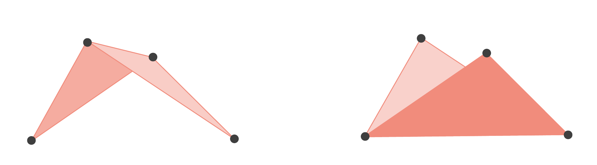

Výslednou mesh můžeme vyrenderovat, jako triangle strips.

### Voxely

Můžeme buď vyrenderovat krychle, ale to je neefektivní, protože krychle sdílejí strany. Alternativně můžeme vyhladit povrch pomocí Marching cubes, nebo použít raytracing.

### Výkon a zjednodušení

Často potřebujeme renderovat obrovské mapy a je zbytečné vzdálené body renderovat s nejvyšší kvalitou. Místo toho můžeme použít několik technik pro jejich odřezání / zjednodušení.

- **Quadtree**\
  Máme uložených několik úrovní detailů pro celou mapu. Podle vzdálenosti od kamery určíme, jak hluboko (jak detailně) sestoupíme v našem stromě. Zároveň můžeme strom využít pro aplikaci frustum cullingu. CPU musí upravovat mesh.
- **ROAM**\
  Podobné quadtrees, ale využívá trojúhelníků místo quads. Dynamicky mění úroveň detailů podle vzdálenosti od kamery. CPU musí upravovat mesh.
- **Triangle Bintree**\
  Dělí trojúhelníky víc a víc, čím blíže jsou ke kameře. CPU musí upravovat mesh.

  

- **Geometry Clipmaps**\
  Chová se k terénu, jako k obrázku s mipmapami. Čím blíže je kamera, tím větší detail. GPU si sám upravuje mesh.

  Je nutné hranice mezi jednotlivými částmi meshů vyhlazovat, aby nebyly vidět.

  

- **Tessellation**\
  GPU si sám upravuje mesh podle vzdálenosti od kamery. Můžeme využít i geometry shader, který nám umožní upravovat mesh v průběhu renderování.

## Techniky renderování stínů

Stíny jsou důležité, jelikož:

- zvyšují věrohodnost scény,
- jsou indikátorem vzdálenosti objektů od sebe -- hloubky scény,
- mohou dávat informaci o objektech, které jsou mimo zorné pole kamery nebo ukryté za jinými objekty,
- popisují tvar objektu, na který jsou promítány.

- **Hard shadows / "ostré" stíny**\
  Rozlišují jen, zda je bod osvětlený nebo ne. Neřeší se, jak moc je osvětlený. Týká se bodových světel.

  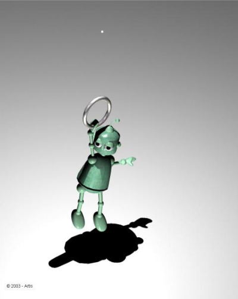
  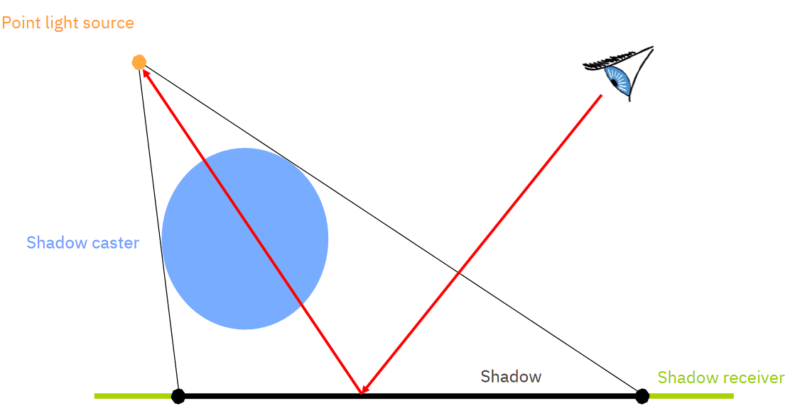

- **Soft shadows / "měkké" stíny**\
  Rozlišují i částečně osvětlené oblasti. Týká se světel, která mají plochu.

  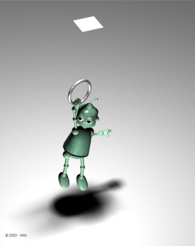
  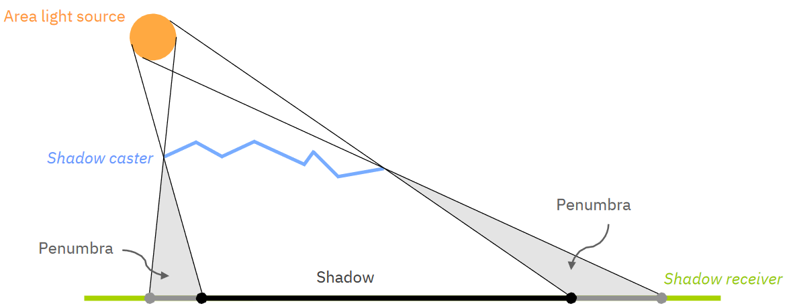

- **Planar shadows**\
  Vykreslí objekt ještě jednou projektovaný na danou plochu.

  - Použitelné na velké plochy jako je rovná podlaha či stěny.
  - Blinn (1988)
  - Jednoduché a rychlé.
  - Nedá se použít na sebevržené stíny, stíny vržené na jiné objekty, kulaté plochy, atd.

- **Fake shadows and Projective textures**\
  Použitelné pro velice málo velmi velkých dopadových objektů.

  1. Vyrenderuj objekt černobíle z pohledu světla a ulož do textury.
  2. Projektuj tuhle texturu na **každý** objekt, na který má dopadat stín.

- **Shadow maps**\
  Renderuje scénu z pohledu světla, ale ukládá si do textury jen hloubku. Při vykreslování scény z pohledu kamery sampleuje texturu a porovnává vzdálenost od světla s hloubkou v textuře. Pokud je větší, je bod ve stínu.

  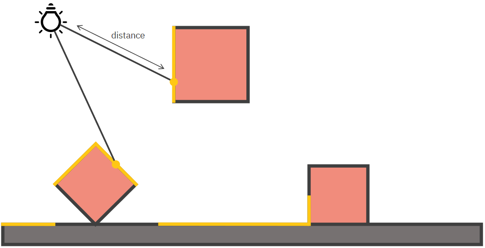

  > [!IMPORTANT]
  > Shadow mapám se důkladně věnuje otázka [Renderování s využitím GPU](../vph07_gpu_rendering/)

- **Shadow volumes**\
  Počítá stíny ve 3D. Shadow volume explicitně popisuje objem prostoru ve stínu nějakého polygonu.

  1. Pro každý shadow caster, vyrob shadow volume.
  2. Pro každý fragment, počítej do kolika objemů paprsek z kamery do fragmentu vstoupí (+1) a z kolika vystoupí (-1). Pokud je výsledek > 0, pak je fragment ve stínu, pokud je 0 tak je osvětlený.

     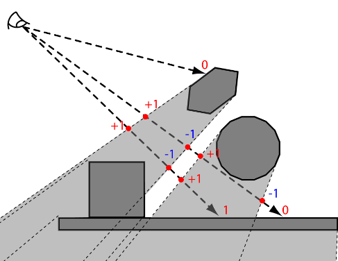

     Prakticky se používá Stencil Buffer Algorithm, kdy renderujeme pro každý objekt nejprve front faces a pak back faces. Tenhle přístup je problematický, pokud je kamera ve stínu, ale řešitelný pokud obrátíme pořádí objektů -- jdeme od nekonečna ke kameře (Z-fail, Carmack’s reverse).

- **Soft shadows**\
  Existuje množství algoritmů. Například shadow mapy s Percentage Closer Filtering (PCF). Jsou ale výpočetně náročnější než hard shadows.

[^pa010]: Byška, Furmanová, Kozlíková, Trtík: PA010 Intermediate Computer Graphics (podzim 2021)
