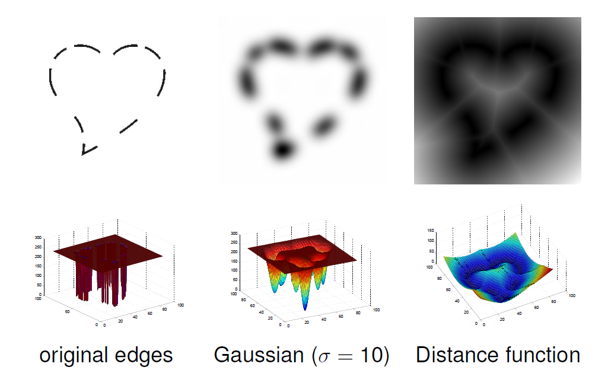
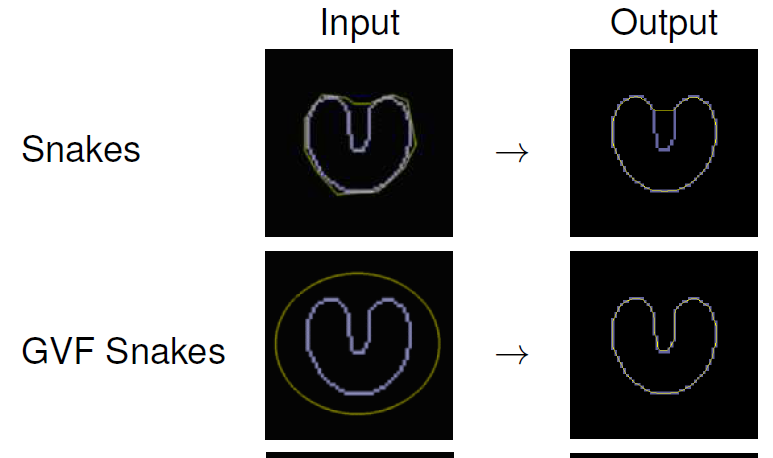
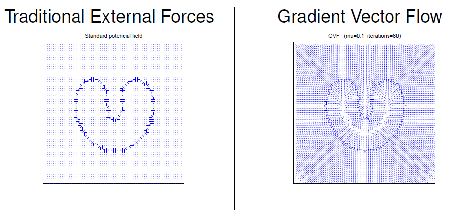
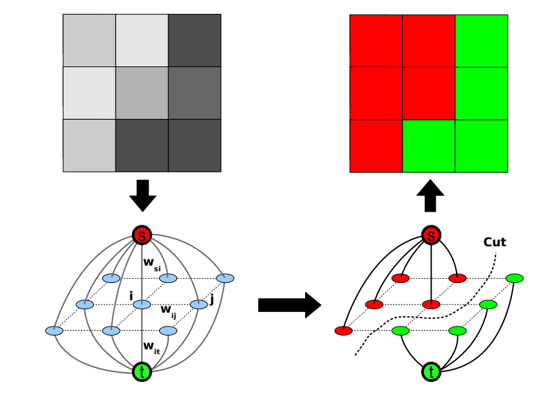
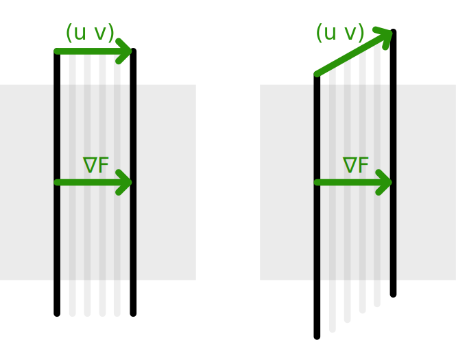

<dl><dt><strong>📌 NOTE</strong></dt><dd>

Variační filtrování. Aktivní křivky a plochy (geodetický model, Chan-Vese model). Minimalizace pomocí grafových řezů. Variační optický tok.

_PA166_

</dd></dl>

## Variační filtrování

Variační filtrování neřeší lokálně jednotlivé pixely, ale snaží se minimalizovat enetgii celého obrázku.

Typickým předpisem takovéhle funkce je

```math
E_f(u) = \int_{\Omega} (  \underbrace{(u - f)^2}_\text{similarity}   +   \alpha \underbrace{\Psi (| \nabla u |^2)}_\text{smoothness}   ) dx
```

Chceme, aby byl obrázek co nejpodobnější původnímu (_data/similarity term_), ale zároveň co nejvíc vyhlazený (_smoothness term/regularizer/penaliser_). Poměr těchto dvou členů určuje parametr $\alpha$. Regularizer $\Psi$ určuje “metodu” vyhlazení:

|                                     |                                                                                                              |
| ----------------------------------- | ------------------------------------------------------------------------------------------------------------ |
| **_Tikhonov (linear)_** -- identita | $\Psi(\lvert \nabla u \rvert^2) = \lvert \nabla u \rvert^2$                                                  |
| **_Charbonnier_**                   | $\Psi(\lvert \nabla u \rvert^2) = 2 \lambda^2 \sqrt{1 + \lvert \nabla u \rvert^2 / \lambda^2} - 2 \lambda^2$ |
| **_Total Variation_**               | $\Psi(\lvert \nabla u \rvert^2) = 2\sqrt{\lvert \nabla u \rvert^2} = 2\lvert\nabla u\rvert$                  |

Tuto funkci můžeme minimalizovat dvěma způsoby:

### Přímé řešení (lineární funkce)

Provedeme diskretizaci a poté parciálně zderivujeme pro jednotlivé pixely. Tím dostáváme sadu lineárních funkcí položených nule. Tyto poté položíme do matice, kterou řešíme. Matice má hodnoty pouze kolem diagonály, což znamená, že je velmi rychle řešitelná např. pomocí Thomas method.

Pokud je obraz 2D, bereme všechny pixely jako dlouhou 1D posloupnost a řešíme obdobně.

Matice je ale obrovská, proto můžeme využít např. Gauss-Seidel metodu, s pomocí které matici řešíme iterativně po řádcích.

### Nelineární řešení

Použijeme Variační kalkulus, který dokáže minimalizovat Funkcionály

- **Funkcionál**\
  Bere na vstupu funkci a přiřazuje jí nějakou hodnotu $u(x) \Rightarrow \mathbb{R}$.

Pro řešení můžeme nyní využít Euler-Lagrangeovy rovnice. Pro funkcionál $E_f(u) = \int_{\Omega} (  (u - f)^2   +   \alpha \Psi (| \nabla u |^2)   ) dxdy$ získáme předpis pro minimalizaci:

```math
0 = u - f - \alpha \text{div}(\Psi'(\lvert \nabla u \rvert^2) \nabla u)
```

Nyní můžeme hezky vidět vztah k difuznímu filtrování (otázka [PGV10](../zpracovani_obrazu_pomoci_PDE)):

|                          |                                                                                |
| ------------------------ | ------------------------------------------------------------------------------ |
| **_Variační metoda_**    | $\frac {u - f}{\alpha} = \text{div}(\Psi'(\lvert \nabla u \rvert^2) \nabla u)$ |
| **_Difuzní filtrování_** | $\partial_t u = \text{div}(\Psi'(\lvert \nabla u \rvert^2) \nabla u)$          |

Přičemž vidíme, že

- **Tikhonov regulariser** ~ **Linear diffusivity**
  - $\Psi(\lvert \nabla u \rvert^2) = \lvert \nabla u \rvert^2$
  - $\Psi'(\lvert \nabla u \rvert^2) = 1$
- **Charbonnier regulariser** ~ **Charbonnier diffusivity**
  - $\Psi(\lvert \nabla u \rvert^2) = 2 \lambda^2 \sqrt{1 + \lvert \nabla u \rvert^2 / \lambda^2} - 2 \lambda^2$
  - $\Psi'(\lvert \nabla u \rvert^2) = \frac{1}{\sqrt{1 + \lvert \nabla u \rvert^2 / \lambda^2}}$
- **Total Variation regulariser** ~ **Total Variation diffusivity** s difusivitou $\frac{1}{\lvert \nabla u \rvert}$
  - $\Psi(\lvert \nabla u \rvert^2) = 2\lvert\nabla u\rvert$
  - $\Psi'(\lvert \nabla u \rvert^2) = \frac{1}{\lvert \nabla u \rvert}$

## Aktivní křivky a plochy

- **Segmentace**\
  Chceme rozdělit obrázek podle něčeho (region based, edge based, texture, …)
- **Segmentace založená na energii**\
  Hledáme konturu s minimální energií. Závisí na volbě iniciální křivky - hledá pouze lokální minimum.

### Hadi

Působí dvě energie:

- Vnitřní - tvar a plynulost křivky
- Vnější - omezení z obrázku

Kontura zadaná, jako parametrická křivka $p(s): [0, 1] \rightarrow \mathbb{R}\ \ \ \ p(s) = (x(s), y(s))^T$. Podobně, jako u variačního filtrování, definujeme funkcionál energie, který se snažíme minimalizovat:

```math
E(p) = \int_0^1 E_{int}(p(s)) + E_{ext}(p(s)) ds
```

Kde $E_{int}$ je **vnitřní energie**, kde $\alpha$ a $\beta$ jsou váhy pro délku ($\alpha$) a křivost ($\beta$) křivky:

-

```math
E_{int}(p(s)) = \alpha(s) \lvert p'(s) \rvert^2 + \beta(s) \lvert p''(s) \rvert^2
```

A $E_{ext}$ je **vnější energie**, kde $P$ je potenciální funkce:

-

```math
E_{ext}(p(s)) = P(p(s))
```

- **Potenciál**\
  Potenciál určuje vztah křivky k obrázku. Může být definován různými způsoby:

  - **Hrany** - $P(x, y) = -\lvert \nabla f(x, y) \rvert^2$
  - **Hrany po rozmazání** - $P(x, y) = -\lvert \nabla (G_{\sigma}(x, y) * f(x, y) )\rvert^2$
  - **Linie** - $P(x, y) = -f(x, y)$
  - **Linie po rozmazání** - $P(x, y) = -G_{\sigma}(x, y) * f(x, y)$

Minimalizaci funkcionálu chceme opět udělat Euler-Lagraneovou rovnicí, tedy:

```math
\alpha p''(s) + \beta p'''(s) - \nabla P = 0 \text{, kde } p(0), p'(0), p(1), p'(1) \text{ jsou zadané}.
```

Na derivace můžeme použít finite differences a přepíšeme výsledek do matice $AX = F_{ext}$. Blbý ale je, že F*{ext} závisí na p a p závisí na F*{ext}. Proto se to řeší iterativně $\frac{\partial p}{\partial t} = F_{int}(p) + F_{ext}(p)\\p(s, 0) = p_0(s)$

- **Problémy**
- Reparametrizace
  - Body mají tendenci se slévat do míst s nízkou potenciální energií
  - Musíme jednou za čas rozmístit body pravidelně podél vzniklé křivky
- Normalizace (Diskretizace času)
  - Velikost gradientu není ničím omezena a může nám “vystřelit” body úplně do kša
  - Místo klasického gradientu vezmeme gradient normalizovaný, tedy jen směr
- Diskretizace prostoru
  - Potenciální funkce je spočítaná pouze v diskrétních bodech, ale křivka může procházet i mimo tyto body
  - Na dopočítání použijeme například bilineární interpolaci
- Problémy předchozí detekce hran

  - Výsledkem detekce hran je často binární obrázek, kde by ale křivka nevěděla, kam se pohybovat - kuličky jsou na rovině
  - Můžeme obrázek Gaussovsky rozmazat, nebo dopočítat vzdálenost všech bodů od bodů hran (distance function from the edge pixels)

    

- Balonování

  - Kontury mají tendenci se slévat do středu do jednoho bodu, kde zaniknou
  - Často chceme detekovat něco, kde začneme uvnitř
  - K externím silám přidáme tzv. balonovou sílu ve směru normály křivky

    $$F_{ext} = k_1 n(s) - k \frac{\nabla P}{|\nabla P|}$$

  - Parametr $k_1$ ovlivňuje, jestli se křivka “nafukuje”, nebo “vyfukuje”, můžeme měnit během iterování

- GVF Snakes
- Kontury mají problém opsat “tvar rohlíku” a nic je nenutí dostávat se do úzkých prostor

  

- Převedeme externí síly na nové pole sil, kterému říkáme Gradient Vector Flow
- Chceme v podstatě přidat síly tam, kde nejsou hrany, aby celý prostor k hranám směřoval

  

### Geodetické aktivní křivky

Hloupé na hadech (to, co jsem popisoval doteď) je, že závisí na parametrizaci (rozložení bodů na křivce). GAC naopak na parametrizaci nezávisí.

Pro křivku minimalizujeme funkcionál (_Chceme co nejmenší délku křivky && co nejnižší celkový gradient_): +

```math
E_{GAC}(C) = \int_0^1 g(\underbrace{\lvert \nabla G_{\sigma} * I(C(q)) \rvert}_{\text{Vyhlazený obrázek}})   \underbrace{\lvert C'(q) \rvert}_{\text{Délka křivky}}   dq
```

Funkce $g$ snižuje vliv délky na energii, pokud leží v místech s vysokým gradientem, protože je nepřímo úměrná rozmazanému gradientu: +

```math
g(\lvert \nabla G_{\sigma} * I(x, y) \rvert) = \frac{1}{1 + \lvert \nabla G_{\sigma} * I(x, y) \rvert}
```

### Chan-Vese model

Do teď jsme neřešili, co je uvnitř kontur (homogenita), jen co je přímo pod nimi. Chan-Vese model se snaží najít konturu, která rozdělí obrázek na dvě části s různými intenzitami.

```math
E_{CV}(\underbrace{C}_{\text{Křivka}}, \underbrace{c_1}_{\substack{\text{Odhad} \\ \text{popředí}}}, \underbrace{c_2}_{\substack{\text{Odhad} \\ \text{pozadí}}}) =
\underbrace{\mu L(C)}_{\text{Délka křivky}} + \underbrace{\lambda_1 \int_{\Omega_1} (f(x) - c_1)^2 dx}_{\text{Odlišnost popředí od odhadu}} + \underbrace{\lambda_2 \int_{\Omega_2} (f(x) - c_2)^2 dx}_{\text{Odlišnost pozadí od odhadu}}
```

- **_Regularity term_** - délka dělící křivky
- **_Data term (2x)_** - rozdíl částí (fg,bg; $\Omega_1, \Omega_2$) od konstantního odhadu $c_1, c_2$
- Parametry $\mu, \lambda_1, \lambda_2$ určují vyhlazení, variabilitu pozadí a popředí respectively
- Pro danou křivku C jsou optimální $c_1, c_2$ s průměrnou hodnotou

Abychom se zbavili integrálů přes část oblasti, můžeme použít Harveside funkci, která vrací 0 pro nulu a 1 jinak. Tím dostaneme:

```math
\begin{aligned}
E_{CV}(C, c_1, c_2) &= \mu \int_{\Omega} \lvert \nabla H (u(x)) \rvert dx   &\footnotesize{\text{ Délka křivky}}\\
&+ \lambda_1 \int_{\Omega} (f(x) - c_1)^2 H(u(x)) dx                        &\footnotesize{\text{ Odlišnost popředí od odhadu}}\\
&+ \lambda_2 \int_{\Omega} (f(x) - c_2)^2 (1 - H(u(x))) dx                  &\footnotesize{\text{ Odlišnost pozadí od odhadu}}\\
\end{aligned}
```

Diskretizujeme a řešíme.

## Minimalizace pomocí grafových řezů

Rozdělení metodou minimálního řezu využívá algoritmu pro hledání minimálního řezu v grafech. Uvažme graf, kde každý pixel je jeden vrchol a pro všechny pixely vytvoříme hrany ze zdroje (s) a spotřebiče (t) a hrany mezi sousedy.



- **Riemannovy metrické systémy**\
  Normálně, když počítáme délku mezi dvěma body, počítáme ji, jako $d = \sqrt{u^T \cdot u}$. Můžeme ale přidat tzv. metrický tensor $M$, který může tuto délku upravit v závislosti na směru $d = \sqrt{u^T \cdot M \cdot u}$. Díky tomu potom můžeme měřit nejen euklidovskou vzdálenost, ale třeba:

  - **Euklidovskou vzdálenost** - $M = I$ (identita)
  - **Geodetickou vzdálenost** - $M = \text{diag}(g(\lvert \nabla I(\cdot) \rvert))$
  - **Anizotropní vzdálenost** - $M = g(\lvert \nabla I(\cdot) \rvert) \cdot E + (1 - g(\lvert \nabla I(\cdot) \rvert)) \cdot u \cdot u^T$ (kde $u = \frac{\nabla I}{\lvert \nabla I \rvert}$ jednotkový vektor ve směru gradientu a $E$ je identita)

Pro aproximaxi vah hran v našem grafu můžeme použít Riemannovu metriku:

```math
w_k^R = w_k^{\epsilon} \cdot \frac{\text{det} M}{(u_k^T \cdot M \cdot u_k)^{p}}
```

### Geodetická segmentace

Můžeme rozdělit obrázek na dvě části pomocí minimálního řezu na dvě části podle geodetické vzdálenosti.

- **t-linky (hrany do _s_ nebo do _t_)** - nastavíme váhy na 0 vyjma pixelů s omezením (víme, že jsou popředí, nebo pozadí), které nastavíme na nekonečno (nebo velkou konstantu), čímž zabráníme výběr do minimálního řezu
- **n-linky (mezi sousedními pixely)** - podle Riemannovy metriky

### Chan-Vese pomocí minimálního řezu

Můžeme rozdělit obrázek na dvě části, přičemž o některých pixelech víme, jestli patří do popředí, nebo do pozadí. Podobně, jako u Chan-Vese křivkami máme odhad $c_1, c_2$ pro popředí a pozadí. Nastavme tedy váhy:

- **t-linky** - $w_{si} = \lambda_2(f(i) - c_2)^2 \text{, } w_{it} = \lambda_1(f(i) - c_1)^2$
- **n-linky** - podle Riemannovy metriky

Bohužel $w_{si}, w_{it}$ jsou závislé na $c_1, c_2$. Typicky řešíme tak, že si tipneme, provedeme iteraci, aktualizujeme a jedem znovu

## Variační optický tok

Pro sekvenci obrázků $f(x,y,t)$ chceme získat vektor posunutí $(u(x,y,t),v(x,y,t))^T$ každého místa obrázku.

Máme **_2 předpoklady_**, které platí pro všechny metody:

- Zachování jasu (mezi snímky se nám nemění jas obrázku) = **_BCA_** - $f(x+u, y+v, t+1)=f(x,y,t)$ (posunutý pixel se rovná neposunutému)
- Malé změny (objekty se posouvají jen o několik málo (třeba 5) pixelů) - Abychom mohli provést linearizaci Taylorovým rozvojem

Z rovnice pro BCA můžeme linearizací dostat

```math
0 = f(x+u, y+v, t+1) - f(x,y,t) \\
\approx f_x(x,y,t)u + f_y(x,y,t)v + f_t(x,y,t)
```

Tím dostáváme nejdůležitější rovnici **linearised optical flow constraint (OFC)
$f_x u+f_y v + f_t = 0$ ($\nabla f \cdot (u,v) + f_t = 0$)**

Problém Apertury = OFC ukazuje jen tok rovnoběžný s gradientem (protože jinak to není vidět)



Taky protože $f_x u+f_y v + f_t = 0  \sim  \nabla f \cdot (u,v) + f_t = 0$ , tedy máme projekci reálného směru na gradient\
-> Nonuniqueness = Můžeme libovolně přidat část toku kolmou na gradient, aniž bychom změnili výsledek

### Lukas a Kanade (Lokální metoda)

Přidává 3. předpoklad:

- Zachování jasu
- Malé změny
- **Konstantnost toku v okolí $B_\rho$ každého bodu**

Chceme minimalizovat následující lokální energii (integrál přes okolí)

```math
E(u,v) = \frac{1}{2} \int_{B_\rho(x_0, y_0)} (f_x u + f_y v + f_t)^2 dx dy
```

Parciálně zderivujeme a převedeme na matice

```math
\begin{aligned}
0 = \frac{\partial E}{\partial u} &= \int_{B_\rho} f_x(f_x u + f_y v + f_t) dx dy = 0 \\
0 = \frac{\partial E}{\partial v} &= \int_{B_\rho} f_y(f_x u + f_y v + f_t) dx dy = 0
\end{aligned}
\\
\begin{pmatrix}
\int_{B_\rho} f_x^2 dxdy & \int_{B_\rho} f_x f_y dxdy \\
\int_{B_\rho} f_x f_y dxdy & \int_{B_\rho} f_y^2 dxdy
\end{pmatrix}
\begin{pmatrix}
u \\
v
\end{pmatrix}
=
\begin{pmatrix}
-\int_{B_\rho} f_x f_t dxdy \\
-\int_{B_\rho} f_y f_t dxdy
\end{pmatrix}
```

Můžeme nahradit integrály za Gaussovské rozmazání, čímž dostaneme "plynulejší okolí"

```math
\begin{pmatrix}
G_{\sigma} * (f_x^2) & G_{\sigma} * (f_x f_y) \\
G_{\sigma} * (f_x f_y) & G_{\sigma} * (f_y^2)
\end{pmatrix}
\begin{pmatrix}
u \\
v
\end{pmatrix}
=
\begin{pmatrix}
-G_{\sigma} * (f_x f_t) \\
-G_{\sigma} * (f_y f_t)
\end{pmatrix}
```

Snadno vyřešíme Cramerovým pravidlem

Výhody

- Jednoduché, rychlé
- Stačí nám 2 snímky

Nevýhody

- Problémové situace, kde neplatí podmínka konstantnosti - rotace, protijedoucí auta, …
- Nepočítá husté pole toků (jen tam, kde víme gradient)

### Horn-Schunck (Globální metoda)

Pouze dva přepoklady:

- Zachování jasu - $f_x u+f_y v + f_t = 0$
- Malé změny (Gradient vektorového pole je malý) - $\int_{\Omega} ( \lvert \nabla u \rvert^2 + \lvert \nabla v \rvert^2) dx dy$ je malé

Kombinací dostáváme funkcionál energie optického toku

```math
E_{HS}(u, v) = \int_{\Omega} ((f_x u + f_y v + f_t)^2 + \alpha (\lvert \nabla u \rvert^2 + \lvert \nabla v \rvert^2)) dx dy
```

Tento funkcionál minimalizujeme na jediné globální řešení

Výhody

- Jsme schopni řídit smoothness pomocí $\alpha$
- Produkuje dense flow fields

Nevýhody

- Stále musíme splňovat předpoklad malých změn
- Celkem pomalé a drahé
