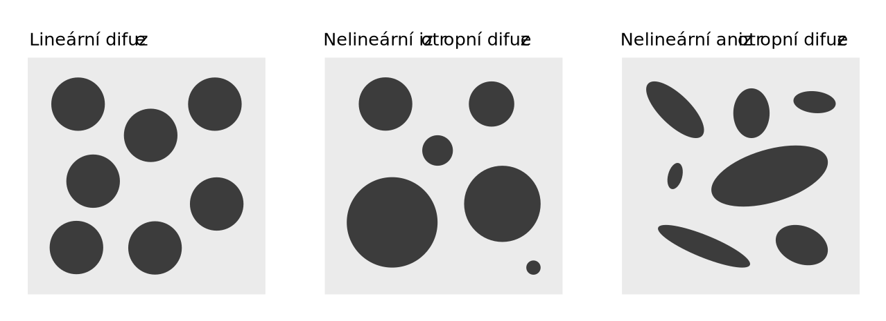
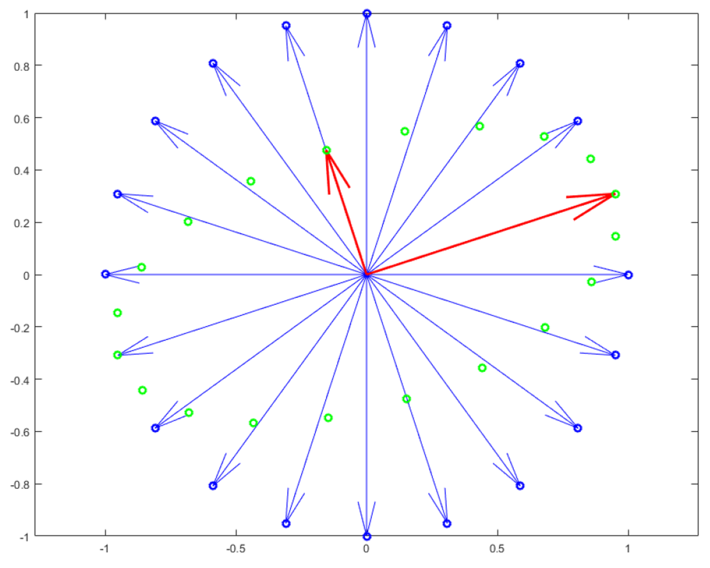
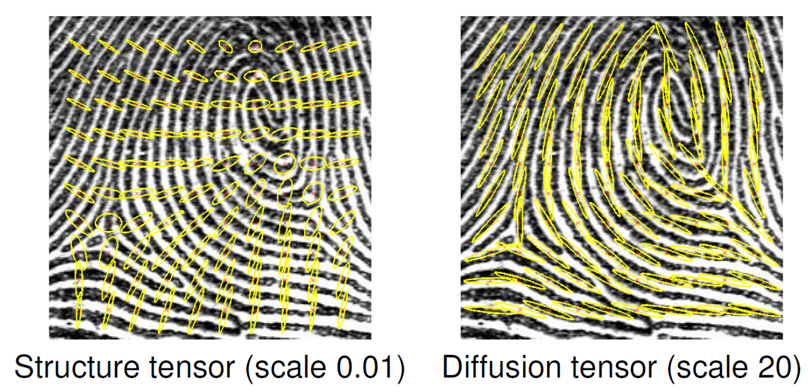
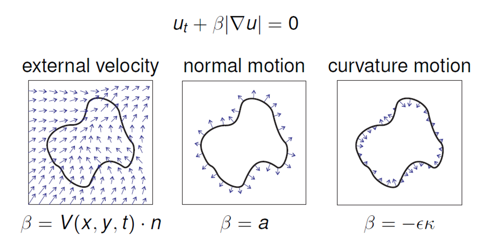
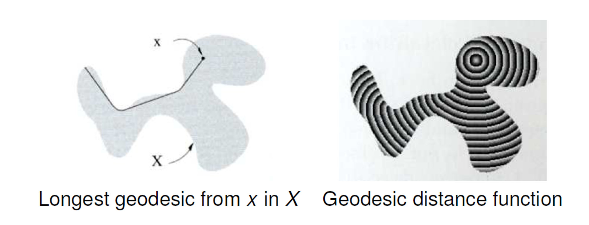

> [!NOTE]
> Difúzní filtrování (lineární difuze, nelineární izotropní a nelineární anizotropní difuze). Level set metody (pohyb ve směru normály, pohyb řízený křivostí a pohyb ve vnějším vektorovém poli). Fast marching algoritmus.
> <br>
> _PA166_


- **Divergence**\
  Operace, která nám říká, jak moc vektorové pole míří ven z daného bodu. Pokud je $\text{div} j > 0$, pak se v daném bodě hodnota časem snižuje, pokud je $\text{div} j &lt; 0$, pak se hodnota zvyšuje.

  $\text{div} j = \nabla^T j = (\partial_x, \partial_y) \cdot (j_1, j_2) = \partial_x j_1 + \partial_y j_2$.

- **Laplacian $\Delta$**\
  Jak se mění teplota v daném místě s časem, proto to odpovídá derivaci teploty podle času.

  Laplacian je vlastně divergence gradientu: $\Delta u = \text{div}(\nabla f) = (\partial_x, \partial_y) \cdot (\partial_x u, \partial_y u) = \partial_{xx} u + \partial_{yy} u = u_{xx} + u_{yy}$.

## Difuze

Imituje šíření tepla v 1D tyči / 2D ploše / ... Řídí se také rovnicí pro šíření tepla: $u_t = \Delta u = u_{xx} + u_{yy}$ (kde $\Delta$ je Laplaceův operátor).

- Teplo se v takové ploše může šířit různými způsoby v závislosti na vlastnostech materiálu. Je možné že:

1. Celý materiál ve všech směrech vede teplo stejně = **lineární difuze (LD)**.
2. Materiál vede v různých místech teplo různě, ale vždy ve všech směrech stejně = **nelineární izotropní difuze (NID)**.
3. Materiál vede teplo různě v různých směrech = **nelineární anizotropní difuze (NAD)**.



### Lineární difuze

Pokud aplikujeme lineární difuzi na obrázek, dojde k jeho rozmazání (Gaussovský filtr).

Pokud vezmeme prostor všech různých Gaussovských rozmazání v různých časem, dostáváme "Gaussovský prostor měřítek" (_Gaussian scale space_). Pro ten platí

- **_Zachování průměrné hodnoty šedé_**
- **_Princip maxima a minima_** - se zvyšujícím se t se maximum jedině snižuje a minimum jedině zvyšuje
- **_Řešení je nezávislé na_**
- **_Posuvu hodnoty šedé_** - “posun po ose Y”
- **_Translaci_** - “posun po ose X”
- **_Škálování_**
- **_Vlastnost porovnání_** - pokud $u \leq v \rightarrow (T_tu) \leq (T_tv)$
- Pro dimenze $\geq 2$ mohou vznikat nové extrémy

Chceme vypočítat $u_{ij}^{k + 1}$ pomocí aproximace Taylorova rozvoje:

```math
u_t = \frac{u_{ij}^{k + 1} - u_{ij}^k}{\Delta t} + O(\Delta t)\\
u_{xx} = u_{i + 1, j}^k - 2u_{ij}^k + u_{i - 1, j}^k + O(\Delta x^2)\\
u_{yy} = u_{i, j + 1}^k - 2u_{ij}^k + u_{i, j - 1}^k + O(\Delta y^2)
```

A z této rovnice už vyjádříme $u_{ij}^{k + 1}$. ($\Delta t$ je časový krok, $\Delta x$ a $\Delta y$ jsou prostorové kroky)

### Nelineární izotropní difuze

Zobecníme funkci pro difuzi kombinací Fick’s law a Mass preservation: $\partial_t u = \text{div} (g \cdot \nabla u)$, kde $\div$ je divergence.

- **Lineární**
  - $g = 1$
  - Rozmazání ve všech bodech stejně ve všech směrech
- **Nelineární izotropní**
  - $g =$ skalární funkce
  - Rozmazání stejně ve všech směrech, ale v každém bodě jinak
- **Nelineární anizotropní**
  - $g =$ maticová funkce
  - Rozmazání v každém bodě a směru jinak

Pro NID chceme typicky zabránit rozmazání na výrazných hranách. Chceme tedy, aby fce $g$ byla na hranách (tam, kde je velký gradient) co nejmenší a jinde co největší. Existuje několik různých vzorců:

- **Perona-Malik difuzivita**\
  $g(\nabla u) = \frac{1}{1 + |\nabla u|^2 / \lambda^2}$.
- **Charbonnier difuzivita**\
  $g(\nabla u) = \frac{1}{\sqrt{1 + |\nabla u|^2 / \lambda^2}}$.
- **Exponenciální difuzivita**\
  $g(\nabla u) = e^\frac{-|\nabla u|^2}{2\lambda^2}$.

### Nelineární anizotropní difuze

NID nechával "chlupaté hrany", protože kolem hran nerozmazával vůbec. NAD dokáže kolem hran rozmazat jen v tom správném směru, neboť $g$ je v tomto případě matice.

- **Symetrická matice**\
  Reprezentuje otočení, roztažení a otočení zpátky:

  ```math
  A=
  \begin{pmatrix}
  u_1 & v_1\\
  u_2 & v_2
  \end{pmatrix}
  \begin{pmatrix}
  \lambda_1 & 0\\
  0 & \lambda_2
  \end{pmatrix}
  \begin{pmatrix}
  u_1 & u_2\\
  v_1 & v_2
  \end{pmatrix}
  ```

  - Vlastní vektory kolmé na sebe
  - Vlastní čísla jsou reálná

  

Díky symetrickým maticím můžeme sestavit sami maticky s předem danými vlastními vektory a čísly.

- **Edge-enhancing difuzivita (difuzivita zvýrazňující hrany)**\
  My chceme matici, co má následující vlastnosti:

  ```math
  v_1 \parallel \nabla u_\sigma, \lambda_1 = g(|\nabla u_\sigma|^2) \\
  v_2 \perp \nabla u_\sigma, \lambda_2 = 1
  ```

  Kde funkce $g$ je funkce nepřímé úměry. Tím zajistíme, že rozmazání podél hran bude maximální a v ostatních směrech bude minimální.

- **Coherence-enhancing difuzivita (difuzivita zvýrazňující koherenci)**\
  Potřebujeme vypočítat difuzní tenzor a podle něj potom aplikujeme rozmazání. Tenzor je dán jako:

  ```math
  D = \nabla u_\sigma \nabla u_\sigma^T
  ```

  My opět vytvoříme matici s vlastními vektory a čísly. Tentokrát vektory vezmeme z tensoru: Vlastní vektor tensoru s větším vl. číslem vede přes strukturu -> Dáme mu malé číslo blízko nuly; vlastní vektor s menším vl. číslem vede kolmo -> Dáme mu číslo podle rozdílu koherence (pokud je koherentní, nechceme rozmazávat tolik, může to být roh).

  

## Level set metody

Level set metody využívají implicitní reprezentace křivek.

- **Implicitní reprezentace**\
  Představme si funkci, která má uvnitř křivky záporné hodnoty, na křivce nulu a venku kladné hodnoty. Potom můžeme křivku reprezentovat, jako (nulovou) vrstevnici funkce.

  Při takovéto reprezentaci nemáme přístup přímo k hranici, ale můžeme jí získat například pomocí marching squares (cubes) algoritmu. Zároveň musíme mít uloženou hodnotu funkce pro celý obraz, což může být nevýhoda. Výhodou je, že můžeme snadno měnit topologii křivky (přidávat díry, spojovat křivky, ...).

  Toto všechno funguje i ve 3D, kde se ale bavíme o povrchu.

Vývoj křivky můžeme definovat, jako $\frac{\partial C}{\partial t} = \beta n$ (kde $n$ je normála a $\beta$ řídí rychlost evoluce). Pokud ho chceme definovat v rámci obalující funkce $u$, můžeme ho zapsat, jako $\partial_t u = \beta |\nabla u|$. $\beta$ v této rovnici ovlivňuje směr a rychlost pohybu křivky, $|\nabla u|$ je velikost gradientu.

**Level set metody se snaží řešit tuto rovnici**.

- **Typy pohybu**\
  Existují 3 základní typy pohybu křivky:

  - **_Pohyb ve směru normály_** - $\beta = a$ = dilatace / eroze
  - **_Pohyb řízený křivostí_** - $\beta = - \epsilon \kappa$ = vyhlazování křivky
  - **_Pohyb ve vnějším vektorovém poli_** - $\beta = V(x, y, t) \cdot n$, kde $V$ je vnější vektorové pole

  

- **Pohyb ve vnějším vektorovém poli**\
  $\beta = V(x, y, t) \cdot n$ popisuje pohyb ve vektorovém poli definovaném parametrem $V$. Aproximujeme opět pomocí Taylorova rozvoje.
- **Pohyb řízený křivostí**\
  Chceme, aby se křivka vyhlazovala, protože křivost je vlastně druhá derivace. $\beta = - \epsilon \kappa$ popisuje pohyb křivky ve směru opačném k její křivosti. $\kappa$ je křivost a $\epsilon$ je parametr, který řídí rychlost vyhlazování.
- **Pohyb ve směru normály**\
  Chceme, aby se křivka rozšiřovala, nebo smršťovala. $\beta = a$ popisuje pohyb křivky ve směru normály. $a$ je parametr, který řídí rychlost pohybu.

Všechny typy pohybu můžeme zapsat do jedné rovnice: $u_t = -V \cdot \nabla u - a |\nabla u| + \epsilon \kappa |\nabla u|$ a aproximovat pomocí Taylorova rozvoje.

### Fast marching algoritmus

FMA je specifický případ Level set metody s pouze jedním typem pohybu ve směru normály $\partial_t u = a |\nabla u|$.

Pro různé případy můžeme volit různé hodnoty $a$.

- **Euklidovská vzdálenost**\
  Pro výpočet vzdálenosti od křivky ke všem bodům obrazu zvolíme $a = 1$.
- **Geodesická vzdálenost**\
  Chceme-li změřit vzdálenost od daného bodu uvnitř objektu, zvolíme $a = 1$ uvnitř objektu a $a \rightarrow 0$ venku.

  

- **Segmentace**\
  Můžeme jednoduše segmentovat obraz, pokud zvolíme $a = g(|\nabla f|)$ (kde $f$ je obraz a $g$ je nějaká funkce, například Perona-Malik). Potom $g$ jde k 0 při vysokém gradientu a k 1 při nízkém gradientu.

Samotný výpočet algoritmu je trošku složitější, uděláme si 3 množiny

- Trial (co chceme testovat, init. kontura)
- Far (neobjevené, init. všechno krom kontury)
- Known (vyřešené, init. prázdná množina)

Vždy najdeme v Trial nejmenší hodnotu, přehodíme ji do Known a pro její sousedy vypočítáme nový arrival time minimalizací $T_{new} = \tau(v_1, v_2) + v_1 T_1 + v_2 T_2$, kde $\tau$ je časový krok, $T_1, T_2$ jsou hodnoty v Known a $v_1, v_2$ jsou souřadnice bodu X, které chceme minimalizovat ($v_1 + v_2 = 1, v_1, v_2 \geq 0$).

Konkrétní výpočet je ve slidech, nebo v [notionu](https://xrosecky.notion.site/PA166-Image-analysis-II-b2875a07366c404dabbf20a8b75a6e2e?pvs=74), ale myslím, že je celkem zbytečný.

Složitost je v řádu $O(n \log n)$, kde $n$ je počet pixelů v obrazu.
