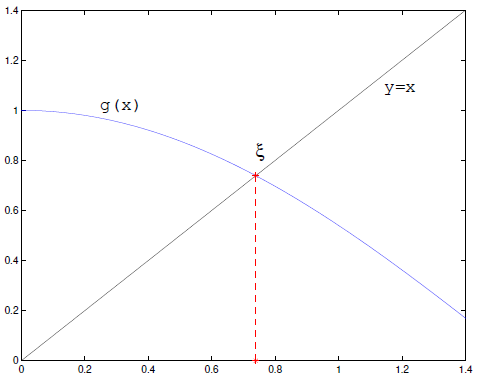
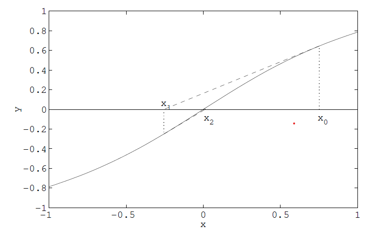
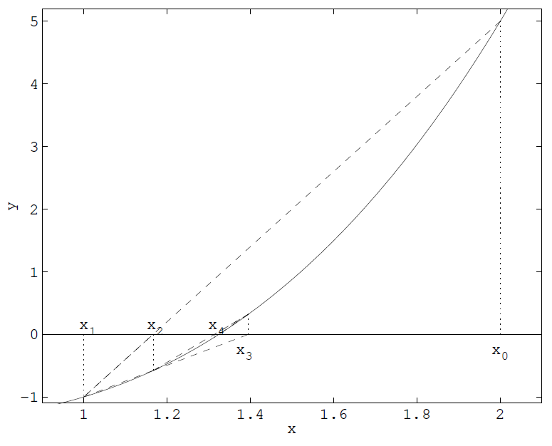
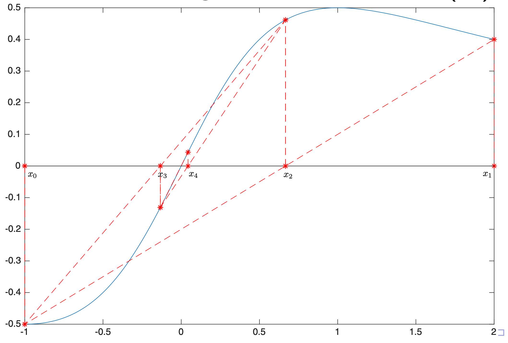

> [!NOTE]
> Iterativní metody pro řešení nelineárních rovnic (Newtonova metoda a její modifikace). Přímé metody pro řešení systému lineárních rovnic (Gaussova eliminace, Jacobi, Gauss-Seidel, relaxační metody). Numerická diferenciace, diferenciační schémata.
> <br>
> _MA018_


- **Numerická analýza / numerical analysis**\
  Oblast matematiky / informatiky zabývající se tvorbou numerických metod a algoritmů, které řeší problémy matematické analýzy (např. derivace, integrály a podobný symbolický balast) pomocí numerické aproximace. [^numerical-analysis]

  Je výhodná v situacích, kdy problém nelze řešit analyticky nebo je to příliš složité a není to (výpočetní) čas.

- **Notace chyb**

  - $x$ je přesná hodnota,
  - $\tilde{x}$ je aproximace $x$,
  - $x - \tilde{x}$ je absolutní chyba $\tilde{x}$,
  - $\lvert x - \tilde{x} \rvert \leq \alpha$ je odhad absolutní chyby,
  - $\frac{x - \tilde{x}}{x}$ je relativní chyba,
  - $\left\lvert \frac{x - \tilde{x}}{x} \right\rvert \leq \alpha$ je odhad relativní chyby.

- **Numerická stabilita**\
  Schopnost numerické metody zpracovat chyby vstupních dat a výpočetních operací.

  Desetinná čísla jsou v počítačích nevyhnutelně reprezentována nepřesně. Numericky stabilní metody jsou takové, které tyto nepřesnosti **nezhoršují**. [^numerical-stability]

- **Řád metody / order of accuracy / order of approximation**\
  Hodnota reprezentující, jak rychle metoda konverguje k výsledku, resp. jak přesný je její odhad.

  Numerická metoda obvykle konverguje snižováním nějakého _kroku_ $h$. Pokud ho lze zvolit libovolně malý, a lze-li prohlásit, že pro chybu aproximace $E$ platí: [^rate] [^numericka-metoda] [^order-question]

  ```math
  \begin{aligned}

  E(h) &\leq C \cdot h^p \\
  E(h) &\in \mathcal{O}(h^p)

  \end{aligned}
  ```

  kde $C$ je konstanta. Pak $p$ je řád metody.

## Iterativní metody pro řešení nelineárních rovnic

- **Root-finding problem**\
  Problém nalezení _kořenů_ (root) funkce $f$. T.j. takových parametrů $x, ...$, kde funkce vrací 0: [^root-finding]

  ```math
  f(x, ...) = 0
  ```

- **Iterative methods for root-finding problem**\
  Metody pro řešení root-finding problemu, které využívají iterativního přístupu. Tedy opakují nějaký výpočet a zpřesňují svůj odhad, dokud nedosáhnou požadované přesnosti. [^ma018] [^root-finding]
- **Řád metody / rate of convergence**\
  Hodnota reprezentující, jak rychle metoda konverguje k výsledku. [^rate]
- **Prostá iterační metoda / metoda pevného bodu / fixed-point iteration**\
  Používá se pro rovnice typu $x = g(x)$.

  1. Zvolíme počáteční odhad $x_0$.
  2. Opakujeme $x_{n+1} = g(x_n)$ dokud $\lvert x_{n+1} - x_n \rvert \leq \alpha$ (kde $\alpha$ je požadovaná přesnost).

     

- **Newtonova metoda / metoda tečen**\
  Používá k odhadu kořene funkce $f$ její tečnu v bodě $x_n$. Iterační funkce je:

  ```math
  g(x_{k+1}) = x_k - \frac{f(x_k)}{f'(x_k)}
  ```

  1. Zvolíme počáteční odhad $x_0$.
  2. Další odhad je $x_{n+1} = g(x_n)$, tedy průsečík tečny fukce $f$ v bodě $x_n$ s osou $x$.
  3. Opakujeme 2. dokud nedosáhneme požadované přesnosti odhadu.

     
  

  > [!TIP]
  > How to derive Newton approximation method:
  > 1. Start with Taylor $f(x)=\sum_{n=0}^{1} \frac{f_n(a)}{n!} \cdot (x-a)^n$
  > 2. Substitute $a = x_n$
  >
  > $f(x) \approx f(x_n) + f'(x_n)(x-x_n)$
  > 
  > Now, we want to find $x_{n+1}$ such that $f(x) = f(x_{n+1}) = 0$.
  > 
  > ```math
  > \begin{aligned}
  > 0 \approx &\ f(x_n) + f'(x_n)(x_{n+1}-x_n) \\
  > 0 \approx &\ \frac{f(x_n)}{f'(x_n)} + x_{n+1} - x_n \\
  > x_{n+1} = &\ x_n - \frac{f(x_n)}{f'(x_n)}
  > \end{aligned}
  > ```
  

- **Metoda sečen / secant method**\
  Používá k odhadu kořene funkce $f$ sečny, resp. _finite difference_, které aproximují derivaci funkce $f$. Díky tomu není potřeba znát derivaci funkce $f$. Iterační funkce je:

  ```math
  g(x_{k+1}) = x_k - \frac{f(x_k)(x_k - x_{k-1})}{f(x_k) - f(x_{k-1})}
  ```

  

- **Metoda regula falsi**\
  Je _bracketing_ metoda, tedy metoda, která využívá intervalu, ve kterém se nachází kořen. Nemusí se použít iterativně, ale v iterativní podobě tento interval postupně zmenšuje. [^regula-falsi]

  ```math
  x_{k+1} = x_k - \frac{x_k - x_s}{f(x_k) - f(x_s)} f(x_k)
  ```

  kde $s$ je největší index takový, že $f(x_k)f(x_s)  < 0$.

  

- **Metoda Binary search**\
  Podobný princip jako _regula falsi_. Vybereš si interval $(x_0, x_1)$ kde kořen funkce leží v tomto intervalu ($f(x_{0,1})$ mají jiné znaménka).
  Interval zmenšuješ binárním dělením - nový bod vybereš přímo uprostřed a interval upravíš aby kořen stále ležel v něm. Regula falsi se snaží zlepšit rychlost konvergence sofistikovanějším výběrem nového bodu, než jen střed.

## Přímé metody pro řešení systému lineárních rovnic

### Gaussova eliminace

Systém rovnice je přepsán do matice. Gaussova eliminace je posloupnost operací, jejichž cílem je převést matici do horní trojúhelníkové matice (_row echelon form_). [^gauss-elimination] Povoleny jsou následující operace:

- výměna dvou řádků,
- vynásobení řádku nenulovou konstantou,
- přičtení násobku jednoho řádku k jinému.

### Jacobiho iterační metoda

Iterativní algoritmus pro řešení soustavy lineárních rovnic. Rozděluje vstupní matici lineárních rovnic na matici diagonál $D$, dolní trojúhelníkovou matici $L$ a horní trojúhelníkovou matici $U$. [^jacobi-method]

Nechť $A\mathbf{x} = \mathbf{b}$ je systém $n$ lineárních rovnic. Tedy:

```math
A = \begin{bmatrix}
    a_{11} & a_{12} & \cdots & a_{1n} \\
    a_{21} & a_{22} & \cdots & a_{2n} \\
    \vdots & \vdots & \ddots & \vdots \\
    a_{n1} & a_{n2} & \cdots & a_{nn}
\end{bmatrix}, \qquad

\mathbf{x} = \begin{bmatrix}
    x_{1} \\ x_2 \\ \vdots \\ x_n
\end{bmatrix} , \qquad

\mathbf{b} = \begin{bmatrix}
    b_{1} \\ b_2 \\ \vdots \\ b_n
\end{bmatrix}.
```

Algoritmus vypadá takto:

1. Zvolíme počáteční odhad $\mathbf{x}^{(0)}$, nejčastěji $\vec{0}$.
2. Nový odhad získáme ze vztahu:

   ```math
   \mathbf{x}^{(k+1)} = D^{-1}(\mathbf{b} - (L + U)\mathbf{x}^{(k)})
   ```

Jelikož $L + U = A - D$, dá to zapsat i jako:

```math
\mathbf{x}^{(k+1)} = D^{-1}\mathbf{b} + (I - D^{-1} A) \mathbf{x}^{(k)}
```

- **Spektrální poloměr**\
  Spektrální poloměr $\rho$ matice $A$ je největší absolutní hodnota vlastního čísla matice $A$.

  ```math
  \rho(A) = \max_{i=1,\ldots,n} |\lambda_i|
  ```

- **(Řádková) diagonální dominance**\
  Matice $A$ je diagonálně dominantní, pokud platí:

  ```math
  |a_{ii}| > \sum_{j=1, j \neq i}^n |a_{ij}|
  ```

  Tedy absolutní hodnota prvku na diagonále je větší než součet absolutních hodnot všech ostatních prvků v řádku.

  - _Striktní_: nerovnost je ostrá ($>$).
  - _Slabá_: nerovnost je neostá ($\ge$).

  Analogicky se definuje sloupcová diagonální dominance.

- **Konvergence Jacobiho metody**\
  Jacobiho metoda konveguje pokud všechny následující podmínky:

  1. Nechť $T_j = I - D^{-1} A$ je matice iterace Jacobiho metody. Pak Jacobiho metoda konverguje, pokud:

     ```math
     \rho(T_j) < 1
     ```

  2. Jacobiho metoda konverguje pro libovolný počáteční odhad $\mathbf{x}^{(0)}$, pokud $A$ je diagonálně dominantní (sloupcově nebo řádkově).

### Gaussova-Seidelova iterační metoda

Iterativní metoda pro řešení soustavy lineárních rovnic. Dělí vstupní matici na spodní trojúhelníkovou matici $L_*$ (včetně diagonály, tedy $L_* = D + L$) a striktně horní trojúhelníkovou matici $U$ (diagonála je nulová). Algoritmus vypadá takto: [^gauss-seidel]

1. Zvolíme počáteční odhad $\mathbf{x}^{(0)}$.
2. Nový odhad získáme ze vztahu:

   ```math
   \mathbf{x}^{(k+1)} = L_*^{-1}(\mathbf{b} - U\mathbf{x}^{(k)}).
   ```

Alternativně:

```math
\begin{aligned}

T_{gs} &= (D + L)^{-1} U = L_*^{-1} U \\
\mathbf{x}^{(k+1)} &= T_{gs} \mathbf{x}^{(k)} + g,\quad g = L_*^{-1} \mathbf{b}

\end{aligned}
```

- **Konvergence Gaussovy-Seidelovy metody**\
  Analogicky jako u Jacobiho metody, ale místo matice $T_j$ se použije matice $T_{gs} = (D + L)^{-1} U$.

### Relaxační iterativní metody

Modifikace Gauss-Seidelovy metody. Využívá parametr $\omega$, který určuje, jak moc se má nový odhad lišit od předchozího. Vztah pro další iteraci se mění na: [^relaxation-method]

```math
\begin{align*}
    \mathbf{x}^{(k+1)} &= (D - \omega L)^{-1} [(1-\omega)D + \omega U]\mathbf{x}^{(k)} + \omega(D - \omega L)^{-1}\mathbf{b} \\
    T_\omega &= (D - \omega L)^{-1} [(1-\omega)D + \omega U]
\end{align*}
```

- Pro $0  < \omega  < 1$ se názývá metodou dolní relaxace. Je vhodná v případě, kdy Gauss-Seidel nekonverguje.
- Pro $\omega = 1$ je totožná s Gauss-Seidelem.
- Pro $\omega > 1$ se názývá metodou horní relaxace / SOR metodou. Zrychluje konvergenci Gauss-Seidela.

### Dekompozice matic

Metody podobné Gaussově eliminaci, ale s vlastnostmi, které mohou být vyhodné.

- **LU dekompozice**\
  Rozdělení matice $A$ na horní dolní trojúhelníkovou matici $L$ a horní trojúhelníkovou matici $U$, tak že $A = LU$.

  Je to v podstatě Gaussova eliminace. Matice $P$ je permutační matice, která prohazuje řádky:

  ```math
  P \cdot A = L \cdot U
  ```

  Platí, že:

  ```math
  \begin{aligned}
  A \cdot x &= b \\
  A &= LU \\
  LU \cdot x &= b
  \end{aligned}
  ```

  Původní problém řešení soustavy linárních rovnic se tedy převede na dva problémy:

  ```math
  \begin{aligned}
  y &= U \cdot x \\
  L \cdot y &= b \\
  \end{aligned}
  ```

  Řešíme tedy dva systémy rovnic s trojúhelníkovými maticemi.

  Oproti Gaussovi je výhodnější pro:

  - Opakované řešení soustav s maticí $A$ a různými pravými stranami $b$.
  - Inverzi matice $A$.
  - Výpočet determinantu matice $A$.

- **QR dekompozice**\
  Rozdělení matice $A$ na ortogonální matici $Q$ a horní trojúhelníkovou matici $R$ (už ne $U$), tak že $A = QR$.

  ```math
  \begin{aligned}

  A \cdot x &= b \\
  A = QR \Rightarrow U \cdot x &= Q^T \cdot b \\

  \end{aligned}
  ```

  Protože je ortogonální a tedy $Q^{-1} = Q^T$.

  Má lepší numerickou stabilitu než LU dekompozice.

## Numerická diferenciace

Algoritmy numerické diferenciace (derivace) počítají odhady derivace reálných funkcí -- aproximují $f'(x)$. Využívají při tom známé hodnoty této funkce a jiné znalosti a předpoklady. [^differentiation]

Numerická diferenciace se využívá pro aproximaci differenciálních rovnic (převodem na _diferenční rovnice_).

- **Langrangeova interpolace**\
  Pokud známe hodnoty $f$ můžeme mezi nimi interpolovat pomocí Lagrangeova polynomu a derivovat ten, protože derivovat polynomy je jednoduché.

  > [!IMPORTANT]
  > Lagrangeovu interpolaci řeší část otázky [Křivky a povrchy](../szp05_krivky_a_povrchy/).

- **Finite difference method**\
  Rodina metod numerické diferenciace, které využívají _konečné diference_. Tedy approximují limitu v definici derivace malými posuny ve vstupních hodnotách diferenciovaných funkcí. [^finite-difference-method]

  Jednotlivým "odstínům" -- konkrétním výpočetním vzorcům -- téhle metody se říká _diferenciační schémata_.

  > [!TIP]
  > Abych pravdu řekl, nepodařilo se mi najít zdroj pro konkrétní definici pojmu "diferenciační schéma".

- **(Konečné) diference prvního řádu / first-order (finite) differences**\
  Nejjednodušší schéma numerické diferenciace. Vychází z definice derivace. [^finite-difference]

  - _Dopředná diference / forward (finite) difference_

    ```math
    \frac{\partial f}{\partial x} \approx \frac{f(x+h) - f(x)}{h}
    ```

  - _Zpětná diference / backward (finite) difference_

    ```math
    \frac{\partial f}{\partial x} \approx \frac{f(x) - f(x-h)}{h}
    ```

  - _Centrální diference / central (finite) difference_

    ```math
    \frac{\partial f}{\partial x} \approx \frac{f(x+h) - f(x-h)}{2h}
    ```

  kde $h$ je kladné číslo napodobující nekonečně malou změnu (limitu) v definici derivace. Může to být konstanta, může ale být i zvoleno adaptivně.

  > [!TIP]
  > Tečna je tak napodobena sečnou.

- **Richardson extrapolation**\
  Způsob zlepšení rate of convergence iterativních metod. [^richardson]


[^ma018]: [MA018 Numerical Methods (podzim 2019)](https://is.muni.cz/auth/el/fi/podzim2019/MA018/)
[^numerical-analysis]: [Wikipedia: Numerical analysis](https://en.wikipedia.org/wiki/Numerical_analysis)
[^root-finding]: [Wikipedia: Root-finding algorithms](https://en.wikipedia.org/wiki/Root-finding_algorithms)
[^rate]: [Wikipedia: Rate of convergence](https://en.wikipedia.org/wiki/Rate_of_convergence)
[^regula-falsi]: [Wikipedia: Regula falsi](https://en.wikipedia.org/wiki/Regula_falsi)
[^gauss-elimination]: [Wikipedia: Gaussian elimination](https://en.wikipedia.org/wiki/Gaussian_elimination)
[^jacobi-method]: [Wikipedia: Jacobi method](https://en.wikipedia.org/wiki/Jacobi_method)
[^gauss-seidel]: [Wikipedia: Gauss-Seidel method](https://en.wikipedia.org/wiki/Gauss%E2%80%93Seidel_method)
[^relaxation-method]: [Wikipedia: Relaxation (iterative method)](<https://en.wikipedia.org/wiki/Relaxation_(iterative_method)>)
[^differentiation]: [Wikipedia: Numerical differentiation](https://en.wikipedia.org/wiki/Numerical_differentiation)
[^finite-difference]: [Wikipedia: Finite difference](https://en.wikipedia.org/wiki/Finite_difference)
[^finite-difference-method]: [Wikipedia: Finite difference method](https://en.wikipedia.org/wiki/Finite_difference_method)
[^richardson]: [Wikipedia: Richardson extrapolation](https://en.wikipedia.org/wiki/Richardson_extrapolation)
[^linear-eq]: [Wikipedia: System of linear equations](https://en.wikipedia.org/wiki/System_of_linear_equations)
[^numerical-stability]: [Wikipedia: Numerical stability](https://en.wikipedia.org/wiki/Numerical_stability)
[^numericka-metoda]: [Wikipedia: Numerická metoda](https://cs.wikipedia.org/wiki/Numerick%C3%A1_metoda)
[^order-question]: [What is the intuitive meaning of order of accuracy and order of approximation?](https://math.stackexchange.com/questions/2873291/what-is-the-intuitive-meaning-of-order-of-accuracy-and-order-of-approximation)
