> [!NOTE]
> Mnohoúhelníkové a trojúhelníkové sítě: datové struktury, modelování,  ~filtrování~ , změna struktury sítě, **\*zjednodušování sítě\*\***. Implicitní **a parametrické\*** reprezentace a modelování **_(SDF, CSG, B-Rep)_**.
> <br>
> _PA010_


## Mnohoúhelníkové a trojúhelníkové sítě

### Základní pojmy

- **Geometrie**
  - Mění jí deformace.
  - Např. to, kde jsou body.
  - Zahrnuje zakřivení (curvature), plochu (area), vzdálenosti mezi body, atd. [^pa010-2021]
- **Topologie**

  - Nemění ji deformace.
  - Např. to jak jsou body propojené.
  - Sousednost (neighborhood), souvislost (connectedness), adjacency. atd. [^pa010-2021]

    **Topology [^topology]**

    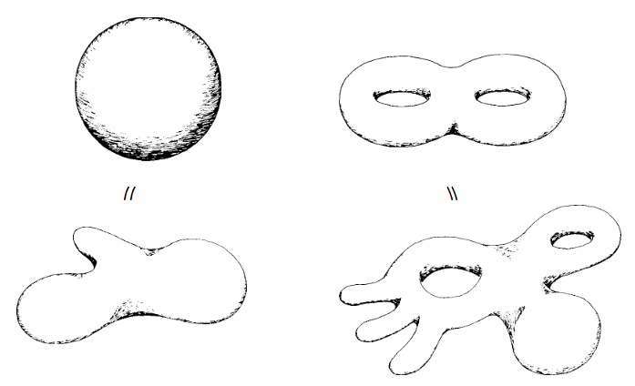

- **Topological manifold**\
  Prostor/útvar, který lokálně _připomíná_ (je homeomorfní) $n$-dimenzionální Euklidovský prostor. [^pa010-2021] [^manifold-wiki]

  $n$-manifold je takový topologický manifold, kde okolí každého bodu je homeomorfní s $n$-dimenzionálním Euklidovským prostorem. [^manifold-wiki]

  Manifoldy jsou typicky fyzikálně validní a efektivní (např. pomocí half-edge).

  - Souřadnicový prostor $\mathbb{R}^n$ je $n$-manifold.
  - Libovolný diskrétní prostor je 0-manifold.
  - Kruh je 1-manifold.
  - Torus (donut) a Kleinova láhev je 2-manifold (povrch).
  - Každý povrch je 2-manifold až na neuzavřené hrany. [^pa010-2021]
  - $n$-dimenzionální koule je $n$-manifold.

    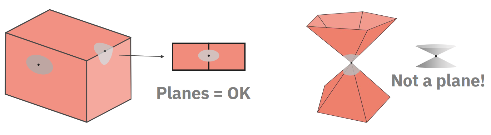

- **Orientability / orientace**

  > - Orientable surfaces allow consistent definition of clockwise and counter-clockwise orientation.
  >   - We can define front/back or inner/outer side.
  > - In non-orientable surfaces, the orientation can change after running through a surface loop.
  >
  > — PA010

  **Möbiova páska a Kleinova láhev**

  Möbiova páska je neorientovatelná, protože po oběhnutí pásu se změní orientace.

  Kleinova láhev je orientovatelná, protože po oběhnutí láhve se orientace nezmění.

  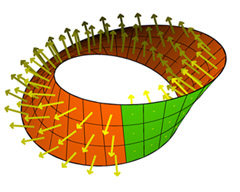
  

- **Elementy topologie**
  - Vertices (vertexy / vrcholy) (V)
  - Edges (hrany) (E)
  - Faces (stěny) (F)
  - Genus (G)
  - Edge loops (L)
  - Boundary edge loops (rings, R)
  - Shells (S)
- **Genus**

  - Počet "děr" v povrchu.
  - Počet "držadel" v povrchu.
  - Počet skupin křivek, které nelze stáhnout do bodu.

    > Genus of an orientable surface is the maximum number of cuttings along nonintersecting simple closed curves without separating it.
    >
    > — PA010

    > [!TIP]
    > Podle Wikipedie je _genus_ česky _rod plochy_.
    

    > [!TIP]
    > Je to **maximální** počet těch řezů.
    > <br>
    > Následující povrch[^genus] jde rozdělit podél červené křivky na dva, ale neuvažujeme ji, protože chceme **nejvyší možný** počet řezů, které povrch **nerozdělí**.
    > <br>
    > 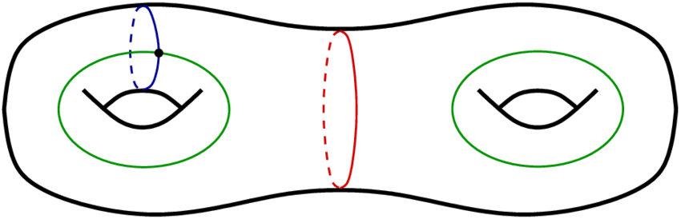
    

- **Boundary edge loops / rings**\
  Edge loops uvnitř stěn, které nejsou vnějšími hranicemi objektu.

  "Díry" ve stěnách, ale není to genus.

  $R = L - F$

  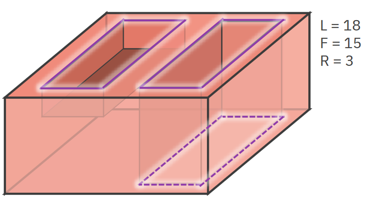

- **Shells (S)**\
  Spojené komponenty povrchu (množiny stěn).

  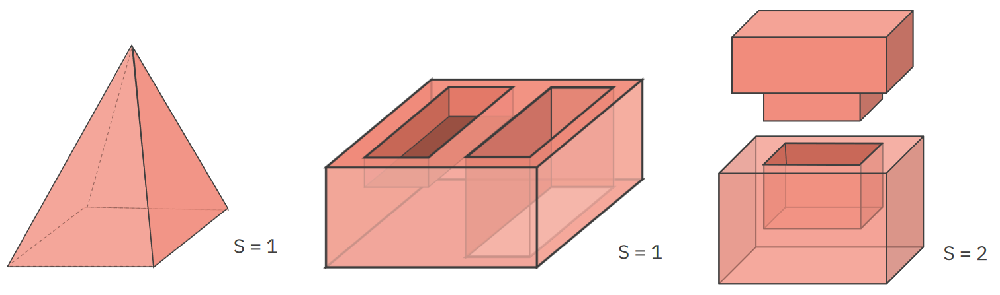

- **Eulerova charakteristika / Euler-Poincaré formula**\
  Eulerova charakteristika $\chi$ popisuje topologický prostor či geometrický útvar $M$. Je to topologický invariant -- nezmění se jakkoli je tento útvar pozohýbán.

  ```math
  \chi(M) = V - E + F \text{ (bez děr)} \\
  \chi(M) = V - E + F - R = 2 \cdot (S - G) \text{ (s děrami)}
  ```

    > [!IMPORTANT]
    > Pro libovolný mnohostěn (polyhedron) bez děr je $\chi = 2$.
    

    > [!IMPORTANT]
    > Pro uzavřený 2-manifoldní trojúhelníkový mesh:
    > <br>
    > Každý trojúhelník má 3 hrany a každá hrana je sdílena dvěma trojúhelníky, takže $E = \frac{3}{2} F$.
    > <br>
    > > [!TIP]
    > > Intuitivně: pokud jsme neúsporní, pak máme tři hrany pro každý trojúhelník ($3F$), každou hranu ale "přilepíme" k nějakému dalšímu trojúhelníku, takže každou hranu máme zbytečně dvakrát ($2E$), proto $3F = 2E$, tedy $E = \frac{3}{2} F$.
    > 
    > Z Euler-Poincaré plyne, že
    > <br>
    > ```math
    > V = 2 + E - F = 2 + \frac{3}{2} F - F = 2 + \frac{1}{2} F \sim \frac{1}{2}
    > ```
    > <br>
    > - Tedy platí poměr $E:F:V = 3:2:1$.
    > - Tedy průmeřný vertex degree (počet hran, které vycházejí z vertexu) je $2 \cdot \frac{E}{V} \sim 6$.
    > <br>
    > Každá hrana (ve 2-manifoldu) přispívá k degree právě dvou vertexů, protože někde začíná a končí.
    > <br>
    > Kdybychom sečetli degree všech vertexů, dostali bychom $2E$, proto $2E \sim 6V$.
    

- **Simplex**\
  Nejjednodušší polytop (generalizace mnohoúhelníku, mnohostěnu, atd.). Generalizace trojúhelníku v libovolné dimenzi:

  - 0D -- bod
  - 1D -- úsečka
  - 2D -- trojúhelník
  - 3D -- tetraedr
  - 4D -- 5-cell (5nadstěn)

### Datové struktury

- **Seznam trojúhelníků / list of triangles (polygon soup)**\
  Jednoduchý, ale obsahuje redundantní informace. Neříká nic o sousednosti.
- **Indexed face set**\
  Vrcholy trojúhelníků jsou dány pomocí indexů do pole vertexů. Méně redundantní, ale neříká nic o sousednosti.
- **Adjacency matrix**\
  Matice vertexů říkající, zda-li je mezi vertexy hrana. Nijak nereprezentuje faces.

  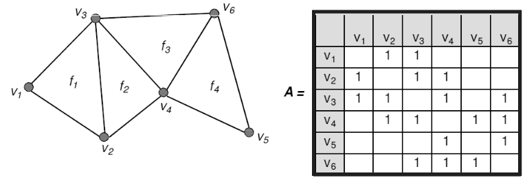

- **Corner table / tabulka rohů**\
  Pro každý vertex udává sousední rohy. Fajn, pokud nás zajímá sousednost vertexů. Trochu redundantní. Použitelná jen pro trojúhelníkové sítě.

  - $c.v$ -- vertex rohu,
  - $c.t$ -- trojúhelník rohu,
  - $c.n$ -- následující roh trojúhelníku,
  - $c.p$ -- předchozí roh trojúhelníku,
  - $c.o$ -- opačný roh v sousedním trojúhelníku (opačný roh kdyby to byl quad).
  - $c.r$ -- "pravý" roh v sousedním trojúhelníku,
  - $c.l$ -- "levý" roh v sousedním trojúhelníku.

  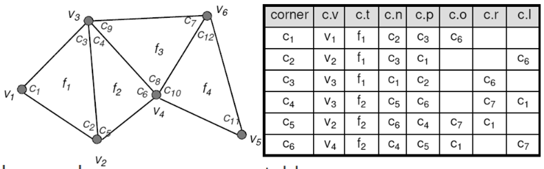

- **Half-edge data structure**\
  Použitelná pro 2-manifoldy. Poskytuje rychlé hledání sousednosti. Umožňuje efektivní modifikace meshů.

  ```csharp
  record HalfEdge // e.g. e
  {
      Vertex Start { get; set; } // e.g. A
      // NB: End is optional since you can easily access Twin.Start.
      Vertex End { get; set; } // e.g. B
      HalfEdge Twin { get; set; }

      HalfEdge Next { get; set; }
      // NB: Prev is optional since you can easily access Next.Next.
      HalfEdge Prev { get; set; }
      Face Face { get; set; }
  }
  ```

  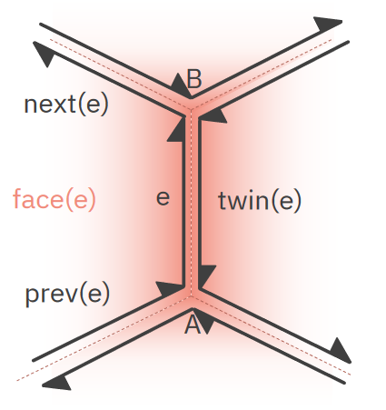

### Modelování

> [!IMPORTANT]
> Tahle sekce má docela průnik s otázkou [Modelování 3D postav](../vph08_modelovani_3d_postav/).

- **Boundary representation model (B-rep)**\
  Modelování objektů pomocí jejich hranic -- boundaries (hrany, stěny, atd.).
- **Polygonální síť / mesh**\
  Síť trojúhelníků. Hrany jsou vždy rovné. Potřebuje velké množství polygonů na hladké povrchy.
- **B-spline plochy**\
  Vertexy řídící sítě slouží k aproximaci křivek. Nedokáže popsat libovolnou topologii.
- **Topologická validita**
  - B-rep model splňuje Euler-Poincaré formuli. (Což neimplikuje, že je 2-manifold.)
  - Sousedící faces mají stejnou orientaci.
  - Žádné faces "nevisí" ven z modelu.
- **Geometrická validita**\
  Numerické chyby v geometrii (např. v pozicích vertexů) mohou způsobit konflikty mezi topologickou a geometrickou informací. [^pa010-2021]

  _Např.: Rovnice rovin tvrdí, že hrana je uvnitř objektu, ale topologie říká, že je mimo něj._

- **Eulerovy operátory**\
  Operátory zachovávající Euler-Poincaré formuli. Jsou dostatečné pro konstrukci užitečných meshů. Pracují s 6 parametry: $V$ -- vertices, $E$ -- edges, $F$ -- faces, $H$ -- components, $S$ -- shells, $G$ -- genus. [^pa010-2021] [^boundaries]

  > [!NOTE]
  > Zdá se, že $H$ -- components je ekvivalentní $R$ -- rings.

  Ač Eulerových operátorů se dá zadefinovat mnoho, v praxi stačí:

  | Operátor | Popis                    |
  | -------- | ------------------------ |
  | MSFV     | make shell, face, vertex |
  | MEV      | make edge, vertex        |
  | MFE      | make face, edge          |
  | MSH      | make shell, hole         |
  | MEKL     | make edge, kill loop     |
  | KEV      | kill edge, vertex        |
  | KFE      | kill face, edge          |
  | KSFV     | kill shell, face, vertex |
  | KSH      | kill shell, hole         |
  | KEML     | kill edge, make loop     |

- **Regularizované booleovské operátory / regularized boolean operators**\
  Reprezentace těles pomocí booleovských operací. _Regularizované_ značí, že výsledek je vždy platné 2-manifold těleso.

  - `AND` - průnik $\cap^*$
  - `OR` - sjednocení $\cup^*$
  - `SUB` - rozdíl $\setminus^*$

  Regularizace vypadá tak, že nejprve je provedena booleovská operace, poté je vypočítán _interior_ a následně _closure_. [^rbo]

  - _Interior point_ $p$ tělesa $S$ je takový bod, že existuje $r$ takové, že otevřená koule s poloměrem $r$ a středem v $p$ obsahuje jen body z $S$.
  - _Exterior point_ $p$ tělesa $S$ je takový bod, že existuje $r$ takové, že otevřená koule s poloměrem $r$ a střem v $p$ **nemá žádný průnik** s $S$.
  - _Interior_ tělesa $S$ je množina všech jeho interior pointů.
  - _Exterior_ tělesa $S$ je množina všech jeho exterior pointů.
  - _Boundary_ tělesa $S$ je množina bodů, které nejsou ani interior ani exterior tělesa $S$.
  - _Clusure_ tělesa $S$ je sjednocení jeho interior a boundary.

  _Otevřená koule_ je koule bez povrchu. Tedy právě ty body, které jsou jejím "vnitřkem".

  **Schéma interior and a boundary tělesa $A \cap B$ [^pa010-2021]**

  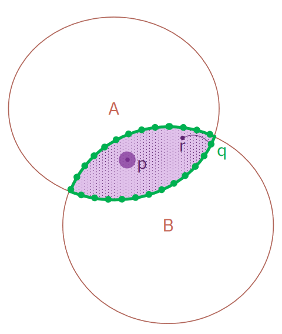

  **Příklad regularizovaného průniku [^pa010-2021]**

  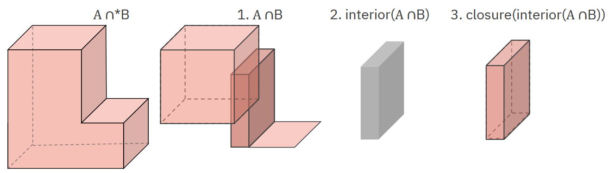

- **Global deformations (Alan Barr)**\
  Mění tvar celého meshe. Obvykle jednoduché a snadno implementovatelné. Jsou fajn při modelování.

  - _Translace_,
  - _Rotace_,
  - _Škálování / scale_,
  - _Zkosení / shear_,
  - _Tapering / zúžení_ -- nekonstantní škálování,

    **Tapering in [3ds Max](https://help.autodesk.com/view/3DSMAX/2016/ENU/?guid=GUID-51233298-312D-4773-AD22-ADB08E70CCE1)**

    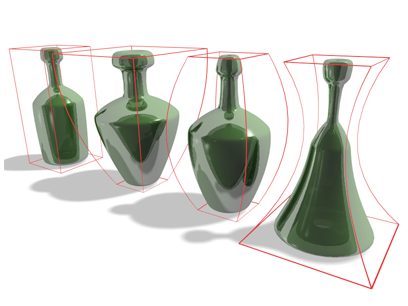

  - _Twisting / screw / šroubování_ -- nekonstantní rotace okolo osy,

    **Twisting in [3ds Max](https://help.autodesk.com/view/3DSMAX/2022/ENU/?guid=GUID-0AD7CE08-9992-4E49-BA11-672DEA3B13CF)**

    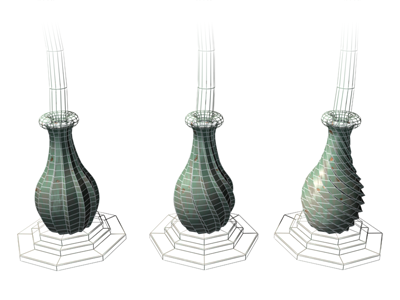

  - _Bending / ohýbání_ -- ohnutí rozsahu vertexů okolo daného bodu o daný úhel.

    **Bending in [Blender](https://docs.blender.org/manual/en/latest/modeling/meshes/editing/mesh/transform/bend.html)**

    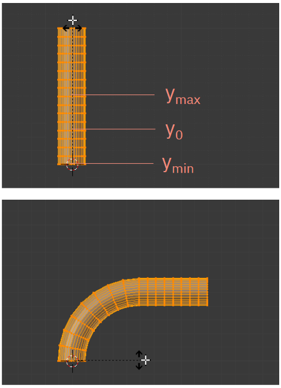

- **Free-form deformations (FFD)**\
  Lokální deformace vertexů v dané "kleci" / mřížce / lattice -- Bezierově objemu.

  1. Vyrob FFD mřížku (Bezierův objem).
  2. "Umísti" do objemu objekt, který chceš deformovat.
  3. Deformuj mřížku (hýbej s jejími body).
  4. Transformuj vertexy v mřížce podle změn v FFD prostoru.

  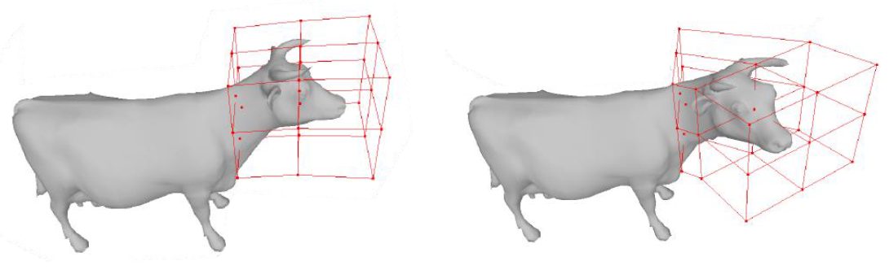

  Má řadu rozšíření s různými tvary mřížky.

### Změna struktury sítě

> [!IMPORTANT]
> Modifikace meshů mají značný přesah do otázky [Křivky a povrchy](../szp05_krivky_a_povrchy/) a taky [Pokročilá počítačová grafika](../vph01_pokrocila_grafika/)

- **Překlápění hrany / edge flip**\
  Lokální změna, která nahradí hranu $(b,c)$ hranou $(a,d)$. Trojúhelníky $(a,b,c)$ a $(b,d,c)$ se stanou $(a,d,c)$ a $(a,b,d)$. [^pa010-2021]

  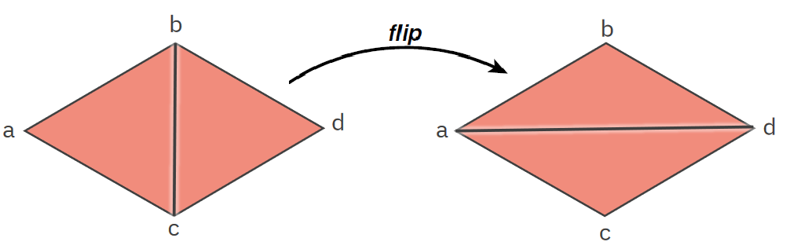

- **Rozdělení hrany / edge split**\
  Lokální změna přidávající další vertex a hrany mezi dva trojúhelníky, které tak rozdělí na čtyři. [^pa010-2021]

  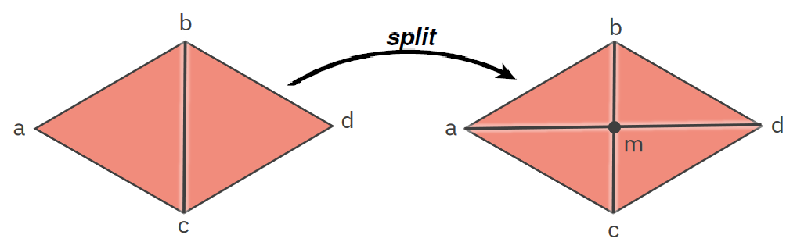

- **Zhroucení grany / edge collapse**\
  Lokální změna, která nahrazuje hranu vrcholem. [^pa010-2021]

  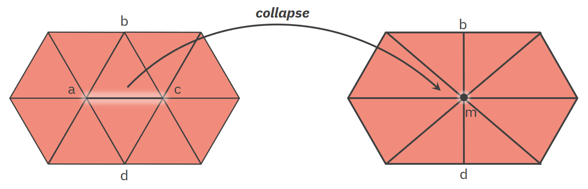

- **Upsampling / subdivision**\
  Globální změna, která rozdělí jedno primitivum (trojúhelník / quad) na více. Vyhlazuje mesh dělením na menší kousky. [^pa010-2021]

  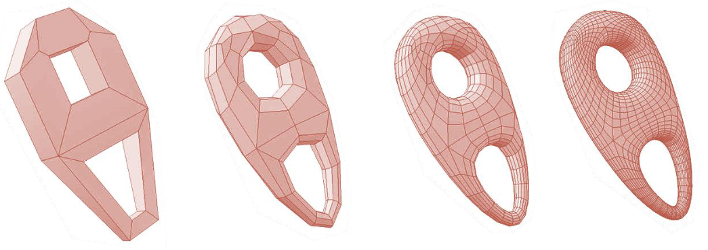

- **Downsampling / decimation / simplification**\
  Globální redukce množství primitiv. Často využívá edge collapse.
- **Regularization / mesh resampling**\
  Globální upráva s cílem zlepšit kvalitu meshe, např.: tvar trojúhelníků a četnost vertexů. [^pa010-2021]

  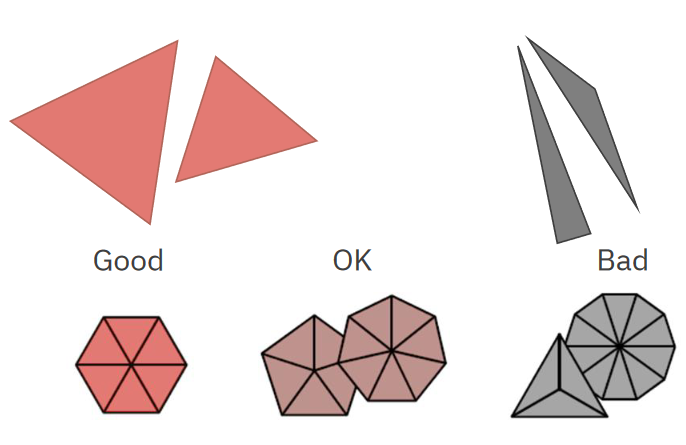

- **Isotropic remeshing**\
  Algoritmus pro regularizaci meshů. Opakuje čtyři kroky:

  1. Rozděl hrany delší než $4 / 3$ průměrné délky.
  2. Zhruť hrany kratší než $4 / 5$ průměrné délky.
  3. Překlop hrany, pokud to zlepší stupeň vrcholu (ideální je 6).
  4. Vycentruj vrcholy.

  Zlepšuje rychlost některých algoritmů, eliminuje podlouhlé trojúhelníky, které se blbě renderují, zlepšuje subdivision, ale nejde použít vždy a může vést ke ztrátě detailů (řeší _Adaptive remeshing_). [^pa010-2021]

  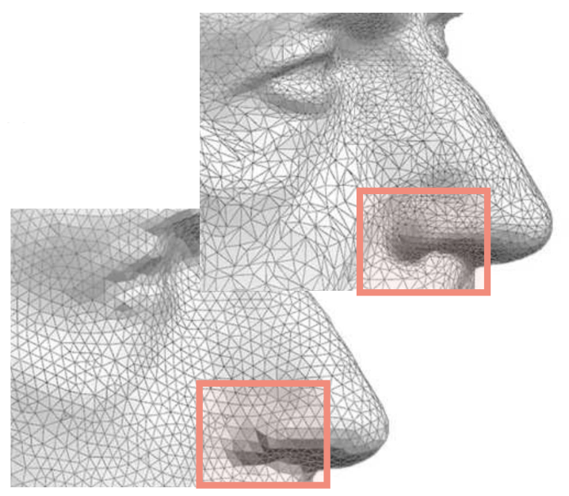

## Implicitní reprezentace a modelování

_Když máme objekt definovaný polévkou matematických symbolů místo hromádky trojúhelníků._ Jinými slovy máme jednu nebo více reálných funkcí, které klasifikují body v prostoru.

- **Rovina**\
  Dána bodem $p$ a normálou $N$, ohraničuje poloprostor. Vzdálenost bodu od roviny je dána (za předpokladu, že $N$ je normalizovaná):

  ```math
  f(x) = (x - p) \cdot N
  ```

- **Kvadriky / kvadratické plochy**

  - _Elipsoid_ (třeba koule): $\frac{x^2}{a^2} + \frac{y^2}{b^2} + \frac{z^2}{c^2} = 1$,

    **An ellipsoid by [Sam Derbyshire](https://commons.wikimedia.org/w/index.php?curid=18447750)**

    

  - _Hyperboloid_ (třeba kužel): $\frac{x^2}{a^2} + \frac{y^2}{b^2} - \frac{z^2}{c^2} = 1$,

    **A one-sheeted hyperboloid by [Sam Derbyshire](https://commons.wikimedia.org/w/index.php?curid=18447776)**

    

  - _Válec (cylinder)_: $\frac{x^2}{a^2} + \frac{y^2}{b^2} = 1$,

    **A cylinder by [Sam Derbyshire](https://commons.wikimedia.org/w/index.php?curid=18447784)**

    

  - _Paraboloid_ (třeba miska): $\frac{x^2}{a^2} + \frac{y^2}{b^2} - z = 0$,

    **A paraboloid by [Sam Derbyshire](https://commons.wikimedia.org/w/index.php?curid=18447777)**

    

- **Kvartiky / kvartické plochy**

  - _Torus_ (donut): $\left( \sqrt{x^2 + y^2} - R \right)^2 + z^2 - r^2 = 0$.

    **[A torus](https://commons.wikimedia.org/w/index.php?curid=979546)**

    

- **Distance surfaces**\
  Tělesa lze definovat pomocí vzdálenosti od jiných entit:

  - _Sphere_: $d(x, \text{point}) = r$,
  - _Cylinder / capsule_: $d(x, \text{line}) = r$,
  - _Torus_: $d(x, \text{circle}) = r$,
  - _Generalized cylinder_: $d(x, \text{curve}) = r$,
  - _Offset surface_: $d(x, \text{surface}) = r$.

  kde $d(x, A)$ je nejmenší vzdálenost bodu $x$ od entity $A$. [^pa010-2020]

- **Constructive solid geometry (CSG)**\
  Umožňuje kombinovat implicitní objekty pomocí logických operací. Předpokládáme, že pokud $f(x, y, z)  < 0$ pak je bod uvnitř objektu daném $f$. Tato metoda nezachovává $C^1$ spojitost. Pro dva objekty $f$ a $g$: [^pa010-2020]

  - _Sjednocení_: $\min(f, g)$,
  - _Průnik_: $\max(f, g)$,
  - _Rozdíl_: $\max(f, -g)$.
  - _Komplement_: $-f$.

- **Bloby (kapky)**\
  Součet několika Gaussových křivek. [^pa010-2020]

  ```math
  \begin{align*}

  r_i^2 (x,y,z) &= (x-x_i)^2 + (y-y_i)^2 + (z-z_i)^2 \\
  f(x,y,z) &= -1 + \sum_i \exp \left( -B_i \cdot \frac{r_i^2 (x,y,z)}{R_i^2} + B_i \right) \\
  f(x,y,z) &= -1 + \sum_i D(r_i)

  \end{align*}
  ```

  kde:

  - $B_i$ je "blobbiness",
  - $R_i$ je poloměr blobu v klidu,
  - $D(r_i)$ je Gaussova křivka,
  - $r_i$ je funkce poloměru kapky.

  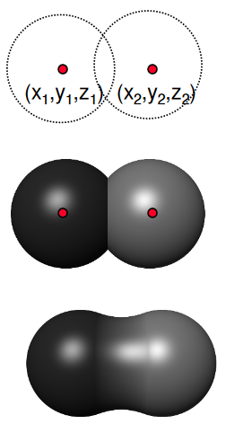

- **Metaballs**\
  Podobné blobům, ale nepoužívá exponenciální funkci. Organicky se "slévající" koule. [^pa010-2020]

  ```math
  \begin{align*}

  D(r_i)= \begin{cases}

  \alpha \left( 1 - \frac{3r_i^2}{R_i^2} \right)
      & 0 \leq r_i \leq R_i/3 \\

  \frac{3\alpha}{2} \left( 1 - \frac{r_i}{R_i} \right) ^2
      & R_i/3 \leq r_i \leq R_i  \\

  0
      & R_i \leq r_i

  \end{cases}

  \end{align*}
  ```

  **Metaballs by [SharkD](https://commons.wikimedia.org/w/index.php?curid=5237220)**

  


[^pa010-2021]: Byška, Furmanová, Kozlíková, Trtík: PA010 Intermediate Computer Graphics (podzim 2021)
[^pa010-2020]: Sochor: PA010 Intermediate Computer Graphics (podzim 2020)
[^notes-pa010]: [Moje poznámky z PA010 (podzim 2020)](/fi/pa010/)
[^manifold-wiki]: [Wikipedia: Topological manifold](https://en.wikipedia.org/wiki/Topological_manifold)
[^klein-bottle]: [Konrad Polthier: Imaging maths - Inside the Klein bottle ](https://plus.maths.org/content/imaging-maths-inside-klein-bottle)
[^genus]: [Saul Schleimer: Notes on the complex of curves](https://www.researchgate.net/publication/228393582_Notes_on_the_complex_of_curves)
[^topology]: [Topology vs. Geometry](https://www.austincc.edu/herbling/shape-of-space.pdf)
[^boundaries]: [Ian Stroud: Boundary Representation Modelling Techniques](https://link.springer.com/book/10.1007/978-1-84628-616-2)
[^rbo]: [Interior, Exterior and Closure](https://pages.mtu.edu/~shene/COURSES/cs3621/NOTES/model/closure.html)
[^validity]: [Representational validity of boundary representation models](https://www.sciencedirect.com/science/article/pii/S0010448500000476)
[^denoising]: [Bilateral Normal Filtering for Mesh Denoising](https://ieeexplore.ieee.org/document/5674028)
