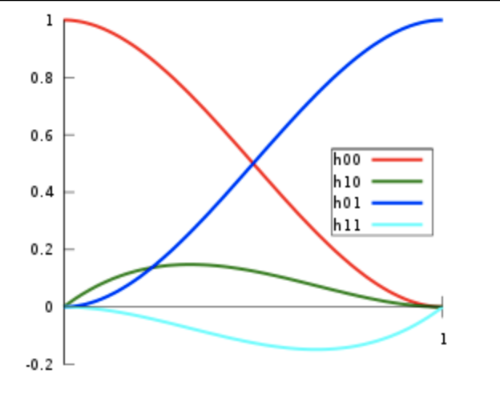
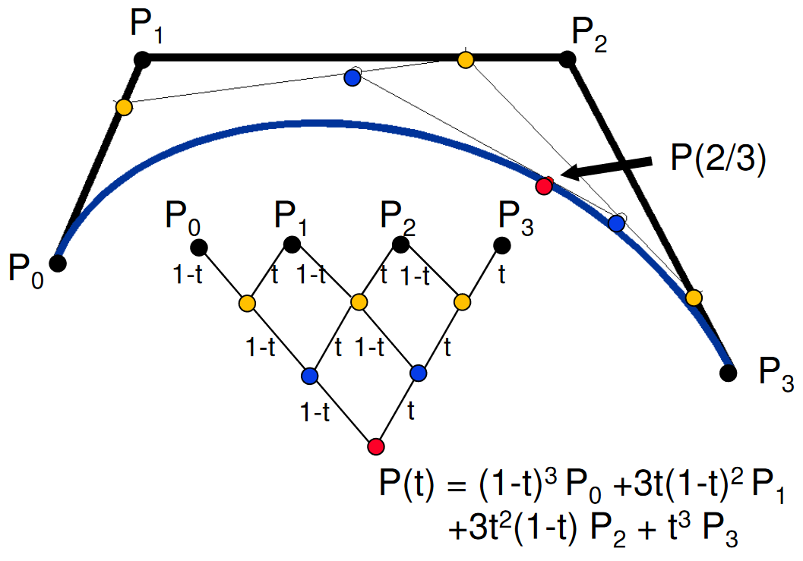
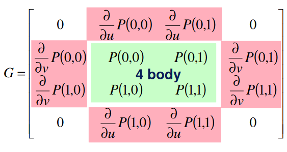
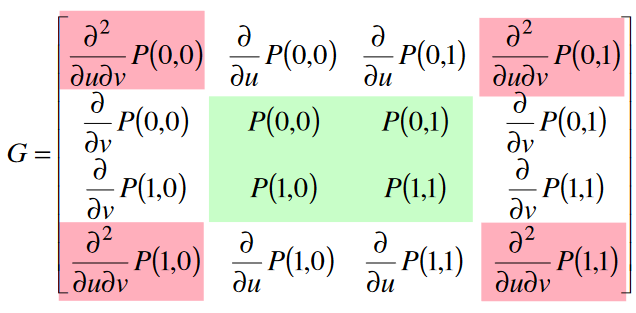
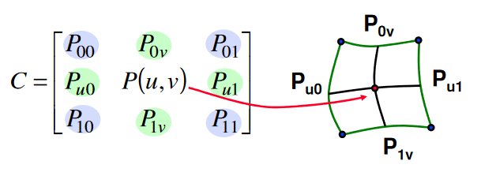
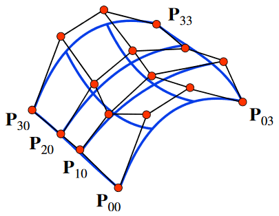

<dl><dt><strong>📌 NOTE</strong></dt><dd>

Implicitní a parametrické reprezentace. Interpolace a aproximace. Cn, Gn spojitost, podmínky spojitosti pro po částech definované funkce. Bézierovy křivky, B-spline křivky, pass:[&lt;s>NURBS, &lt;/s>]Coonsovy pass:[&lt;s>křivky a &lt;/s>]pláty. Povrchy tvořené rekurzivním dělením polygonů.

_PB009, PA010_

</dd></dl>

## Druhy reprezentace

Jak povrchy tak křivky mohou být reprezentovány třemi způsoby:

### Explicitní reprezentace

Křivka nebo povrch je vyjádřen pomocí **funkce**.

```math
\begin{align*}

y &= f(x) & \text{ pro křivku} \\
z &= f(x, y) & \text{ pro povrch}

\end{align*}
```

Omezení na funkce je však příliš silné. Spoustu pěkných křivek a povrchů nelze vyjádřit pomocí jediné funkce.

### Implicitní reprezentace

Máme k dispozici rovnici ve tvaru:

```math
\begin{align*}

F(x, y) &= c & \text{ pro křivku} \\
F(x, y, z) &= c & \text{ pro povrch}

\end{align*}
```

kde $c$ je konstanta a je obvykle rovná 0.

Tato rovnice udává množinu bodů, ze které se křivka nebo povrch sestává. Takové množině se někdy říká _level set_ a metodám, které s nimi pracují _level-set methods_.

**❗ IMPORTANT**\
Výhodou implicitně zadaných ploch je kompaktnější reprezentace a jednodušší ray casting. Nicméně výpočty s nimi jsou časově náročné, takže se stejně nejdřív převádí na polygonové meshe -- _polygonizace_.

**❗ IMPORTANT**\
Tahle sekce přesahuje do [3D modelování a datové struktury](../3d-modelovani-a-datove-struktury/) -> _Implicitní reprezentace a modelování_.

### Parametrická reprezentace

Udává **dráhu** pohybujícího se bodu, či něco jako **hladinu** povrchu. Snadno se z ní vyjadřuje tečna, čehož se využívá při jejich skládání.

Pro křivky:

```math
\begin{align*}

Q(t) &= \lbrack x(t), y(t), z(t) \rbrack & \text{ (bodová rovnice křivky)} \\
\vec{q}(t) &= (x(t), y(t), z(t)) & \text{ (vektorová rovnice křivky)}

\end{align*}
```

kde $t$ je "čas" z intervalu $\lbrack t_\text{min}, t_\text{max} \rbrack$, nejčastěji $\lbrack 0, 1 \rbrack$. Výhodné je, že takto zadaná křivka se může sama křížit, uzavírat, a podobně.

Analogicky pro povrchy:

```math
Q(u, v) = \lbrack x(u, v), y(u, v), z(u, v) \rbrack
```

kde pro $u$ a $v$ už metafora s časem nefunguje. Obvykle obě náleží do intervalu $\lbrack 0, 1 \rbrack$.

## Terminologie

Pro zbytek otázky je podstatné znát několik termínů:

- **Dotykový / tečný / tangent vektor křivky**\
  Aktuální směr křivky v daném bodě. Z parametricky vyjádřené křivky $\vec{q}$ ho lze v čase $t_0$ získat jako derivaci:

  ```math
  \vec{q}'(t_0) = \left(
      \frac{\partial x(t_0)}{\partial t},
      \frac{\partial y(t_0)}{\partial t},
      \frac{\partial z(t_0)}{\partial t}
  \right)
  ```

  Rovnice tečny $\vec{p}$ je pak $\vec{p}(u) = \vec{q}(t_0) + \vec{q}'(t_0) \cdot u$.

- **Polynomiální křivka**\
  Velmi častý druh křivek v počítačové grafice. Vypadají jako:

  ```math
  Q_n(t) = a_0 + a_1 \cdot t + a_2 \cdot t^2 + \ldots + a_n \cdot t^n
  ```

  Je velmi snadné je evaluovat a derivovat. Z nich často skládáme křivky po částech.

- **Kubika**\
  Polynomiální křivka třetího stupně.

  Parametricky:

  ```math
  \begin{align*}

  x(t) = a_{x}t^{3} +  b_{x}t^{2} +  c_{x}t +  d_{x} \\
  y(t) = a_{y}t^{3} +  b_{y}t^{2} +  c_{y}t +  d_{y} \\
  z(t) = a_{z}t^{3} +  b_{z}t^{2} +  c_{z}t +  d_{z}

  \end{align*}
  ```

  Zapsáno pomocí matice:

  ```math
  Q(t) = T \cdot C = \lbrack t^3, t^2, t, 1 \rbrack \cdot \begin{bmatrix}
  a_x & a_y & a_z \\
  b_x & b_y & b_z \\
  c_x & c_y & c_z \\
  d_x & d_y & d_z
  \end{bmatrix}
  ```

  Tečný vektor $\vec{q'}$ je pak:

  ```math
  \vec{q'}(t) = \frac{\partial}{\partial t} \cdot C = \lbrack 3t^2, 2t, 1, 0 \rbrack \cdot C
  ```

  U kubik platí, že $C = M \cdot G$, kde $M$ je bázová matice a $G$ je vektor geometrických podmínek.

  - $T \cdot M$ definuje polynomiální bázi -- skupinu polynomů -- která je společná pro všechny křivky určitého typu.
  - $G$ pak obsahuje parametry konkrétní křivky -- řídící a dotykové body.
  - $t$ udává, jestli jsme na začátku či konci křivky.

- **Tečná rovina**\
  Rovina, která se povrchu dotýká v konkrétním bodě a její normála je na povrch kolmá. Pro parametrickou plochu $Q$ je tečná plocha $T$ dána jako:

  ```math
  \begin{align*}

  \vec{q_{u}}(u,v) &= \frac{\partial Q(u,v)}{\partial u}
      = \left(
          \frac{\partial x(u,v)}{\partial u},
          \frac{\partial y(u,v)}{\partial u},
          {\partial z(u,v) \over \partial u}
      \right) \\

  \vec{q_{v}}(u,v) &= \frac{\partial Q(u,v)}{\partial v}
      = \left(
          \frac{\partial x(u,v)}{\partial v},
          \frac{\partial y(u,v)}{\partial v},
          {\partial z(u,v) \over \partial v}
      \right) \\

  T(r,s) &= Q(u,v) + r.\vec{q_{u}} + s.\vec{q_{v}}, \quad r,s \in \mathbb{R}

  \end{align*}
  ```

  kde $\vec{q_u}$ je tečný vektor ve směru parametru $u$, a analogicky $\vec{q_v}$

- **Normála / kolmice**\
  Normálu $\vec{n}$ parametricky dané plochy $Q$ určíme jako vektorový součin tečných vektorů:

  ```math
  \vec{n} = \frac{\vec{q_u} \times \vec{q_v}}{\left\lVert \vec{q_u} \times \vec{q_v} \right\rVert}
  ```

- **Gradient**\
  Funkce, která vrací "směr a velikost největšího růstu". Nejčastěji se používá u povrchů k určení normály, ale lze ji použít v libovolné dimenzi k různým účelům. Pokud je povrch $f$ zadán implicitně, pak je gradient:

  ```math
  \nabla f = \left(
      \frac{\partial f}{\partial x},
      \frac{\partial f}{\partial y},
      \frac{\partial f}{\partial z}
  \right)
  ```

## Interpolace a aproximace

- **Interpolace**\
  Prokládání daných bodů křivkou. Konstrukce křivky, která interpolovanými body prochází.

  V případě kubiky výše to znamená, že $G$ obsahuje body, kterými křivka prochází.

  Mějmě funkci $f(x)$, jejíž hodnotu známe v bodech $f(x_0), f(x_1), \ldots, f(x_n)$. Interpolace znamená nalezení hodnot $f(x)$ pro všechna $x_0 &lt; x &lt; x_n$.

- **Aproximace**\
  Přiblížení, odhad. Je nepřesným popisem nějaké jiné entity (např. čísla či funkce). Saháme k ní, pokud pro analytické řešení nemáme dost informací nebo výpočetní kapacity. Aproximace je méně přesná než interpolace, ale výpočetně jednodušší.

  V případě kubiky výše to znamená, že $G$ obsahuje _řídící_ body, které sice udávají směr křivky, ale ta jimi neprochází.

## Spojitost

Představme si, že máme dva segmenty křivky: $Q_1$ a $Q_2$, spojené v bodě $t$, tedy $Q_1(t) = Q_2(t)$. Tento bod nazýváme _uzlem_ (knot). _Spojitost_ je zjednodušeně způsob, jakým jsou tyhle segmenty spojeny v uzlu.

### Parametrická spojitost stupně stem:[n] (stem:[C^n])

Křivka $Q$ patří do třídy $C^n$, pokud má ve všech bodech $t$ spojitou derivaci až do řádu $n$.

- $C^0$ -- dva segmenty jsou spojené; konečný bod jednoho segmentu je počátečním bodem druhého.
- $C^1$ -- platí $C^0$ a navíc je tečný vektor na konci prvního segmentu shodný s tečným vektorem na začátku druhého segmentu -- první derivace v uzlu jsou si rovny.
- $C^2$ -- platí $C^1$ a druhé derivace v uzlu jsou si rovny.
- $C^n$ -- platí $C^{n-1}$ a navíc jsou si $n$-té derivace v uzlu rovny.

- Bod pohybující se po $C^0$-spojité dráze sebou "trhne" **v prostoru**, když projde uzlem.
- V případě $C^1$ křivky se při průchodu uzlem směr ani rychlost prudce **nezmění**, může se však změnit zrychlení.
- V případě $C^2$ křivky se při průchodu uzlem **nezmění** už ani zrychlení.

### Geometrická spojitost stupně stem:[n] (stem:[G^n])

Je podobná parametrické spojitosti, ale vyžaduje jen "geometrickou" spojitost. Vyžaduje, aby si derivace byly **sobě úměrné**. [mallinus](#mallinus) [geometric-continuity](#geometric-continuity)

- $G^0$ -- koncový bod prvního segmentu je totožný s počátečním bodem druhého segmentu ($C^0 = G^0$).
- $G^1$ -- platí $G^0$ a navíc je **směr** tečny na konci prvního segmentu shodný s **směrem** tečny na začátku druhého segmentu. **Velikost tečného vektoru (rychlost) se však může prudce změnit.**
- $G^2$ -- platí $G^1$ a navíc mají stejný **střed křivosti** (center of curvature). [smoothness](#smoothness)

Platí, že $C^n \Rightarrow G^n$, ale obráceně $G^n \not\Rightarrow C^n$.

**📌 NOTE**\
Podle slidů z PB009 musí faktor úměrnosti být různý od 0. [pb009-2019](#pb009-2019) Podle Barskyho a DeRoseho musí v první derivaci být $> 0$ a v dalších už je to šumák. [geometric-continuity](#geometric-continuity) Co je správně? Kdo ví. Nemám dost častu to zjistit, takže to ponechávám jako cvičení čtenáři.

## Křivky

### Lagrangeův interpolační polynom

Základní metoda interpolace funkce, jejíž hodnotu známe jen v $n + 1$ diskrétních bodech $P_0, P_1, ... P_n$. Sestává se z pomocných polynomů $\ell_i$: [lagrange](#lagrange)

```math
\ell_i(x) = \prod_{0 \le k \le n, k \neq i}^n \frac{x - x_k}{x_i - x_k}
```

Který splňuje podmínku:

```math
\ell_i(x_k) = \begin{cases}

1 & \text{ pro } i = k \\
0 & \text{ pro } i \neq k

\end{cases}
```

Pak polynom $P$ interpoluje danou množinu bodů:

```math
P(x) = \sum_{i=0}^n P_i \ell_i(x)
```

Blbé je, že musíme všechny pomocné polynomy přepočítat, když přidáme nový bod.

- **Hornerovo schéma / Horner’s method**\
  Metoda evaluace polynomů. Vychází z myšlenky, že násobení se dá nestovat: [horner](#horner)

  ```math
  \begin{aligned}

  & a_0 + a_1 \cdot x + a_2 \cdot x^2 + ... + a_n \cdot x_n \\

  &   = a_0 + x(a_1 + x(a_2 + ... + x(a_{n-1} + x \cdot a_n)...))
  \end{aligned}
  ```

  Vyžaduje jen $n$ násobení a $n$ sčítání, což je optimální.

### Hermitovské křivky

Asi nejznámnější interpolační křivky v počítačové grafice. Jsou určeny dvěma řídícími body -- $P_0$ a $P_1$ -- a dvěma dotykovými vektory -- $\vec{p_0'}$ a $\vec{p_1'}$. Řídící body určují začátek a konec křivky, dotykové vektory její směr a vyklenutí. Pokud jsou oba vektory nulové, je to úsečka.

Je jednoduché je na sebe navázat v $C^1$, neboť tečné vektory jsou přímo součástí definice.

- **Cubic Hermite spline / Ferguson curve**\
  Pro Hermitovskou kubiku platí: [hermite-spline](#hermite-spline) [ferguson](#ferguson)

  ```math
  \begin{aligned}

  Q(t) &=

  \begin{bmatrix}
      t^{3} & t^{2} & t & 1
  \end{bmatrix}

  \cdot

  \begin{bmatrix}
      2 & -2 & 1 & 1 \\
      -3 & 3 & -2 & -1 \\
      0 & 0 & 1 & 0 \\
      1 & 0 & 0 & 0
  \end{bmatrix}

  \cdot

  \begin{bmatrix}
      P_{0} \\
      P_{1} \\
      \vec{p'}_{0} \\
      \vec{p'}_{1}
  \end{bmatrix} = \\

  &= P_0 \cdot F_1(t) + P_1 \cdot F_2(t) + \vec{p'}_0 \cdot F_3(t) + \vec{p'}_1 \cdot F_4(t)

  \end{aligned}
  ```

  kde $F_1, F_2, F_3, F_4$ jsou Hermitovské polynomy 3. stupně:

  ```math
  \begin{aligned}

  \textcolor{red}{F_1(t)} &= 2t^3 - 3t^2 + 1 \\
  \textcolor{blue}{F_2(t)} &= -2t^3 + 3t^2 \\
  \textcolor{green}{F_3(t)} &= t^3 - 2t^2 + t \\
  \textcolor{cyan}{F_4(t)} &= t^3 - t^2

  \end{aligned}
  ```

  

### Bézierova křivka

Asi nejčastěji používaná **aproximační** křivka. Využívá se zejména ve 2D grafice, třeba při definici fontů.

- Bézierova křivka $n$-tého stupně je definována $n + 1$ řídícími body $P_0, P_1, ... P_n$.
- Změnou polohy jednoho bodu dojde ke změně celé křivky. Proto se často dělí na segmenty menšího stupně, které se pak navazují na sebe.

Základem jsou **Bernsteinovy polynomy** $n$-tého stupně:

[stem]
b\_{\nu,n}(x) = \binom{n}{\nu} x^{\nu} \left( 1 - x \right)^{n - \nu}, \quad \nu = 0, \ldots, n,

Mezi jejich vlastnosti patří:

- Nezápornost: $b_{\nu,n}(x) \ge 0$ pro $x \in \lbrack 0, 1 \rbrack$.
- Jejich součet je roven jedné: $\sum_{\nu = 0}^n b_{\nu,n}(x) = 1$.
- Dají se vyjádřit rekurzí: $b_{\nu,n}(x) = (1 - x) \cdot b_{\nu,n-1}(x) + x \cdot b_{\nu-1,n-1}(x)$.

**Bernstein basis polynomials for 4th degree curve blending by [VisorZ](https://commons.wikimedia.org/w/index.php?curid=40129768)**


- **DeCasteljau algorithm**\
  Rekurzivní algoritmus pro konstrukci Bézierových křivek. Využívá vlastností Bernsteinových polynomů.

  

- **Bézierova kubika**\
  Bézierova křivka třetího stupně. Je dána čtyřmi řídícími body $P_0, P_1, P_2, P_3$:

  ```math
  P(t) = (1 - t)^3 \cdot P_0 + 3 \cdot (1 - t)^2 \cdot t \cdot P_1 + 3 \cdot (1 - t) \cdot t^2 \cdot P_2 + t^3 \cdot P_3
  ```

### B-spline

- **Splajn / spline**\
  Splajn stupně $n$ po částech definovaná polynomiální funkce stupně $n-1$ proměnné $x$. [bspline](#bspline)

  _Po částech definovaná / piecewise_ znamená, že má několik intervalů a pro každý z nich jiný polynom.

  - Místa, kde se části polynomu dotýkají jsou _uzly_ a jsou značeny pomocí $t_0, t_1, ..., t_n$ a řazeny v neklesajícím pořadí.
  - Pokud jsou uzly unikátní, pak je splajn v uzlech $C^{n-2}$ spojitý. [bspline](#bspline)
  - Pokud je $r$ uzlů shodných, je v tomto místě pouze $C^{n-r-1}$ spojitý.

---

**Basis spline / B-spline** stupně $n$ je aproximační křivka / splajn daná sekvencí $n$ uzlů. Jako funkce vrací užitečné hodnoty jen mezi prvním a posledním uzlem, všude jinde je nulová. Svůj název dostala podle toho, že B-splajny slouží jako bázové funkce pro splajnové křivky.

Lze ji definovat pomocí **Cox-de Boorovy** rekurzivní formule:

**💡 TIP**\
de Boorův algoritmus je generalizací DeCasteljauova algoritmu ale pro B-splajny.

```math
\begin{aligned}

B_{i,0}(x) &= \begin{cases}
    1 & \text{pro } t_i \le x < t_{i+1} \\
    0 & \text{jinak}
\end{cases}

\\

B_{i,n}(x) &= \textcolor{red}{\frac{x - t_i}{t_{i+n} - t_i}} B_{i,n-1}(x)
    + \textcolor{blue}{\frac{t_{i+n+1} - x}{t_{i+n+1} - t_{i+1}}} B_{i+1,n-1}(x)

\end{aligned}
```

Zatímco $x$ jde od $t_i$ k $t_{i+n}$, červený výraz začíná na 1 a klesá k 0.

Podobně, zatímco $x$ jde od $t_{i+1}$ k $t_{i+n+1}$, modrý výraz začíná na 0 a roste k 1.

Navíc platí $\sum_{i=0}^{n} B_{i,n}(x) = 1$.

Jejich užitečnost spočívá v tom, že libovolný splajn stupně $n$ daný sekvencí uzlů lze vyjádřit jako lineární kombinaci B-splajnů:

```math
S(x) = \sum_{i=0} c_i B_{i,n}(x)
```

**📌 NOTE**\
Uzlů je zpravidla víc než $n+1$, protože pak teprve máme víc než jeden B-spline, který kombinujeme.

- **Uniformní B-splajny**\
  Uzly jsou rozloženy rovnoměrně. Tedy mezi každými dvěma uzly $t_i$ a $t_{i+1}$ je stejná vzdálenost $h$.

  Příklad:

  ```math
  T = \begin{bmatrix}
      t_0 & t_1 & t_2 & t_3
      \end{bmatrix}
  = \begin{bmatrix}
      0 & 0.\overline{3} & 0.\overline{6} & 1
  \end{bmatrix}
  ```

- **Coonsova kubika**\
  Kubika $P$ daná 4 řídícími body $P_0, P_1, P_2, P_3$. Neprochází ani jedním z kontrolních bodů. [coons](#coons)

  ```math
  \begin{aligned}

  P(t) &= B_0(t) \cdot P_0 + B_1(t) \cdot P_1 + B_2(t) \cdot P_2 + B_3(t) \cdot P_3, t \in \lbrack 0, 1 \rbrack \\

  B_0(t) &= \frac{1}{6} (1 - t)^3 \\
  B_1(t) &= \frac{1}{6} (3t^3 - 6t^2 + 4) \\
  B_2(t) &= \frac{1}{6} (-3t^3 + 3t^2 + 3t + 1) \\
  B_3(t) &= \frac{1}{6} t^3

  \end{aligned}
  ```

  

  **📌 NOTE**\
   Něco ohledně tohohle termínu mi hrozně smrdí. Zdá se, že jediní, kdo používají "coons cubic curve" jsme my a ČVUT.

## Povrchy

Interpolace je náročná, proto se častěji používají aproximační povrchy.

### Interpolační plocha

Plocha $\vec{P}$.
Dáno:

- $(m + 1) \times (n + 1)$ řídících bodů $\vec{P}_{i,j}$.
- $m + 1$ hodnot $u_k$ a $n + 1$ hodnot $v_l$.

Platí, že $\vec{P}(u_k, u_l) = \vec{P}_{k,l}$ pro $k = 0, 1, ..., m$ a $l = 0, 1, ..., n$.

Interpolujeme vektorovým polynomem $\vec{a}_{i,j}$:

```math
\vec{P}(u, v) = \sum_{i = 0}^m \sum{j = 0}^n \vec{a}_{i,j} \cdot u^i \cdot v^j
```

V případě Lagrangeova polynomu je $\vec{a}_{i,j} = \ell_i^m(u) \cdot \ell_j^n(v)$.

### Hermitovský plát

Interpolační povrch.

- **12-ti vektorová varianta**\
  4 rohové body a 8 tečných vektorů.

  

- **16-ti vektorová varianta**\
  4 rohové body, 8 tečných vektorů a 4 zkrutové vektory.

  

### Coonsovy pláty / Coonsovy plochy / Coons patch

Plochy vzniknuvší interpolací mezi křivkami udávající jejich okraje. Dají se na sebe pěkně napojovat, právě protože jsou definovány svými okraji.

**⚠️ WARNING**\
Coonsovy pláty jsou **interpolační**, zatímco Coonsovy křivky jsou **aproximační**.

- **Bilineární Coonsovy pláty**

  Určeny 4 křivkami $P(u, 0), P(u, 1), P(0, v), P(1, v)$, které tvoří okraj plátu.

  Implicitně se dá zapsat jako:

  ```math
  \begin{bmatrix}
  1-u & -1 & u
  \end{bmatrix}

  \cdot

  C

  \cdot

  \begin{bmatrix}
  1-v \\ -1 \\ v
  \end{bmatrix}

  = 0
  ```

  Povrch je pak tvořen body $C$, které tuto rovnici splňují.

  Explicitně se dá zapsat jako:

  ```math
  P(u, v) = \begin{bmatrix} 1 - u & u \end{bmatrix} \cdot \begin{bmatrix} P_{0, v} \\ P_{1, v} \end{bmatrix}
      + \begin{bmatrix} P_{u, 0} & P_{u, 1} \end{bmatrix} \cdot \begin{bmatrix} 1 - v \\ v \end{bmatrix}
      - \begin{bmatrix} 1 - u & u \end{bmatrix} \cdot
          \begin{bmatrix}
              P_{0, 0} & P_{0, 1} \\
              P_{1, 0} & P_{1, 1}
          \end{bmatrix}
      \cdot \begin{bmatrix} 1 - v \\ v \end{bmatrix}
  ```

  

  Zásadním nedostatek těchto ploch je, že není snadné vyjádřit tečné vektory na okrajích, a proto není snadné je napojovat na sebe.

- **Bikubické Coonsovy pláty**

  Podobné bilineárním, ale používájí Hermitovské polynomy:

  ```math
  \begin{aligned}

  F_1(t) &= 2t^3 - 3t^2 + 1 \\
  F_2(t) &= -2t^3 + 3t^2 \\

  \end{aligned}
  ```

  Implicitně je pak tento plát dán:

  ```math
  \begin{bmatrix}
  F_1(u) & -1 & F_2(u)
  \end{bmatrix}

  \cdot

  C

  \cdot

  \begin{bmatrix}
  F_1(v) \\ -1 \\ F_2(v)
  \end{bmatrix}

  = 0
  ```

  Stejně jako u bilineárních ploch, i tady je těžké získat tečné vektory na okrajích.

- **Obecná bikubická plocha**

  Kromě rohů je parametrizována i tečnými vektory na okrajích. Konečně tedy umožňuje snadné navazování.

### Bézierovy plochy

Aproximační plochy dány $(m + 1) \times (n + 1)$ řídícími body. Jsou:

- snadno diferencovatelné,
- jednoduše se modelují,
- lze z nich relativně snadno spočítat průnik s paprskem,
- speciální případ NURBS ploch.

```math
P(u, v) = \sum_{i=0}^m \sum_{j=0}^n B_i^m(u) \cdot B_j^n(v) \cdot \vec{a}_{i,j}
```

Kde $B_i^m(u)$ a $B_j^n(v)$ jsou Bernsteinovy polynomy.



Při změně jendoho z bodů se změní celá plocha, proto se často více plátů spojuje dohromady. Pro spojitost $G^0$ se musí rovnat řídící body na okrajích. Pro $G^0$ musí tečné vektory na okrajích být lineárně závislé.

Zobrazují se rekurzivním dělením (patch splitting). Využívá se algoritmu de Casteljau.

### B-spline plochy

Aproximační plochy analogické B-spline křivkám, ale se dvěma parametry.

- Jsou lepší pro modelování než Hermitovské nebo Bézierovy plochy, protože se lépe navazují, jelikož B-splajny stupně $k$ garantují spojitost $C^{k-1}$.
- Změnou jednoho řídícího bodu nezměníme celou plochu, ale jen část.
- Celá plocha leží v konvexním obalu řídících bodů.
- Průchodu řídícím bodem lze dosáhnout zvýšením jeho násobnosti (a tak snížením spojitosti).
- Invariantní k lineárním transformacím.

- **NURBS plochy**

  Standard v průmyslovém modelování. Umožňují definovat velké množstí ploch: free-form surfaces, plochy založené na přímkách a kuželosečkách, atd. [nurbs](#nurbs) Jsou invariantní k lineárním transformacím i k perspektivní projekci.

  ```math
  S(u,v) = \sum_{i=1}^k \sum_{j=1}^l R_{i,j}(u,v) \mathbf{P}_{i,j}
  ```

  kde $\mathbf{P}_{i,j}$ jsou řídící body a $R_{i,j}(u,v)$ jsou NURBS bázové funkce:

  ```math
  R_{i,j}(u,v) = \frac {N_{i,n}(u) N_{j,m}(v) w_{i,j}} {\sum_{p=1}^k \sum_{q=1}^l N_{p,n}(u) N_{q,m}(v) w_{p,q}}
  ```

  $N_{i,n}(u)$ a $N_{j,m}(v)$ jsou B-spline bázové funkce stupně $n$ a $m$. $w_{i,j}$ jsou váhy.

**💡 TIP**\
NURBS plochy se využívají v modelovací technice _sweeping_ (šablonování), kdy se množina bodů pohybuje (posunuje, rotuje, ...) prostorem za vniku tělesa. [sweeping](#sweeping)

## Surface subdivision / rekurzivní dělení polygonů

Polygonové povrchy dělíme v případě, kdy chceme je zjemnit, vyhladit.

- **Pravidla dělení**\
  Dělení dodržují nějaké pravidlo.

  - _Topologická pravidla_: udávají vztahy pro generování nových vrcholů, hran, atd. z topologie objektu.
  - _Geometrická pravidla_: generují nové vrcholy, hrany, atd. na základě intepolací sousedních vrcholů.

- **Extraordinary vertices / mimořádné vrcholy**

  Vrcholy, které mají jiný počet sousedů (valenci) než ostatní vrcholy.

- **4-point scheme**

  Interpolace $C^1$ křivkou.

- **Catmull-Clark**

  Aproximuje původní mesh. Zachovává $C^2$, na mimořádných bodech ale jen $C^1$. Po první iteraci vždy vznikou quady. Založený na bikubických uniformních B-splinech.

- **Doo-Sabin**

  Aproximuje původní mesh. Narozdíl od Catmull-Clark je založený na **bikvadratických** uniformních B-splinech.

  

- **Loop**

  Aproximuje původní mesh. Funguje jen na trojúhelníkové síti.

- **Butterfly**

  **Interpoluje** původní mesh. Funguje jen na trojúhelníkové síti.

## Zdroje

- [[[pa010-2021,1]]] Byška, Furmanová, Kozlíková, Trtík: PA010 Intermediate Computer Graphics (podzim 2021)
- [[[pa010-2020,2]]] Sochor: PA010 Intermediate Computer Graphics (podzim 2020)
- [[[pb009-2019,3]]] Sochor: PB009 Principles of Computer Graphics (jaro 2019)
- [[[smoothness,4]]] [Wikipedia: Smoothness](https://en.wikipedia.org/wiki/Smoothness)
- [[[mallinus,5]]] [Jaakko Kurhila and Matti Mäkelä: Parametric Curves](https://www.cs.helsinki.fi/group/goa/mallinnus/curves/curves.html)
- [[[geometric-continuity,6]]] [Geometric Continuity of Parametric Curves: Three Equivalent Characterizations](https://ieeexplore.ieee.org/document/41470)
- [[[lagrange, 7]]] [Wikipedia: Lagrange polynomial](https://en.wikipedia.org/wiki/Lagrange_polynomial)
- [[[bspline, 8]]] [Wikipedia: B-spline](https://en.wikipedia.org/wiki/B-spline)
- [[[hermite-spline, 9]]] [Wikipedia: Cubic Hermite spline](https://en.wikipedia.org/wiki/Cubic_Hermite_spline)
- [[[ferguson, 10]]] [ČVUT: Ferguson curve](https://marian.fsik.cvut.cz/~kongo/download/pcgr/lectures/01%20crv_ferg.pdf)
- [[[coons, 11]]] [ČVUT: Coons curve](https://marian.fsik.cvut.cz/~kongo/download/pcgr/lectures/03%20crv_coons.pdf)
- [[[coons-path, 12]]] [Wikipedia: Coons patch](https://en.wikipedia.org/wiki/Coons_patch)
- [[[nurbs, 13]]] [Wikipedia: Non-uniform rational B-spline](https://en.wikipedia.org/wiki/Non-uniform_rational_B-spline)
- [[[sweeping,14]]] [Wikipedia: Solid modeling](https://en.wikipedia.org/wiki/Solid_modeling#Sweeping)
- [[[horner,15]]] [Wikipedia: Horner’s method](https://en.wikipedia.org/wiki/Horner%27s_method)

## Další zdroje

- [NURBS Calculator](http://nurbscalculator.in/)
- [ČVUT: Computer Graphics](https://mat.fs.cvut.cz/computer-graphics/)

&lt;div class="fortunate-brain">
&lt;/div>
