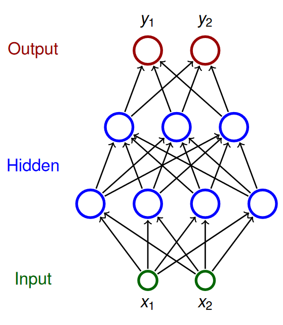
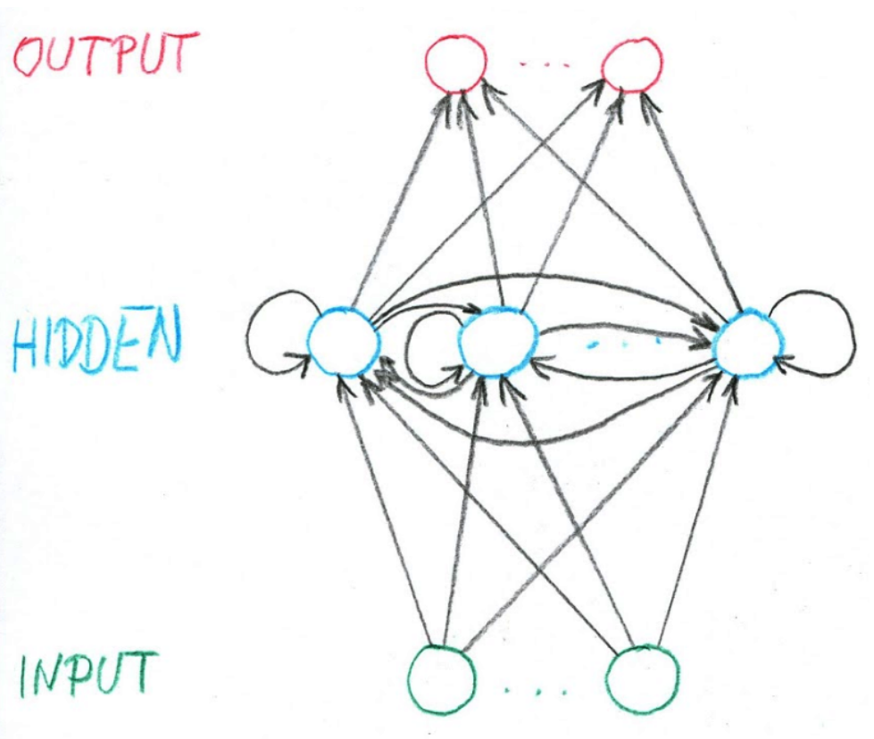

> [!NOTE]
> Strojové učení a rozpoznávání vzorů: problém klasifikace a regrese, shluková analýza, učení s učitelem a bez učitele. Vícevrstvé neuronové sítě, vícevrstvé perceptrony, ztrátové funkce, zpětná propagace. pass:[&lt;s>Hopfieldova síť, &lt;/s>]konvoluční sítě, rekurentní sítěpass:[&lt;s>, samo-organizující mapy&lt;/s>].
> <br>
> _PV021_


> [!TIP]
> Velkou část zpracování téhle otázky jsem ukradl [sám sobě](/fi/pv021/).

## Strojové učení a rozpoznávání vzorů

- **Machine learning / strojové učení**

  Oblast informatiky zabývající se konstrukcí systémů, které nemají svoji funkcionalitu explicitně naprogramovanou, ale naučí se ji až na základě vstupních dat. [^ml] [^pv021]

  Používá se např. pro:

  - filtrování spamu v emailech,
  - rozpoznávání řeči, rukopisu, tváří, zvuků, atd.,
  - klasifikaci textů,
  - herní strategie,
  - analýzu trhu,
  - autonomní řízení vozidel.

- **Rozpoznávání vzorů / pattern recognition**\
  Problém automatizovaného rozpoznávání vzorů v datech (např. číslic v obrázku). Příklady jsou _klasifikace_, _regrese_ a _shluková analýza_. [^pattern-recognition]
- **Klasifikace**\
  Problém identifikace kategorie, do které patří vstupní data. Výstupem klasifikace je buď jedna konkrétní kategorie nebo vektor popisující s jakou pravděpodobností vstup do každé kategorie patří. [^classification]
- **Regrese**\
  Problém odhadu hodnoty nějaké proměnné na základě znalosti jiných proměnných. Výstupem regrese je obvykle reálné číslo. [^regression]

  Například při _lineární regresi_ se snažíme data napasovat na přímku -- najít její offset a směrnici. Při _logistické regresi_ chceme to samé ale místo přímky máme logistic sigmoid. A tak dále. [^pv021]

- **Shluková analýza / cluster analysis**\
  Vicedimenzionální problém rozdělení vstupních dat do skupin (shluků) tak, aby data v jednom shluku byla _podobnější_ sobě než datům v jiných shlucích. [^clustering]

  Souvisejícím problémem je vyjádření toho, že jsou si data v nějakém smyslu _podobná_.

- **Supervised learning / učení s učitelem**\
  Síť se učí na základě množiny trénovacích vstupů ve formátu (vstup, výstup). Supervised learning algoritmy se snaží síť modifikovat tak, aby vracela výstupy co možná nejpodobnější těm trénovacím. [^pv021]
- **Unsupervised learning / učení bez učitele**\
  Síť dostává jen vstupy. Cílem je získat o vstupní množině dat nějakou užitečnou informaci, třeba kde jsou shluky. [^pv021]

## Neuronové sítě

- **Neural network / neuronová síť**

  Neuronová síť je množina propojených neuronů, jejíž chování je zakódováno do spojení mezi neurony. Je primitivním modelem biologických neuronových sítí.

  Typ neuronové sítě je dán její architekturou (způsobem zapojení), aktivitou (transformací vstupů na výstupy) a učením (metodou změny vah při trénování).

- **Architektura**\
  Neuron může být _input_, _output_ nebo _hidden_. Může být dokonce input i output najednou. Hidden je, právě když není input ani output.

  Síť být cyklická -- _recurrent_ -- nebo acyklická -- _feed-forward_.

- **Stav sítě**\
  Vektor výstupů všech neuronů sítě (nejen output).
- **Stavový prostor sítě**\
  Množina všech možných stavů sítě.
- **Vstup sítě**\
  Vektor reálných čísel (prvek $\Reals^n$), kde $n$ je počet vstupů.
- **Vstupní prostor sítě**\
  Množina všech vstupů sítě.
- **Iniciální stav**\
  Input neuronům je za výstup ($y$) dán vektor vstupů ($\vec{x}$). Všem ostatním neuronům je výstup ($y$) nastaven na 0.
- **Výstup sítě**\
  Vektor výstupů ($y$) output neuronů. Výstup se v průběhu výpočtu může měnit.
- **Výpočet**\
  Typicky po diskrétních krocích:

  1. Zvolí se množina neuronů (vybrané podle pravidla daného architekturou).
  2. Zvoleným neuronům je nastaven výstup -- prostě se vyhodnotí aktivační funkce.
  3. Vrať se ke kroku 1.

     Výpočet je _konečný_, pokud se stav sítě dále nemění po konečném množství opakování postupu výše.

- **Konfigurace**\
  Vektor hodnot všech vah.
- **Vahový prostor**\
  Množina všech konfigurací.
- **Iniciální konfigurace**\
  Počáteční hodnoty vah (než začne trénování).

## Multilayer perceptron (MLP) / vícevrstvé neuronové sítě

- **Perceptron -- jeden neuron**

  - Hrubá matematická aproximace biologického neuronu.
  - Binární klasifikátor -- rozlišuje jestli vstup patří nebo nepatří do nějaké jedné kategorie.[^pv021]
  - Linerání klasifikátor -- jeho funkce kombinuje vstupy lineárně.

  

  - $x_i$ -- inputy
  - $w_i$ -- váhy
  - $\xi = w_0 + \sum_{i=1}^n w_i x_i$ -- vnitřní potenciál
  - $y$ -- výstup
  - $y = \sigma(\xi)$ -- aktivační funkce udávající výstup
  - bias -- udává "jak těžké" je pro neuron se aktivovat (čím vyšší číslo, tím těžší je pro neuron vydat nenulový výstup)
  - $x_0$ -- pro snažší implementaci se závádí dodatečný vstup, který má vždy hodnotu 1 a váhu rovnu -bias

  > [!NOTE]
  > Vnitřní potenciál funguje jako nadrovina (čára při 2D, rovina při 3D, nepředstavitelný mostrum ve vyšších dimenzí), která rozděluje prostor vstupů na část, kde je $\xi  < 0$ a kde $\xi > 0$.

- **Multilayer perceptron (MLP)**

  MLP je feed-forward (neobsahuje cykly) architektura NN, kde platí:

  - Neurony rozděleny do vrstev -- jedné vstupní, jedné výstupní a libovolného počtu skrytých vrstev uprostřed.
  - Vrstvy jsou _dense_ -- každý neuron v $i$-té vrstvě je napojen na každý neuron v $(i + 1)$-ní vrstvě.

  

  Kde:

  - $\textcolor{green}{X}$ -- množina input neuronů
  - $\textcolor{red}{Y}$ -- množina output neuronů
  - $Z$ -- množina všech neuronů
  - Neurony mají indexy $i$, $j$, ...
  - $\xi_j$ -- vnitřní potenciál neuronu $j$ po skončení výpočtu
  - $y_j$ -- výstup neuronu $j$ po skončení výpočtu
  - $x_0 = 1$ -- hodnota formálního jednotkového vstupu (kvůli biasům)
  - $w_{j,i}$ -- váha spojení **z** neuronu $i$ **do** neuronu $j$ (dst  <- src)
  - $w_{j,0} = -b_j$ -- bias -- váha z formální jednotky do neuronu $j$
  - $j_{\leftarrow}$ -- množina neuronů $i$, jenž mají spojení **do** $j$ (j  <- i)
  - $j^{\rightarrow}$ -- množina neuronů $i$, do nichž vede spojení **z** $j$ (j -> i)

### Aktivita

- **Pravidlo pro výběr neuronů při výpočtu**\
  V i-tému kroku vezmi i-tou vrstvu.
- **Vnitřní potenciál neuronu $j$**\
  $\xi_j = \sum_{i \in j_{\leftarrow}} w_{ji}y_i$
- **Aktivační funkce neuronu $j$**\
  $\sigma_j : \Reals \to \Reals$ (třeba logistic sigmoid)
- **Stav nevstupního neuronu $j$**\
  $y_j = \sigma_j(\xi_j)$ resp. $y_j(\vec{w}, \vec{x})$
- **Logistic sigmoid**\
  Většina aktivačních funkcí vychází s funkce _sigmoid_. (Jsou _sigmoidní_, vypadají trochu jako písmeno `S`). Přidávají do výpočtu nelinearitu, která je potřeba, aby NN mohla modelovat libovolné funkce. Zároveň je podobná klasickému thresholdu, ale je "vyhlazená".

  ```math
  \sigma(\xi) = \frac{1}{1 + e^{-\lambda \cdot \xi}}
  ```

  kde $\lambda$ je _steepness_ parametr, který určuje, jak rychle sigmoid roste.

  

### Trénink

> [!IMPORTANT]
> Pro likelihood viz otázka [Statistika](../szp03_statistika/).

Neuronka je model, kde váhy neuronů jsou parametry. Při učení neuronek je naším cílem maximalizovat likelihood, jakožto míru toho, že naše síť sedí na "naměřená data", training set $\cal T$. Tomuhle přístupu se říká _maximum likelihood principle_.

- **Training set $\cal T$**\
  je množina $p$ samplů, kde $\vec{x} \in \Reals^{|X|}$ jsou vstupní vektory a $\vec{d} \in \Reals^{|Y|}$ jejich očekáváné výstupy.

  ```math
  \mathcal{T} = \{(\vec{x}_1, \vec{d}_1), (\vec{x}_2, \vec{d}_2), ..., (\vec{x}_p, \vec{d}_p)\}
  ```

- **Ztrátové funkce / loss function / error function**\
  Popisuje způsob, jakým je při tréninku výstup z NN porovnán s očekáváným výstupem.

  Její volba závisí na tom, co NN modeluje. Např. volíme:

  - _mean squared error_ (MSE) -- pro regresi,

    ```math
    \begin{aligned}

    E_k(\vec{w}) &= \frac{1}{2} \sum_{j \in Y}
        \left(
            y_j(\vec{w}, \vec{x_k}) - d_{kj}
        \right)^2 \\

    E(\vec{w}) &= \textcolor{red}{\frac{1}{p}} \sum_{k=1}^p E_k(\vec{w})

    \end{aligned}
    ```

  - _(categorical) cross-entropy_ -- pro (multi-class) klasifikaci.

    ```math
    \begin{aligned}

    E(\vec{w}) = -\frac{1}{p} \sum_{k=1}^p \sum_{j \in Y} d_{kj} \ln(y_j)

    \end{aligned}
    ```

- **Gradient descent**\
  Algoritmus počítající, jak se mají vahy neuronů upravit, aby se zmenšila ztráta. Vychází z gradientu ztrátové funkce.

  ```math
  \Delta \vec{w}^{(t)} = - \varepsilon(t) \cdot \nabla E (\vec{w}^{(t)})
  ```

- **Stochastic Gradient Descent (SGD)**\
  Sample nebereš po jednom ale po malých randomizovaných várkách -- minibatchích $T$, a váhy upravuješ až po zpracování minibatche.

  ```math
  \Delta \vec{w}^{(t)} = - \varepsilon(t) \cdot \sum_{k \in T} \nabla E_k(\vec{w}^{(t)})
  ```

- **Backpropagation / zpětná propagace**\
  Technika, kdy se v průběhu _gradient descent_ ztráta způsobená konkrétním neuronem dedukuje na zákládě jeho příspěvku k výsledku. Algoritmus tak postupuje od output vrstvy směrem k input vrstvě.
- **Learning rate $\varepsilon$**\
  Hyperparametr $0  < \varepsilon \le 1$ ovlivňující rychlost učení. Může záviset na iteraci $t$, pak je to funkce $\varepsilon(t)$.

**Gradient descent v MLP**

```math
\begin{aligned}

w_{ji}^{(t+1)}
&= w_{ji}^{(t)} + \Delta w_{ji}^{(t)} \\

\Delta w_{ji}^{(t)}
&= -\varepsilon(t) \cdot \textcolor{green}{\frac{\partial E}{\partial w_{ji}}(\vec{w}^{(t)})} \\

\textcolor{green}{\frac{\partial E}{\partial w_{ji}}}
&= \sum_{k=1}^{p} \textcolor{blue}{\frac{\partial E_k}{\partial w_{ji}}} \\

\textcolor{blue}{\frac{\partial E_k}{\partial w_{ji}}}
&= \textcolor{red}{\frac{\partial E_k}{\partial y_j}}
    \cdot \textcolor{purple}{\frac{\partial y_j}{\partial \xi_j}}
    \cdot \textcolor{teal}{\frac{\partial \xi_j}{\partial w_{ji}}} \\
&= \textcolor{red}{\frac{\partial E_k}{\partial y_j}}
    \cdot \textcolor{purple}{\sigma'_j(\xi_j)}
    \cdot \textcolor{teal}{y_i}
\end{aligned}
```

Za předpokladu, že $E$ je squared error, pak:

> [!WARNING]
> V případě, že $E$ není squared error, následující výpočet neplatí.

```math
\large
\textcolor{red}{\frac{\partial E_k}{\partial y_j}} =
\begin{cases}
    y_j - d_{kj} & \text{ pokud } j \in Y ; \\
    \sum_{r \in j^{\rightarrow}} \textcolor{brown}{\frac{\partial E_k}{\partial y_r}}
        \cdot \textcolor{dodgerblue}{\frac{\partial y_r}{\partial \xi_r}}
        \cdot \textcolor{forestgreen}{\frac{\partial \xi_r}{\partial y_j}}
    = \sum_{r \in j^{\rightarrow}} \textcolor{brown}{\frac{\partial E_k}{\partial y_r}}
        \cdot \textcolor{dodgerblue}{\sigma'_r(\xi_r)}
        \cdot \textcolor{forestgreen}{w_{rj}}
    & \text{ jinak}.
\end{cases}
```

**Algoritmus pro výpočet $\frac{\partial E}{\partial w_{ji}}$**

1. Inicializuj $\varepsilon_{ji} := 0$.
2. forward pass -- vyhodnoť NN pro sample $k$ (t.j. $y_j(\vec{w}, \vec{x_k})$ pro všechny $j \in Z$)
3. backward pass -- od konce pro každou vrstvu spočítej $\frac{\partial E_k}{\partial y_j}$
   a. pokud $j \in Y$, pak $\frac{\partial E_k}{\partial y_j} = y_j - d_{kj}$
   b. pokud $j \in Z \setminus Y \cup X $, a $j$ je v $l$-té vrstvě, pak
   $\frac{\partial E_k}{\partial y_j} = \sum_{r \in j^{\rightarrow}} \frac{\partial E_k}{\partial y_r} \cdot \sigma'_r(\xi_r) \cdot w_{rj}$
4. weight update -- pro všechna $w_{ji}$ spočítej
   $\frac{\partial E_k}{\partial w_{ji}} := \frac{\partial E_k}{\partial y_j} \cdot \sigma'_j(\xi_j) \cdot y_i$
5. $\varepsilon_{ji} := \varepsilon_{ji} + \frac{\partial E_k}{\partial w_{ji}}$
6. $\varepsilon_{ji}$ obsahuje výslednou hodnotu $\frac{\partial E}{\partial w_{ji}}$

## Konvoluční sítě

Neuronové sítě uzpůsobené ke zpracování obrazu. Místo násobení matic používají alespoň v jedné vrstvě konvoluci. Konvoluční sítě mají dva nové typy vrstev: _konvoluční_ a _pooling_, ale jinak se od klasických MLP moc neliší. Aktivace a trénink zůstavají v podstatě stejné. [^cnn]

> [!IMPORTANT]
> Pro konvoluci viz otázka [Zpracování rastrového obrazu](../szp09_zpracovani_obrazu/).

**Typical CNN by [Aphex34](https://commons.wikimedia.org/w/index.php?curid=45679374)**


- **Konvoluční vrstva**
  - Každý neuron je napojen jen na malý _receptive field_ neuronů o vrstvu níže, který se posouvá o daný stride.
  - Výstup z neuronu v konvoluční vrstvě je dán konvolucí jeho receptive field s váhami a přičtením biasu.
  - Všechny neurony v konvoluční vrstvě sdílí stejné váhy a biasy dané velikostí receptive field, což jim umožňuje naučit se nějaký vzor o velikosti receptive field -- říkáme, že taková vrstva je feature mapa.
  - Vzorů se chceme zpravidla naučit více, máme vícero vzájemně nezávislých feature map napojených na stejnou vstupní vrstvu.
- **Pooling vrstva**\
  Nemají váhy. Slouží ke snížení počtu parametrů. Každý neuron počítá nějakou jednoduchou funkci na svém _receptive field_:
  - _max-pooling_: maximum,
  - _L2-pooling_: square root of sum of squares,
  - _average-pooling_: mean.
- **Backpropagation**

  Algoritmus je potřeba trochu poupravit, aby podporovat konvoluční a pooling vrstvy.

  U konvolučních vrstev nestačí pro každou váhu $w_{ji}$ spočítat $\frac{\partial E_k}{\partial w_{ji}}$, protože pro každou váhu existuje víc než jeden výstup $y_j$. Tedy:

  ```math
  \frac{\partial E_k}{\partial w_{ji}} = \sum_{rl \in \textcolor{red}{\bf \lbrack ji \rbrack}} \frac{\partial E_k}{\partial y_r}
      \cdot \sigma'_r(\xi_r)
      \cdot y_l
  ```

  kde $\color{red}\bf \lbrack ji \rbrack$ je množina spojení (dvojic neuronů) sdílících váhu $w_{ji}$.

  Pokud $j \in Z \setminus Y$ a $j^{\rightarrow}$ je max-pooling, pak $j^{\rightarrow} = \{ i \}$ a platí:

  ```math
  \frac{\partial E_k}{\partial y_j}
  = \begin{cases}
      \frac{\partial E_k}{\partial y_i} & \text{pokud } j = \argmax_{r \in i_{\leftarrow}} y_r \\
      0 & \text{jinak}
  \end{cases}
  ```

## Rekurentní sítě

Neuronové sítě, jejichž architektura obsahuje cykly. Tedy výstup v jednom bodě v čase sítě přispívá k výstup v budoucnosti. Jinými slovy, je to neuronka s pamětí. _Recurrent neural networks_ (RNN) konkrétně jsou MLP _minimálně_ rozšířené tak, aby měly paměť. [^rnn]

- **Výhody**

  - Umí zpracovat vstupy s variabilní, předem neznámou délkou.
  - Velikost modelu (množiny vah) je fixní nezávisle na velikosti vstupu.
  - Váhy se sdílí mezi vstupy (např. slova ve větě), což umožňuje naučit se nějaký kontext.

- **Nevýhody**
  - Trénování je složitější, protože se vyskytuje zpětná vazba.
  - Výpočetně náročnější.
  - Gradient může explodovat (exploding) nebo zaniknout (diminishing).



- **Notace**\
  V čase $t$:

  - $\vec{x_t} = (x_{t, 1}, x_{t, 2}, ..., x_{t, M})$ je vstupní vektor předávaný $M$ vstupním neuronům,
  - $\vec{h_t} = (h_{t, 1}, h_{t, 2}, ..., h_{t, H})$ je vektor hodnot $H$ skrytých neuronů,
  - $\vec{y_t} = (y_{t, 1}, y_{t, 2}, ..., y_{y, N})$ je výstupní vektor $N$ neuronů,
  - $U_{j, i}$ je váha mezi inputem $i$ a hiddenem $j$,
  - $W_{j', i'}$ je váha mezi hiddenem $i'$ a hiddenem $j'$,
  - $V_{j'', i''}$ je váha mezi hiddenem $i''$ a outputem $j''$.

- **Aktivita**

  - Na počátku je výstup neuronky vynulován. Paměť je tedy prázdná.
  - RNN zpracovává sekvenci vstupů $\mathbb{x} = \vec{x_1}, \vec{x_2}, ..., \vec{x_T}$ délky $T$.
  - Pro každý prvek $\vec{x_t} \in \mathbb{x}$, síť vyprodukuje výstup z hidden neuronů:

    ```math
    \vec{h_t} = \sigma(U \cdot \vec{x}_t + W \cdot \vec{h}_{t-1})
    ```

  - Pro výstup pak:

    ```math
    \vec{y_t} = \sigma(V \cdot \vec{h}_t)
    ```

- **Trénink**

  Trénovací set je množina dvojic -- (vstupní **sekvence**, výstupní **sekvence**).

  ```math
  \mathcal{T} = \{ (\bold{x}_1, \bold{d}_1), ..., (\bold{x}_p, \bold{d}_p) \}
  ```

  > [!NOTE]
  > Ano, to znamená, že $x_{lt1}$ je první prvek $t$-ho prvku v $l$-té vstupní sekvenci.

  Squared error samplu $(\bold{x}, \bold{d})$:

  ```math
  E_{(\bold{x}, \bold{d})} = \sum_{t=1}^T \sum_{k=1}^N \frac{1}{2} (y_{tk} - d_{tk})^2
  ```

  Gradient descent je podobný. Na začátku jsou všechny váhy inicalizovány poblíž 0 a pak iterativně přepočítávány:

  ```math
  \begin{aligned}

  U_{kk'}^{(l+1)} &= U_{kk'}^{(l)} - \varepsilon(l) \cdot \frac{\partial E_{(x, d)}}{\partial U_{kk'}} \\
  V_{kk'}^{(l+1)} &= V_{kk'}^{(l)} - \varepsilon(l) \cdot \frac{\partial E_{(x, d)}}{\partial V_{kk'}} \\
  W_{kk'}^{(l+1)} &= W_{kk'}^{(l)} - \varepsilon(l) \cdot \frac{\partial E_{(x, d)}}{\partial W_{kk'}} \\

  \frac{\partial E_{(x, d)}}{\partial U_{kk'}} &= \sum_{t=1}^T
      \textcolor{brown}{\frac{\partial E_{(x, d)}}{\partial h_{tk}}}
      \cdot \sigma'
      \cdot x_{tk'} \\
  \frac{\partial E_{(x, d)}}{\partial V_{kk'}} &= \sum_{t=1}^T
      \textcolor{darkgreen}{\frac{\partial E_{(x, d)}}{\partial y_{tk}}}
      \cdot \sigma'
      \cdot h_{tk'} \\
  \frac{\partial E_{(x, d)}}{\partial W_{kk'}} &= \sum_{t=1}^T
      \textcolor{brown}{\frac{\partial E_{(x, d)}}{\partial h_{tk}}}
      \cdot \sigma'
      \cdot h_{(t-1)k'} \\

  \end{aligned}
  ```

  Za předpokladu squared error je backpropagation:

  ```math
  \begin{aligned}
  \textcolor{darkgreen}{\frac{\partial E_{(x, d)}}{\partial y_{tk}}}
  &= y_{tk} - d_{tk} \\

  \textcolor{brown}{\frac{\partial E_{(x, d)}}{\partial h_{tk}}}
  &= \sum_{k'=1}^N
      \textcolor{darkgreen}{\frac{\partial E_{(x, d)}}{\partial y_{tk'}}}
      \cdot \sigma'
      \cdot V_{k'k}
  +
      \sum_{k'=1}^H
      \textcolor{brown}{\frac{\partial E_{(x, d)}}{\partial h_{(t+1)k'}}}
      \cdot \textcolor{red}{\sigma'
      \cdot W_{k'k}}
  \end{aligned}
  ```

  > [!TIP]
  > Pokud $\textcolor{red}{\sigma' \cdot W_{k’k}} \not\approx 1$, pak gradient buď vybouchne nebo se ztratí.

  - **Long Short-Term Memory (LSTM)**\
    LSTM řeší problém s vanishing a exploding gradientem, kterým RNN. V RNN je $\sigma$ typicky $\tanh$. V LSTM obsahuje jeden hidden neuron vlastně čtyři "podvrstvy", které mimo jiné umožňují část paměti zapomenout:

    


[^pv021]: T. Brázdil: PV021 Neural Networks
[^ml]: [Wikipedia: Machine learning](https://en.wikipedia.org/wiki/Machine_learning)
[^classification]: [Wikipedia: Statistical classification](https://en.wikipedia.org/wiki/Statistical_classification)
[^regression]: [Wikipedia: Regression analysis](https://en.wikipedia.org/wiki/Regression_analysis)
[^clustering]: [Wikipedia: Cluster analysis](https://en.wikipedia.org/wiki/Cluster_analysis)
[^pattern]: [Wikipedia: Pattern recognition](https://en.wikipedia.org/wiki/Pattern_recognition)
[^hopfield]: [Wikipedia: Hopfield network](https://en.wikipedia.org/wiki/Hopfield_network)
[^hebb]: [Wikipedia: Hebbian theory](https://en.wikipedia.org/wiki/Hebbian_theory)
[^cnn]: [Wikipedia: Convolutional neural network](https://en.wikipedia.org/wiki/Convolutional_neural_network)
[^rnn]: [Wikipedia: Recurrent neural network](https://en.wikipedia.org/wiki/Recurrent_neural_network)
[^som]: [Wikipedia: Self-organizing map](https://en.wikipedia.org/wiki/Self-organizing_map)
[^som]: [Self-Organizing Maps: Tutorial](https://sites.pitt.edu/~is2470pb/Spring05/FinalProjects/Group1a/tutorial/som.html)
[^som]: [SDL Component Suite: Kohonen Network](http://www.lohninger.com/helpcsuite/kohonen_network_-_background_information.htm)
