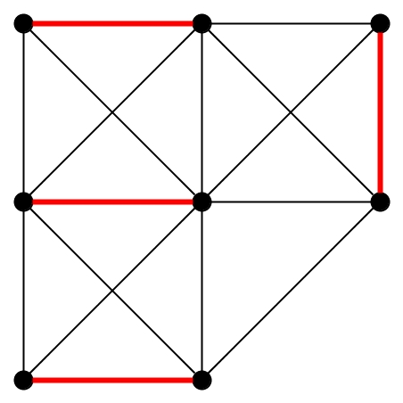
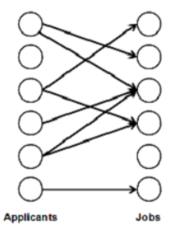
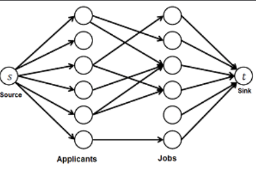
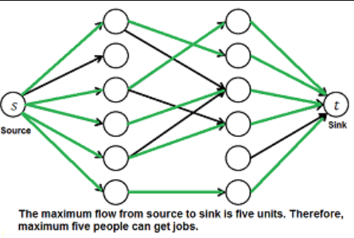

> [!NOTE]
> Reprezentace grafů. Souvislost grafu, rovinné grafy. Prohledávání grafu do šířky a do hloubky, nejkratší vzdálenosti, kostry, toky v sítích. Algoritmy: Bellman-Ford, Dijkstra, Ford-Fulkerson, Push-Relabel, maximální párování v bipartitních grafech.
> <br> > _IB000, IB002, IV003_

> [!TIP]
> Tahle otázka má solidní překryv s bakalářskými otázkami [Grafy](../../szb/grafy/) a [Grafové problémy](../../szb/grafove-problemy/).

## Terminologie

- **Graf**\
  Dvojice $G = (V, E)$ kde:

  - $V$ je množina vrcholů; $\lvert V \rvert = n$,
  - $E$ je množina hran; $\lvert E \rvert = m$,
  - hrana $e \in E$ je dvojice vrcholů $e = (u, v)$.

- **Váha grafu**\
  Váha grafu je součet vah hran grafu $G$.

  ```math
  w(G) = \sum_{e \in E(G)} w(e)
  ```

- **Bipartitní graf**\
  Graf jehož vrcholy lze rozdělit do dvou disjunktních množin tak, že všechny hrany vedou z jedné množiny do druhé.

  **Example of bipartite graph without cycles by [Watchduck](https://commons.wikimedia.org/w/index.php?curid=121779105)**

  

- **(Silná) souvislost grafu / (strongly) connected graph**\
  Graf $G$ je souvislý, pokud pro každé dva vrcholy $u, v \in V(G)$ existuje cesta z $u$ do $v$.
- **Slabá souvislost grafu / weakly connected graph**\
  Graf $G$ je slabě souvislý, pokud je souvislý jeho podgraf $G'$ vzniklý odebráním orientace hran.

  > Je souvislý alespoň, pokud zapomeneme, že hrany mají směr?

- **Silně souvislá komponenta / strongly connected component**\
  Silně souvislá komponenta grafu $G$ je jeho maximální podgraf $G'$ takový, že je silně souvislý. Jinými slovy pro každé dva vrcholy $u, v \in V(G')$ existuje cesta z $u$ do $v$.
- **Planární / rovinný graf**\
  Graf $G$ je planární, pokud se dá nakreslit do roviny tak, že se žádné dvě hrany nekříží.

  Platí v nich Eulerova formule:

  ```math
  \lvert V \rvert - \lvert E \rvert + \lvert F \rvert = 2
  ```

  Kde $\lvert F \rvert$ je počet stěn -- oblastí ohraničených hranami.

  Vrcholy planárního grafu lze vždy obarvit 4 barvami tak, že žádné dva sousední vrcholy nebudou mít stejnou barvu.

- **(Hranový) řez / (edge) cut**\
  Množina hran $C \subseteq E(G)$ taková, že po odebrání hran $C$ se graf $G$ rozpadne na více komponent -- $G' = (V, E \setminus C)$ není souvislý.

  Analogicky se definuje i _vrcholový řez / vertex cut_.

## Reprezentace grafů

- **Seznam následníků / adjacency list**\
  Pro každý vrchol $v \in V$ máme seznam (např. dynamic array nebo linked list) $N(v)$ jeho následníků.

  Zabírá $\Theta(\lvert V \rvert + \lvert E \rvert)$ paměti.

- **Matice sousednosti / adjacency matrix**\
  Máme matici velikosti $\lvert V \rvert \times \lvert V \rvert$ kde $A_{u,v} = 1$ pokud existuje hrana mezi $u$ a $v$, jinak $A_{u,v} = 0$.

  Dá se pěkně použít k uložení vah.

- **Matice incidence / incidence matrix**\
  Máme matici velikosti $\lvert V \rvert \times \lvert E \rvert$ kde $A_{u,e} = 1$ pokud $u$ je vrcholem hrany $e$, jinak $A_{u,e} = 0$.

  Dá se z ní pěkně určit stupeň vrcholu.

## Prohledávání grafu

### Prohlédávání do šířky / breadth-first search (BFS)

Od zadaného vrcholu navštíví nejprve vrcholy vzdálené 1 hranou, poté vrcholy vzdálené 2 hranami, atd.

- Prohledávání po "vrstvách".
- Je implementovaný pomocí _fronty_ (queue / FIFO).
- Časová složitost je $\mathcal{O}(\lvert V \rvert + \lvert E \rvert)$.

```python
def dfs(graph: List[List[bool]], stamps: List[int], vertex: int) -> None:
    if stamps[vertex] == -1:
        stamps[vertex] = 0
    stamp = stamps[vertex]
    for i in range(0, len(graph)):
        if graph[vertex][i] and stamps[i] != -1:
            stamps[i] = stamp + 1
            dfs(graph, stamps, i)
```

### Prohlédávání do hloubky / depth-first search (DFS)

Od zadaného vrcholu rekurzivně navštěvuje jeho nenavštívené následníky.

- Prohledání po "slepých uličkách".
- Vynořuje se teprve ve chvíli, kdy nemá kam dál (_backtrackuje_).
- Je implementovaný pomocí _zásobníku_ (stack / LIFO).
- Časová složitost je $\mathcal{O}(\lvert V \rvert + \lvert E \rvert)$.

```python
def bfs(graph: List[List[bool]], stamps: List[int], vertex: int) -> None:
    stamp = 0
    queue = deque()
    queue.append(vertex)
    while len(queue) > 0:
        current = queue.popleft()
        stamps[current] = stamp
        stamp += 1
        for i in range(0, len(graph)):
            if graph[current][i] and stamps[i] == -1:
                queue.append(i)
```

## Nejkratší vzdálenosti

Problém nalezení buď nejkratší cesty mezi dvěma vrcholy nebo nejkratší cesty z jednoho vrcholu do všech ostatních.

- **Relaxace hrany $(u, v)$**\
  Zkrácení vzdálenosti k vrcholu $v$ průchodem přes vrchol $u$. Musí platit $u\text{.distance} + w(u, v)  < v\text{.distance}$. Hrana $(u, v)$ je v takovém případě _napjatá_.

### Bellman-Fordův algoritmus

Hledá nejkratší cesty z jednoho vrcholu do všech ostatních.

- Využívá relaxaci hran.
- Funguje i na grafech se zápornými hranami.
- Má časovou složitost $\mathcal{O}(\lvert V \rvert \cdot \lvert E \rvert)$.
- Udělá max $V-1$ iterací, protože nejdelší cesta může mít max $V-1$ hran (přes žádný vertex nepůjdeš dvakrát).
- _Modifikace_: Po $V-1$ by už nejkratší cesty měly být nalezeny. Udělejme ještě jednu iteraci - pokud se hodnoty změní, pak nejkratší cesta obsahuje negativní cyklus. Viz python kód dole.
- _Modifikace_: Early stop - pokud se 2 interace po sobě hodnoty vrcholů nezmění, pak jsme našli nejkratší cesty.

```python
def bellmanford(graph: List[List[Tuple[int, int]]], s: int) \
        -> Tuple[bool, List[int], List[int]]:
    # graph is an adjacency list of tuples (dst, weight)
    distance = [float('inf') for i in range(0, len(graph))]
    distance[s] = 0
    parent = [-1 for i in range(0, len(graph))]

    # relax all edges |V| - 1 times
    for _ in range(1, len(graph)):
        for u in range(0, len(graph)):
            for edge in graph[u]:
                (v, w) = edge
                if distance[u] + w < distance[v]:
                    distance[v] = distance[u] + w
                    parent[v] = u

    # check for negative cycles
    for u in range(0, len(graph)):
        for edge in graph[u]:
            (v, w) = edge
            if distance[u] + w < distance[v]:
                return (False, None, None)

    return (True, distance, parent)
```

### Dijkstrův algoritmus

Hledá nejkratší cesty z jednoho vrcholu do všech ostatních.

- Je podobný BFS, ale používá prioritní frontu.
- Funguje **pouze** na grafech **bez záporných** hran.

> [!TIP]
> Složitost závisí na implementaci prioritní fronty. Je to $\Theta(V)$ insertů, $\Theta(V)$ hledání nejmenšího prvku, $\Theta(E)$ snížení priority.

> [!NOTE]
> Implementace níže používá pole (resp. Pythoní `list`), tedy složitost je $\Theta(V^2)$, jelikož hledání minima je lineární.

```python
def dijkstra(graph: List[List[Tuple[int, int]]], s: int) \
        -> Tuple[List[int], List[int]]:
    # graph is an adjacency list of tuples (dst, weight)
    distance = [float('inf') for i in range(0, len(graph))]
    distance[s] = 0
    parent = [-1 for i in range(0, len(graph))]

    queue = list(range(0, len(graph)))
    while len(queue) > 0:
        u = min(queue, lambda v: distance[v])
        queue.remove(u)
        for edge in graph[current]:
            (v, w) = edge
            if distance[u] + w < distance[v]:
                distance[v] = distance[u] + w
                parent[v] = u
    return (distance, parent)
```

V binární haldě by to bylo $\Theta(V \log V + E \log V)$ a ve Fibonacciho haldě $\Theta(V \log V + E)$.

Dijkstrův algoritmus lze optimalizovat, pokud nás zajímá jen nejkratší cesta mezi dvěma konkrétními vrcholy:

- Funkce vrátí výsledek, jakmile je cílový vrchol vytažen z fronty.
- Můžeme hledat zároveň ze začátku a konce pomocí dvou front a skončit, jakmile se někde potkají.
- Můžeme přidat _potenciál_ -- dodatečnou heuristickou váhu.

  > [!IMPORTANT]
  > Téhle variantě se říká A\* (A star). Věnuje se mu část otázky [Umělá inteligence v počítačových hrách](../vph06_ai_ve_hrach/).

## Kostry

- **Spanning tree / kostra**\
  Kostra grafu $G = (V, E)$ je podgraf $T \sube G$ takový, že $V(T) = V(G)$ je $T$ je strom.

  

- **Minimum spanning tree (MST) / minimální kostra**\
  Je kostra $M$ grafu $G$ s nejmenší možnou váhou. Tedy pro každou kostru $T$ grafu $G$:

  ```math
  w(M) \le w(T)
  ```

- **Fundamental cycle**\
  Fundamental cycle je cyklus $C$ v grafu $G$ takový, že odebráním libovolné hrany $e \in C$ získáme kostru.
- **Fundamental cutset / řez**\
  Fundamental cutset je množina hran $D$ v grafu $G$ taková, že přidáním libovolné hrany $e \in D$ získáme kostru.
- **Red rule**\
  Najdi cyklus bez červených hran, vyber v něm **neobarvenou** hranu s **nejvyšší** cenou a obarvi ji červeně. Červená hrana znamená odebrání z finální kostry.
- **Blue rule**\
  Najdi řez bez modrých hran, vyber v něm **neobarvenou** hranu s **nejmenší** cenou a obarvi ji modře. Modrá hrana znamená přidání do finální kostry.
- **Greedy algoritmus**\
  Nedeterministicky aplikuj red rule a blue rule, dokud to jde (stačí $n-1$ iterací). Modré hrany tvoří MST.
- **Jarníkův / Primův algoritmus**\
  Speciální případ greedy algoritmu, kdy aplikujeme pouze blue rule. Princip:

  1. Vyber libovolný vrchol $v$ a přidej ho do kostry $S$.
  2. Opakuj $n-1$ krát:
     1. Vyber hranu $e$ s nejmenší cenou, která má právě jeden vrchol v $S$.
     2. Přidej druhý vrchol $e$ do $S$.

  _Složitost_: použijeme binární haldu

  - Inicializace ($\infty$ jako cena hrany mezi prázdnou kostrou a každým vrcholem): $\mathcal{O}( \lvert  V \rvert )$
  - Odstranění minima z binární haldy pro každý vrchol ve $V$: $\mathcal{O}( \lvert V \rvert \log \lvert V \rvert )$
  - Procházení každé hrany z $E$ a snižování ceny: $\mathcal{O}( \lvert E \rvert \log \lvert V \rvert )$
  - Celková složitost: $\mathcal{O}( \lvert E \rvert \log \lvert V \rvert )$
  - S Fibonacciho haldou jde zlepšit na: $\mathcal{O}( \lvert E \rvert + \lvert V \rvert \log \lvert V \rvert )$

- **Kruskalův algoritmus**\
  Princip: Seřaď hrany podle ceny vzestupně. Postupně přidávej hrany do kostry, vynechej ty, které by vytvořily cyklus.

  1. Seřad hrany podle ceny vzestupně.
  2. Použij _union-find_ na udržování komponent grafu.
  3. Procházej hrany postupně. Pokud oba konce hrany patří do různých množin, přidej ji.

  Je to speciální případ greedy algoritmu.

  _Složitost_:

  - Inicializace union-findu: $\mathcal{O}( \lvert  V \rvert )$
  - Seřazení hran: $\mathcal{O}( \lvert E \rvert \log \lvert E \rvert )$
  - Pro každou hranu provádíme dvakrát `find` ($\mathcal{O}(\log \lvert V \rvert )$) a eventuálně `union` ($\mathcal{O}(\log \lvert V \rvert )$): $\mathcal{O}( \lvert E \rvert \log \lvert V \rvert )$
  - Celková složitost: $\mathcal{O}( \lvert E \rvert \log \lvert V \rvert )$

- **Borůvkův algoritmus**\
  Je "paralelní". Buduje modré stromy ze všech vrcholů naráz.

  1. Pro každý vrchol inicializuj modrý strom.
  2. Dokud nemáš jen jeden modrý strom, opakuj _fázi_:
     1. Pro každý modrý strom najdi nejlevnější odchozí hranu a přidej ji (propojíš tak dva stromy).

  Je to speciální případ greedy algoritmu, který spamuje jen blue rule.

  _Složitost:_

  - Počet komponent v první fázi: $\lvert V \rvert$.
  - V každé fázi se zmenší počet komponent na polovin. Tím pádem bude $\log \lvert V \rvert$ fází.
  - Každá fáze zabere $\mathcal{O}( \lvert E \rvert )$ času, protože procházíme všechny hrany.
  - Celková složitost: $\mathcal{O}( \lvert E \rvert \log \lvert V \rvert )$

  > [!TIP]
  > Kruskal sice taky buduje stromy na více místech najednou, ale není "paralelní", protože minimalita kostry spoléhá na to, že hrany jsou seřazené. Borůvka takový požadavek nemá, a proto je paralelizovatelnější.

**Složitosti algoritmů**

| Algoritmus                         | Časová složitost                                                       | Prostorová složitost              |
| ---------------------------------- | ---------------------------------------------------------------------- | --------------------------------- |
| Jarník (Prim) s prioritní frontou  | $\mathcal{O}(\lvert E \rvert \log \lvert V \rvert )$                   | $\mathcal{O}( \lvert  V \rvert )$ |
| Jarník (Prim) s Fibonacciho haldou | $\mathcal{O}(\lvert E \rvert + \lvert V \rvert \log \lvert V \rvert )$ | $\mathcal{O}( \lvert  V \rvert )$ |
| Kruskal                            | $\mathcal{O}(\lvert E \rvert \log \lvert V \rvert )$                   | $\mathcal{O}( \lvert  V \rvert )$ |
| Borůvka                            | $\mathcal{O}(\lvert E \rvert \log \lvert V \rvert )$                   | $\mathcal{O}( \lvert  V \rvert )$ |

## Toky v sítích

- **Síť toků / flow network**\
  Je čtveřice $(G, s, t, c)$, kde:

  - $G = (V, E)$ je orientovaný graf,
  - $s \in V$ je zdroj / source,
  - $t \in V$ je cíl / stok / sink; $s \neq t$,
  - $c: E \rightarrow \mathbb{R}^+$ je funkce udávající kapacitu hran.

- **Network flow / tok**\
  Je funkce $f: E \rightarrow \mathbb{R}^+$, která splňuje:

  - podmínku kapacity: $(\forall e \in E)(f(e) \ge 0 \land f(e) \leq c(e))$
    - _tok hranou je nezáporný a nepřevyšuje povolenou kapacitu_
  - podmínku kontinuity: $(\forall v \in V \setminus \{s, t\})(\sum_{e \in \delta^+(v)} f(e) = \sum_{e \in \delta^-(v)} f(e))$
    - _tok do vrcholu je stejný jako tok z vrcholu_

- **Hodnota toku $f$**

  ```math
  \lvert f \rvert = \sum_{(s, v) \in E} f(s, v) = \sum_{(w, t) \in E} f(w, t)
  ```

### Ford-Fulkerson

- **Residual network**\
  Síť, která vzniká, když je už část kapacity hrany využívána tokem $f$. Umožnuje algoritmům změnit přechozí rozhodnutí a získat využitou kapacitu zpět.

  Je to pětice $G_f = (V, E_f, s, t, c_f)$, kde

  - $E_f = \{ e \in E : f(e)  < c(e) \} \cup \{ e^R : f(e) > 0 \}$,
  - pokud $e = (u, v) \in E$, $e^R = (v, u)$,
  - $$
    c_f(e) = \begin{cases}
    c(e) - f(e) & \text{ pokud } e \in E \\
    f(e) & \text{ pokud } e^R \in E
    \end{cases}
    $$

- **Augmenting path $P$**\
  Jednoduchá $s \rightsquigarrow t$ cesta v residuální síti $G_f$. Cesty hledáš buď BFS nebo DFS - každou iteraci si prostě nějakou vybereš.

  > [!NOTE]
  > T.j. cesta která může jít i proti směru toku $f$.

  _Bottleneck kapacita_ je nejmenší kapacita hran v augmenting path $P$.

  To krásné na augmenting cestách je, že pro flow $f$ a augmenting path $P$ v grafu $G_f$, existuje tok $f'$ takový, že $\text{val}(f') = \text{val}(f) + \text{bottleneck}(G_f, P)$. Nový tok $f'$ lze získat takto:

  ```
  *Augment*(f, c, P)
  {
      delta = bottleneck(P)
      *foreach*(e in P)
      {
          *if*(e in E)
          {
              f[e] = f[e] + delta
          }
          *else*
          {
              f[reverse(e)] = f[reverse(e)] - delta
          }
      }
      *return* f
  }
  ```

- **Algoritmus Ford-Fulkerson**\
  Hledá maximální tok. Augmentuje cestu v residuální síti dokud to jde.

  1. $f(e) = 0$ pro každou $e \in E$.
  2. Najdi $s \rightsquigarrow t$ cestu $P$ v reziduální síti $G_f$.
  3. Augmentuj tok podél $P$.
  4. Opakuj dokud se nezasekneš.

  ```
  *Ford-Fulkerson*(G)
  {
      *foreach* (e in E)
      {
          f(e) = 0
      }

      G_f = reziduální síť vzniklá z G vzhledem k toku f
      *while* (existuje s ~> t cesta v G_f)
      {
          f = Augment(f, c, P)
          Updatuj G_f
      }
      *return* f
  }
  ```

### Push-Relabel

- **Pre-flow**\
  _Ne-tak-docela tok._

  Funkce $f$ taková, že

  - platí _kapacitní podmínka_: $(\forall e \in E)(0 \le f(e) \le c(e))$,
  - platí _relaxováné zachování toku_:
    $$
    (\forall v \in V - \{ s, t \})(\sum_{e \text{ do } v} f(e) \ge \sum_{e \text{ ven z } v} f(e))
    $$

- **Overflowing vertex**\
  Takový vertex $v \in V - \{ s, t \}$, do kterého více přitéká než odtéká.

  ```math
  \sum_{e \text{ do } v} f(e) > \sum_{e \text{ ven z } v} f(e)
  ```

- **Excess flow**\
  To, co je v overflowing vertexu navíc.

  ```math
  e_f(v) = \sum_{e \text{ do } v} f(e) - \sum_{e \text{ ven z } v} f(e)
  ```

- **Height function**\
  Funkce $h : V \to \N_0$. Řekneme, že $h$ je _kompatibilní s preflow $f$_, právě když

  - _source_: $h(s) = |V| = n$,
  - _sink_: $h(t) = 0$,
  - _height difference_: $(\forall (v, w) \in E_{G_f})(h(v) \le h(w) + 1)$.

    > [!NOTE]
    > Pokud mezi dvěma vrcholy $(v, w)$ v reziduální síti vede hrana, pak je $v$ nejvýše o jednu úroveň výš než $w$.

- **Push operace**\
  Pro (reziduálně-grafovou) hranu $(v, w)$ se pokusí přesunout excess flow z $v$ do $w$, aniž by porušil (reziduální) kapacitu $(v, w)$.

  ```
  // Assumptions: e_f[v] > 0, c_f( (v, w) > 0) > 0, h[v] > h[w]
  *Push*(f, h, v, w)
  {
      delta_f = min(e_f[v], c_f(v, w))
      *if*( (v, w) in E)
          f[(v, w)] += delta_f
      *else*
          f[(w, v)] -= delta_f
      e_f[v] -= delta_f
      e_f[w] += delta_f
  }
  ```

- **Relabel operace**\
  Zvýší výšku $h(v)$ natolik, aby neporušil kompatibilitu $h$ s $f$.

  ```
  // Assumptions:
  //   - v is overflowing: e_f[v] > 0
  //   - all residual neighbors of v the same height or higher:
  //     forall (v, w) in E_f: h[v] \<= h[w]
  *Relabel*(f, h, v)
  {
      h[v] = 1 + min(h[w] | (v, w) in E_f)
  }
  ```

- **Algoritmus Push-Relabel (Goldberg-Tarjan)**\
  Hledá maximální tok.

  Princip: Pokud je nějaký vrchol overflowing, tak ho pushni nebo relabeluj. Pokud ne, tak jsi našel maximální tok.

  ```
  *Push-Relabel*(V, E, s, t, c)
  {
      // initialize preflow -- default values
      *for*(v in V)
      {
          h[v] = 0    // height function
          e_f[v] = 0  // excess flow
      }
      n = |V|
      h[s] = n

      *for*(e in E)
      {
          f[e] = 0    // (pre)flow
      }

      // initialize preflow -- saturate connections from s
      *for*( (s, v) in E)
      {
          f[(s, v)] = c(s, v) // preflow maxes out all capacity
          e_f[v] = c(s, v)    // presume all of it excess
          e_f[s] -= c(s, v)   // yes, it will be negative
      }

      // the juicy part
      *while*(_any vertex is overflowing_)
      {
          v = _an overflowing vertex_ (has e_f[v] > 0)
          *if*(v _has a neighbor_ w _in_ G_f _such that_ h(v) > h(w))
          {
              *Push*(f, h, v, w)
          }
          else
          {
              *Relabel*(f, h, v)
          }
      }
      *return* f
  }
  ```

  _Korektnost_: V průběhu výpočtu platí:

  - Výška vrcholu nikdy neklesá.
  - Pre-flow a výšková funkce jsou kompatibilní.

  _Složitost_:

  - Nejvýše $2^n$ Relabelů.
  - $2nm$ saturujících Push.
  - $4n^2m$ nesaturujících Push.
  - Relabel i Push jsou v $\mathcal{O}(1)$.
  - Celkem: $O(n^2m)$.

---

**Srovnání algoritmů Ford-Fulkerson a Push-Relabel**

| Ford-Fulkerson                       | Push-Relabel (Goldberg) |
| ------------------------------------ | ----------------------- |
| global character                     | local character         |
| update flow along an augmenting path | update flow on edges    |
| flow conservation                    | preflow                 |

## Maximální párování v bipartitních grafech

- **Párování / matching**\
  Množina $M \sube E$ taková, že žádné dvě hrany v $M$ nemají společný vrchol. [^matching]

  Prázdná množina je párováním na každém grafu. Graf bez hran má pouze prázdné párování.

  **Příklad párování, které je zároveň maximální by [RRPPGG](https://commons.wikimedia.org/w/index.php?curid=45306558)**

  

- **Maximální párování**\
  Takové párování, které má nejvyšší počet hran. Graf může mít několik maximálních párování.
- **Perfektní párování**\
  Takové párování, které páruje všechny vrcholy grafu. Každé perfektní párování je zároveň maximální.
- **Maximum cardinality matching (MCM) v bipartitním grafu**\
  Problém nalezení maximálního párování v grafu. Ve speciálním případě, kdy graf je bipartitní, se tento problém dá převést na problém nalezení maximálního toku v síti: [^mcm]

  1. Mejmě bipartitní graf $G=(X+Y,E)$.

     

  2. Přidej zdroj $s$ a hranu $(s, v)$ pro každý vrchol $v$ z $X$.
  3. Přidej stok $t$ a ranu $(v, t)$ pro každý vrchol $v$ z $Y$.

     

  4. Každé hraně dej kapacitu 1.
  5. Spusť algoritmus Ford-Fulkerson.

     

[^matching]: [Wikipedia: Párování grafu](https://cs.wikipedia.org/wiki/P%C3%A1rov%C3%A1n%C3%AD_grafu)
[^mcm]: [Wikipedia: Maximum cardinality matching](https://en.wikipedia.org/wiki/Maximum_cardinality_matching)

## Další zdroje

- [IB000 Matematické základy informatiky (podzim 2022)](https://is.muni.cz/auth/el/fi/podzim2022/IB000/um/)
- [IB002 Algoritmy a datové struktury (jaro 2020)](https://is.muni.cz/auth/el/fi/jaro2020/IB002/um/)
- [IV003 Algoritmy a datové struktury II (jaro 2021)](https://is.muni.cz/auth/el/fi/jaro2021/IV003/um/)
- [Vizualizace max-flow algoritmů](https://visualgo.net/en/maxflow)
- [Vizualizace push-relabel](http://www.adrian-haarbach.de/idp-graph-algorithms/implementation/maxflow-push-relabel/index_en.html)
