<dl><dt><strong>📌 NOTE</strong></dt><dd>

Bodové transformace. Histogram, vyrovnání histogramu, analýza histogramu. Lineární a nelineární filtry. Detekce hran. Fourierova transformace. Vzorkovací teorém, převzorkování, geometrické transformace. Vlnková transformace. Houghova/Radonova transformace.

_PB130/PV131_

</dd></dl>

- **Rastr / bitmapa**\
  Obraz reprezentovaný pomocí 2D pole _pixelů_. Každý pixel obsahuje jednu (pokud je obraz černobílý) nebo více (typicky RGB nebo CMYK) intenzit. Intenzity jsou zakódovány na _bity_. [raster](#raster)

  > Je to 2D mapa bitů... bitmapa. Get it?

- **Zpracování obrazu / digital image processing**\
  Oblast informatiky zabývající se manipulací s obrazy pomocí počítače. Obsahuje třeba: [dip](#dip)

  - zpracování raw dat ze senzorů ve foťácích,
  - odstranění šumu,
  - zvýraznění hran,
  - zvýšení kontrastu,
  - detekci tváří,
  - rozpoznávání objektů,
  - rozpoznávání textu -- _optical character recognition_ (OCR).

- **Klasifikace transformací**
- Neměnící geometrii obrazu
  - Bodové
  - Lokální
  - Globální
- Geometrické

## Bodové transformace

Transformace hodnot pixelů **nezávisle** na jejich okolí. Nemění velikost obrazu.

### Homogenní

Bodové transformace, které **nezávisí** na pozici pixelu v obraze. Je definována pomocí _převodní funkce_ $I'(u, v) \leftarrow f(I(u,v))$. Patří sem třeba:

- úprava jasu,
- úprava kontrastu,
- hue, saturation, atd.,
- gama korekce,
- globální prahování.

#### Lineární transformace

Převodní funkce je lineární, definována, jako $f(a) = ka + q$.

- Identita: $k = 1, q = 0$
- Inverze intenzit (negativ): $k = -1, q = a_{max}$
- Zvýšení jasu: $k = 1, q > 0$
- Snížení jasu: $k = 1, q &lt; 0$
- Zvýšení kontrastu: $k > 1, q = 0$
- Snížení kontrastu: $0 &lt; k &lt; 1, q = 0$
- Lineární roztažení: viz dále
- (Percentilové roztažení: viz dále)
- **Negativ**\
  Inverze hodnot pixelů. Nejvyšší hodnota se změní na nejnižší a naopak.

  Pokud maximální intenzita je 255 pak negativ je definován jako:

  ```math
  f(x) = 255 - x
  ```

- **Lineární roztažení**\
  Přemapování rozsahu intenzit $(a_\text{low}, a_\text{high})$ na rozsah $(a_\text{min}, a_\text{max})$ pomocí lineární interpolace. Často ke zvýraznění kontrastu.

  ```math
  f(x) = \frac{a_\text{max} - a_\text{min}}{a_\text{high}-a_\text{low}} \cdot (x - a_\text{min}) + a_\text{min}
  ```

  kde $a_\text{low}$ je nejnižší hodnota a $a_\text{high}$ nejvyšší hodnota v obraze. Obvykle $a_\text{min} = 0$ a $a_\text{max} = 255$.

  Alternativně lze použít **percentilové roztažení**, které převede $p$ procent nejnižších a nejvyšších hodnot na $a_\text{min}$ a $a_\text{max}$ (tedy "uřízne" extrémy). není striktně řečeno lineární.

#### Nelineární transformace

Převod nelze vyjádřit v lineárním tvaru

- **Gama korekce**\
  Nelineární bodová transformace kompenzující vlastnosti lidského oka pro lepší využití bitové hloubky.

  1. Vstupní obraz je normalizován na rozsah $(0, 1)$.
  2. Každá hodnota $x$ je transformována typicky pomocí $x^\gamma$.
  3. Výsledný obraz je přeškálován na původní rozsah.

  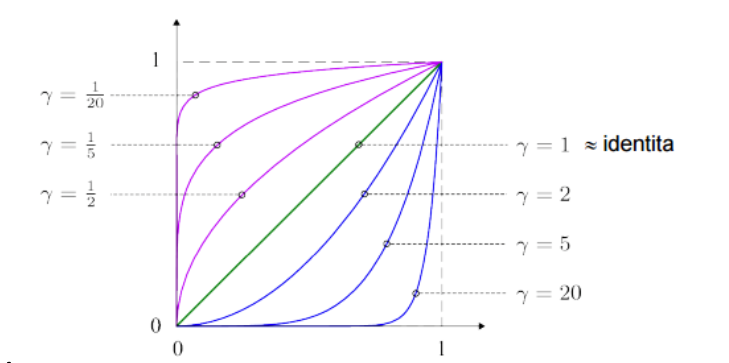

- **Kvantizace**\
  Nelineární bodová transformace, která snižuje bitovou hloubku obrazu. Výsledkem je obraz s menším počtem barev.

  > Může vypadat cool. Viz toon shading.

- **Prahování / thresholding**\
  Nelineární bodová transformace, která rozdělí obraz na dvě skupiny podle intenzity. Výsledkem je binární obraz.

  ```math
  f(x) = \begin{cases} 0 & \text{pokud } x < T \\ 1 & \text{pokud } x \geq T \end{cases}
  ```

  kde $T$ je práh. Pokud je $T$ konstanta, pak se jedná o _globální prahování_.

  Prahování se pořádně věnuje otázka [Analýza rastrového obrazu](../analyza-rastroveho-obrazu/).

- **Paleta**\
  Můžeme použít funkci či vyhledávácí tabulku pro přemapování existujících hodnot v obrazu na jiné (viz barevné škály u vizualizací).

### Nehomogenní

Bodové transformace, které **závisí** na pozici pixelu v obraze. Je definována pomocí _převodní charakteristiky_ $I'(u, v) \leftarrow f(I(u,v), u,v)$. Patří sem třeba:

- korekce nerovnoměrného osvětlení,
- vignette,
- přechodové filtry.

## Histogramy

Histogram kvantifikuje množství a frekvenci barev obsažených v obraze. Ve statické terminologii je to aproximace hustoty pravděpodobnosti.

- Hodnota histogramu $H$ v indexu $i$ odpovídá počtu pixelů v obraze s intenzitou $i$.
- Šedotónní obraz má jeden histogram. RGB obraz má tři.

- **Kumulativní histogram**\
  Kumulativní histogram $\mathbb{H}$ bbsahuje množství pixelů s intenzitou **menší nebo rovnou** než $i$. Ve statické terminologii je to aproximace distribuční funkce.

  ```math
  \mathbb{H} \lbrack i \rbrack = \sum_{j=0}^{i} H \lbrack j \rbrack
  ```

- **Vyrovnání histogramu / histogram equalization**\
  Změna obrazu tak, aby jeho kumulativní histogram měl konkrétní tvar, obvykle aby byl lineární. [histogram-eq](#histogram-eq)

  Typicky k tomu využíváme funkci $f(x) = \mathbb{H}[x] \cdot \frac{a_{\text{max}}}{w \cdot h}$, kde $\text{cumhist}$ je kumulativní histogram pro barvu v bodě x, $a_{\text{max}}$ je maximální intenzita a $w \cdot h$ je velikost obrazu.

  **Před vyrovnáním histogramu**

  
  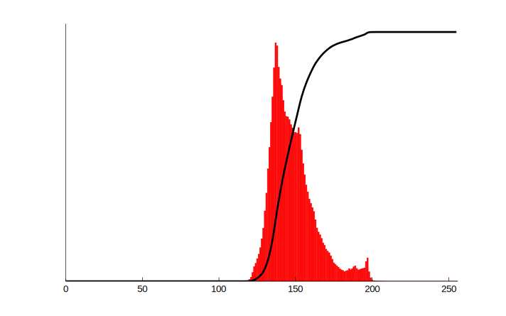

  **Po vyrovnání histogramu**

  
  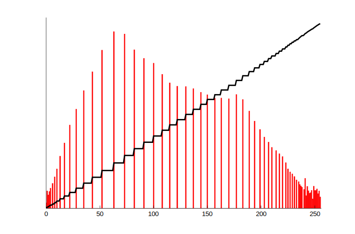

  **📌 NOTE**\
   Původní fotku vyfotil [Phillip](https://commons.wikimedia.org/w/index.php?curid=855363) [Capper](https://commons.wikimedia.org/w/index.php?curid=855383).

- **Analýza histogramu**\
  Z histogramu lze vysledovat řadu věcí jak manuálně tak automaticky. Často se proto používá jako mezikrok v jiných algoritmech. Lze z něj například zjistit: [histogram](#histogram) [histogram-bbc](#histogram-bbc)

  - průměrný jas,
  - kontrast,
  - vztah mezi mediánem a střední hodnotou,
  - přepaly a podexponované oblasti,
  - šikmost / skewness.

## Konvoluční filtry

- **Filtr**\
  Filtr je termín ze zpracování signálů (kterýmžto obraz z jisté perspektivy je). Je to zařízení, postup, či transformace, která ze signálu odstraňuje nechtěnné informace. [filter](#filter)
- **Šum / noise**\
  Šum je informace, která v obrazu vznikla kvůli nedokonalosti snímače, přenosu, uložení dat, atd. Ač někdy může vypadat docela cool, obvykle je to nechtěná informace. Podle frekvenční charakteristiky se dělí na:

  - _bílý šum_: má stejnou energii ve všech frekvencích; je to jen matematická abstrakce,
  - _Poissonův šum / photon noise_: vzniká při náhodném procesu, jako je například dopad světla na snímač,
  - _Aditivní_: přidává se k signálu; $g = f + n$, kde $f$ je originální funkce signálu a $n$ je šum,
  - _Impulzní_: nahrazuje některé hodnoty signálu jinými hodnotami; patří sem například _sůl a pepř / salt and pepper noise_.

- **Konvoluce**\
  Matematická operace, která vezme dvě funkce $f$ a $g$ a produkuje třetí funkci $h = f * g$ popisující, jak jedna funkce mění tvar té druhé. Je komutativní, takže je jedno, která je _první_ a která je _druhá_. Ve spojité doméně je definována jako: [convolution](#convolution)

  ```math
  (f * g)(t) = \int_{-\infty}^{\infty} \cdot f(\tau) g(t - \tau) d\tau
  ```

  Pokud jsou funkce $f$ a $g$ diskrétní a $g$ navíc je doména (množina povolených vstupů) $g$ konečná a je třeba $\{ -M, -M+1, ..., M-1, M \}$, pak se používá _diskrétní konvoluce_:

  ```math
  (f * g) \lbrack t \rbrack = \sum_{m = -\infty}^\infty f \lbrack m \rbrack \cdot g \lbrack t - m \rbrack
  ```

  Obrazy však mají dvě dimenze, takže se používá dvourozměrná diskrétní konvoluce:

  ```math
  (f * g) \lbrack x, y \rbrack = \sum_{m = -k}^k \sum_{n = -k}^k f \lbrack x - m, x - n \rbrack \cdot g \lbrack m, n \rbrack
  ```

  kde $h$ je _kernel / konvoluční jádro_ dáno jako matice velikosti $(2k + 1) \times (2k + 1)$.

  **⚠️ WARNING**\
   Všimni si, že kvůli $f \lbrack x - m, x - n \rbrack$ se jádro při aplikaci na obraz překlápí. Kdyby to bylo $f \lbrack x + m, x + n \rbrack$, tak jde o **korelaci**, ne o konvoluci.

  Konvoluce má složitost $O(MNKL)$, kde $M \times N$ je velikost obrazu a $K \times L$ je velikost jádra. Pro velká jádra se složitost blíží $O(M^2 N^2)$.

  Konvoluce je **komutativní**, **asociativní**, **xy separabilní** (lze ji rozdělit na dvě jednorozměrné konvoluce, pokud platí, že $H_{x,y}(i,j) = H_x(i) \cdot H_y(j)$), a **lineární** (tedy lze ji **násobit skalárem** a **sčítat**).

- **Okrajové hodnoty**\
  Je důležité si uvědomit, že na okrajích obrazu nelze aplikovat konvoluci tak, jak je definována. Existuje několik způsobů, jak s tímto problémem pracovat:

  - _Doplnění nulami_: okraje se doplní nulami,
  - _Doplnění nejbližší hodnotou_: okraje se doplní hodnotou nejbližšího pixelu,
  - _Doplnění zrcadlením_: okraje se doplní hodnotami jako podle zrcadla,
  - _Doplnění periodickým opakováním_: okraje se doplní hodnotami z opačné strany obrazu.
  - _Zmenšení okolí pro pixely u krajů obrazu_: pixely mimo obraz se ignorují.

  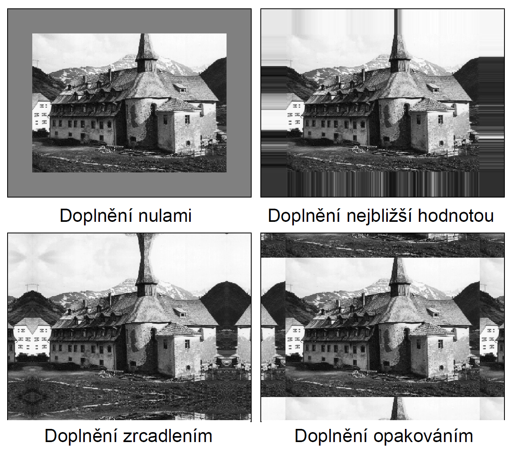

### Lineární

- **Lineární filtr**\
  Je takový filtr $\Theta: \mathbb{I}^{w \times h} \to \mathbb{I}^{w \times h}$, kde $\mathbb{I}$ je množina povolených hodnot pixelů v obraze a $\mathbb{I}^{w \times h}$ je množina všech obrazů s šířkou $w$ a výškou $h$. Musí splňovat _podmínky linearity_:

  ```math
  \begin{aligned}

  a \cdot \Theta(I) &= \Theta(a \cdot I) \\
  \Theta(I_1 + I_2) &= \Theta(I_1) + \Theta(I_2)

  \end{aligned}
  ```

  kde $I, I_1, I_2$ jsou obrazy a $a$ je skalární hodnota.

- **Posunutí**\
  Jednoduchý lineární filtr, který posune obraz o nějaký vektor.

  ```math
  \begin{bmatrix}
  0 & 0 & 0 \\
  0 & 0 & 0 \\
  0 & 0 & 1
  \end{bmatrix}
  ```

- **Box filtr / box blur**\
  Rozmazání pomocí okolních pixelů.

  ```math
  \frac{1}{9} \cdot
  \begin{bmatrix}
  1 & 1 & 1 \\
  1 & 1 & 1 \\
  1 & 1 & 1
  \end{bmatrix}
  ```

- **Gaussian filtr / Gaussian blur**\
  Rozmazání pomocí okolních pixelů s Gaussovským váhováním, kde $\sigma$ je parametr určující šířku Gaussova zvonu.
- **Rozdílové filtry**\
  Filtry, které počítají rozdíly mezi okolními pixely. Často se využívají pro detekci hran (viz dále).

### Nelineární

Nelineární filtry jsou takové filtry, které nejsou lineární. (_Duh._) Tedy nesplňují podmínky linearity.

## Detekce hran

Proces, kdy hledání _hran_ v obraze. Hrana je křivka, podél níž pixely výrazně mění intenzitu -- výrazně se mění gradient.

- Detekce hran je důležitá při identifikaci objektů a počítačovém vidění.
- Bývá implementováná pomocí (první, druhé) derivace (resp. numerické diferenciace).
- Hrany lze detekovat pomocí konvoluce.

**❗ IMPORTANT**\
Numerické diferenciaci se věnuje otázka [Numerické metody](../numericke-metody/).

### Podle první derivace (gradientu)

- **Prewittové operátor / Prewitt operator**\
  Aproximuje velikost gradientu pomocí **centrálních** konečných diferencí. Skládá se ze dvou konvolucí s jádry:

  ```math
  P_x = \begin{bmatrix} -1 & 0 & 1 \\ -1 & 0 & 1 \\ -1 & 0 & 1 \end{bmatrix} \qquad
  P_y = \begin{bmatrix} 1 & 1 & 1 \\ 0 & 0 & 0 \\ -1 & -1 & -1 \end{bmatrix}
  ```

  Které se dají odseparovat na:

  ```math
  P_x = \begin{bmatrix} -1 \\ 0 \\ 1 \end{bmatrix} \cdot \begin{bmatrix} 1 & 1 & 1 \end{bmatrix} \qquad
  P_y = \begin{bmatrix} 1 \\ 1 \\ 1 \end{bmatrix} \cdot \begin{bmatrix} -1 & 0 & 1 \end{bmatrix}
  ```

  Aproximace je pak dána jako:

  ```math
  \lvert \nabla f(m, n) \rvert \approx \sqrt{(P_x * I)^2 + (P_y * I)^2}
  ```

  kde $I$ je vstupní obraz.

    <dl><dt><strong>📌 NOTE</strong></dt><dd>

  Všimni si podobnosti s Sobelovým operátorem. Jen místo Gaussovského rozmazání používá box filtr.
    </dd></dl>

- **Sobelův operátor**\
  Aproximuje velikost gradientu pomocí **centrálních** konečných diferencí. Skládá se ze dvou konvolucí s jádry:

  ```math
  G_x = \begin{bmatrix} -1 & 0 & 1 \\ -2 & 0 & 2 \\ -1 & 0 & 1 \end{bmatrix} \qquad
  G_y = \begin{bmatrix} 1 & 2 & 1 \\ 0 & 0 & 0 \\ -1 & -2 & -1 \end{bmatrix}
  ```

  Tato jádra se dají odseparovat na:

  ```math
  G_x = \begin{bmatrix} -1 \\ 0 \\ 1 \end{bmatrix} \cdot \begin{bmatrix} 1 & 2 & 1 \end{bmatrix} \qquad
  G_y = \begin{bmatrix} 1 \\ 2 \\ 1 \end{bmatrix} \cdot \begin{bmatrix} -1 & 0 & 1 \end{bmatrix}
  ```

  Všimni si, že jeden kernel je Gaussovo rozmázání a druhý jsou centrální diference.

  Aproximace je pak dána jako:

  ```math
  \lvert \nabla f(m, n) \rvert \approx \sqrt{(G_x * I)^2 + (G_y * I)^2}
  ```

  kde $I$ je vstupní obraz.

- **Robertsův operátor / Roberts cross**\
  Aproximuje velikost gradientu pomocí konečných diferencí. Detekuje především hrany se sklonem 45°.

  ```math
  \lvert \nabla f(m, n) \rvert \approx \textcolor{red}{\lvert f(m, n) - f(m + 1, n + 1) \rvert} + \textcolor{blue}{\lvert f(m + 1, n) - f(m, n + 1) \rvert}
  ```

  kde barevné výrazy získa dvěma konvolucemi s jádry:

  ```math
  \textcolor{red}{R_x}  = \begin{bmatrix} 1 & 0 \\ 0 & -1 \end{bmatrix} \qquad
  \textcolor{blue}{R_y} = \begin{bmatrix} 0 & 1 \\ -1 & 0 \end{bmatrix}
  ```

- **Robinsonův operátor / Robinson compass mark**\
  Detekuje hrany pomocí centrální diferencí. Používá osm různých jader, jedno prokaždý směr na kompasu. To mu umožňuje snadno aproximovat nejen velikost ale i směr gradientu.
- **Canny edge detector**\
  Algoritmus pro detekci hran. [canny](#canny) [canny-tds](#canny-tds)

  - Má nízké procento chyb.
  - Přesně lokalizuje hrany.
  - Má jednoznačnou odezvu (hrana prostě buď je nebo není).
  - Ale **neprodukuje** nutně spojité hrany.

  Zjednodušený postup:

  1. Aplikuj Gaussovo rozmazání na vstupní obraz, pro odstranění šumu.
  2. Spočítej gradient intenzity obrazu (pomocí Roberts, Sobela, ...).
  3. Non-maximum suppression: zuž hrany na jednopixelovou šířku.
  4. Double threshold: urči, které pixely jsou _strong_, _weak_ a _non-relevant_.
  5. Aplikuj hysterezní prahování: spoj _strong_ pixely s _weak_ pixely, pokud je kolem nich _strong_ pixel.

### Podle druhé derivace

Hrany lze detekovat pomocí druhé derivace obrazu. Nacházejí se v _nulových bodech / zero crossings_ (tedy v maximech a minimech první derivace).

- **Divergence**\
  Divergence je operátor, který vrací skalární hodnotu. Popisuje zda gradient roste či klesá. Je definován jako: [divergence](#divergence)

  ```math
  \text{div} \vec{F} = \nabla \cdot \vec{F} = \frac{\partial F_x}{\partial x} + \frac{\partial F_y}{\partial y} + \frac{\partial F_z}{\partial z}
  ```

- **Laplaceův operátor / Laplacian**\
  Laplaceův operátor $\Delta$ hledá hrany pomocí divergence gradientu.

  - Produkuje spojité hrany.
  - Uzavřené kontury.
  - Invariantní k otáčení o násobky $\pi/2$.
  - Ale je velmi citlivý na šum.
  - Nedetekuje orientaci hrany.

  ```math
  \Delta f = \nabla^2 f = \nabla \cdot \nabla f = f_{xx} + f_{yy}
  ```

  kde $f$ je vstupní obraz.

  Jeho diskrétní aproximace v maticové podobě potom vypadá jako:

  ```math

  \begin{bmatrix} 0 & 1 & 0 \\ 1 & -4 & 1 \\ 0 & 1 & 0 \end{bmatrix}
  ```

- **Laplacian of Gaussian (LoG)**\
  Kombinace Gaussovského rozmazání a Laplacianu.

  Laplaceův operátor je velmi citlivý na šum. Proto se před jeho použítím obraz často prožene Gaussovským rozmazáním.

  Matice pro LoG je potom dána jako:

  ```math
  \begin{bmatrix}
      0 & 0 & -1 & 0 & 0 \\
      0 & -1 & -2 & -1 & 0 \\
      -1 & -2 & 16 & -2 & -1 \\
      0 & -1 & -2 & -1 & 0 \\
      0 & 0 & -1 & 0 & 0
  \end{bmatrix}
  ```

  Říká se mu _Mexican hat_.

  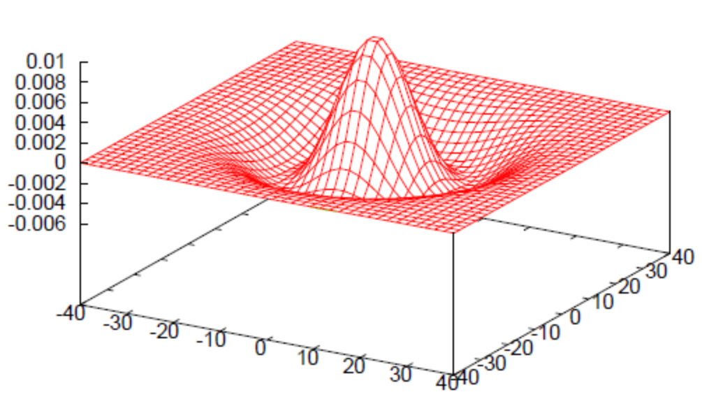

## Integrální transformace

Transformace, která mapuje funkci $f: A \to B$ z jejího původního funkčního prostoru $A \to B$ do nějakého jiného funkčního prostoru $A' \to B'$. Používá se, protože s některými vlastnostmi funkcí je snazší pracovat v jiném prostoru. [integral-transform](#integral-transform)

Patří sem transformace jako:

- Fourierova transformace,
- vlnková transformace,
- Houghova transformace,
- Radonova transformace.

## Fourierova transformace

> Fourierka je ako more. Je to hromada vlniek.
>
> — Nika Kunzová

<dl><dt><strong>💡 TIP</strong></dt><dd>

3Blue1Brown má skvělý [video o Fourierově transformaci](https://www.youtube.com/watch?v=spUNpyF58BY), ze kterého to pochopíš! _(a evidentně je tak dobrý, že mi Copilot sám nabídl správný link...)_

</dd></dl>

Je operace (integrální transformace) při níž je obraz převeden z _prostorové_ do _frekvenční_ domény. A při _inverzní Fourierově transformaci_ obráceně. [fourier](#fourier)

- Frekvenční doména je složena ze sinusoid s různými frekvencemi a fázemi (indikovaných pomocí polárních souřadnic).
- Intenzita pixelu v obrazu frekvenční domény pak udává amplitudu dané sinusoidy.
- Roztažení (stretch) funkce v prostorové doméně odpovídá opakování funkce (repetition) ve frekvenční doméně.
- Posun (shift) v prostorové doméně ovlivňuje jenom fázi.

- **Eulerova formule**\
  Eulerova formule je vztah mezi komplexními čísly a goniometrickými funkcemi.

  ```math
  e^{i \theta} = \cos \theta + i \sin \theta
  ```

  Lidskými slovy říká (viz 3b1b), že komplexní číslo $e^{i t}$ popisuje pohyb po jednotkové kružnici v komplexní rovině proti směru hodinových ručiček. Jedna otáčka je $t = 2 \pi$ radianů.

- **1D Fourierova transformace**\
  Eulerovu formuli využijeme při popisu Fourierovy transformace:

  ```math
  \underbrace{\mathcal{F}(u)}_{\substack{\text{FT pro} \\ \text{frekvenci } u}} =
  \underbrace{\int_{-\infty}^{\infty}
      \underbrace{f(x)}_{\substack{\text{poloměr} \\ \text{podle} \\ \text{funkce } f}}
      \underbrace{e^{
          \underbrace{-}_{\substack{\text{chceme} \\ \text{po směru} \\ \text{hodin}}}
          \underbrace{i}_{\substack{\text{komplexní} \\ \text{číslo}}}
          \underbrace{2 \pi}_{\substack{\text{celá} \\ \text{kružnice}}}
          \underbrace{u}_{\substack{\text{frekvence} \\ \text{ve FT}}}
          \underbrace{x}_{\substack{\text{čas} \\ \text{ve funkci } f}}
      }}_{\text{fáze kružnice podle frekvence a času}}
      dx
  }_{\text{pro všechna } x \text{ v celém definičním oboru funkce} f}
  ```

  **Forward** (z prostorové do frekvenční domény): [fourier](#fourier)

  ```math
  \begin{align*}

  \mathcal{F}(u) &= \int_{-\infty}^{\infty} f(x) e^{-i 2 \pi u x} dx & \text{ spojitá} \\
  \mathcal{F}(k) &= \frac{1}{\sqrt{N}} \sum_{m = 0}^{N-1} f(m) e^\frac{-i 2 \pi k m}{N} & \text{ diskrétní}

  \end{align*}
  ```

  **Inverse** (z frekvenční do prostorové domény):

  ```math
  \begin{align*}

  f(x) &= \int_{-\infty}^{\infty} \mathcal{F}(u) e^{i 2 \pi u x} du & \text{ spojitá} \\
  f(x) & = {1 \over \sqrt N} \sum_{m=0}^{N-1} \mathcal{F}(k) e^{{2 \pi i m k \over N}}

  \end{align*}
  ```

- **2D Fourierova transformace**\
  **Forward** (z prostorové do frekvenční domény): [fourier](#fourier)

  ```math
  \begin{align*}

  \mathcal{F}(u, v) &= \int_{-\infty}^{\infty} \int_{-\infty}^{\infty} f(x, y) e^{-i 2 \pi (ux + vy)} dx dy & \text{ spojitá} \\
  \mathcal{F}(u, v) &= \frac{1}{\sqrt{MN}} \sum_{m=0}^{M-1} \sum_{n = 0}^{N-1} f(x, y) e^{-i 2 \pi \left(\frac{m \cdot u}{M} + \frac{n \cdot v}{N}\right)} & \text{ diskrétní}

  \end{align*}
  ```

  **Inverse** (z frekvenční do prostorové domény):

  ```math
  \begin{align*}

  f(m, n) &= \int_{-\infty}^{\infty} \int_{-\infty}^{\infty} \mathcal{F}(u, v) e^{i 2 \pi (um + vn)} du dv & \text{ spojitá} \\
  f(m, n) &= \frac{1}{MN}\sum_{k=0}^{M-1} \sum_{l = 0}^{N-1} \mathcal{F}(u, v) e^{i 2 \pi \left(\frac{um}{M} + \frac{vn}{N}\right)} & \text{ diskrétní}

  \end{align*}
  ```

- **Fast Fourier Transform (FFT)**\
  Algoritmus pro rychlé výpočty diskrétní Fourierovy transformace (DFT). [fft](#fft)
- **Konvoluční teorém**\
  Říká, že běžné násobení ve frekvenční doméně odpovídá konvoluci v prostorové doméně a obráceně. To je cool, protože konvoluce je pomalá, ale násobení je rychlé. [convolution](#convolution)

  ```math
  \mathcal{F} \{ f * g \} = \mathcal{F} \{ f \} \cdot \mathcal{F} \{ g \}
  ```

  kde $\mathcal{F}$ je Fourierova transformace.

## Sampling / vzorkování

Samplování je převod spojitého signálu na diskrétní. [sampling](#sampling)

- **Převzorkování**\
  Je proces, kdy na vstupu je **diskrétní** signál s nějakou vzorkovací frekvencí a na výstupu je **diskrétní** signál s **jinou** vzorkovací frekvencí.

  V případě 2D obrazů to může ale nemusí znamenat změnu velikosti obrazu. [image-scaling](#image-scaling)

- **Vzorkovací teorém / Nyquist-Shannon sampling theorem**\
  Říká, že chceme-li spojitý signál převést na diskrétní a pak z tohoto diskrétního signálu zrekonstruovat původní spojitý signál, můsíme samplovat s alespoň dvojnásobnou frekvencí než je nejvyšší frekvence v původním signálu. [n-s](#n-s)

  - Původní spojitý signál musí být frekvenčně omezený (band-limited), aby bylo možné v něm určit nejvyšší frekvenci.
  - Při nesplnění těchto podmínek vzniká aliasing.

    **💡 TIP**\
    Aliasingu se věnuje část otázky [Renderování s využitím GPU](../renderovani-s-vyuzitim-gpu/).

  **💡 TIP**\
   Intuitivně je signál hromádka kopečků. Abychom poznali i ty nejužší kopečky -- s nejvyšší frekvencí -- musíme mít dostatečně jemné síto -- koukat na kopečky s dvakrát takovou frekvencí, abychom si všimli, že někde začíná a končí.

- **Rekonstrukce**\
  Proces, kdy z diskrétního signálu zpět získáme spojitý signál. [reconstruction](#reconstruction)
- **Rekonstrukční filtr**\
  Filtr pro rekonstrukci signálu.

  - _box_: nejbližší soused,
  - _tent_: lineární interpolace,
  - sinc,
  - Lanczos,
  - Gaussian.

## Geometrické transformace

Geometrická transformace $T$ je bijekce mezi body dvou obrazů $I$ a $J$. Díky tomu, že je to bijekce, k ní musí vždy existovat inverze. [geometric-transform](#geometric-transform)

```math
J \lbrack u, v \rbrack = T(u, v) = I \lbrack x(u, v), y(u, v) \rbrack
```

Patří sem operace jako:

- posunutí / translace,
- rotace,
- škálování,
- zkosení / shear,
- zrcadlení / flip,
- deformace / warping (na rozdíl od operací výše není lineární).

- **Dopředné mapování / forward mapping**\
  Procházíme pixely v $I$ a hledáme jejich umístění v $J$ (_metoda "Kam s ním?"_).
- **Zpětné mapování / backward mapping**\
  Pro každý pixel $J$ počítáme jeho původní umístění v $I$ (_metoda "Kde je?"_).

## Vlnková transformace / wavelet transform

<dl><dt><strong>💡 TIP</strong></dt><dd>

Opět výborné video, bohužel ne od 3b1b, ale obdobně kvalitně zpracované: [Wavelets: a mathematical microscope](https://www.youtube.com/watch?v=jnxqHcObNK4).

</dd></dl>

- **Vlnka / wavelet**\
  Funkce $\psi$, která je omezená v čase. Je to "brief oscillation". [wavelet](#wavelet)

  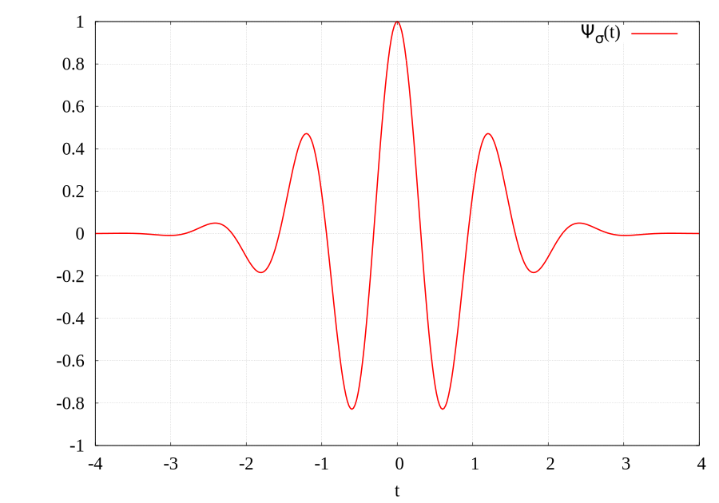

  - **Má konečnou energii**:

    ```math
    \int_{-\infty}^{\infty} |\psi(t)|^2 dt < \infty
    ```

  - Splňuje podmínku přípustnosti:

    ```math
    C_\psi = \int_{0}^{\infty} { {|\hat{\psi}(\omega)|^{2}}\over{\omega} } \, \mathrm{d}\omega < \infty
    ```

    kde $\hat{\psi}$ je Fourierova transformace $\psi$. Tato podmínka zajišťuje invertibilitu vlnkové transformace.

  - Z podmínky přípustnosti plyne, že vlnka **musí mít nulovou střední hodnotu**:

    ```math
    \int_{-\infty}^{\infty} \psi(t) \, \mathrm{d}t = 0
    ```

---

Vlnková transformace je integrální transformace, která popisuje funkci v **čase** a **frekvenci** zároveň. Popis v čase je dán tím, že vlnky (narozdíl od sinusoid u Fourierky) jsou časově omezené. [wavelet](#wavelet)

Používá se k:

- Detekci nespojitosti signálu a jeho derivaci.
- Identifikaci okamžitých frekvencí.
- Odstranění šumu.
- Extrakci příznaků.
- Kompresi signálu.

Základní myšlenka je:

1. Zvolíme mateřskou vlnku $\psi$ (je spousta různých, ale nejznámnější je Morletova vlnka $\psi(t) = k \cdot \underbrace{e^{i \omega_0 t}}_{\text{Rotace jako u FT}} \cdot \underbrace{e^{\frac{-t^2}{2}}}_{\text{Škála}}$

   

2. Tuto vlnku můžeme posouvat a škálovat pomocí parametrů $a$ a $b$ - $\psi_{a,b} = \psi \frac{t-b}{a}$.

   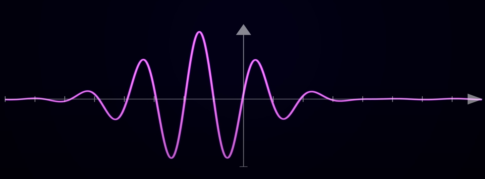

3. Posouváme naši vlnkovou funkci po signálu oběma parametry a pro každý bod sledujeme shodu s funkcí. Tu získáme intuitivně, jako integrál součinu vlnky a signálu $\int_{-\infty}^{\infty} y(t) \psi_{a,b}(t) dt$. Pokud se ale podíváme na to, co to znamená ve frekvenční doméně, zjistíme, že to je skalární součin mezi Fourierovou transformací signálu a vlnky $\langle f, \psi_{a,b} \rangle$.

   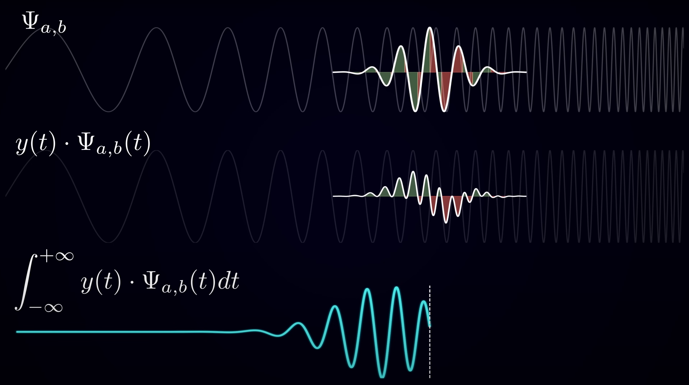

4. Pokud toto uděláme pro každý bod časové ($a$) a frekvenční ($b$) domény, dostaneme výsledný obraz vlnkové transformace.

   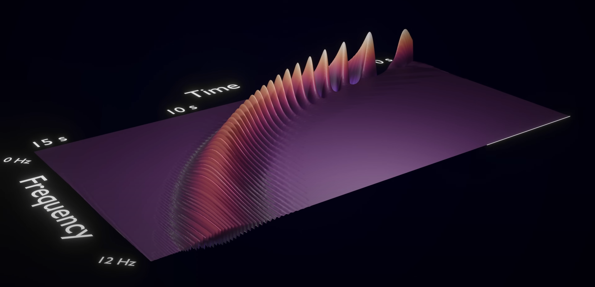

5. Ale co to? V reálné části výsledku vidíme podivné vlnky! To je proto, že vlnková funkce je komplexní a ve skutečnosti nám dot product nevrací jednu hodnotu, ale komplexní číslo. Pokud zkoumáme to, pak vidíme, že rotuje kolem středu imaginární roviny. Stačí nám tedy změřit jeho vzdálenost od středu (absolutní hodnotu komplexního čísla) a dostáváme vlnkovou transformaci.

   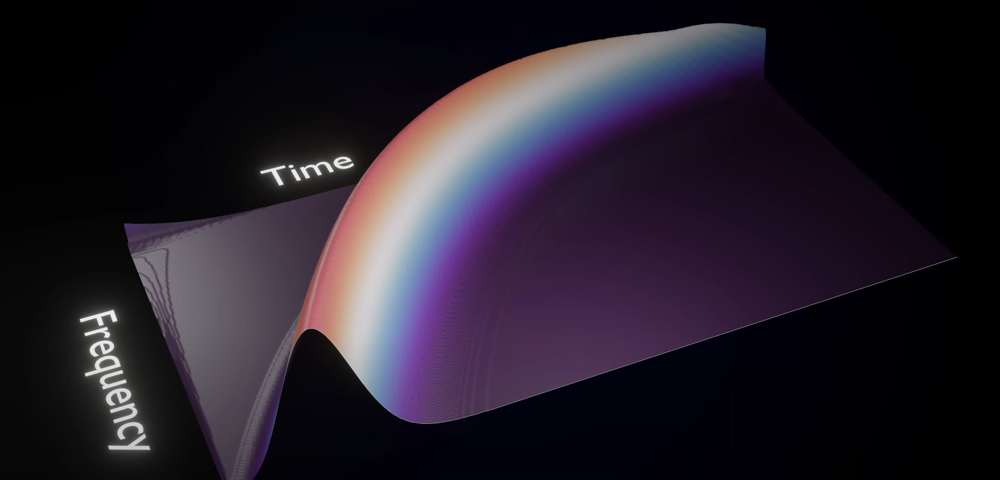

Ve výsledku je to fakt jen **dot product funkce $f$ s upravenou vlnkou $\psi_{a,b}$**!

```math
\begin{aligned}
\left[\operatorname {W} _{\psi }\,f\right](a,b) &=
    \langle f,\psi _{a,b}\rangle\\

&=\int _{-\infty }^{+\infty }\!f(t)\,\psi _{a,b}^{\ast }(t)\,\mathrm {d} t\\

&=\int _{-\infty }^{+\infty }\!f(t)\,{\frac {1}{\sqrt {a}}}\psi ^{\ast }\left({{t-b} \over {a}}\right)\,\mathrm {d} t\\

&=f*\psi _{a}^{\ast }(b)\\&={\frac {1}{2\pi }}\langle {\hat {f}},{\hat {\psi }}_{a,b}\rangle ,

\end{aligned}
```

kde:

- $\psi$ je mateřská vlnka,
- $\psi_{a,b}$ je škálovaná a posunutá mateřská vlnka,
- $a$ je škálovací parametr,
- $b$ je posunutí.
- $\hat {f}$ je Fourierova transformace funkce $f$,
- $\hat {\psi }$ je Fourierova transformace vlnky $\psi$,
- $\langle \cdot ,\cdot \rangle $ je skalární součin,
- $\ast $ u $\psi^\ast$ je komplexně sdružená funkce,
- $*$ je spojitá konvoluce,
- $\psi _{a}(t)={\frac {1}{\sqrt {a}}}\psi \left({{-t} \over {a}}\right)$ je spojitý filtr, který odpovídá vlnce $\psi$, pro dané měřítko $a$.

Dále platí:

- Vlnky jsou konstruovány, aby měly vhodné vlastnosti například pro zpracování signálů.
- Vlnková transformace je v podstatě konvoluce signálu s vlnkou.

Představme si například vlnku, která má frekvenci tónu střední C a krátké trvání odpovídající osminové notě. Provedeme-li v pravidelných intervalech konvoluci takovéto vlnky se signálem - nahrávkou písně - pak nám výsledky této konvoluce napoví, kdy byla nota „osminové střední C“ v nahrávce použita.

Matematicky vzato, k vysoké korelaci vlnky se signálem (vysokému korelačnímu koeficientu) dojde v těch místech (intervalech), kde signál obsahuje informaci o podobné frekvenci, tedy tam, kde je námi zvolené vlnce nejpodobnější. Tento koncept je jádrem mnoha aplikací vlnkové transformace. [others](#others)

## Houghova transformace

<dl><dt><strong>💡 TIP</strong></dt><dd>

Super [minutu a půl dlouhé video, co ti řekne úplně všechno](https://www.youtube.com/watch?v=X1DxCPS1iwA).

</dd></dl>

Integrální transformace, která identifikuje přímky v obraze. V rozšířené podobě hledá libovolné tvary zadané parametricky. [hough](#hough)

- Dlouho byla používána pro detekci čar na silnici pro autonomní řízení aut. (Už ne. Dnes se používají neuronové sítě.)
- Pracuje nad binárním obrazem.
- Mapuje tvar na bod v parametrickém prostoru.

- **Houghův prostor**\
  Prostor je definován jednoduchou rovnicí $x \cdot \cos (\theta) + y \cdot \sin (\theta) = \rho$.

  Bod v prostoru obrázku je reprezentován jako křivka v Houghově prostoru. Bod v Houghově prostoru je reprezentován jako přímka v obrázku.

  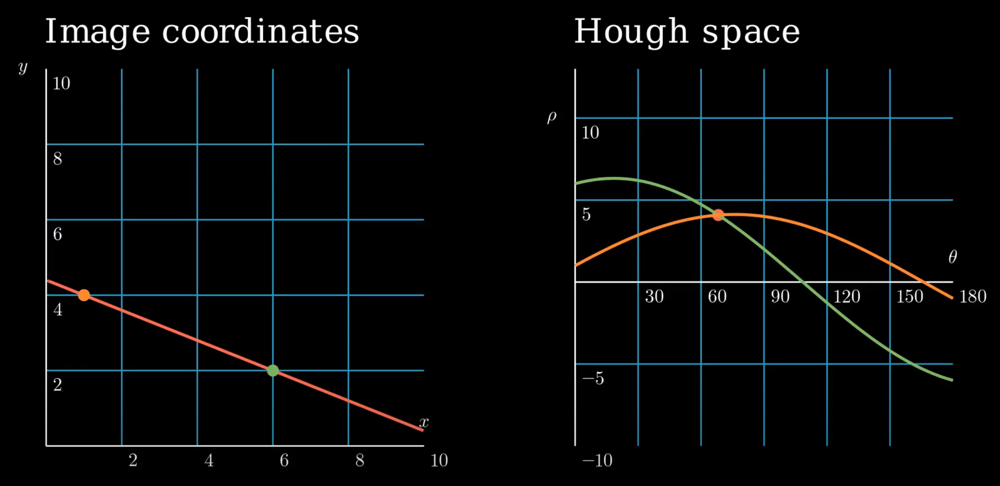

  Můžeme promítnout všechny body z obrázku do Houghova prostoru s intenzitou odpovídající intenzitě bodu v obrázku. Pak hledáme body v Houghově prostoru, které mají největší intenzitu. To jsou body, které reprezentují přímky v obrázku.

  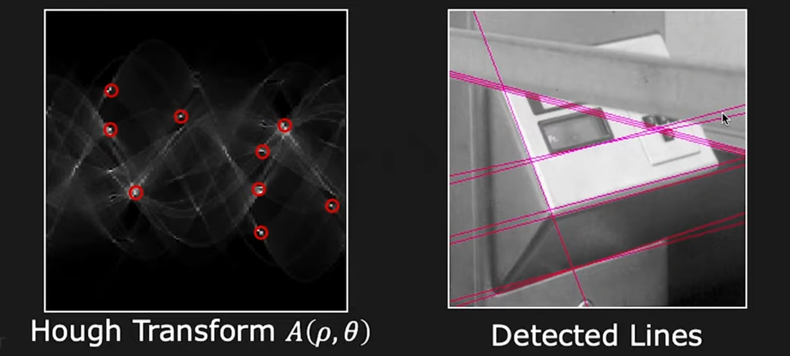

## Radonova transformace

<dl><dt><strong>💡 TIP</strong></dt><dd>

Jako je již tradicí, mám pro vás [video](https://www.youtube.com/watch?v=f0sxjhGHRPo)...

</dd></dl>

Integrální transformace, která integruje funkci přes přímky. Tedy rozkládá funkci na hromádku parametrů, které definují přímky.

Užitečná je především inverzní Radonova transformace, která se používá v tomografii ("CTčko"). [radon](#radon)

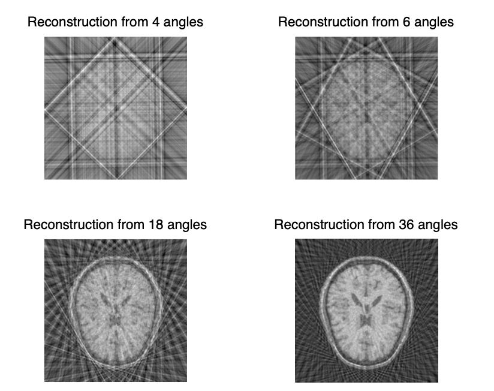

Mějme 3D objekt, který chceme "proskenovat" z různých úhlů $\phi$. Pro každý úhel chceme získat 1D projekci objektu $p(s, \phi)$. Tato projekce je dána integrálem funkce $f(x, y)$ přes přímku.

Uvažme, že nejprve celý prostor otočíme o úhel $\phi$ a potom provedeme jednoduchou projekci všech bodů na této přímce.

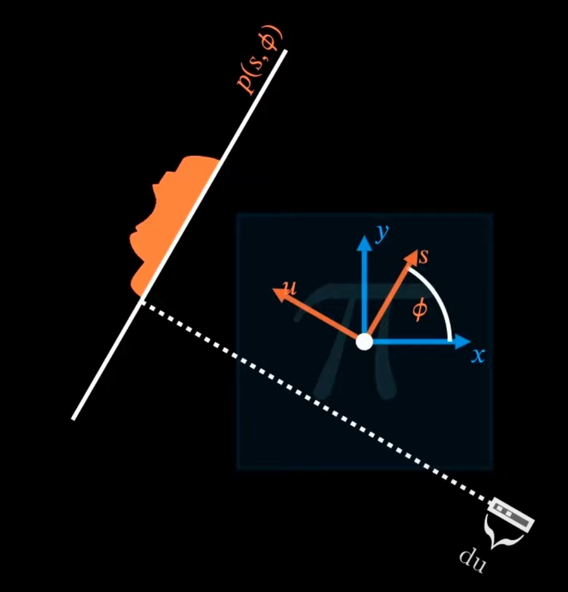

```math
\begin{pmatrix}
x \\
y
\end{pmatrix}
=
\begin{pmatrix}
\cos \phi & -\sin \phi \\
\sin \phi & \cos \phi
\end{pmatrix}
\begin{pmatrix}
s \\
u
\end{pmatrix}

\Rightarrow

\begin{aligned}
x = s \cos \phi - u \sin \phi \\
y = s \sin \phi + u \cos \phi
\end{aligned}
```

```math
\begin{aligned}
p(s, \phi) &= \mathcal{R} \{ f(s, \phi) \} \\
&= \int_{-\infty}^{\infty} f(x, y) du \\
&= \int_{-\infty}^{\infty} f(s \cos \phi - u \sin \phi, s \sin \phi + u \cos \phi) du
\end{aligned}
```

Pokud vezmeme všechny hodnoty z této projekce, získáme tzv. Sinogram:

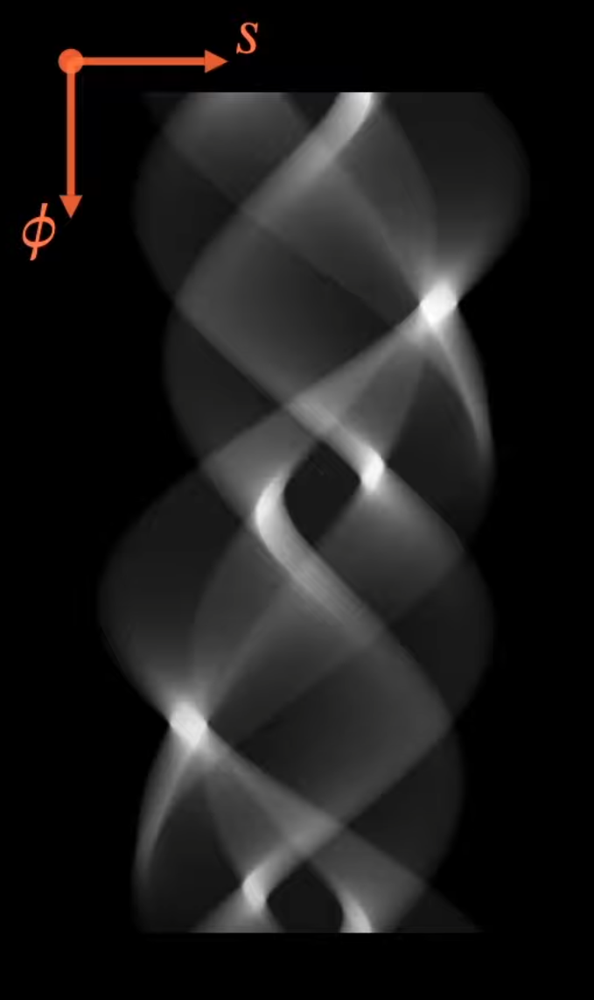

Inverzní funkce je velice užitečná, ale poměrně složitá, takže doufám, že stačí tato obecná myšlenka.

---

**Radon vs Hough**

| Radon                                                                   |
| ----------------------------------------------------------------------- |
| Hough                                                                   |
| Vyvinuta v 1917                                                         |
| Vyvinuta v 1962                                                         |
| Nejčastěji hledá přímky                                                 |
| Hledá nějaký tvar zadaný parametricky (přímky, kružnice, elipsy, ...)   |
| Dopředná transformace nás moc nezajímá tu provádí CT skener kontinuálně |
| Dopředná transformace je implementovaná diskrétně                       |
| Hlavním cílem je rekonstrukce obrazu -- inverzní transformace           |
| Hlavním cílem je detekce tvarů                                          |

## Zdroje

- [[[pb130,1]]] [PB130 Úvod do digitálního zpracování obrazu (podzim 2022)](https://is.muni.cz/auth/el/fi/podzim2022/PB130/)
- [[[pv131,2]]] [PV131 Digitální zpracování obrazu (jaro 2023)](https://is.muni.cz/auth/el/fi/jaro2023/PV131/)
- [[[raster,3]]] [Wikipedia: Raster graphics](https://en.wikipedia.org/wiki/Raster_graphics)
- [[[dip,4]]] [Wikipedia: Digital image processing](https://en.wikipedia.org/wiki/Digital_image_processing)
- [[[filter,5]]] [Wikipedia: Filter (signal processing)](<https://en.wikipedia.org/wiki/Filter_(signal_processing)>)
- [[[convolution,6]]] [Wikipedia: Convolution](https://en.wikipedia.org/wiki/Convolution)
- [[[edge-detection,7]]] [Wikipedia: Edge detection](https://en.wikipedia.org/wiki/Edge_detection)
- [[[fourier, 8]]] [Wikipedia: Fourier transform](https://en.wikipedia.org/wiki/Fourier_transform)
- [[[fft, 9]]] [Wikipedia: Fast Fourier transform](https://en.wikipedia.org/wiki/Fast_Fourier_transform)
- [[[samping, 10]]] [Wikipedia: Sampling (signal processing)](<https://en.wikipedia.org/wiki/Sampling_(signal_processing)>)
- [[[scaling, 11]]] [Wikipedia: Image scaling](https://en.wikipedia.org/wiki/Image_scaling)
- [[[n-s, 12]]] [Wikipedia: Nyquist–Shannon sampling theorem](https://en.wikipedia.org/wiki/Nyquist%E2%80%93Shannon_sampling_theorem)
- [[[geometric-transform,13]]] [Wikipedia: Geometric transformation](https://en.wikipedia.org/wiki/Geometric_transformation)
- [[[reconstruction, 14]]] [Wikipedia: Signal reconstruction](https://en.wikipedia.org/wiki/Signal_reconstruction)
- [[[wavelet,15]]] [Wikipedia: Wavelet transform](https://en.wikipedia.org/wiki/Wavelet_transform)
- [[[hough, 16]]] [Wikipedia: Hough transform](https://en.wikipedia.org/wiki/Hough_transform)
- [[[radon, 17]]] [Wikipedia: Radon transform](https://en.wikipedia.org/wiki/Radon_transform)
- [[[integral-transform, 18]]] [Wikipedia: Integral transform](https://en.wikipedia.org/wiki/Integral_transform)
- [[[histogram, 19]]] [Wikipedia: Histogram](https://en.wikipedia.org/wiki/Histogram)
- [[[histogram-eq, 20]]] [Wikipedia: Histogram equalization](https://en.wikipedia.org/wiki/Histogram_equalization)
- [[[histogram-bbc, 21]]] [Bitesize: Histograms - Higher only](https://www.bbc.co.uk/bitesize/guides/zspfcwx/revision/3)
- [[[sobel, 22]]] [Wikipedia: Sobel operator](https://en.wikipedia.org/wiki/Sobel_operator)
- [[[canny, 23]]] [Wikipedia: Canny edge detector](https://en.wikipedia.org/wiki/Canny_edge_detector)
- [[[canny-tds, 24]]] [Canny Edge Detection Step by Step in Python — Computer Vision](https://towardsdatascience.com/canny-edge-detection-step-by-step-in-python-computer-vision-b49c3a2d8123)
- [[[divergence, 25]]] [Wikipedia: Divergence (operátor)](<https://cs.wikipedia.org/wiki/Divergence_(oper%C3%A1tor)>)
- [[[dog, 26]]] [Wikipedia: Difference of Gaussians](https://en.wikipedia.org/wiki/Difference_of_Gaussians)
- [[[others, 27]]] https://hackmd.io/@fi-muni-viz-2022/SywCznl2t
- [[[waveleet, 28]]] [Wikipedia: Vlnka](https://cs.wikipedia.org/wiki/Vlnka)
