<dl><dt><strong>📌 NOTE</strong></dt><dd>

Segmentace obrazu, algoritmy značení komponent, popis objektů, klasifikace objektů. Výpočet mapy vzdáleností. Základy matematické morfologie (dilatace a eroze, otevření a uzavření, hit-or-miss, top-hat, watershed).

_PB130/PV131_

</dd></dl>

- **Typické fáze analýzy obrazu**
  1. Předzpracování
     - Potlačení šumu, odstranění nerovnoměrného osvětlení, atd.
  2. Segmentace
     - Rozdělení obrazu na oblasti odpovídající objektům.
  3. Popis
     - Určení vlastností objektů. Vlastnosti potřebujeme pro klasifikaci.
  4. Klasifikace
     - Rozdělení objektů do tříd podle jejich vlastností.
  5. Porozumění
     - Pochopení smyslu objektů v obraze.

## Segmentace obrazu

Rozdělení definičního oboru obrazu $\Omega$ na _segmenty_ $\Omega = \Omega_0 \cup \Omega_1 \cup \dots \cup \Omega_{n-1}$ (oblasti, regiony, spojené množiny) podle nějaké společné vlastnosti.

> 1. Regions should be uniform and homogeneous with respect to some characteristic(s).
> 2. Adjacent regions should have significant differences with respect to the characteristic on which they are uniform.
> 3. Region interiors should be simple and without holes.
> 4. Boundaries should be simple, not ragged, and be spatially accurate.
>
> — Haralick a Shapiro

Segmentace přiřazuje každému pixelu obrazu jednoznačnou značku (číslo) podle toho, do které komponenty patří. Výsledkem je šedotónový obraz, kde každá komponenta má jinou intenzitu. Oblasti (=regiony) lze reprezentovat pomocí obrysu (=kontury).

Typickým problémem je rozpoznávání objektů. Možnosti řešení:

- **Prahování** (často s využitím histogramu)
- Shlukovací metody
- Metody založené na kompresi
- Narůstání regionů (region-growing, split-and-merge)
- PDE-based (parametrické a implicitní aktivní křivky)
- Variační přístupy (modely Mumford-Shah a Chan-Vese)
- Grafové přístupy (graph-cuts, MST, MRF)
- **Algoritmus záplava** (watershed)
- Hierarchické segmentace
- Metody pracující s modelem tvaru (ASM, AAM)
- **Neuronové sítě** (zejména konvoluční)

Před samotnou segmentací je vhodné obraz předpřipravit.

- **Algoritmy značení komponent / connected-component labeling (CCL)**\
  Algoritmy, které přiřazují každému pixelu obrazu jednoznačnou značku (číslo) podle toho, do které komponenty patří. Je algoritmickou aplikací teorie grafů na obraz.

  Obraz je převeden na graf, kde každý pixel je vrchol a hrany jsou mezi sousedními pixely. Hrany jsou ohodnoceny podle podobnosti sousedních pixelů. Segmenty jsou pak komponenty souvislosti v grafu.

  **❗ IMPORTANT**\
   Segmentace je problém nalezení oblastí. CCL je jen jedno z možných řešení.

### Neuronové sítě

Moderní přístup, vyžaduje velké množství parametrů a mohou být náročné na trénování, existuje mnoho předtrénovaných modelů.

**Plně konvoluční sítě** -- Všechny vrstvy jsou konvoluční, typicky Downsample + Upsample. Výstupy můžou být různé podle natrénované sítě.

### Prahování / thresholding

> Prahuje se v Prahe často? Badumtsss

Pixely jsou rozděleny na regiony podle jejich intenzity. Pixely s intenzitou nižší než _threshold / práh_ jsou označeny jako pozadí, ostatní jako popředí.

Důležitá je volba prahu. Někdy víme procento pixelů, které mají být popředí / pozadí, ale typicky zjistíme z analýzy histogramu.

- Prahování je jedna z nejjednodušších metod segmentace obrazu.
- Práh lze určit manuálně nebo automaticky.

#### Globální prahování

Práh je stejný pro celý obraz. Nezávisle na pozici.

- **Otsuova metoda**\
  Minimalizace váženého součtu rozptylu intenzit v popředí a pozadí.

  ```math
  \sigma^2_w(t) = q_1(t) \sigma_1^2(t) + q_2(t) \sigma_2^2(t)
  ```

  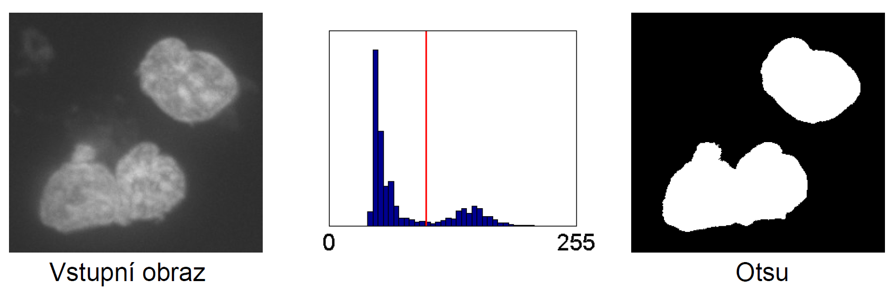

  Při velkém šumu je problém s analýzou i segmentací

- **Gradientní prahování**\
  Práh počítaný jako vážený průměr intenzit, kde váhy odpovídají normalizované velikosti gradientu. Vychází z předpokladu, že gradient má velkou velikost
  v místech výskytu hran => vyšší váha.

  ```math
  a_{th} = \sum_{u,v} I(u,v) \cdot \frac{|\nabla I(u,v)|}{\sum_{i,j} |\nabla I(i,j)|}
  ```

- **Unimodální histogram**\
  Pro obrazy, kde je viditelné jediné výrazné maximum (pro pixely pozadí). Použijeme Trojúhelníkovou metodu:;

  ```math
  \begin{aligned}
  M &\equiv [m, h(m)] &\text{ globální maximum histogramu}\\
  N &\equiv [n, h(n)] &\text{ kde } n \text{ je hodnota intenzity s nenulovou četností nejdál od } m\\
  T &\equiv [t, h(t)] &\text{ bod s největší vzdáleností od přímky } MN
  \end{aligned}
  ```

  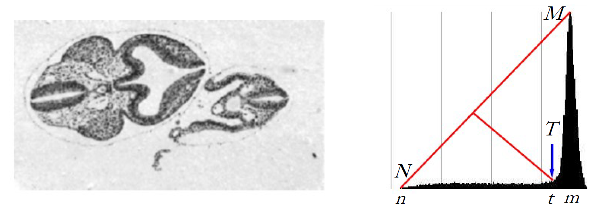

- **Hysterézní prahování**\
  Používá dva prahy: _nízký_ a _vysoký_. S pixely mezi nimi zachází _vcelku inteligentně_.

  - Pixely s hodnotou **vyšší** než _vysoký práh_ jsou označeny jako popředí.
  - Pixely s hodnotou **vyšší** než _nízký práh_ jsou oznaženy jako popředí, pokud obsahují alespoň jeden pixel získaný vysokým prahem.
  - Všechny ostatní pixely jsou označeny jako pozadí.

  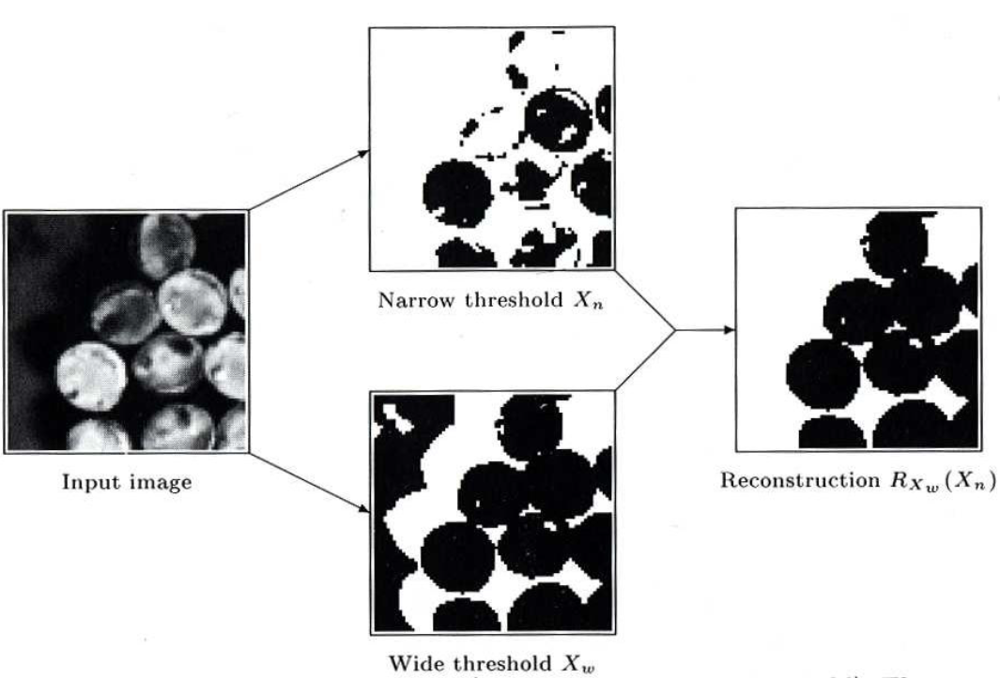

- **Víceúrovňové prahování**\
  Pokud je obraz jednoduchá, pak histogram obsahuje více vysokých vrcholů s údolím mezi nimi. Práh lze potom snadno zvolit jako dno těchto údolí.

#### Lokální (adaptivní) prahování

Práh se mění podle pozice v obraze. Třeba podle průměru intenzit v okolí.

### Algoritmus záplava (watershed)

Přístup k segmentaci obrazu z matematické morfologie, který kombinuje segmentaci pomocí narůstání oblastí a segmentaci založenou na hranách.

Detaily jsou popsány dále v textu.

## Popis objektů

Popis objektů je proces, při kterém se počítají vlastnosti segmentovaných objektů. Tyto vlastnosti jsou později použity pro klasifikaci objektů nebo hledání podobných objektů v databázi (třeba pro _face recognition_).

- **Popisovač / descriptor**\
  Funkce, která přiřazuje oblasti obrazu -- objektu -- popis vlastnosti.

  - Preferujeme deskriptory, které jsou invariantní vzhledem k posunu, rotaci, změně měřítka, změně osvětlení, atd.
  - Existují standardizované sady deskriptorů, např. MPEG-7.

  Descriptory dělíme na:

  - _Globální_: popisují celý obraz.
  - _Lokální_: extrahují zajímavý rysy z malé části obrazu.
    - Třeba rohy, lokální struktury, atd.
    - Není potřeba segmentace.
  - _Objektové_: popisují objekt.
    - Třeba barva, textura, tvar, atd.
    - Potřebujeme segmentaci.

- **Číselné charakteristiky intentizity**\
  Průměr, rozptyl, medián, kvantily, maximum, atd. přes intenzity pixelů objektu.
- **Velikost / plocha**\
  Počet pixelů objektu.
- **Obvod**\
  Počet hraničních pixelů objektu.
- **Topologické vlastnosti**\
  Vlastnosti objektu nezávislé na jeho deformaci. Např. počet děr.

  **❗ IMPORTANT**\
   Pro topologické vlastnosti viz otázka [3D modelování a datové struktury](../3d-modelovani-a-datove-struktury/).

- **Ohraničující obdélník / bounding box**\
  Nejmenší obdélník ohraničující objekt.

  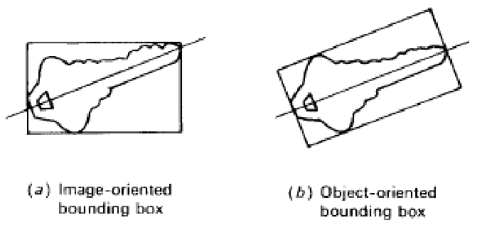

- **Průměr / diameter**\
  Velikost objektu. Dá se odhadnout z bounding boxu.

  - _Feretův průměr_: délka projekce do daného směru.

    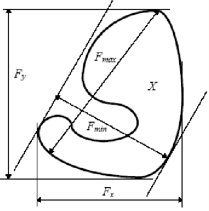

- **Kruhovost / circularity**\
  Jak moc je objekt podobný kruhu?

  ```math
  \text{circularity} = 4 \cdot \pi \cdot \text{area} / (\text{perimeter} \cdot \text{perimeter})
  ```

- **Konvexní obal / convex hull**\
  Nejmenší konvexní polygon ohraničující objekt.
- **Hranice / boundary**\
  Popisuje okraj objektu. Obvykle je zakódovaná jako posloupnost bodů.
- **Geometrický střed / centroid**\
  Průměr souřadnic pixelů objektu.
- **Těžiště / hmotný střed / center of mass**\
  Vážený průměr souřadnic pixelů objektu. Váhy jsou intenzity pixelů. Pokud je objekt homogenní, je těžiště totožné s geometrickým středem.
- **Momenty / moments**\
  Popisují tvar objektu. Používájí se ale i pro popis pravděpodobnostních rozdělení.

  Moment se obecně řídí vzorcem $m_{pq}(R) = \sum_{(u,v) \in R} I(u,v) \cdot u^p v^q$, kde $I(u,v)$ je intenzita pixelu na pozici $(u,v)$ a $R$ je oblast objektu.

  Vidíme, že obsah odpovídá $m_{00}$ a geometrický střed (=těžiště) $(m_{10}/m_{00}, m_{01}/m_{00})$.

  Můžeme využít **centrální momenty**, které jsou posunuté do těžiště objektu $m_{pq}(R) = \sum_{(u,v) \in R} I(u,v) \cdot (u - \hat{x})^p \cdot (v - \hat{y})^q$

  - _První moment_: střední hodnota / hmotný střed.
  - _Druhý moment_: rozptyl / moment setrvačnosti.

- **Moment setrvačnosti / moment of inertia**\
  Míra setrvačnosti při otáčení kolem těžiště. Popisuje rozložení hmoty okolo těžiště (_odchylku_ od něj v jistém smyslu). Umožňuje určit směr nejdůležitější osy objektu. [image-moment](#image-moment)

  Provazochodci využívají moment setrvačnosti při chůzi po laně.

  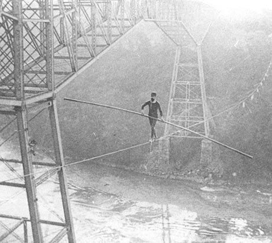

**💡 TIP**\
"Moment" nereferuje na čas, ale spíš na svůj starý význam "důležitost". Ve fyzice navíc obvykle souvisí s otáčivým pohybem. [moment](#moment)

- **Prostorová orientace / spatial orientation**\
  Směr a velikost delší strany nejmenšího bounding boxu. Lze ji také spočítat pomocí momentů setrvačnosti.
- **Podlouhlost / elongatedness / eccentricity**\
  Poměr mezi délkou a šířkou objektu. Dá se spočítat pomocí momentů setrvačnosti.
- **Matice součásného výskytu / co-occurrence matrix**\
  Matice, která popisuje, jak často se vyskytují dvojice pixelů s danými intenzitami v dané vzdálenosti a směru. Používá se pro popis textury.
- **Lokální binární vzory / local binary patterns**\
  Popisují texturu. Základní myšlenka spočívá v nahrazení pixelu 8-bitovým číslem, které udává výsledek porovnání dané hodnoty s hodnotami v osmi-okolí. Je invariantní vůči jasu a byl rozšířen i na rotační nezávislost.

  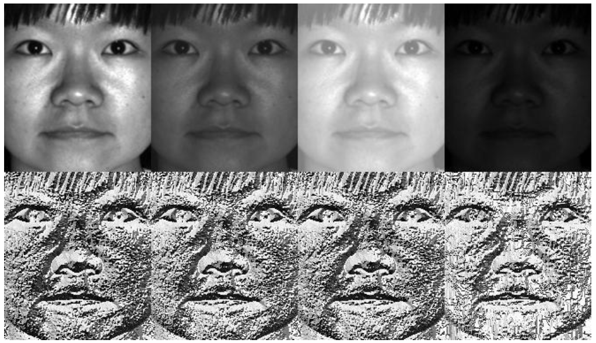

## Klasifikace objektů

Problém zařazení objektů do jedné z předem daných tříd.

**❗ IMPORTANT**\
Detaily přístupů řešení klasifikace lze nalézt v otázce [Strojové učení](../strojove-uceni/).

- **Konstrukce formálního popisu / známý algoritmus**\
  Pokud lze napsat formální popis tříd, lze klasifikátor realizovat přímo pomocí programu.

  Takový formální popis může mít podobu např. konečného automatu, gramatiky, predikátových formulí, atd.

- **Učení pod dohledem / supervised learning**\
  Program se nejprve vytrénuje na už oklasifikované množině dat. Poté se použije na nová data. Patří sem např.:

  - Neuronové sítě.
  - Support vector machines.

- **Učení bez dohledu / unsupervised learning**\
  Program se sám naučí rozpoznávat třídy. Patří sem např.:

  - Hierarchické shlukování.
  - K-means clustering.
  - Self-organizing maps.

- **Hierarchické shlukování / hierarchical clustering**\
  Shlukuje objekty podle konektivity.

  1. Každý objekt je jeden shluk.
  2. Opakovaně spojujeme dva nejbližší shluky.

  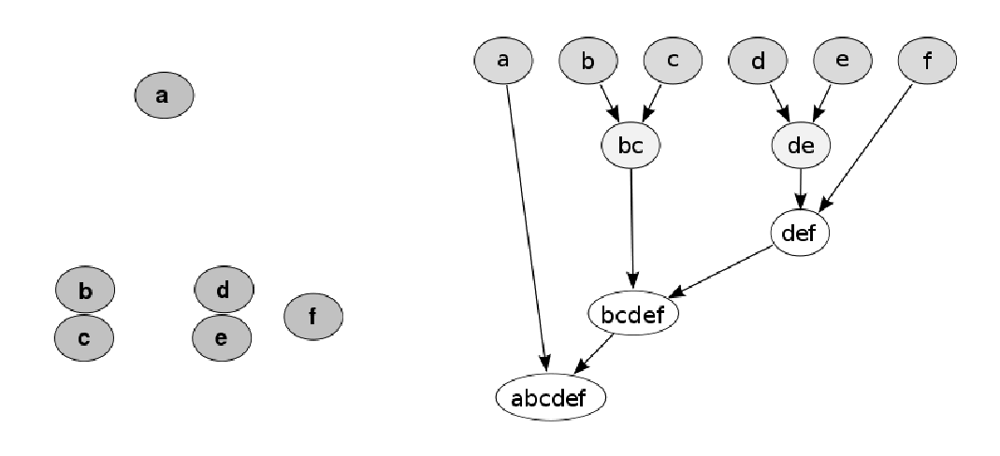

- **K-means clustering**\
  Shlukuje objekty podle těžišť. Počet shluků je pevně stanovený na $k$.

  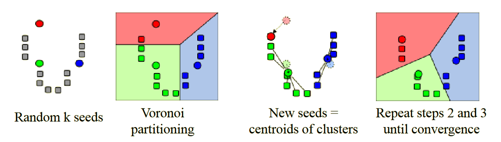

### Kvalita klasifikace

- **Typ výsledku**

  - _True positive (TP)_: klasifikátor říká, že objekt do třídy **patří**, a je to tak.
  - _True negative (TN)_: klasifikátor říká, že objekt do třídy **nepatří**, a je to tak.
  - _False positive (FP)_: klasifikátor říká, že objekt do třídy **patří**, ale je to **blbost**.
  - _False negative (FN)_: klasifikátor říká, že objekt do třídy **nepatří**, ale je to **blbost**.

  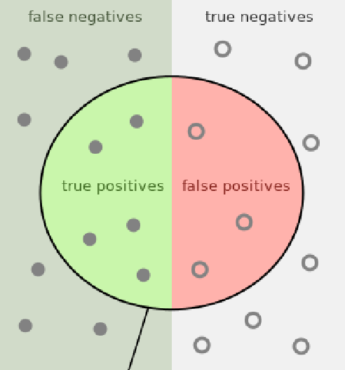

- **Precision**

  ```math
  \frac{TP}{TP + FP}
  ```

- **Sensitivity / recall**

  ```math
  \frac{TP}{TP + FN}
  ```

- **Specificity**

  ```math
  \frac{TN}{TN + FP}
  ```

- **Accuracy**

  ```math
  \frac{TP + TN}{TP + TN + FP + FN}
  ```

- **Ground truth (GT)**\
  Informace o které víme, že je pravdivá. Její získání se liší problém od problému:

  - _Není známa, je dána odborníky._
    - Velmi subjektivní, proto se může zapojit více odborníků. Výsledky jsou sločeny hlasováním.
  - _Je známa, určena z předchozích znalostí._
    - Získavají se z předchozích měření, nebo získané z jiných zdrojů.
    - Standardizované testovací objekty, fantomy lidských orgánů, atd.
  - _Je známa přesně a úplně pro velký soubor dat._
    - Vstupní objekty i jejich obrázky jsou simulovány.
    - Digitální fantomy.

  Pomocí GT lze ověřit:

  - _Výsledky segmentace_
    - GT udává správnou binární masku. Kvalitu segmentačního algoritmu lze měřit pomocí korelačních koeficientů jako je Dice, Jaccard, atd.
  - _Výsledky měření_: plocha, objem, atd.
    - GT udává správné hodnoty měřených parametrů. Chyba je dána rozdílem mezi výsledkem a GT.
  - _Výsledky klasifikace_
    - GT udává správné třídy. Kvalitu určujeme na základě poměrů TP, TN, FP, FN.
  - _Statistické výsledky_
    - GT udává míru výskytu (v procentech) pro každou třídu. Přesnost měříme srovnáním s GT.

## Mapa vzdáleností

Mapování, které každému pixelu popředí přiřazuje vzdálenost k nejbližšímu pixelu pozadí. Používá se třeba pro:

- Oddělení dotýkajících se objektů.
- Výpočet morfologických operátorů.
- Výpočet geometrických reprezentací a měr: kostra, Voroného diagram, osy souměrnosti, atd.
- Navigace robotů.
- Porovnávání vzorů.

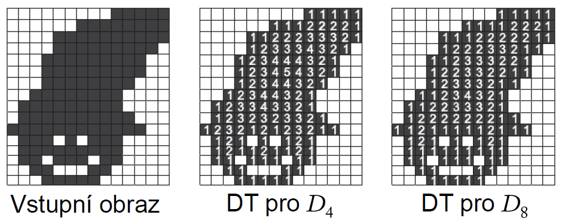

- **Metriky vzdálenosti**

  - Euklidovská $\textcolor{red}{D_E}$.
  - Taxikářská $\textcolor{blue}{D_4}$.
  - Šachovnicová $\textcolor{green}{D_8}$.

  ```math
  \begin{aligned}
  \textcolor{red}{D_E}(\lbrack x_1, y_1 \rbrack, \lbrack x_2, y_2 \rbrack ) &= \sqrt{(x_2 - x_1)^2 + (y_2 - y_1)^2} \\
  \textcolor{blue}{D_4}(\lbrack x_1, y_1 \rbrack, \lbrack x_2, y_2 \rbrack ) &= |x_2-x_1| + |y_2-y_1| \\
  \textcolor{green}{D_8}(\lbrack x_1, y_1 \rbrack, \lbrack x_2, y_2 \rbrack ) &= \max(|x_2-x_1|, |y_2-y_1|)
  \end{aligned}
  ```

  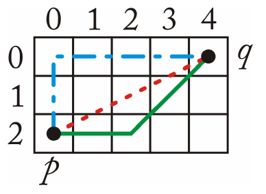

## Matematická morfologie

Teorie a techniky pro analýzu geometrických struktur. Jsou založené na teorii množin, topologii, atd. Nejčastěji se aplikuje na digitální binární obrazy, ale dá se použít na grafy, meshe, apod. [morphology](#morphology)

- **Binární obraz**\
  Dá se vnímat jako funkce $I: \Omega \rightarrow \{0, 1\}$, kde $\Omega \sub \mathbb{Z}^2$.

  Ale taky to je množina $F = \{ (x, y) | I(x, y) = 1 \}$

### Základní operátory

Pracují na každém pixelu a jeho okolí -- strukturním elementu.

- **Strukturní element / structuring element (SE)**\
  Množina souřadnic, pomocí které je obraz zpracováván. [pb130](#pb130)

  - Má definovaný _počátek_ -- $(0, 0)$. Schematicky se značí křížkem.
  - Aktuálně uvažovaná souřadnice do něj nemusí patřit.

  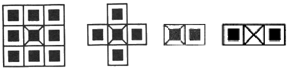

- **Posunutí množiny**\
  Nechť $F$ je množina souřadnic. Posunutí $F$ o vektor $b$ je množina:

  ```math
  F_b = \{ s | s = s' + b, s' \in F \}
  ```

- **Zrcadlení SE**\
  Překlopení souřadnic podle počátku.

  ```math
  \breve{B} = \{ (-x, -y) | (x, y) \in B \}
  ```

- **Eroze**

  > **Vejde se celý** SE do obrazu na dané pozici? Pokud ano, ulož pozici.

  Množina bodů takových, že SE posunutý tak, aby počátek odpovídal danému bodu, musí **celý patřit** do vyšetřované množiny.

  ```math
  \Large
  \varepsilon_B (X) = \{ x | B_x \subseteq X \}
  ```

  kde $B$ je SE a $X$ je vyšetřovaná množina / obraz.

  _"Hloupý" algoritmus_: hledání minima v okolí daném SE.

  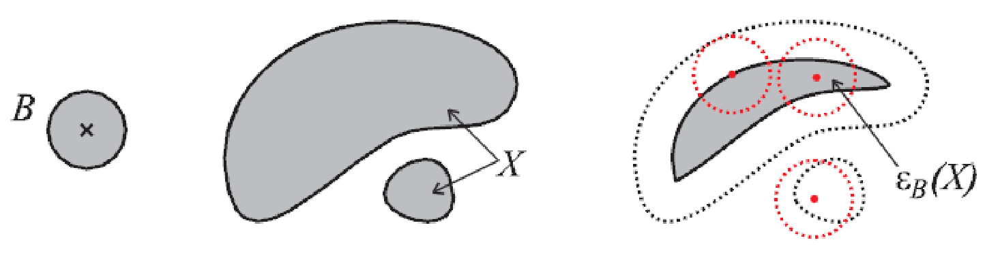

- **Dilatace**

  > **Zasáhne** SE vyšetřovanou množinu při umístění na dané pozici? Pokud ano, ulož pozici.

  Množina bodů takových, že SE posunutý tak, aby počátek odpovídal danému bodu, **aspoň částečně zasáhne** vyšetřovanou množinu.

  ```math
  \Large
  \delta_B (X) = \{ x | B_x \cap X \neq \emptyset \}
  ```

  kde $B$ je SE a $X$ je vyšetřovaná množina / obraz.

  _"Hloupý" algoritmus_: hledání maxima v okolí daném SE.

  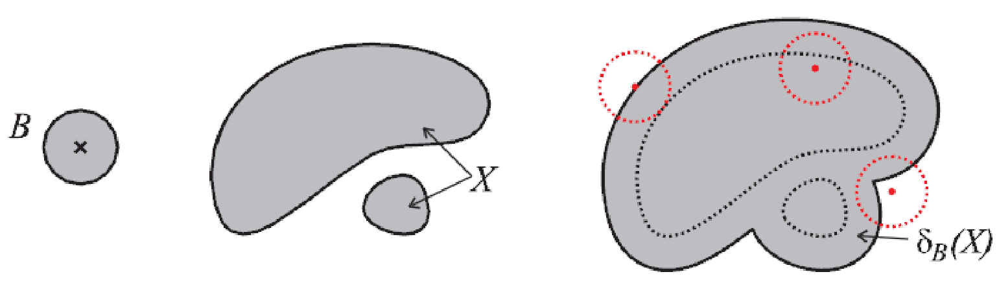

- **Otevření / opening**

  > **Vejde se celý SE** do vyšetřované množiny na dané pozici? Pokud ano, tak jej **celý ulož** na tuto pozici.

  Snaha o obnovu obrazu po jeho erozi. Je to eroze a pak dilatace s překlopeným SE.

  - Nezávisí na počátku SE.
  - Odstraňuje jednotlivá lokální maxima, tenké čáry a rozděluje objekty spojené úzkou cestou.

  ```math
  \Large
  \begin{aligned}

  \gamma_B (X) &= \delta_{\breve{B}} (\varepsilon_B (X)) \\
  \gamma_B (X) &= \{ B_x | B_x \sube X, x \in X \} \\

  \end{aligned}
  ```

  kde $B$ je SE a $X$ je vyšetřovaná množina / obraz.

  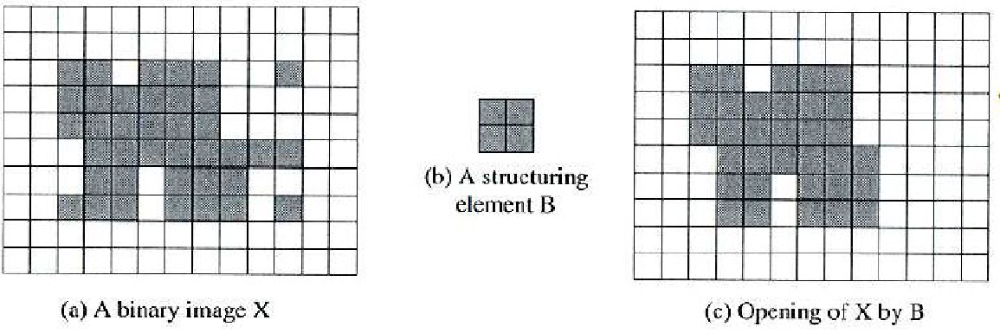

- **Uzavření / closing**

  > **Vejde se SE do pozadí** vyšetřované množiny? Pokud ano, tak jej **celý ulož** do komplementu výsledku.

  Snaha o obnovu obrazu po jeho dilataci. Je to dilatace a pak eroze s překlopeným SE.

  - Nezávisí na počátku SE.
  - Spojuje husté aglomerace lokálních maxim dohromady, vyplňuje malé dírky a vyhlazuje hranice.

  ```math
  \Large
  \begin{aligned}

  \theta_B (X) &= \varepsilon_{\breve{B}} (\delta_B (X)) \\
  \theta_B (X) &= \left\lbrack \bigcup_{x \in X} B_x \sube X^c \right\rbrack^c

  \end{aligned}
  ```

  kde $B$ je SE a $X$ je vyšetřovaná množina / obraz.

  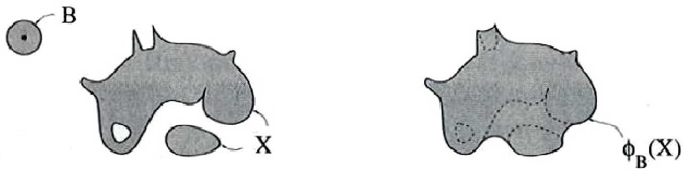

### Pokročilejší-ish operace

- **Hit-or-miss**\
  Mějme SE složený ze dvou disjunktních množin. Jedna z nich odpovídá pozadí, druhá objektu / popředí.

  ```math
  \Large
  B = (B_\text{fg}, B_\text{bg}), B_\text{fg} \cap B_\text{bg} = \emptyset
  ```

  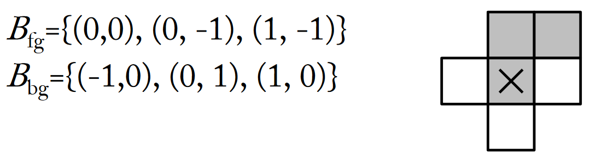

  > **Vejde se první část SE** do vyšetřované množiny na dané pozici a současně **druhá část SE** ji zcela **mine**? Pokud ano, tak ulož tuto pozici

  ```math
  \Large

  \text{HMT}_B(X) = \{ x | (B_\text{fg})_s \sube X, (B_\text{bg})_s \sube X^c \}
  ```

  Používá se k:

  - Nalezení instancí konkrétní konfigure pixelů. Například _izolovaných_ pixelů, které jen tak chillují uprostřed ničeho.
  - _Vytváření kostry / skeletonizing_: body kosty mají stejnou vzdálenost od hranice objektu.
  - _Ztenčování / thinning_: převod objektů bez děr na čáry; objektů s dírami na uzavřené smyčky.
  - _Scvrkávání / shrinking_: převod objektů bez děr na izolované body poblíž jejich těžiště; objektů s dírami na uzavřené smyčky.

  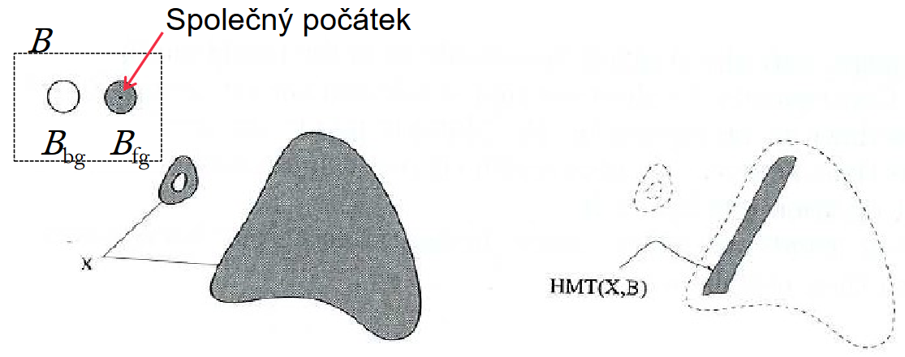

- **Top-hat transformace**\
  Morfologické transformace obrazu užitečné např. pro korekci nerovnoměrného osvětlení.

  - _Bílý top-hat_: rozdíl mezi vstupním obrazem a jeho otevřením.
    - Extrahuje světlé skvrny (lokální maxima) nezávisle na jejich intenzitě, bere v úvahu pouze tvar.
  - _Černý top-hat_: rozdíl mezi uzavřením a vstupním obrazem.
    - Extrahuje tmavé skvrny (lokální minima) nezávisle na jejich intenzitě, bere v úvahu pouze tvar.

  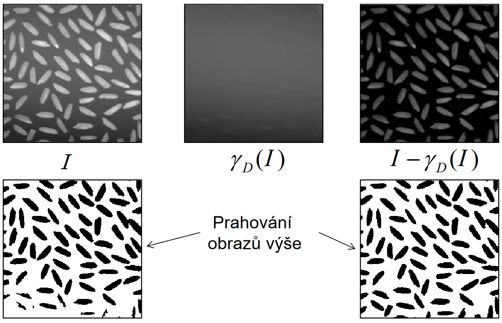

- **Watershed**\
  Algoritmický přístup k segmentaci skrze matematickou morfologii. Kombinuje segmentaci _narůstáním oblastí_ a _detekcí hran_. [pb130](#pb130)

  - Simulace zvyšování hladiny vody krok za krokem.
  - Obraz vnímán jako topografický povrch. Ve všech lokálních minimech je "udělána díra" odkud stoupá hladina vody.
  - Postupně zvyšujeme hladinu za vzniku _bazénů / catchment basins_.
  - Když už by se měly dva bazény spojit, zabráníme tomu postavením hrází.
  - Hráze tvoří _čáry rozvodí / watershed lines_.

  Postup:

  1. Vyhlaď obrázek např. pomocí Gaussova filtru.
  2. Zjisti maximální a minimální intenzitu obrazu: $(a_\text{high}, a_\text{low})$.
  3. Urči značky pro budoucí objekty (manuálně nebo z lokálních minim).
  4. Inicializuj binární obraz $B$ vynulováním.
  5. Pro $a$ od $a_\text{low}$ do $a_\text{high}$:
     1. Nech narůst oblasti značek, tak aby byly do $B$ přidány pixely s intenzitou $\leq a$.
     2. Nedovol spojení oblastí různých značek.
  6. $B$ nyní definuje oblasti objektů. Počet objektů je roven počtu značek.

  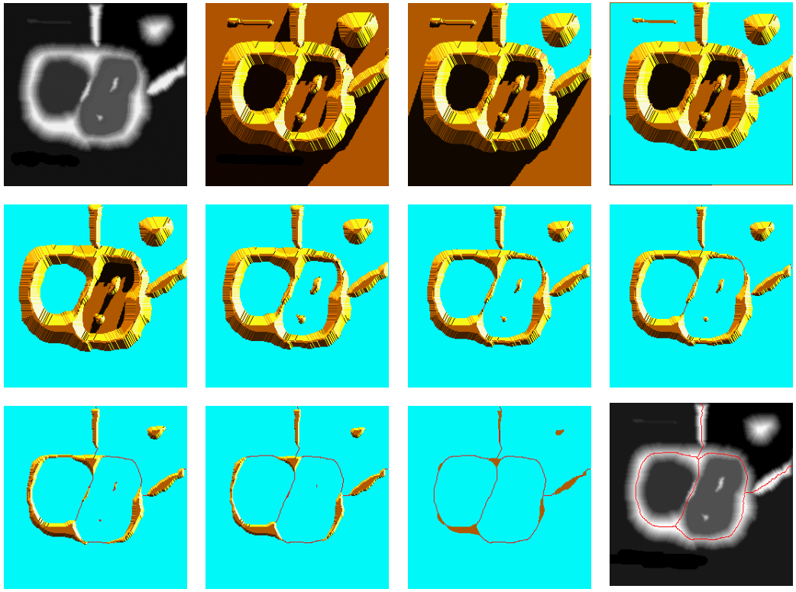

## Zdroje

- [[[pb130,1]]] [PB130 Úvod do digitálního zpracování obrazu (podzim 2022)](https://is.muni.cz/auth/el/fi/podzim2022/PB130/)
- [[[pv131,2]]] [PV131 Digitální zpracování obrazu (jaro 2023)](https://is.muni.cz/auth/el/fi/jaro2023/PV131/)
- [[[image-moment,3]]] [Wikipedia: Image moment](https://en.wikipedia.org/wiki/Image_moment)
- [[[moment, 4]]] [Wikipedia: Moment (mathematics)](<https://en.wikipedia.org/wiki/Moment_(mathematics)>)
- [[[morphology, 5]]] [Wikipedia: Mathematical morphology](https://en.wikipedia.org/wiki/Mathematical_morphology)

## Další zdroje

- Haralick, Shapiro: Image segmentation techniques
- [Zhang, Fritts, Goldman: Image segmentation evaluation: A survey of unsupervised methods](https://www.sciencedirect.com/science/article/pii/S1077314207001294#bib46)
- [What is the reasoning behind using "moment" in the "moment of inertia"?](https://hsm.stackexchange.com/questions/11433/what-is-the-reasoning-behind-using-moment-in-the-moment-of-inertia)
