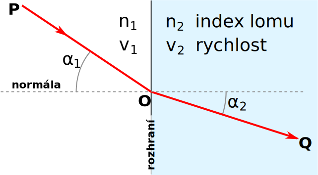
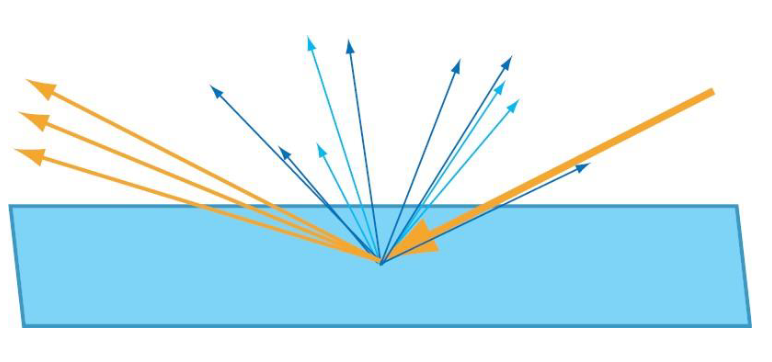
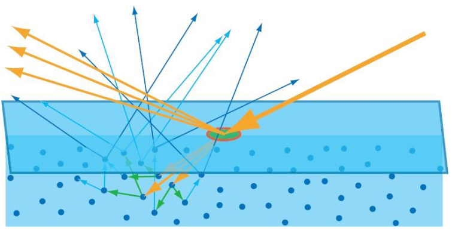
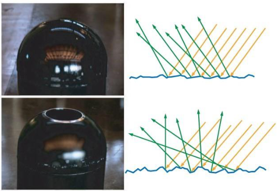
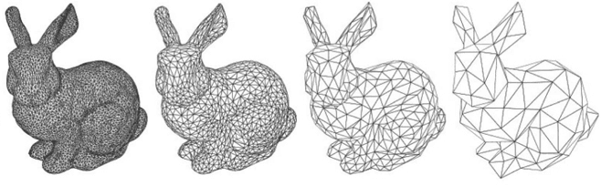
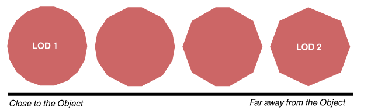
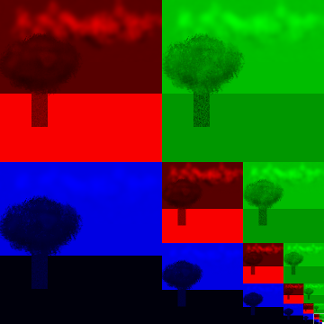
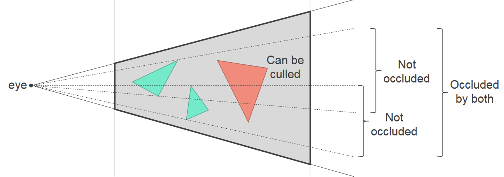
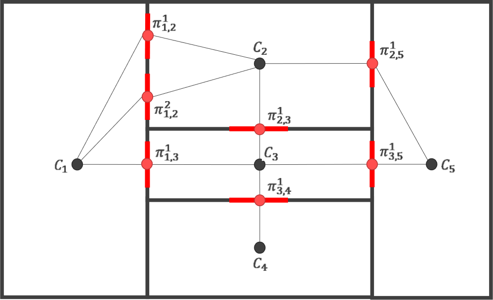
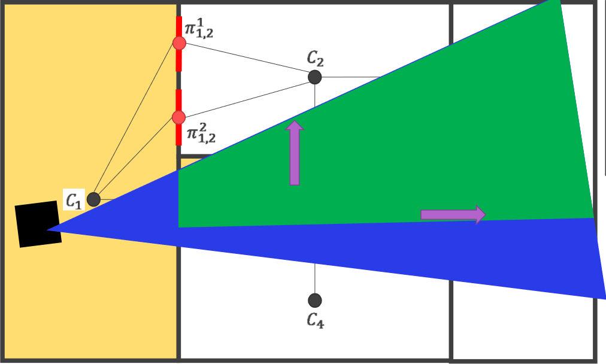

<dl><dt><strong>📌 NOTE</strong></dt><dd>

Příprava a vývoj scény (grayboxing, zástupné modely (placeholders)). Lokální a globální modely nasvícení. Vykreslování založené na fyzikálních modelech (PBR). Techniky optimalizace výkonu vykreslování (úrovně detailů, řešení viditelnosti objektů (culling), MIP mapy).

_PB009, PA010, PA213, PV255_

</dd></dl>

## Příprava a vývoj scény

**📌 NOTE**\
Poznámky o grayboxingu, iterování, modulárním workflow, atd. jsou z přednášky Lukáše Medka v rámci PV255. [medek](#medek)

- **Iterace**\
  Práce v iteracích pomáhá:

  - udržet konzistenci,
  - mít přehled o objemu práce,
  - průběžně přídávat obsah a
  - šetřit čas.

- **Základní workflow**
  1. Modelování high-poly a low-poly modelů
  2. Unwrap
  3. Tvorba textur a materiálů
  4. Vypečení map (normály, bump, atd.)
  5. Aplikace shaderu v engine
  6. Optimalizace
- **Grayboxing**
  - Rychlý nástřel modelu / scény / prostředí.
  - Obrovská časová úspora při tvorbě assetů. Místo jejich finální podoby se používají placeholdery (obvykle šedé krabice).
  - Umožňuje implementovat mechaniky bez nutnosti čekat na assety.
  - Limituje odpad -- nevyužité assety -- při změnách nebo škrtech.
- **Modulární workflow**\
  Využití malého množství assetů pro vytvoření rozsáhlého prostředí. Nutná promyšlená preprodukce. [modular](#modular)
- **Modulární textury**\
  Textury aplikovatelné na více modelů. Je potřeba na všechna využití myslet při vytváření textury.
- **Placeholders**\
  Zjednodušené / low-poly / koupené / kradené modely nebo šedé / oranžové / libovolné krabice, které jsou v pohodě pro prototyping, ale neměly by být ve finální hře.

## Modely nasvícení (illumination models)

- **Lokální osvětlení (local illumination) / direct lighting**\
  Berou v úvahu jen světlo, které dopadá přímo na daný bod/objekt. Neřeší okolní objekty, ani nepřímé osvětlení. Je založený na empirických znalostech o chování světla, spíš než simulaci fyzikálních zákonů.

  Patří sem Blinn-Phong, pomineme-li jeho ambientní složku.

- **Globální osvětlení (global illumination)**\
  Řeší nejen přímé osvětlení, ale i odrazy, lomy, průhlednost, stíny, atd.
- **Ambient illumination**\
  Aproximace globálního osvětlení pomocí konstantní ambientní barvy.
- **Ray tracing**\
  Metoda, kdy simulujeme paprsky světla vycházející ze zdroje světla a dopadající na scénu. Používá se jak k lokální tak globální iluminaci. Počítáme však jen to, co vidí kamera, jelikož posíláme paprsky skrze pixely. Pokud se kamera pohne, musíme znovu paprsky zpravidla počítat znovu.
- **Radiosity (metoda osvětlení)**\
  Metoda, kdy scénu rozdělíme na segmenty a simulujeme "přelévání" světla mezi segmenty. Je vypočetně náročné, ale nezávisí na pozici a směru kamery.

## Physically based rendering (PBR)

Physically based rendering (PBR) je způsob renderování, který se snaží co nejvíce aproximovat realitu pomocí fyzikálních modelů světla, stínů, materiálů, očí, atd. [pv227-2022](#pv227-2022) Aproximuje efekty jako absorpci světla nebo jeho rozptyl pod povrchem objektů.

- **Absorption and scattering / absorpce a rozptyl**\
  Materiály mohou světlo buď absorbovat (v takovém případě jsou alespoň částěčně průhledné) nebo odrážet a rozptylovat (objekty jsou matné). Většina materiálů kombinuje oba efekty. Světlo se může rozpylovat i pod povrchem (subsurface scattering).
- **Reflection / odraz světla**\
  V nejjednodušším případě se úhel odrazu rovná úhlu dopadu. V realitě úhel odrazu však záleží na mnoha faktorech jako je i vlnová délka světla. Toto chování popisují Fresnelovy rovnice. Znamená to, že odraz má barvu. V praxi používáme Schlickovu aproximaci:

  ```math
  F_\text{Schlick}(F_0, L, N) = F_0 + (1 - F_0) \cdot (1 - L \cdot N)^5
  ```

  kde:

  - $F_0$ je Fresnelův odraz při úhlu 0 (dá se dohledat pro daný materiál),
  - $L$ je vektor směru světla,
  - $N$ je vektor normály povrchu.

  **Z určitého úhlu se povrchy, které normálně světlo odráží špatně, jeví jako zrcadla ([tanakawho](https://commons.wikimedia.org/w/index.php?curid=2138545))**

  

- **Refraction / lom světla**\
  Kovy světlo absorbují, v homogenních materiálech (např. sklo) pokračuje v jiném směru, a v heterogenních materiálech (např. kůži) se světlo rozptýlí a pak absorbuje. Lom světla popisuje Snellův zákon:

  ```math
  \frac{\sin \alpha_1}{\sin \alpha_2} = \frac{v_1}{v_2} = \frac{n_2}{n_1}
  ```

  kde:

  - $\alpha_1$ je úhel dopadu (angle of incidence),
  - $\alpha_2$ je úhel lomu (angle of refraction),
  - $v_1$ je rychlost šíření vlnění ve vnějším prostředí,
  - $v_2$ je rychlost šíření vlnění v prostředí objektu,
  - $n_1$ je index lomu vnějšího prostředí,
  - $n_2$ je index lomu prostředí objektu.

    

- **Diffuse lighting**\
  Když všechno (neabsorbované) světlo opustí objekt ze stejného místa, kam dopadlo.

  

- **Subsurface scattering**\
  Když neabsorbované světlo opustí objekt z jiného místa, než kam dopadlo.

  

- **Microfacets / mikro-plošky**\
  Ne všechny objekty jsou ploché. Většina má nerovnosti, které jsou menší než pixel, ale větší než vlnová délka dopadajícího světla, proto je modelujeme nějakou pravděpodobností distribucí (např. Gaussovou).

  

  Existuje řada modelů chování microfacet, např. Cook-Torrance, Oren-Nayar, Ashnikmin-Shirley, Normalized Blinn-Phong, atd.

- **Geometrická atenuace**\
  Postupná ztráta "intenzity" paprsku v důsledku geometrie objektu.

  - **Shadowing** -- facety zastiňují jiné facety.
  - **Masking** -- facet nejde vidět, protože ho zastiňuje jiný facet.
  - **Interreflection** -- světlo se odráží mezi facety, než je odraženo zpátky ke kameře.

### Fyzikální věličiny radiometrie

- **Radiant energy / energie záření (Q)**\
  "Energy per one photon."

  Jednotka: Joule (J)

- **Radiant flux, radiant power / zářivý tok ($\Phi$)**\
  "Energy per second." Bezva na popisování síly světel jako jsou žárovky, plošná světla, atd.

  ```math
  \Phi = \frac{\partial Q}{\partial t}
  ```

  Jednotka: Watt (W) = J/s

- **Irradiance / ozářenost, ozáření (E)**\
  "Flux through area." Světlo dopadající na jednotku plochy. Kvadraticky se zmenšuje s rostoucí vzdáleností od zdroje. Bezva na popis vzdálených zdrojů jako je slunce.

  ```math
  E = \frac{\partial \Phi}{\partial A}
  ```

  Jednotka: Watt per square meter ($\frac{W}{m^2}$)

- **Radiosity / radiozita (radiometrická veličina) (J)**\
  Jako irradiance, ale je to světlo _vycházející_ z jednotky plochy.
- **Radiance / zář (L)**\
  "Flux through a cone of directions from an area." a nebo "Flux through an area from a cone of directions." Nezmenšuje se se zvětšující se vzdáleností od zdroje. Tohle měří senzory.

  ```math
  L = \frac{\partial^2 \Phi}{\partial A_\text{proj} \partial \omega}
  ```

  Jednotka: Watt per square meter per steradian ($\frac{W}{m^2 \cdot sr}$)

### Bidirectional Reflectance Distribution Function (BRDF)

Funkce popisující poměr mezi dopajícím a odraženým světlem na povrchu objektu.

```math
f(\vec{l}, \vec{v}) = \frac{\partial L_o(\vec{v})}{\partial E_i(\vec{l})}
```

_Povrch je nasvícen ze směru $\vec{l}$ s ozářením $\partial E(\vec{l})$. $\partial(L_o(\vec{v}))$ je odražená zář ve směru $\vec{v}$._

Udává pravděpodobnost, že světlo dopadající na povrch ze směru $\vec{l}$ bude odraženo ve směru $\vec{v}$.

Z pohledu teorie pravděpodobnosti / statistiky to ale není distribuční funkce ale spíš hustota pravděpodobnosti.

BRDF je řešena pomocí ray tracingu, radiosity, nebo nějakým hybridním řešením.

## Optimizalizace výkonu vykreslování

- **Level-of-detail (LOD) / úrovně detailů**\
  Čím větší vzdálenost, tím méně detailů. [pv255-2022](#pv255-2022)

  Pro každý model máme hierarchii modelů s různým počtem polygonů. V závislosti na vzdálenosti od pozorovatele vybíráme vhodný LOD.

  

  Dají se vytvořit _manuálně_ i _automaticky_ (pomocí algoritmů pro mesh reduction / decimation).

- **Diskrétní LOD**\
  Existuje fixní počet variant meshe, mezi kterými se přepíná diskrétně. Nevýhodou je "popping" efekt.
- **Continous LOD**\
  Mezi variantami se nepřepíná "ráz naráz", ale postupně tak, že v jeden moment jsou vykresly dva LODy přes sebe a blendovány pomocí alpha kanálu.
- **Geomorphic LOD**\
  Redukuje popping postupnou "proměnnou" jednoho LODu na druhý odebíráním a přidáváním hran. Generuje approximované mezistavy.

  **Geomorphing by [Sirotk](https://commons.wikimedia.org/w/index.php?curid=24515584)**

  

- **Hierarchical LOD**\
  Seskupuje objekty ve scéně do hierarchie a zjednodušuje celé skupiny objektů najednou. Vede k lepšímu výkonu.
- **Texture filtering**\
  Popisuje, jakým způsobem se pixely textury (texely) mapují na pixely obrazovky / daného polygonu. [texture-mapping](#texture-mapping)

  Součástí problému je potřeba odhadnout, jak velkou plochu polygon zabere na obrazovce.

- **Mipmapy**

  > multum in parvo -- mnoho v malém prostoru

  V zásadě LOD na texturách. Z velikosti $\delta$ otexturovaného polygonu je LOD $D = \log_2(\max(\delta, 1))$. Výsledek je získán interpolací mezi LODy $\lfloor D \rfloor$ a $\lceil D \rceil$.

  Mimojiné je to tedy přístup k texture filteringu, kdy aproximujeme velikost polygonu pomocí čtverce daného úrovní mipmapy.

  **Separate color channels of a mipmapped texture by [Phorgan1](https://commons.wikimedia.org/w/index.php?curid=27311755)**

  

  **💡 TIP**\
  Jak je patrné z obrázku výše, chytrým uložením je mipmapovaná textura jen o 33 % větší než původní textura. (Nová má velikost $\frac{4}{3}$ té staré.)

- **Shaderové / GPU optimalizace**\
  Existuje řada nástrojů, které umožňují debugovat a optimalizovat GPU:

  - _V Unity:_ Rendering Statistics, Frame Debugger
  - _nVidia Nsight:_ obecné debuggování GPU
  - _Intel Graphics Performance Analyzers:_ obecné debuggování GPU
  - _RenderDoc:_ debuggování OpenGL, DirectX a Vulkan

- **Object culling / ostřelování objektů**\
  Nalézání podmnožiny objektů ve scéně, která může být vynechána, aniž by viditelně ovlivnila výsledný obraz. Počítání přesné viditelnosti je příliš náročné, proto se používají aproximace známé jako _potentially visible set_ (PVS). [pa010-2021](#pa010-2021)
- **Back-face culling**\
  Vykreslování pouze předních stran polygonů.
- **View frustum culling**\
  Vykreslování pouze objektů, které jsou v zorném poli kamery.
- **Occlusion culling**\
  Vykreslování pouze objektů, které nejsou zakryty jinými objekty.

  

- **Portal culling**\
  Užitečné, pokud máme statickou scénu, kde jsou některé části viditelné jen z některých jiných částí (např. místnosti v domě). Část dat potřebných pro odstřel tak může být předpočítána.

  
  

- **Obecné zásady**
  - Nevykreslovat co není nutné (zahazovat na CPU, využívat předchozí snímky)
  - LODovat
  - Batching (Unity) -- shlukovat geometrie a vykreslovat naráz
  - Instancing -- vykreslovat vícero instancí stejného objektu naráz
  - Minimalizovat počet materiálů (např. spojováním textur).
  - Vypéct všechni nedynamické (statická světla, stíny, atd.)

## Zdroje

- [[[medek,1]]]: [Lukáš Medek (CBE), Základní postupy při tvorbě assetů a herního vizuálu](++http://decibel.fi.muni.cz/pv255/2018/slides/PV255_-_06_-_Zakladni_postupy_pri_tvorbe_assetu_a_herniho_vizualu.pdf++)
- [[[modular,2]]]: http://wiki.polycount.com/wiki/Modular_environments
- [[[pv227-2022, 3]]] [PV227 GPU Rendering (podzim 2022)](https://is.muni.cz/auth/el/fi/podzim2022/PV227/)
- [[[pv255-2022,4]]] [Chmelík, PV255 Game Development I](https://is.muni.cz/auth/el/fi/podzim2022/PV255/um/)
- [[[texture-mapping, 5]]] [Wikipedia: Texture mapping](https://en.wikipedia.org/wiki/Texture_mapping)
- [[[pa010-2021,6]]] [Byška, Furmanová, Kozlíková, Trtík: PA010 Intermediate Computer Graphics (podzim 2021)](https://is.muni.cz/auth/el/fi/podzim2021/PA010/um/)
