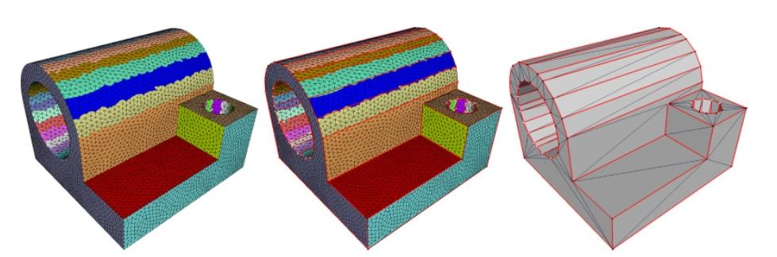
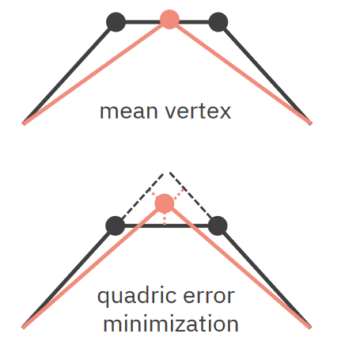
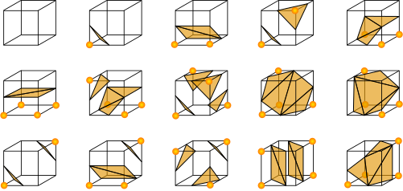
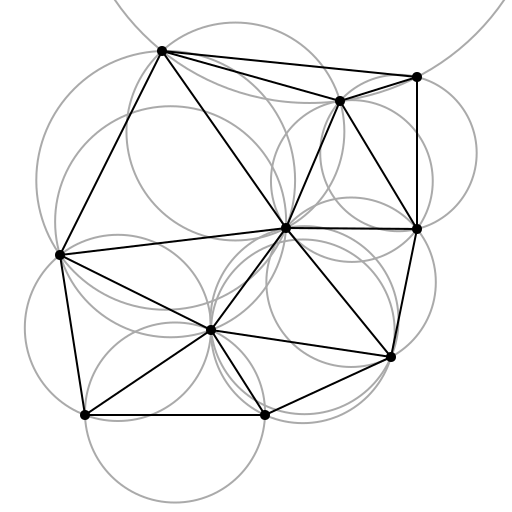

> [!WARNING]
> Tato je stará verze otázky. Nová verze: [Grafické principy ve vývoji her](../VPH01_graficke_principy_ve_vyvoji_her).

> [!NOTE]
> Techniky aproximace objektů. Renderování objemových dat (bodový mrak, techniky rekonstrukce povrchů, přímé renderování objemu). Lokální a globální modely nasvícení. Renderování založené na fyzikálních modelech (PBR). Techniky renderování stínů.
> <br>
> _PA010, PA213_


## Techniky aproximace objektů

3D objekty mohou být definované mnoha miliony polygony či výpočetně náročnými matematickými funkcemi. Pro renderování v reálném čase je tedy žádoucí je zjednodušit a přitom zachovat jejich vzhled -- aproximovat je.

> [!IMPORTANT]
> Aproximace objektů souvisí s collidery, kterým se částečně věnuje otázka [Grafické a fyzikální principy](../vph02_graficke_a_fyzikalni_principy/).

### Redukce počtu polygonů

Slučování polygonů (merging) či odstranění polygonů (culling), které nejsou vidět. [^pa010-2021]

- **Variational Shape Approximation**

  1. Cluster surface elements (e.g. triangles) into $k$ regions.
     - Start with random seed.
     - Apply region growing based on proximity, orientation, etc.
     - Refine seeds (find best representatives) and repeat until regions stabilize.
  2. Fit each region into a proxy (e.g. plane) with minimum error.

     - E.g. by using a weighted average of triangle normals.

       

- **Iterative Decimation -- Edge Collapse Simplification**

  1. Přiřaď každé hraně cenu (třeba quadratic error metric -- suma vzdáleností bodu od rovin)
  2. Zbab se hrany s nejnižší cenou sloučením jejích vrcholů.
  3. Opakuj, dokud nemáš požadovaný počet polygonů.

     

### Implicitní reprezentace

Pokud dokážeme model vyjádřit pomocí matematických funkcí, nemusíme ukládat polygonovou síť. Např. koule je definována jako $x^2 + y^2 + z^2 = r^2$. Šetří prostor, plyne z ní však nutnost výpočtu. Ne všechny modely je možné takto vyjádřit jednoduše.

- **Constructive solid geometry (CSG)**\
  Dokáže reprezentovat komplexní objekty jako kombinace primitiv (krychle, koule, válec, ...). Tyto primitiva jsou následně transformována (posun, rotace, škálování) a kombinována (sjednocení, průnik, rozdíl).

  Šetří místo, ale je náročnější na výpočetní výkon než polygonová síť.

### Zjednodušení vzhledu

Nemusíme zjednodušovat jen povrch/objem modelu, ale i související atributy. Můžeme snížit rozlišení textur, či snížit počet barev v paletě. Pokud používáme PBR, můžeme upravit parametry materiálu nebo použít jednodušší model osvětlení.

### Bounding Volume Hierarchies (BVH)

Hierarchie _bounding volumes_ -- jednoduchých objektů jako jsou kostky, koule, apod. -- které obsahují nějakou část objektu / geometrie scény. Používá se k rychlým průchodům scénou, např. při detekci kolizí, ray tracingu, atd. Svým způsobem jde tím pádem také o aproximaci objektů.

- **Discrete Oriented Polytopes (DOP)**\
  Generaliace bounding boxu. k-DOP je konvexní polytop -- generalizace mnohoúhelníků ve 2D, mnohostěnů ve 3D atd. -- který vzniká průnikem $k$ bounding slabů -- prostorů mezi dvě paralelními rovinami daných osou a vzdáleností mezi rovinami. Použitých os může být více než je dimenze prostoru. Např. 3D scéna může mít 13-DOP.

## Renderování objemových dat

- **Voxel**\
  Voxel je 3D analogií pixelu -- bod v prostoru, který má určitou hodnotu (např. barvu, intenzitu, ...). Voxelová data mohou být získána (např. pomocí CT, MRI, PET, atd.) nebo být také výsledkem simulace (např. simulace proudění tekutin).
- **Objemová data**

  Objemová data jsou definována nejčastěji jako mřížka voxelů.

  Při renderování objemů je třeba vyřešit několik souvisejících problémů s daty:

  - Data s neuniformním vzorkem.
  - Chybějící data.
  - Šum a outlieři.

  Kromě pozic mohou surová data obsahovat také normály, barvy, apod.

### Bodový mrak (point cloud)

Množina bodů v prostoru, které nemají žádnou strukturu. Nejjednodušší přístup k renderování objemu, kdy se nepokoušíme o žádnou rekonstrukci povrchu. Body však mohou mít různé barvy a průhlednost.

### Rekonstrukce povrchu

Ze získaných dat se snažíme vytvořit mesh. Ten lze vyrenderovat tradičním způsobem.

- **Marching cubes**\
  Rozděluje prostor na mřížku voxelů. V každém voxelu se pak vyhodnocuje, zda je povrch objektu překročen. Pokud ano, je třeba přidat triangle mesh pro daný voxel. [^pa010-2020] [^marching-cubes]

  **Marching cubes by [Ryoshoru](https://commons.wikimedia.org/wiki/File:MarchingCubesEdit.svg)**

  

- **Marching tetrahedra**\
  Analogický k marching cubes, ale používá místo krychlí čtyřstěny. Řeší problém s některými nejednoznačnými konfiguracemi v marching cubes, a taky nikdy nebyl patentován (kdežto marching cubes ano). [^marching-tetrahedra]
- **Vertex clustering**\
  Metoda podobná _iterative decimation_ (viz výše), nejprve vytvoříme clustery bodů, poté pro každý vybereme vhodného reprezentanta (např. průměrem, mediánem, quadric error minimization, atd.), pak už jen zbývá mesh "sešít" např. pomocí triangulace. [^pa010-2020]
- **Dual contouring**\
  Z voxelů se stanou vrcholy (tedy využíváme dualního grafu). Tyto vrcholy jsou ale posunuty tak, že povrch může obsahovat jak ostré hrany tak zaoblené plochy. [^dual-contouring]
- **Delaunay triangulation**\
  Vytváří trojúhelníkovou síť, tak že žádný bod se nenáchází ve vepsané kružnici žádného trojúhelníku. Maximalizuje nejmenší úhel trojúhelníků. [^delaunay-triangulation]

  

### Direct volume rendering (přímé renderování objemu)

Nerekonstruujeme povrch, ale mapujeme data na _optické_ vlastnosti jako je barva a průhlednost. Během renderování se pak využívá path tracing, a tyto vlastnosti se akumulují podél jednotlivých paprsků. [^gpugems]

V realitě tohle chování paprsku popisujeme integrály. V počítačové grafice se ale využívá aproximace pomocí sumy.

**The Process of Volume Rendering [^gpugems]**


- **Emmission-absorption model**\
  Paprsek vstupuje do objemu, kde je absorbován a emitován. Výsledná barva je pak výsledkem akumulace těchto vlastností. V notaci používáme: [^pa213]

  - $\kappa$ je funkce absorpce,
  - $q$ je emise.

- **Optická hloubka / optical depth**\
  Bezrozměrná veličina $\tau$, která popisuje, jak moc jde "vidět skrz" něco, třeba plyn. Čím větší, tím méně vidíme.

  Z jiné perspektivy je to akumulovaná absorpce na paprsku. Optická hloubka mezi dvěma body $s_1$ a $s_2$ na paprsku je dána jako:

  ```math
  \tau(s_1, s_2) = \int_{s_1}^{s_2} \kappa(s) ds
  ```

- **Průhlednost / transparency**\
  Průhlednost popisuje, jak dobře vidíme skrz objem. Upadá exponenciálně s růstem optické hloubky.

  Průhlednost mezi dvěma body $s_1$ a $s_2$ na paprsku je dána jako:

  ```math
  \theta(s_1, s_2) = e^{-\tau(s_1, s_2)}
  ```

- **Volume rendering integral**\
  Intenzitu světla $I$ v místě paprsku $s$ počítáme pomocí: [^pa213]

  ```math
  \begin{aligned}

  I(s) &= I(s_0) \cdot \theta(s_0, s) + \int_{s_0}^s q(s') \cdot \theta(s', s) ds' \\

  &= I(s_0) \cdot e^{-\tau(s_0, s)} + \int_{s_0}^s q(s') \cdot e^{-\tau(s', s)} ds'

  \end{aligned}
  ```

  kde:

  - $s_0$ je místo, kde se paprsek dostal dovnitř nějakého světlo-vyzařujícího objemu,
  - $I(s_0)$ je boundary light, tedy světlo na hranici objemu,
  - $q(s')$ je emise v bodě $s'$.

  

- **Back-to-front**\
  Přístup k počítání $I$, kdy paprsky vyhodnocujeme od hranice objemu **dále** od kamery směrem **ke kaměře**.

  Výhoda je, že nemusíme udržovat proměnnou pro průhlednost. Nevyhoda je, že musíme vyhodnotit všechny voxely v cestě paprsku, protože "přepisují" výsledek.

- **Front-to-back**\
  Přístup k počítání $I$, kdy paprsky vyhodnocujeme od hranice objemu **blíže** ke kameře směrem **od kamery**.

  Dá se utnout dřív, když víme jistě, že už je výsledek neprůhledný a tedy už se nic nezmění.

- **Transfer function**\
  Funkce $T$, která mapuje hodnoty voxelů na barvu a průhlednost. Klasifikuje voxely. [^pa213]

## Modely nasvícení (illumination models)

- **Lokální osvětlení (local illumination) / direct lighting**\
  Berou v úvahu jen světlo, které dopadá přímo na daný bod/objekt. Neřeší okolní objekty, ani nepřímé osvětlení. Je založený na empirických znalostech o chování světla, spíš než simulaci fyzikálních zákonů.

  Patří sem Blinn-Phong, pomineme-li jeho ambientní složku.

- **Globální osvětlení (global illumination)**\
  Řeší nejen přímé osvětlení, ale i odrazy, lomy, průhlednost, stíny, atd.
- **Ambient illumination**\
  Aproximace globálního osvětlení pomocí konstantní ambientní barvy.
- **Ray tracing**\
  Metoda, kdy simulujeme paprsky světla vycházející ze zdroje světla a dopadající na scénu. Používá se jak k lokální tak globální iluminaci. Počítáme však jen to, co vidí kamera, jelikož posíláme paprsky skrze pixely. Pokud se kamera pohne, musíme znovu paprsky zpravidla počítat znovu.
- **Radiosity (metoda osvětlení)**\
  Metoda, kdy scénu rozdělíme na segmenty a simulujeme "přelévání" světla mezi segmenty. Je vypočetně náročné, ale nezávisí na pozici a směru kamery.

## Physically based rendering (PBR)

Physically based rendering (PBR) je způsob renderování, který se snaží co nejvíce aproximovat realitu pomocí fyzikálních modelů světla, stínů, materiálů, očí, atd. [^pv227-2022] Aproximuje efekty jako absorpci světla nebo jeho rozptyl pod povrchem objektů.

- **Absorption and scattering / absorpce a rozptyl**\
  Materiály mohou světlo buď absorbovat (v takovém případě jsou alespoň částěčně průhledné) nebo odrážet a rozptylovat (objekty jsou matné). Většina materiálů kombinuje oba efekty. Světlo se může rozpylovat i pod povrchem (subsurface scattering).
- **Reflection / odraz světla**\
  V nejjednodušším případě se úhel odrazu rovná úhlu dopadu. V realitě úhel odrazu však záleží na mnoha faktorech jako je i vlnová délka světla. Toto chování popisují Fresnelovy rovnice. Znamená to, že odraz má barvu. V praxi používáme Schlickovu aproximaci:

  ```math
  F_\text{Schlick}(F_0, L, N) = F_0 + (1 - F_0) \cdot (1 - L \cdot N)^5
  ```

  kde:

  - $F_0$ je Fresnelův odraz při úhlu 0 (dá se dohledat pro daný materiál),
  - $L$ je vektor směru světla,
  - $N$ je vektor normály povrchu.

  **Z určitého úhlu se povrchy, které normálně světlo odráží špatně, jeví jako zrcadla ([tanakawho](https://commons.wikimedia.org/w/index.php?curid=2138545))**

  

- **Refraction / lom světla**\
  Kovy světlo absorbují, v homogenních materiálech (např. sklo) pokračuje v jiném směru, a v heterogenních materiálech (např. kůži) se světlo rozptýlí a pak absorbuje. Lom světla popisuje Snellův zákon:

  ```math
  \frac{\sin \alpha_1}{\sin \alpha_2} = \frac{v_1}{v_2} = \frac{n_2}{n_1}
  ```

  kde:

  - $\alpha_1$ je úhel dopadu (angle of incidence),
  - $\alpha_2$ je úhel lomu (angle of refraction),
  - $v_1$ je rychlost šíření vlnění ve vnějším prostředí,
  - $v_2$ je rychlost šíření vlnění v prostředí objektu,
  - $n_1$ je index lomu vnějšího prostředí,
  - $n_2$ je index lomu prostředí objektu.

    

- **Diffuse lighting**\
  Když všechno (neabsorbované) světlo opustí objekt ze stejného místa, kam dopadlo.

  

- **Subsurface scattering**\
  Když neabsorbované světlo opustí objekt z jiného místa, než kam dopadlo.

  

- **Microfacets / mikro-plošky**\
  Ne všechny objekty jsou ploché. Většina má nerovnosti, které jsou menší než pixel, ale větší než vlnová délka dopadajícího světla, proto je modelujeme nějakou pravděpodobností distribucí (např. Gaussovou).

  

  Existuje řada modelů chování microfacet, např. Cook-Torrance, Oren-Nayar, Ashnikmin-Shirley, Normalized Blinn-Phong, atd.

- **Geometrická atenuace**\
  Postupná ztráta "intenzity" paprsku v důsledku geometrie objektu.

  - **Shadowing** -- facety zastiňují jiné facety.
  - **Masking** -- facet nejde vidět, protože ho zastiňuje jiný facet.
  - **Interreflection** -- světlo se odráží mezi facety, než je odraženo zpátky ke kameře.

### Fyzikální věličiny radiometrie

- **Radiant energy / energie záření (Q)**\
  "Energy per one photon."

  Jednotka: Joule (J)

- **Radiant flux, radiant power / zářivý tok ($\Phi$)**\
  "Energy per second." Bezva na popisování síly světel jako jsou žárovky, plošná světla, atd.

  ```math
  \Phi = \frac{\partial Q}{\partial t}
  ```

  Jednotka: Watt (W) = J/s

- **Irradiance / ozářenost, ozáření (E)**\
  "Flux through area." Světlo dopadající na jednotku plochy. Kvadraticky se zmenšuje s rostoucí vzdáleností od zdroje. Bezva na popis vzdálených zdrojů jako je slunce.

  ```math
  E = \frac{\partial \Phi}{\partial A}
  ```

  Jednotka: Watt per square meter ($\frac{W}{m^2}$)

- **Radiosity / radiozita (radiometrická veličina) (J)**\
  Jako irradiance, ale je to světlo _vycházející_ z jednotky plochy.
- **Radiance / zář (L)**\
  "Flux through a cone of directions from an area." a nebo "Flux through an area from a cone of directions." Nezmenšuje se se zvětšující se vzdáleností od zdroje. Tohle měří senzory.

  ```math
  L = \frac{\partial^2 \Phi}{\partial A_\text{proj} \partial \omega}
  ```

  Jednotka: Watt per square meter per steradian ($\frac{W}{m^2 \cdot sr}$)

### Bidirectional Reflectance Distribution Function (BRDF)

Funkce popisující poměr mezi dopajícím a odraženým světlem na povrchu objektu.

```math
f(\vec{l}, \vec{v}) = \frac{\partial L_o(\vec{v})}{\partial E_i(\vec{l})}
```

_Povrch je nasvícen ze směru $\vec{l}$ s ozářením $\partial E(\vec{l})$. $\partial(L_o(\vec{v}))$ je odražená zář ve směru $\vec{v}$._

Udává pravděpodobnost, že světlo dopadající na povrch ze směru $\vec{l}$ bude odraženo ve směru $\vec{v}$.

Z pohledu teorie pravděpodobnosti / statistiky to ale není distribuční funkce ale spíš hustota pravděpodobnosti.

BRDF je řešena pomocí ray tracingu, radiosity, nebo nějakým hybridním řešením.

## Techniky renderování stínů

Stíny jsou důležité, jelikož:

- zvyšují věrohodnost scény,
- jsou indikátorem vzdálenosti objektů od sebe -- hloubky scény,
- mohou dávat informaci o objektech, které jsou mimo zorné pole kamery nebo ukryté za jinými objekty,
- popisují tvar objektu, na který jsou promítány.

- **Hard shadows / "ostré" stíny**\
  Rozlišují jen, zda je bod osvětlený nebo ne. Neřeší se, jak moc je osvětlený. Týká se bodových světel.

  
  

- **Soft shadows / "měkké" stíny**\
  Rozlišují i částečně osvětlené oblasti. Týká se světel, která mají plochu.

  
  

- **Planar shadows**\
  Vykreslí objekt ještě jednou projektovaný na danou plochu.

  - Použitelné na velké plochy jako je rovná podlaha či stěny.
  - Blinn (1988)
  - Jednoduché a rychlé.
  - Nedá se použít na sebevržené stíny, stíny vržené na jiné objekty, kulaté plochy, atd.

- **Fake shadows and Projective textures**\
  Použitelné pro velice málo velmi velkých dopadových objektů.

  1. Vyrenderuj objekt černobíle z pohledu světla a ulož do textury.
  2. Projektuj tuhle texturu na **každý** objekt, na který má dopadat stín.

- **Shadow maps**\
  Renderuje scénu z pohledu světla, ale ukládá si do textury jen hloubku. Při vykreslování scény z pohledu kamery sampleuje texturu a porovnává vzdálenost od světla s hloubkou v textuře. Pokud je větší, je bod ve stínu.

  

  > [!IMPORTANT]
  > Shadow mapám se důkladně věnuje otázka [Renderování s využitím GPU](../vph07_gpu_rendering/)

- **Shadow volumes**\
  Počítá stíny ve 3D. Shadow volume explicitně popisuje objem prostoru ve stínu nějakého polygonu.

  1. Pro každý shadow caster, vyrob shadow volume.
  2. Pro každý fragment, počítej do kolika objemů paprsek z kamery do fragmentu vstoupí (+1) a z kolika vystoupí (-1). Pokud je výsledek > 0, pak je fragment ve stínu, pokud je 0 tak je osvětlený.

     

     Prakticky se používá Stencil Buffer Algorithm, kdy renderujeme pro každý objekt nejprve front faces a pak back faces. Tenhle přístup je problematický, pokud je kamera ve stínu, ale řešitelný pokud obrátíme pořádí objektů -- jdeme od nekonečna ke kameře (Z-fail, Carmack's reverse).

- **Soft shadows**\
  Existuje množství algoritmů. Například shadow mapy s Percentage Closer Filtering (PCF). Jsou ale výpočetně náročnější než hard shadows.


[^pa010-2021]: Byška, Furmanová, Kozlíková, Trtík: PA010 Intermediate Computer Graphics (podzim 2021)
[^pa010-2020]: Sochor: PA010 Intermediate Computer Graphics (podzim 2020)
[^pa213]: PA213 Advanced Computer Graphics
[^notes-pa010]: [Moje poznámky z PA010 (podzim 2020)](/fi/pa010/)
[^manifold-wiki]: [Wikipedia: Topological manifold](https://en.wikipedia.org/wiki/Topological_manifold)
[^klein-bottle]: [Konrad Polthier: Imaging maths - Inside the Klein bottle ](https://plus.maths.org/content/imaging-maths-inside-klein-bottle)
[^genus]: [Saul Schleimer: Notes on the complex of curves](https://www.researchgate.net/publication/228393582_Notes_on_the_complex_of_curves)
[^gpugems]: [GPU Gems: Volume Rendering Techniques](https://developer.nvidia.com/gpugems/gpugems/part-vi-beyond-triangles/chapter-39-volume-rendering-techniques)
[^marching-cubes]: [Marching cubes: A high resolution 3D surface construction algorithm](https://dl.acm.org/doi/10.1145/37402.37422)
[^marching-tetrahedra]: [Wikipedia: Marching tetrahedra](https://en.wikipedia.org/wiki/Marching_tetrahedra)
[^dual-contouring]: [Dual Contouring Tutorial](https://www.boristhebrave.com/2018/04/15/dual-contouring-tutorial/)
[^delaunay-triangulation]: [Wikipedia: Delaunay triangulation](https://en.wikipedia.org/wiki/Delaunay_triangulation)
[^pv227-2022]: [PV227 GPU Rendering (podzim 2022)](https://is.muni.cz/auth/el/fi/podzim2022/PV227/)

## Další zdroje

- https://pdfs.semanticscholar.org/49a5/5176f4b9c5480621de92551deb2f1566b1c7.pdf
- https://redirect.cs.umbc.edu/~olano/class/435-06-8/illum.pdf
- https://blogs.nvidia.com/blog/2022/08/04/direct-indirect-lighting/
