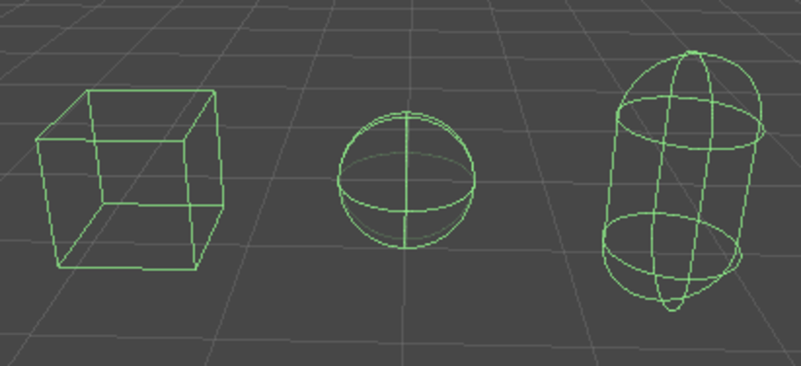

> [!NOTE]
> Typy fyzikálních simulací a jejich využití ve hrách (tuhá tělesa, deformovatelná tělesa, částice). Dynamika tuhých těles (síly, tření). Objekty pro detekci kolizí (“colliders”, typy, limity), kolizní vrstvy. Detekce kolizí (diskrétní a spojitá detekce, obvyklé problémy, využití v herních mechanikách).
>  
> _PV255_

## Fyzikální simulace

- **Rigid body**\
  Aproximace reálného fyzikálního tělesa. Předpokládá uniformní hostotu a **neřeší:**

  - deformace objektu,
  - aerodynamičnost tvaru.

  Nicméně **řeší**:

  - dynamiku (část mechaniky, která se zabývá příčinami pohybu),
  - kolize,
  - klouby.

- **Soft body**\
  Deformovatelný objekt.
- **Fyzikální enginy**
  - PhysX (Nvidia) -- Unity, Unreal Engine.
  - Bullet -- Blender, Paradox engine.
  - Havok
  - Box2D

## Objekty pro detekci kolizí

V principu funguje detekce kolizí tak, že v každém kroku fyzikální simulace: [^pa199-2022]

1. dojde ke kontrole, zda se dva objekty dotýkají -- či mají společný průnik,
2. pokud ano a kolize jsou pro dané objekty povoleny, dojde k výpočtu kolizních dat (normála, hloubka průniku, atd.),
3. ostatní systémy mohou reagovat na kolizi (např. způsobit explozi miny).

- **Fáze**
  1. Broad phase -- hledání kandidátů na kolize
     - Např. pokud se dotýkají AABB nebo jsou objekty v přibližně stejné oblasti.
     - Využívají se struktury pro vyhledávání jako octree, k-D tree, BSP, atd, které je potřeba aktualizovat každé iteraci fyzikální simulace.
  2. Narrow phase -- kontrola zda se kandidáti fakt srazili.
- **Sweep and prune**\
  Algoritmus pro broad phase.
- **Gilbert-Johnson-Keerthi (GJK)**\
  Algoritmus pro narrow phase. Rozhoduje zda dva konvexní tvary mají společný průnik.
- **Primitivní collidery**\
  Výpočty s nimi jsou rychlé.

  - krabice (AABB),
  - koule,
  - kapsle,
  - válec.

    **Primitivní collidery v Unity**

    

- **Mesh collider**\
  Neprimitivní collider objekt. Obvykle konvexní obal nějakého meshe. Vypočetně náročné.
- **Compound collider**\
  Collider složený z vícero primitivních colliderů. Rychlejší než mesh collider. Použitelný i na nekonvexní objekty.
- **Quickhull**\
  Algoritmus pro výpočet konvexního obalu.
- **Statické objekty**\
  Terén, budovy, a podobné nehybné objekty. Nepůsobí na něj fyzikální síly, ale fungují jako collidery. Necollidují však vzájemně. Mívají komplexní tvar.
- **Dynamické objekty**\
  Působí na ně fyzika. Měly by mít jednodušší collidery.
- **Discrete collision detection**\
  Kolize se detekují v každém kroku fyzikální simulace. Výpočetně nenáročné, ale může docházet k "tunelování" objektů skrz jiné objekty.
- **Continous collision detection (CCD)**\
  Kolize se detekují v "průběhu pohybu" objektů -- pomocí supersamplingu, raycastingu, swept spheres, atd. Výpočetně náročné.

[^pa199-2022]: [Chmelík, Trtík, PA199 Advanced Game Development](https://is.muni.cz/auth/el/fi/podzim2022/PA199/um/)
