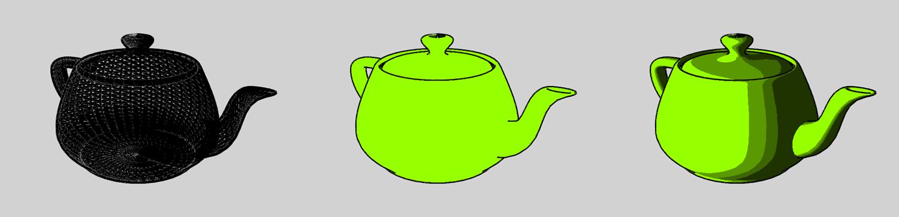
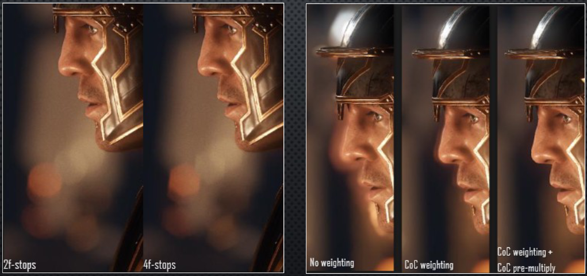
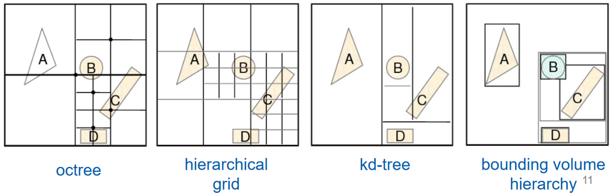
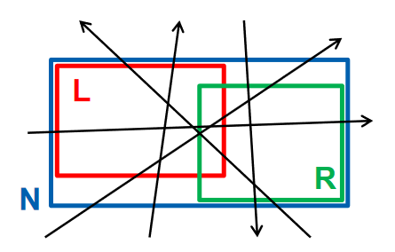
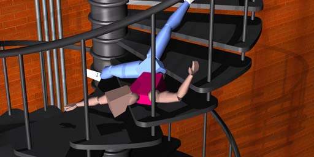

> [!WARNING]
> Tato je stará verze otázky. Nová verze: [Fyzikální principy ve vývoji her](./VPH02_fyzikalni_principy_ve_vyvoji_her.ad).

> [!NOTE]
> Příprava a vývoj scény, grayboxing, zástupné modely (placeholders). Optimalizace výkonu vykreslování (úrovně detailů, odstřelování objektů, MIP mapy). Využití shaderů pro efekty ve hrách. Sledování paprsků, objekty pro detekci kolizí, fyzika hadrové panenky.
> <br>
> _PA010, PA199, PA213, PV255_


## Příprava a vývoj scény

> [!NOTE]
> Poznámky o grayboxingu, iterování, modulárním workflow, atd. jsou z přednášky Lukáše Medka v rámci PV255. [^medek]

- **Iterace**\
  Práce v iteracích pomáhá:

  - udržet konzistenci,
  - mít přehled o objemu práce,
  - průběžně přídávat obsah a
  - šetřit čas.

- **Základní workflow**
  1. Modelování high-poly a low-poly modelů
  2. Unwrap
  3. Tvorba textur a materiálů
  4. Vypečení map (normály, bump, atd.)
  5. Aplikace shaderu v engine
  6. Optimalizace
- **Grayboxing**
  - Rychlý nástřel modelu / scény / prostředí.
  - Obrovská časová úspora při tvorbě assetů. Místo jejich finální podoby se používají placeholdery (obvykle šedé krabice).
  - Umožňuje implementovat mechaniky bez nutnosti čekat na assety.
  - Limituje odpad -- nevyužité assety -- při změnách nebo škrtech.
- **Modulární workflow**\
  Využití malého množství assetů pro vytvoření rozsáhlého prostředí. Nutná promyšlená preprodukce. [^modular]
- **Modulární textury**\
  Textury aplikovatelné na více modelů. Je potřeba na všechna využití myslet při vytváření textury.
- **Placeholders**\
  Zjednodušené / low-poly / koupené / kradené modely nebo šedé / oranžové / libovolné krabice, které jsou v pohodě pro prototyping, ale neměly by být ve finální hře.

## Optimizalizace výkonu vykreslování

- **Level-of-detail (LOD) / úrovně detailů**\
  Čím větší vzdálenost, tím méně detailů. [^pv255-2022]

  Pro každý model máme hierarchii modelů s různým počtem polygonů. V závislosti na vzdálenosti od pozorovatele vybíráme vhodný LOD.

  

  Dají se vytvořit _manuálně_ i _automaticky_ (pomocí algoritmů pro mesh reduction / decimation).

- **Diskrétní LOD**\
  Existuje fixní počet variant meshe, mezi kterými se přepíná diskrétně. Nevýhodou je "popping" efekt.
- **Continous LOD**\
  Mezi variantami se nepřepíná "ráz naráz", ale postupně tak, že v jeden moment jsou vykresly dva LODy přes sebe a blendovány pomocí alpha kanálu.
- **Geomorphic LOD**\
  Redukuje popping postupnou "proměnnou" jednoho LODu na druhý odebíráním a přidáváním hran. Generuje approximované mezistavy.

  **Geomorphing by [Sirotk](https://commons.wikimedia.org/w/index.php?curid=24515584)**

  

- **Hierarchical LOD**\
  Seskupuje objekty ve scéně do hierarchie a zjednodušuje celé skupiny objektů najednou. Vede k lepšímu výkonu.
- **Texture filtering**\
  Popisuje, jakým způsobem se pixely textury (texely) mapují na pixely obrazovky / daného polygonu. [^texture-mapping]

  Součástí problému je potřeba odhadnout, jak velkou plochu polygon zabere na obrazovce.

- **Mipmapy**

  > multum in parvo -- mnoho v malém prostoru

  V zásadě LOD na texturách. Z velikosti $\delta$ otexturovaného polygonu je LOD $D = \log_2(\max(\delta, 1))$. Výsledek je získán interpolací mezi LODy $\lfloor D \rfloor$ a $\lceil D \rceil$.

  Mimojiné je to tedy přístup k texture filteringu, kdy aproximujeme velikost polygonu pomocí čtverce daného úrovní mipmapy.

  **Separate color channels of a mipmapped texture by [Phorgan1](https://commons.wikimedia.org/w/index.php?curid=27311755)**

  

  > [!TIP]
  > Jak je patrné z obrázku výše, chytrým uložením je mipmapovaná textura jen o 33 % větší než původní textura. (Nová má velikost $\frac{4}{3}$ té staré.)

- **Shaderové / GPU optimalizace**\
  Existuje řada nástrojů, které umožňují debugovat a optimalizovat GPU:

  - _V Unity:_ Rendering Statistics, Frame Debugger
  - _nVidia Nsight:_ obecné debuggování GPU
  - _Intel Graphics Performance Analyzers:_ obecné debuggování GPU
  - _RenderDoc:_ debuggování OpenGL, DirectX a Vulkan

- **Object culling / ostřelování objektů**\
  Nalézání podmnožiny objektů ve scéně, která může být vynechána, aniž by viditelně ovlivnila výsledný obraz. Počítání přesné viditelnosti je příliš náročné, proto se používají aproximace známé jako _potentially visible set_ (PVS). [^pa010-2021]
- **Back-face culling**\
  Vykreslování pouze předních stran polygonů.
- **View frustum culling**\
  Vykreslování pouze objektů, které jsou v zorném poli kamery.
- **Occlusion culling**\
  Vykreslování pouze objektů, které nejsou zakryty jinými objekty.

  

- **Portal culling**\
  Užitečné, pokud máme statickou scénu, kde jsou některé části viditelné jen z některých jiných částí (např. místnosti v domě). Část dat potřebných pro odstřel tak může být předpočítána.

  
  

- **Obecné zásady**
  - Nevykreslovat co není nutné (zahazovat na CPU, využívat předchozí snímky)
  - LODovat
  - Batching (Unity) -- shlukovat geometrie a vykreslovat naráz
  - Instancing -- vykreslovat vícero instancí stejného objektu naráz
  - Minimalizovat počet materiálů (např. spojováním textur).
  - Vypéct všechni nedynamické (statická světla, stíny, atd.)

## Využití shaderů pro efekty ve hrách

- **Toon / cel shading**\
  Toon shading používá jen několik ruzných "kroků" intezity barev. Cel shading prý přidává kontury, ale zdá se, že ty termíny jsou spíš synonyma. [^pa010-2020] [^cel]

  **Cel-shaded Utah Teapot by [NicolasSourd](https://commons.wikimedia.org/w/index.php?curid=1788125)**

  

- **Color grading**\
  Využívá se look-up table (LUT) pro jednotnou barevnou korekci. [^zeleny] [^color-grading]
- **Marschner Hair**\
  Shader, co používá Pixar pro vlasy a chlupy postavený na výzkumu Steva Marschnera. Má tři složky: odraz \(R), průchod skrz (TT), vnitřní odraz (TRT). [^zeleny] [^hair]
- **Hloubka obrazu / depth of field**\
  Fyzikálně korektní bokeh. Simuluje fotoaparát včetně clony (F-stop), velikosti snímače (full-frame, APS-C, atd.), ohniskové vzdálenosti, počtu lamel, atd. [^zeleny]

  

  > [!TIP]
  > Circle of Confusion (CoC) je kruh způsobený imperfektním zaostřením. Měřením CoC foťáky určují depth of field. [^coc]

## Ray tracing / sledování paprsků

Ray tracing jsou techniky, které trasují paprsky světla napříč scénou.

- Jsou pomalejší než empirické modely jako Blinn-Phong,
- Jsou limitované na jeden úhel pohledu (pomineme-li hacky).
- Ray tracing zvládá odrazy, refrakci a další chování světla věrohodněji.

**The first bounce of the ray-tracing algorithm schematic by [Henrik](https://commons.wikimedia.org/w/index.php?curid=3869326)**


- **Path tracing**\
  Monte Carlo technika, kdy pro každý pixel je do scény vysláno množství paprsků. Když paprsek narazí na objekt, je buď absorbován, odražen nebo zlomen -- což je zvoleno náhodně.

  Rozdíl oproti klasickému ray tracingu je právě v oné náhodnosti. Klasický ray tracing počítá _všechny_ odražené i zlomené paprsky, které trasuje ke každému ze světelných zdrojů. Path tracing poskytuje "jen" statistický vzorek z nich.

- **Využití**
  - Animované filmy
  - Vizuální efekty
  - Architektonické vizualizace
  - Hry
- **Spatial data structure**\
  Datové struktury popisujicí objekty v prostoru. Volba vhodné struktury je klíčová pro efektivitu ray tracingu, ale je fajn i pro všední průchod scénou. [^bvh-rt]

  

- **Bounding volume hierarchy (BVH)**\
  Hierarchická reprezentace scény, díky které průchod scénou zredukován z $\mathcal{O}(n)$ na $\mathcal{O}(\log n)$ ($n$ je počet objektů ve scéně). Dá se stavět top-down nebo bottom-up. [^bvh-rt]

  Chceme od ní dvě věci:

  1. Rychlý průchod a dotazování na průnik mezi objemy.
  2. Rychlou kostrukci a aktualizace.

- **Surface Area Heuristic (SAH)**\
  Metrika udávající cenu průchodu BVH. Používá se v řadě různých BVH algoritmů a jejich evaluaci.

  Mějme následující scénu:

  

  Pravděpodobnost, že paprsek trefí $L$ je $\color{red} p_L = \frac{SA(L)}{SA(N)}$. Analogicky $\color{green} p_R = \frac{SA(R)}{SA(N)}$.

  Cena průchodu uzlem BVH je pak:

  ```math
  C(N) =
  \begin{cases}
  c_T + \textcolor{red}{p_L \cdot C(L)} + \textcolor{green}{p_R \cdot C(R)} & \text{ pro vnitřní uzel} \\
  c_I \cdot t_N & \text{ pro list}
  \end{cases}
  ```

  kde:

  - $c_T$ je cena průchodu vnitřním uzlem,
  - $c_I$ je cena kontroly průniku,
  - $t_N$ je počet trojúhelníků v listu,

  Celková cena BVH je pak:

  ```math
  C(T) = \frac{1}{SA(T)} \cdot \left\lbrack c_T \textcolor{darkred}{\sum_{N \in \text{inner nodes} SA(N)}} + c_I \textcolor{blue}{\sum_{N \in \text{leaves}} SA(N) \cdot t_N} \right\rbrack
  ```

  Modrý výraz je konstantní, tmavě červený se snažíme minimalizovat volbou BVH algoritmu.

- **Agglomerative Clustering**\
  Bottom-up metoda, kdy se jednotlivé trojúhelníky postupně shlukují do clusterů. Strom trvá déle postavit, ale je efektivnější ho procházet.
- **Morton Codes**\
  Pro efektivní hledání nejbližších bodů se využívá křivek vyplňujících prostor. Jednou takovou je Mortonova Z-křivka.

  **Four iterations of the Z-order curve by [David Eppstein](https://commons.wikimedia.org/w/index.php?curid=3879675)**

  

## Fyzikální simulace

> [!IMPORTANT]
> Renderování založenému na fyzikálních principech se věnuje část otázky [Pokročilá počítačová grafika](../vph01_pokrocila_grafika/).

- **Rigid body**\
  Aproximace reálného fyzikálního tělesa. Předpokládá uniformní hostotu a **neřeší:**

  - deformace objektu,
  - aerodynamičnost tvaru.

  Nicméně **řeší**:

  - dynamiku (část mechaniky, která se zabývá příčinami pohybu),
  - kolize,
  - klouby.

- **Soft body**\
  Deformovatelný objekt.
- **Fyzikální enginy**
  - PhysX (Nvidia) -- Unity, Unreal Engine.
  - Bullet -- Blender, Paradox engine.
  - Havok
  - Box2D

## Objekty pro detekci kolizí

V principu funguje detekce kolizí tak, že v každém kroku fyzikální simulace: [^pa199-2022]

1. dojde ke kontrole, zda se dva objekty dotýkají -- či mají společný průnik,
2. pokud ano a kolize jsou pro dané objekty povoleny, dojde k výpočtu kolizních dat (normála, hloubka průniku, atd.),
3. ostatní systémy mohou reagovat na kolizi (např. způsobit explozi miny).

- **Fáze**
  1. Broad phase -- hledání kandidátů na kolize
     - Např. pokud se dotýkají AABB nebo jsou objekty v přibližně stejné oblasti.
     - Využívají se struktury pro vyhledávání jako octree, k-D tree, BSP, atd, které je potřeba aktualizovat každé iteraci fyzikální simulace.
  2. Narrow phase -- kontrola zda se kandidáti fakt srazili.
- **Sweep and prune**\
  Algoritmus pro broad phase.
- **Gilbert-Johnson-Keerthi (GJK)**\
  Algoritmus pro narrow phase. Rozhoduje zda dva konvexní tvary mají společný průnik.
- **Primitivní collidery**\
  Výpočty s nimi jsou rychlé.

  - krabice (AABB),
  - koule,
  - kapsle,
  - válec.

    **Primitivní collidery v Unity**

    

- **Mesh collider**\
  Neprimitivní collider objekt. Obvykle konvexní obal nějakého meshe. Vypočetně náročné.
- **Compound collider**\
  Collider složený z vícero primitivních colliderů. Rychlejší než mesh collider. Použitelný i na nekonvexní objekty.
- **Quickhull**\
  Algoritmus pro výpočet konvexního obalu.
- **Statické objekty**\
  Terén, budovy, a podobné nehybné objekty. Nepůsobí na něj fyzikální síly, ale fungují jako collidery. Necollidují však vzájemně. Mívají komplexní tvar.
- **Dynamické objekty**\
  Působí na ně fyzika. Měly by mít jednodušší collidery.
- **Discrete collision detection**\
  Kolize se detekují v každém kroku fyzikální simulace. Výpočetně nenáročné, ale může docházet k "tunelování" objektů skrz jiné objekty.
- **Continous collision detection (CCD)**\
  Kolize se detekují v "průběhu pohybu" objektů -- pomocí supersamplingu, raycastingu, swept spheres, atd. Výpočetně náročné.

## Fyzika hadrové panenky

Specifický pohyb postav bezvědomí. Kombinuje animace a fyziku. Je založená na:

- skeletal systém (rig) -- kostra postavy,
- joint restriction -- kloubech,
- rozdělení postavy na skupiny rigid bodies,
- springs and dampers -- pružiny a tlumiče.

**The first "ragdoll falling downstairs" (1997) [^ragdolls]**



- **Featherstone’s algorithm**\
  Algoritmus pro výpočet dynamiky stromovité struktury propojených článků.


[^medek]:: [Lukáš Medek (CBE), Základní postupy při tvorbě assetů a herního vizuálu](++http://decibel.fi.muni.cz/pv255/2018/slides/PV255_-_06_-_Zakladni_postupy_pri_tvorbe_assetu_a_herniho_vizualu.pdf++)
[^modular]:: http://wiki.polycount.com/wiki/Modular_environments
[^pa010]: Sochor: PA010 Intermediate Computer Graphics (podzim 2020)
[^cel]: https://en.wikipedia.org/wiki/Cel_shading
[^zeleny]: [Jan Zelený, Grafické efekty](++http://decibel.fi.muni.cz/pv255/2018/slides/PV255_-_09_-_Graficke_efekty.pdf++)
[^hair]: https://www.fxguide.com/fxfeatured/pixars-renderman-marschner-hair/
[^color]: [Using Look-up Tables for Color Grading](https://docs.unrealengine.com/5.2/en-US/using-look-up-tables-for-color-grading-in-unreal-engine/)
[^coc]: https://en.wikipedia.org/wiki/Circle_of_confusion
[^pa199]: [Chmelík, Trtík, PA199 Advanced Game Development](https://is.muni.cz/auth/el/fi/podzim2022/PA199/um/)
[^quickhull]: [Barber, Dopkin, Huhdanpaa: The Quickhull Algorithm for Convex Hulls](https://dl.acm.org/doi/pdf/10.1145/235815.235821)
[^ragdolls]: http://www.animats.com/
[^bvh]: [Bittner: Bounding Volume Hierarchies for Ray Tracing](https://is.muni.cz/auth/el/fi/jaro2022/PA213/um/slides/BoundingVolumeHierarchiesforRayTracing.pdf)
[^path]: [Path Tracing vs. Ray Tracing, Explained](https://www.techspot.com/article/2485-path-tracing-vs-ray-tracing/)
[^bvh]: [Pharr, Jakob, Humphreys; Physically Based Rendering: From Theory To Implementation; Chapter 4: Bounding Volume Hierarchies](https://www.pbr-book.org/3ed-2018/Primitives_and_Intersection_Acceleration/Bounding_Volume_Hierarchies)
[^pv255]: [Chmelík, PV255 Game Development I](https://is.muni.cz/auth/el/fi/podzim2022/PV255/um/)
[^pa010]: [Byška, Furmanová, Kozlíková, Trtík: PA010 Intermediate Computer Graphics (podzim 2021)](https://is.muni.cz/auth/el/fi/podzim2021/PA010/um/)
[^texture]: [Wikipedia: Texture mapping](https://en.wikipedia.org/wiki/Texture_mapping)
