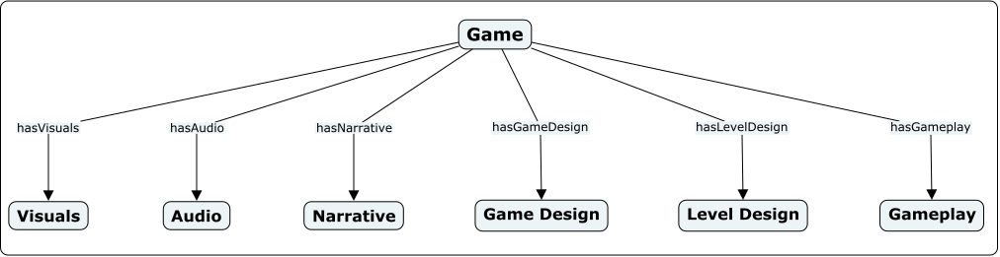

====
Hra, videohra, desková hra, digitální hra, počítačová hra, hračka, hádanka, puzzle, divadelní hra. Typologie typů hráče, cílová skupina. Herní zážitek, herní smyčka, herní dynamika, herní mechanika. Herní zaháčkování (hook), herní kotva (anchor). Proces prototypování her, ověřování herního designu. Činnosti herní/ho designérky/a (kreativní, abstraktní, analytické, systematické, komunikační).

_PA215, PA216_

> Game design is an idea. An idea is worthless. An idea is not playable.[pa215-2022](#pa215-2022) [pa215-2019](#pa215-2019)
>
> — ZZ

> Game design is like a recipe...
>
> It looks fine, but you can’t eat it...
>
> Well it can be eaten, but it doesn’t fill you up.
>
> — Taky ZZ

== Hra

> Hra... je zbytečný termín.
>
> — Určitě ne ŽŽ

Definice hry je stále aktivní proces, ale zjednodušeně je to něco, co se dá _hrát_.

> A game is a problem-solving activity, approached with a playful attitude.
>
> — Jesse Schell

> A game is a **system** in which **players** engage in an **artificial conflict** defined by **rules**, that results in a **quantifiable outcome**.
>
> — Salen & Zimmerman

> Every game is a mental model, a simple mental model of reality, that is easily stored, considered, and manipulated.
>
> — ZZ? Asi.

**Vlastnosti her [schell](#schell)**

1. Games are **entered willfully**.
2. Games have **goals**.
3. Games have **conflict**.
4. Games have **rules**.
5. Games **can be won and lost**.
6. Games are **interactive**.
7. Games have **challenge**.
8. Games **can create their own internal value**.
9. Games **engage players**.
10. Games are **closed, formal systems**.

Hry se dají (poměrně hnidopišsky a rozhodně ne jednoznačně) rozdělit na:

- **Hra**\
  Něco, co se dá hrát.
- **Hračka**\
  Předmět, který slouží ke hraní.
- **Videohra**\
  Něco, co se dá hrát na obrazovce.
- **Desková hra**\
  Typ stolní hry (hra která se hraje na stole) která se hraje na herním plánu (šachy, dáma, člověče nezlob se).
  Další typy stolních her jsou karetní hry, hry s kostkami, hry s tužkou a papírem...
  Moderní hry jsou často kombinací více typů stolních her.
- **Digitální hra**\
  Něco, co se dá hrát na obrazovce a řídí ji nějaký program.
- **Počítačová hra (PC game)**\
  Digitální videohra určená pro osobní počítač (PC).
- **Konzolová hra (console game)**\
  Digitální videohra určená pro herní konzoli (PlayStation, Xbox, Nintendo Switch, ...).

Useless fun fact: _Xbox_ je zkratka pro _DirectX Box_. DirectX zastřešuje několik API jako je _Direct3D_, _DirectPlay_, _DirectSound_, _DirectInput_ atd.

Takže _Xbox X_ je vlastně _DirectX Box X_. Microsoft fakt neumí pojmenovávat věci.

- **Hádanka**\
  Hádanka je drobný slovesný projev v podobě hříčky, která v náznaku předkládá určitý problém, k jehož řešení lze dospět důvtipem nebo logickou úvahou [hadanka](#hadanka).
- **Puzzle**\
  V češtině se slovo _puzzle_ používá pro označení skládaček, ale v herním průmyslu se pod tímto slovem rozumí hlavolam - problém, který musí hráč vyřešit.
- **Divadelní hra**\
  Stejně jako hra se odehrává ve fiktivním světě, obsahuje konflikt a cíl. Většinou ale nemá interaktivní prvky.

== Typy hráčů

Lidi jsou různí a různí lidi hrají různé hry různě.

**Bartleho taxonomie**

- **Socializer**\
  Interaguje s ostatními hráči. Je pyšný na to, že se s ostatními hráči přátelí, že má kontakty a vliv.

  What happened? I missed it, I was talking.

- **Killer**\
  Působí na ostatní hráče. Záleží mu na jeho skillech a reputaci.

  Die!

- **Achiever**\
  Snaží se dosáhnout cílů ve světě. Záleží mu na jeho postavení v rámci herní hierarchie a na tom, jak rychle se tam dostal.

  Only 4211 points to go!

- **Explorer**\
  Snaží se objevovat a poznávat svět. Je hrdý na hloubku svých znalostí o světě.

  > I haven’t tried that one, what’s it do?

**Bartle’s Taxonomy of Players [pa215-2022](#pa215-2022)**

=== Cílová skupina
Neexistuje hra, která by se líbila všem. Cílová skupina je skupina lidí, které se snažíme oslovit. Může být definována věkem, zájmy, zkušenostmi, atp.

== Komponenty hry

Na hru se dá dívat z mnoha různých perspektiv: [pa215-2019](#pa215-2019)

| Component                   |
| --------------------------- | ------------------- | --------------------- |
| Type                        | Example             | Experience            |
| Outer layer / aesthetic     | Fear                | Loops                 |
| Gameplay / motivation / ... | Opening doors       | Dynamics / strategies |
| Gameplay depth              | Hiding in the light | Actions               |
| Game mechanics              | Lantern / light     | Goals                 |
| Motivation                  | To survive          | Elements              |
| Components / aesthetic      | Castle              | System(s)             |

=== Herní zážitek (Experience)

Games are only means for a greater goal - creating experience.

Games are not experiences, they are artifacts people play with while / to create experience.

Hry dovedou navodit řadu různých herních zážitků, které můžeme různými způsoby kategorizovat.

> [!IMPORTANT]
> Herní zážitky souvisí s pojmem obtížnost, kterému se věnuje část otázky [Herní design II](../herni-design-ii/).

==== LeBlanc’s Eight Kinds of Fun

> [!TIP]
> Taky označované jako _Taxonomy of Game Pleasures_ a _herní "pošušňáníčka"_. [pa215-2019](#pa215-2019)

Game designer Marc LeBlanc rozdělil herní zážitky do osmi kategorií: [leblanc](#leblanc)[mda](#mda)

- **Sensation**\
  Game as sense-pleasure: beautiful visuals, good audio, tactile pleasure.
- **Fantasy**\
  Game as make-believe: sense of place, immersion, suspension of disbelief.
- **Narrative**\
  Game as unfolding story: sense of drama, rising tension.
- **Challenge**\
  Game as obstacle course: compelling struggle.
- **Fellowship**\
  Game as social framework: shared intense experience, community.
- **Discovery**\
  Game as uncharted territory: exploration, revealing the hidden, variety.
- **Expression**\
  Game as soap box: customization, self-representation.
- **Submission / masochism**\
  Game as mindless pastime: submission to game structures, mutual agreement to "play".

=== Herní smyčky (Loops)
_Herní smyčka_ je opakovatelná posloupnost akcí / částí gameplaye. Většina velkých her má víc než jednu smyčku různých žánrů, které jsou vágně (a nebo vůbec) propojené.

=== Herní dynamika (Dynamics)
Strategie, způsoby hraní. Chování hráče, které se noří z toho, jak používá mechaniky.

=== Element / Ludeme
Základní jednotka hry. Třeba L-pohyb koně v šachu.

=== Herní mechaniky
Podobně jako termín _hra_, ani _herní mechanika_ nemá jednoznačnou definici.

- Základní herní elementy, se kterými hráč interaguje úmyslně.
- Pravidla, která řídí, co za akce hráč může dělat, a jak hra na jeho akce reaguje.

=== Game goals

- _Konkrétní_: Hráč musí pochopit a být schopný jasně vysvětlit, co jsou zač a jak jich chce dosáhnout.
- _Dosažitelné_: Hráč musí mít pocit, že je schopný cíl dosáhnout.
- _Naplňující_: Hráč musí mít pocit, že cíl má smysl, a to ještě předtím, než ho dosáhne, aby měl motivaci.

== Game Design Anchor and Hook

=== Herní zaháčkování (Hook)
Něco nové, co hru odlišuje od ostatních her. Taky lze nazvat unique selling point.

=== Herní kotva (Anchor)
Něco známeho, povědomého pro hráče.

== Prototypování her
Designér iterativně vytváří hrubé verze hry, které testuje a upravuje. Prototyp je osekaná verze hry, která obsahuje mechaniky, ale ne nutně grafiku. Prototyp lze využít k ověření herního designu - je hra zábavná?

> [!IMPORTANT]
> Testováním se více zabývá otázka [Herní design II](../herni-design-ii/).

== Game Designer

> Artist = inner calling = intimate.
>
> To create a game is not intimate.
>
> In a small team it is possible.
>
> Team = too many voices.
>
> Team = work together.
>
> — ZZho slidy z Herního inkubátoru

- **Cíl**
  - ~~Cílem game designera je vytvořit hru.~~
  - ~~Cílem game designera je vytvořit nějaký zážitek.~~
  - Cílem game designera je vytvořit artefakt (hru), která vytváří nějaký zážitek.
  - Game designer není zodpovědný za celou hru. Je jen jednou z mnoha rolí, které se na tvorbě hry podílejí. [badges](#badges)
- **Role**
  - Analyzuje hru jako systém objektů, relací, příčin a následků.
  - Designuje změny, modeluje následky, rozhoduje, posuzuje produkční rizika.
  - Komunikuje. Hájí hru před ne-designery.

=== Kreativní činnost

Nejlepším nástrojem game designera je tužka a papír. Papírový prototyp je pro začátek dost.

Kromě nich ale existuje:

- [Twine](https://twinery.org/),
- [Bitsy](http://www.bitsy.org/#0,0),
- [Flickgame](https://www.flickgame.org/).

=== Abstraktní činnost

Game designer produkuje taky hromady abstraktních teorií o herním designu.

> Design theory is like coffee.
>
> - You can get it on **every corner**.
> - It’s expensive whether it’s **high or low quality**.
> - It’s a **fuel for magic**.
> - **Without doing something with it it’s useless**.

> — Ano&comma; stále ZZ

=== Analytická činnost

...je tak trochu psychoanalýza.

> By deep listening to your own self, that is, **observing**, **evaluating**, and **describing** your own experiences, **you can make rapid, decisive judgements** about what is and is not working in your game, **and why** it is or is not working.
>
> — Jesse Schell

Ale bacha na mylné závěry. Game designeři mají často zvláštní chutě.

=== Systematická činnost -- game balancing

Při balancování hry designer úmyslně ničí svoji hru, aby odhalil její hranice. [pa215-2022](#pa215-2022)

**Doporučení**

- Změň jen **jednu věc**. Neměň víc věcí najednou.
- Dělej **velké** změny parametrů (MinMaxuj).
- **Zapisuj** si co děláš, protože pamatovat si to fakt nebudeš.
- Chápej **numerické / elementální atributy** svojí hry.

=== Komunikační činnost
Zjednodušit a předat informace o tom co fungeje a co ne ostatním. Musí umět obhájit své návrhy.

== The Core Game Ontology

> [!NOTE]
> Ontologie -- disciplína zabývající se bytím a základními pojmy jako je realita, existence, atp.

Lehký slovník pro popis her. [cgo](#cgo) Hodí se při komunikaci s klienty, nevyvojáři a nehráči. [pa216-2020](#pa216-2020)

**The Core Game Ontology [cgo](#cgo)**

- **Visuals**\
  Any visual output of the game, which range from photorealistic, to caricaturize, to abstract visuals.
- **Audio**\
  Includes background music such as a fully orchestrated soundtrack, sound effects, rewarding sounds and voice-acted dialogue.
- **Narrative**\
  Contains the interactive story of a game which makes up the game’s plot.
- **Game Design**\
  Contains all the game’s mechanics that define the game’s rules, which provide the structures and frames for play (for example winning and losing conditions) and actions available to the player.
- **Level Design**\
  Includes the architecture of the spatial navigation of levels which determine how the player agent can progress from one point in the game to another.
- **Gameplay**\
  Consists of the players strategies whilst playing a game.

== Žánry

Herní žánry jsou jednoduchou, byť ne zcela přesnou, klasifikací her podle jejich herních mechanik a herních smyček. [genre](#genre) Hrá může zapadat do jednoho nebo více žánrů. Jsou jimi například:

- **Platformer**\
  Hra, ve které se hráč pohybuje po platformách a překonává překážky.
- **Role-playing game (RPG)**\
  Hra, ve které hráč hraje za postavu, kterou je pro něj předpřipravena nebo si ji sám vytvořil, a která se vyvíjí a získává nové schopnosti.
- **Rhythm game**\
  Hra, ve které hráč musí reagovat na hudbu.
- **Puzzle game**\
  Hra, ve které hráč řeší hlavolamy.
- **Simulation game**\
  Napodobenina nějakého systému z reálného světa.
- **Strategy game**\
  Hráč se dostává do role vojevůdce a musí se rozhodovat, které jednotky poslat do boje.
- **Adventure game**\
  Příběh je to hlavní. Často kombinuje prvky RPG a puzzle her.
- **First-person shooter (FPS)**\
  Hra, ve které hráč vidí svět očima postavy, kterou hraje, a střílí (převážně) své nepřátele.
- **Rogue-like**\
  Hra, ve které hráč prochází náhodně generovanými úrovněmi a snaží se přežít co nejdéle. Po smrti začíná znovu.

== Zdroje

- [[[pa215-2022,1]]] https://is.muni.cz/auth/el/fi/podzim2022/PA215/index.qwarp
- [[[pa215-2019,2]]] https://is.muni.cz/auth/el/fi/podzim2019/PA215/um/
- [[[schell,3]]] Jesse Schell, _The Art of Game Design: A Book of Lenses_
- [[[hadanka,4]]] https://cs.wikipedia.org/wiki/H%C3%A1danka
- [[[leblanc,5]]] http://algorithmancy.8kindsoffun.com/
- [[[mda,6]]] https://users.cs.northwestern.edu/~hunicke/pubs/MDA.pdf
- [[[badges,7]]] https://kumu.io/gamebadges/gamebadges
- [[[cgo,8]]] https://autosemanticgame.institutedigitalgames.com/ontologies/core-game-ontology/
- [[[pa216-2020,9]]] https://is.muni.cz/auth/el/fi/jaro2020/PA216/index.qwarp
- [[[genre,10]]] https://en.wikipedia.org/wiki/Video_game_genre

== Další zdroje

- [Greg Costikyan: I Have No Words & I Must Design: Toward a Critical Vocabulary for Game](http://www.costik.com/nowords2002.pdf)
