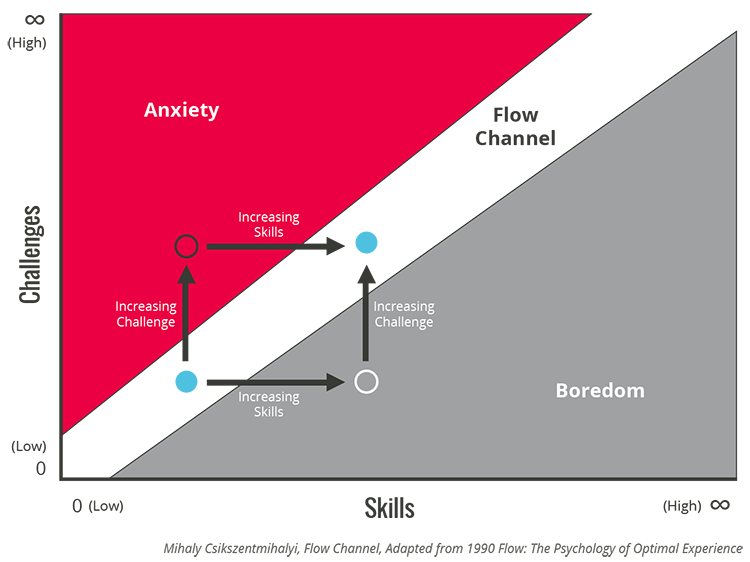
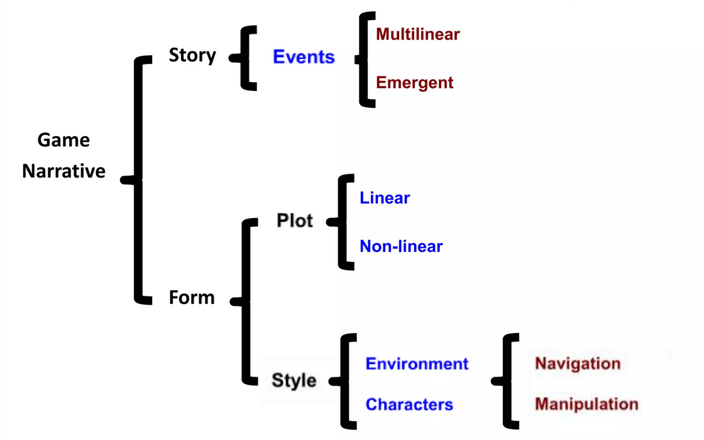

# Herní design II

> [!NOTE]
> Jednotka herního designu, návrh designu hry, designový dokument hry. Teoretické koncepty herní analýzy - magický kruh (Huizinga), kybertext (Aarseth), plynutí (flow; Csikszentmihalyi). Symetrické a nesymetrické (kompetitivní) hry, dominantní strategie. Narativ, vyprávění, příběh, hraní (gameplay). Tutoriál (návod/naučení), onboarding (organické/neinvazivní naučení hry), foreshadowing (před-naznačování). Testování herního zážitku (cílové skupiny (focus), obecné testování hry (play)).
> <br>
> _PA215, PA216_


## Návrh hry

- **Jednotka herního designu**

Jednotkou herního designu se rozumí dokument, který popisuje část hry (textový popis, obrázky) z pohledu designera, artisty, programátora...

- **Návrh designu hry**
- **Designový dokument**

Obsahuje základní informace o hře v čitelné formě pro negamedesignery (třeba pro CEO). Měl by obsahovat:

- target audience, žánr, target platform, pro kolik bude hráčů...
- high concept statement - krátký popis hry
  - What does the player do?
  - Why do they do it?
  - Where do they do it?
  - What are the constraints on the player?
  - What sort of emotion is this game trying to evoke in the player?
  - How is this game unique? What differentiates it from other games?
- feature set
- competition - podobné hry
- inovation - co hra přináší nového (art, design, technologie, ...)
- scope management - omezení rozsahu hry tak aby se zvládla vyrobit
  \*\* must have, should have, could have, won't have

## Teoretické koncepty herní analýzy

### Magický kruh Johana Huizingy

> In a very basic sense, the magic circle of a game is where the game takes place. To play a game means entering into a magic circle, or perhaps creating one as a game begins.
>
> — Salen & Zimmerman

Magický kruh je "prostor", ve kterém neplatí obyčejná pravidla reality a místo toho platí sada pravidel "herního světa". Ač magický kruh funguje na jednu stranu jako štít před realitou, je vlastně poměrně průchozí a nechává vnější realitu prosakovat do té herní. [^magic-circle-wiki] [^rules-of-play]

Byť ten termín zmínil jako první Huizinga, zadefinovali a zpopularizovali ho až Salen a Zimmerman. [^zimmerman-essay]

### Kybertext

Kybertext byl popsán Espenem Aarsethem v jeho knize _Cybertext: Perspectives on Ergodic Literature_ (1997). Ergodická literatura je taková, která vyžaduje od čtenáře aktivní účast, aby mohl text vůbec přečíst. Kybertext je podkategorie ergodické literatury, kde čtenář musí dělat rozhodnutí, která ovlivňují, jak se text vyvíjí [^ergodic-literature-wiki].

In ergodic literature, nontrivial effort is required to allow the reader to traverse the text. If ergodic literature is to make sense as a concept, there must also be nonergodic literature, where the effort to traverse the text is trivial, with no extranoematic responsibilities placed on the reader except (for example) eye movement and the periodic or arbitrary turning of pages.

### Obtížnost hry a Flow

Hry můžou mít různou obtížnost. Ta se dá mnohdy explicitně nastavit v menu, nebo může být adaptivní a přizpůsobovat se okolnostem (zkušenosti hráče, počet spoluhráčů, atd.). Další možností je mít několik stupňů obtížnosti zároveň vedle sebe (projití příběhu vs. získání všech achievementů).

> Starting the game at a higher than normal difficulty introduces the concept of **Darwinian Difficulty**, which can be summarized by the motto **adapt or die**.
>
> — Josh Bycer

- **Absolutní obtížnost ($\text{AD}$)**\
  To, co jsme nadesignovali.
- **Vnímaná (perceived) obtížnost ($\text{PD}$)**\
  To, jak obtížná hra přijde hráči.

  ```math
  \text{PD} = \text{AD} - \text{power provided} - \text{in-game experience}
  ```

#### Flow channel

> [!TIP]
> Termín, se kterým přišel Mihaly Csikszentmihalyi _[me-high cheek-sent-me-high]_.

Balanc mezi nudou a přílišnou obtížností.

- Hráč má jasný cíl.
- Nic hráče nerozpytuje.
- Hráč má přímou zpětnou vazbu.
- Hra je pro hráče stále výzvou.



## Teorie her

> [!WARNING]
> Game design != Game theory

Teorie her se na _hry_ dívá jako na matematické modely, které popisují chování nějakých racionálních agentů.[^wiki]

### Typy her

V teorii her se hry dělí na:

- **Kooperativní**\
  V kooperativních hrách jsou závazky mezi hráči vynucovány externě (např. skrze zákon či pravidla hry).
- **Nekooperativní (kompetitivní)**\
  U nekooperativních her jsou hráči zodpovědní za dodržování vzájemných závazků sami, ale nic je k tomu nenutí.
- **Symetrická**\
  V symetrických hrách mají všichni hráči stejné možnosti. Jinými slovy, nezáleží na tom, **kým** hráč je, ale jakou strategii zvolí. Většina symetrických her je krátká, jelikož při delším hraní mají hráči různé strategické možnosti, a tak se hra stává _de facto_ asymetrickou.

  Příkladem symetrické hry jsou například kámen-nůžky-papír, prisoner's dilema.

  Z pohledu game designu stačí, že mají hráči stejné možnosti. Tedy například šachy jsou symetrické z pohledu game designéra, ale z pohledu teorie her ne, protože bílý začíná a má tedy výhodu.

- **Asymetrická**\
  V případě asymetrických her **neplatí**, že strategie výhodná pro jednoho hráče bude výhodná, i když ji aplikuje někdo jiný. Většina her je asymetrických, ale to neznamená, že nejsou statisticky vyvážené.

  Z pohledu game designu jde o hry, kde má každý hráč jiné možnosti. Hráč si například vybírá postavu s různými schopnostmi nebo má jiné cíle než ostatní hráči.

- **Zero-sum**\
  Zero-sum hry jsou takové, kde zisk jednoho hráče je ztrátou druhého. Například poker, kde výhra jednoho hráče je ztrátou ostatních hráčů.
- **Non-zero-sum**\
  Celkový výsledek hry není nula. Výhra jednoho hráče neznamená nutně prohru druhého hráče.

### Dominantní strategie

> In designing an asymmetric game, **you must test the mechanics for each type of competitor against every other possible type of competitor to make sure that none has a dominant strategy**. This lengthy and involved procedure makes it more likely that a mistake will get past the testers.
>
> — Adams (2009)

> The rock-paper-scissors (or RPS) mechanism is a classic design technique for avoiding dominant strategies and forms the basis for balancing player strategies in many games.
>
> — Adams (2009)

Z pohledu teorie her je dominantní strategie taková strategie, která je pro hráče nejlepší, bez ohledu na to, jak se chovají ostatní hráči.

V dobře vybalancované _Player-vs-Player_ (PvP) hře:

- Náhoda sice může hrát roli, ale nesmí znehodnotit hráčovy skilly.
- Skoro nikdy nedochází k remíze, obzvlášť mezi hráči s nevyrovnanými dovednostmi.
- Si hráči myslí, že hra je fér.

## Narrative design

Game desiner může využít libovolné herní elementy k tomu, aby komunikoval nějaký příběh. Vytváří ho mixováním game designových a narativních nástrojů. Jsou jimy například: [^pa215-2022]

- text,
- video,
- audio,
- animation,
- film sequences,
- graphical user interface (GUI),
- architecture,
- system itself (procedural rhetoric),
- players themselves (fandom, other texts, ...).

**Interactivity with the narrative game [^zagalo]**



---

- Vyprávění ve videohrách může mít mnoho podob a nebo tam nebýt vůbec.
- Pokud hráč nechce "naslouchat" příběhu, tak příběh nebude komunikován a tím pádem se vůbec nestane.

- **Poselství (message)**\
  Téma, obklopené lorem, které se posouvá ke konfliktu.
- **Svět**\
  Kontext zahrnující prostředí a objekty. Všechno spojoje.
- **Postavy**\
  Osobnosti, jejich prezentace a akce. Spojují svět a události.
- **Události**\
  Jednotlivé věci, které se dějí a vytváří zápletku. Spojují formu a obsah.

### Story vs Narrative

- **Fabula (~ story)**\
  The raw material of the story.

  Má zápletku, postavy, lore, story arc, atd.

- **Syuzhet (~ narrative)**\
  The way the story is organized.

  Každé médium nabízí jiné nástroje k tomu, jak příběh vyprávět. Má specifické techniky, prostředí, rozhraní, možnosti přizpůsobení, atd.

### Struktura

- **Lineární (3-bodová struktura, Monomyth / Hero's journey)**

  1. Setup -- expozice, počáteční incident.
  2. Konfrontace -- překážky, krize.
  3. Rozuzlení -- vyvrcholení, závěr.

     > [The] hero's journey, or the monomyth, is the common template of stories that involve a hero who goes on an adventure, is victorious in a decisive crisis, and comes home changed or transformed.
     >
     > — Wikipedia: Hero's journey

- **Nelineární**

  ...will watch the other endings on YouTube.

- **Smíšená**\
  Lineární v některých místech, nelineární v jiných.

### Emergentní vyprávění

Příběhy, které nenavrhl vývojář, ale vznikají z interakce mezi hráčem (či hráči) a hrou. Liší se tak od _embedded_ vyprávění, kde jsou momenty předem skriptované, i když se větví. [^rules-of-play]

V emergentním vyprávění je příběh důsledkem toho, že hra je dostatečně komplexní systém. V takovém systému jsou akce _coupled_ -- vzájemně propojené, rekurzivně se ovlinující. A jsou také závislé na kontextu: hráč se zachová jinak, když narazí na specifický druh nepřítele v závislosti na tom, co se mu stalo posledně.

- **Content generation**\
  Některé hry umožňují hráčům vytvářet nebo přidávat vlastní obsah. Toto velice často podporuje emergentní vyprávění. Možnost měnit věci, zvyšuje entropii / kreativní chaos a podporuje tak fandom, prosumerismus.

  > [!NOTE]
  > Prosumer = producer + consumer

## Tutoriál a onboarding

> Playing a game is a learning experience.
>
> — Celia Hodent

Jak tutoriál tak onboarding učí hráče, jak hru hrát. Onboarding je širší pojem, který zahrnuje i tutoriál. Tutoriál je jeho konkrétní, často velice explicitní formou.

- **Onboarding**
  - A process of teaching the player how to play a game.
  - A design of goals and obstacles to teach the player how to play a game.
  - A design of an early gameplay to motivate the player to play a game. [^pa215-2019]
  - A design of gameplay to motivate the player to achieve mastery.

> [...] it's incredibly powerful to teach a player how to play the game, in-game, because that way they quickly take ownership over what happens.
>
> — Miyamoto

- **Limitace hráče**

  - Fyzické (např. ovladač, klávesnice, myš)
  - Kognitivní (např. paměť, pozornost)
  - Senzorické (např. zrak, sluch, hmat)

    > [!WARNING]
    > Pozor na kognitivní overload!
    

    > [!TIP]
    > Doporučuje se učit hráče **maximálně** tři věci najednou. Může to být třeba:
    > <br>
    > 1. Jak aktivovat nějakou schopnost.
    > 2. Jak ji použít jako reakci na nepřítele.
    > 3. A jak navíc uhýbat před projektily, zatímco ji používám.
    

- **Tutoriál**\
  Typicky jeden nebo více levelů, kdy jsou hráči dány informace, jak hru hrát. Tyto levely jsou často vytrženy ze zbytku hry a nejsou součástí vyprávění a herního světa.

  Některé tutoriály se naopak snaží být nenápadné a zakomponované do světa a příběhu (třeba Portal 2). Občas dokonce parodují své explicitní protějšky (např. Far Cry 3 nebo Undertale).

- **Foreshadowing**\
  Foreshadowing je technika, při které hráč dostává clues o tom, co se bude dít dál. Původně je to termín z literatury, ale používá se ve všech médiích. V game designu jej lze použít pro naznačení toho, na co se má hráč připravit (třeba boss fight), nebo naznačit hráči jeho cíl (třeba hrad na kopci nad městem).

## Testování hratelnosti

Hru je třeba testovat na hráčích, nejlépe takových, kteří jsou target audience a sami nejsou vývojáři.

### Iterativní design

Proces, kdy je game design testován na hráčích po celou dobu vývoje. A to často.

> 1. Think of an Idea.
> 2. Try it out.
> 3. Keep changing it and testing it until it seems good enough.
>
> — Jesse Schell

> Iterative design is a **play-based design process**. Emphasizing **playtesting** and **prototyping**, iterative design is a method in which **design decisions are made based on the experience of playing a game while it is in development**.
>
> — Salen & Zimmerman

> - **The Rule of the Loop**\
>   The more times you test and improve your design, the better your game will be.
>
>   - How can I make every loop count?
>   - How can I loop as fast as possible?
>
> — Jesse Schell

### Playtesting

- **Playtest**

  > A test in which a product is played, or played with, to assess its **quality**, **safety**, or **marketability**.
  >
  > — Oxford Dictionary

  > Playtesting is a method of quality control that **takes place at many points during the video game design process**. A selected group of users play **unfinished** versions of a game to work out **flaws** in gameplay, level design and other basic elements, as well as to discover and resolve **bugs** and **glitches**.
  >
  > — Technopedia

- **Focus test**\
  A playtest of a game by a particular focus group.

---

> - Playtest before you think you are ready.
> - Don't explain.
> - Take notes.
> - Shut Up.
> - Notice everything.
>
> — Pozzi & Zimmerman


[^magic-circle-wiki]: https://en.wikipedia.org/wiki/Magic_circle_(virtual_worlds)
[^rules-of-play]: Salen, Katie & Zimmerman, Eric. Rules of Play: Game Design Fundamentals. 2003.
[^zimmerman-essay]: [Eric Zimmerman: Jerked Around by the Magic Circle - Clearing the Air Ten Years Later](https://www.gamedeveloper.com/design/jerked-around-by-the-magic-circle---clearing-the-air-ten-years-later)
[^ergodic-literature-wiki]: https://en.wikipedia.org/wiki/Ergodic_literature
[^wiki]: https://en.wikipedia.org/wiki/Game_theory
[^pa215-2022]: https://is.muni.cz/auth/el/fi/podzim2022/PA215/index.qwarp
[^zagalo]: https://www.slideshare.net/nzagalo/videogame-narrative
[^pa215-2019]: https://is.muni.cz/auth/el/fi/podzim2019/PA215/um/
[^fuck-rules]: [Don't follow these rules!: A Primer for Playtesting, Nathalie Pozzi and Eric Zimmerman](https://static1.squarespace.com/static/579b8aa26b8f5b8f49605c96/t/5962a494bebafbc89ca001b6/1499636884792/A+Primer+for+Playtesting.pdf)
