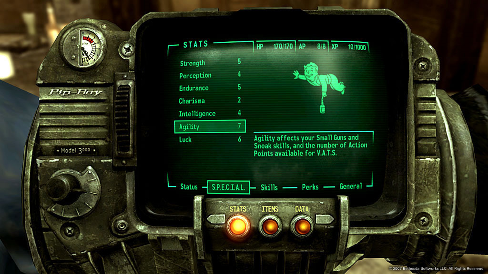
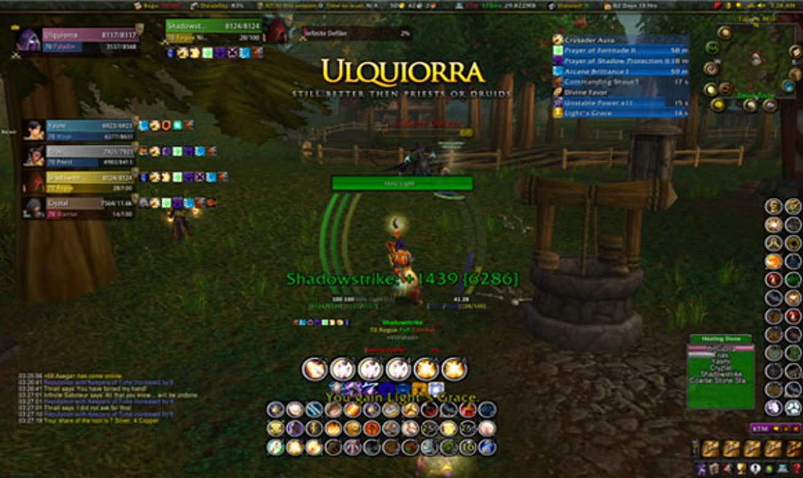
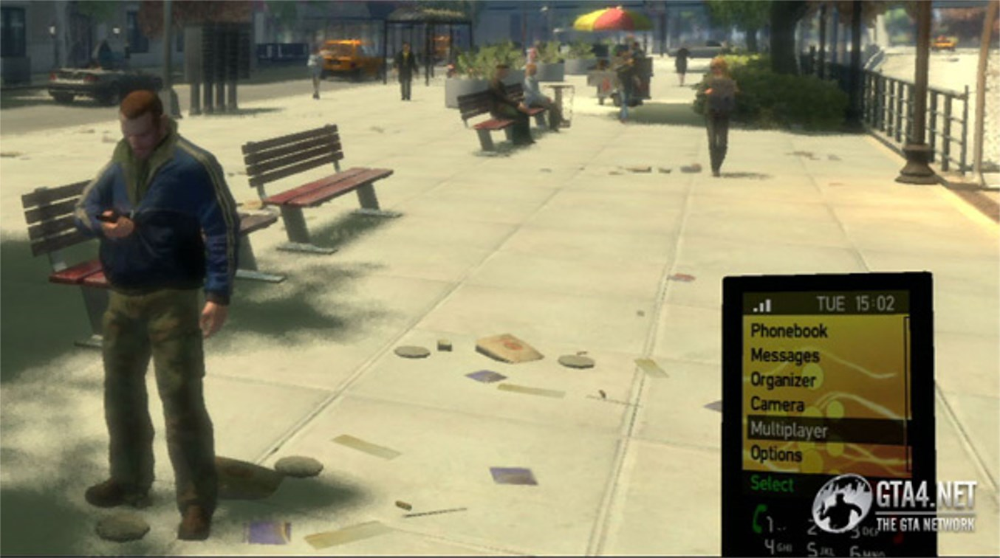
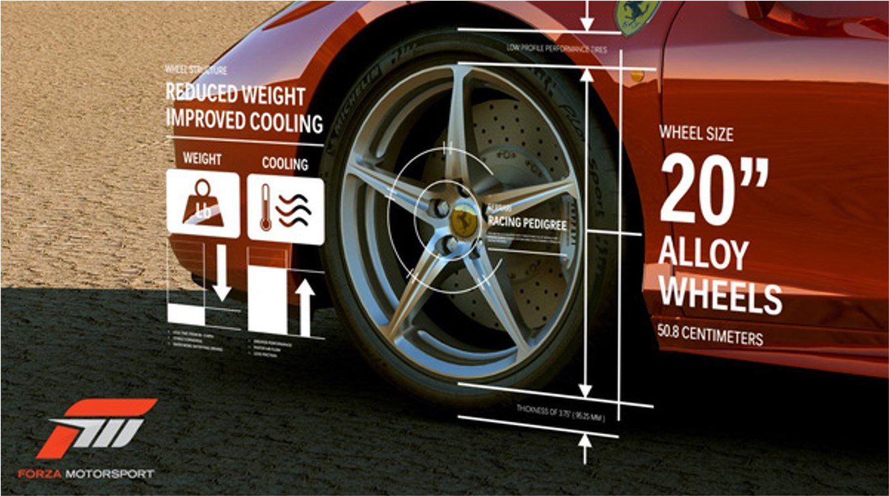
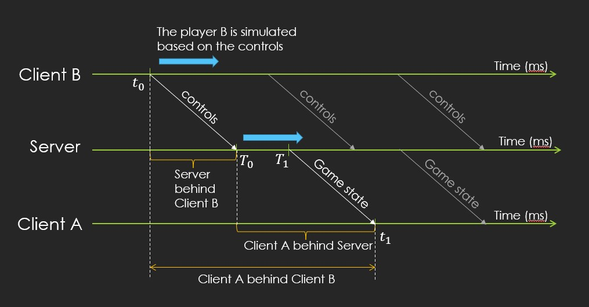

<dl><dt><strong>📌 NOTE</strong></dt><dd>

Architektura herního engine (jednotlivé moduly a jejich význam). Herní rozhraní (fyzická, virtuální, typy vstupních a výstupních zařízení, mapování). Audio ve hrách (propagace zvuku ve scéně, digitální zvuk, PCM, latence, mixování zvuků). Síťová vrstva (přenosová rychlost, latence, obousměrné zpoždění, jitter a ztráta dat), metody redukce latence, TCP vs. UDP.

_PV255_

</dd></dl>

## Architektura herního enginu

Herní engine je software, který slouží jako základ pro vývoj her. Obsahuje spoustu modulů, které se starají o různé aspekty hry. Moduly jsou spíše obecné a engine lze využít pro různé hry.

I přes to, že je game engine obecný, neznamená to, že v něm dokážeme (rozumně) vytvořit jakoukoliv hru. Existují různě specializované enginy ve kterých vytvoříme hry určitého žánru, ale i obecné enginy, ve kterých jde vytvořit téměř všechno.

- **Low-level moduly**
  - Core
    - Řídí základní funkce - inicializace, řízení paměti, konfigurace...
  - Zdroje a souborový systém
    - Hra potřebuje načítat spoustu dat v nejrůznějších formátech a pro různá využití (různé textury, meshe, animace, audio, level data...).
    - Každý soubor by se měl do paměti načíst ideálně jen jednou.
    - Wrapper pro file systém - programátor nemusí řešit různé operační systémy.
    - Off-line část - tak, aby se se soubory dobře pracovalo, zároveň se řeší převod na formáty, které jsou pro hru efektivnější.
    - Runtime část - načítání/odnačítání souborů do paměti, správa paměti.
  - Game loop
    - Značná část kódu běží v nekonečné smyčce. Rychlost smyčky je dána prioritou a náročností výpočtů (např. grafika 60 Hz, fyzika 50 Hz, AI 5 Hz).
    - Na většinu výpočtů je omezený čas jen několik milisekund (60 Hz ~ 16 ms).
    - Ve hře lze měřit milion různých časů - reálný čas, čas ve hře, pauza, čas animace, čas mezi snímky, CPU time budget...
  - Human Interface
    - Input / Output
    - Mapování vstupů na akce
  - Podpora vývoje a debugování
    - Logs, warnings, errors
    - Profiling
    - Crash reporty
    - Debug gizmos (debug ray, box, sphere...)
    - Debug menu a konzole
- **Zvkuk**\
  Speciální engine pro zvuk, často middleware jako FMOD nebo Wwise.
- **Graphics**\
  Zařizuje vykreslování grafiky, osvětlení, stíny, postprocessing, atd.
- **Physics**\
  Zajišťuje fyziku - kolize, gravitace, interakce s objekty, atd.

## Herní rozhraní

Herní rozhraní je to, co přijímá od hráče nějaký vstup (input device) nebo mu vrací nějaký výstup (output device). Někdy zvládá zařízení obě funkce zaráz - např. volant je jistě vstupní zařízení, ale může zároveň podporovat force feedback, tedy výstup. [pv255](#pv255)

### Fyzická rozhraní

_Fyzická rozhraní_ jsou všechny možné ovladače, klávesnice, myš, joystick, volant, kytara, ale taky výstupy jako monitor, reproduktory, dotykový display, atd. Zkrátka to, na co si hráč sáhne.

- **Digitální**\
  Posílají binární signály. Jsou buď stisknuté nebo ne. Typickým příkladem je klávesnice, ale taky tlačítka na gamepadu, myši, atd.
- **Analogová**\
  Posílají spojité signály. Typickým příkladem je analogový joystick, ale taky např. tlačítka na gamepadu, která mohou mít různou intenzitu stisku. Patří sem, ale taky motion sensory jako kinect, gyroskop, akcelerometr, atd.

  **📌 NOTE**\
   Mechanické klávesnice, které mnohdy taky posílají spojité signály, zdá se nikdo zatím moc nepoužil.

### Virtuální rozhraní

Na _virtuální rozhraní_ si hráč nesáhne. Jsou to všemožná menu, inventáře, interaktivní objekty, atd.

- **GUI -- graphical user interface**\
  Obecný low-level pojem pro všechny abstraktní interaktivní formulářovité objekty, které se zobrazují na obrazovce, ale většinou nejsou přímo herními objekty.
- **HUD -- head-up display**\
  Virtuální rozhraní, která má hráč neustále na očích, ale nejsou (často) součástí herních objektů. Např. životy, zásoby munice, minimapa, atd.
- **Diegetická (dynamická) rozhraní**\
  UI prvky, které jsou součástí herního světa. Např. interaktivní terminál, který ovládá hráč, nebo hologramy, které se zobrazují v prostoru. Dopomáhají k imerzi, ale mohou hráče frustrovat jelikož bývají pomalejší (protože animace) a mohou být obtížně čitelné. [ui](#ui)

  **Fallout 3**

  

- **Nediegetická (statická) rozhraní**\
  Jsou "mimo" herní svět, přilepená k obrazovce, a jsou abstraktní, nesouvisí přímo s herním světem.

  **World of Warcraft**

  

- **Meta rozhraní**\
  Jsou sice mimo herní svět, ale alespoň s ním souvisí. Třeba telefon v GTA IV.

  **GTA IV**

  

  **💡 TIP**\
   [Meta](https://about.meta.com) rozhraní != Oculus Quest

- **Spatial (prostorová) rozhraní**\
  Nejsou "bežnou" součástí herního světa, ale nejsou ani mimo něj.

  **Forza**

  

### Virtuální realita (VR)

Virtuální realita hranici mezi fyzickými a virtuálními rozhraními tak trochu stírá. Hráči si sice nemohou sáhnout na virtuální rozhraní, ale mohou se na ně dívat z blízka a sahat na ně ovladači nebo je ovládat gesty.

### Brain computer interaction (BCI)

BCI je technologie, která umožňuje ovládat počítač přímo pomocí myšlenek. V současnosti je to spíše sci-fi, ale v budoucnu by to mohlo být další rozhraní, které by se dalo použít ve hrách.

### UI vs. UX

Zjednodušeně, UI řeší vizuální stránku rozhraní, kdežto UX tu funkční. Realita je ale složitější, neboť vizuál a funkčnost se mnohdy vzájemně ovlivňují.

- **UI -- user interface**\
  UI řeší vizuální prvky, které se zobrazují na obrazovce. Konkrétně se zaobírá jejich vzhledem, umístěním, "feelem". Zahrnuje například: [figma](#figma)

  - Layout
  - Typografii
  - Barevnou paletu
  - Interaktivní prvky: tlačítka, checkboxy, radio buttony, comboboxy, selecty, dropdowny, nebo nedejbože datetimepickery.

- **UX -- user experience**\
  UX řeší prvky, které se zobrazují na obrazovce, ale zabývá se tím, _jak_ je uživatelé používají, a jestli splňují svůj účel. Zahrnuje třeba: [figma](#figma)

  - Průzkum uživatelských očekávání a konkurence
  - Wireframy a prototypování
  - Testování

### Mapování

Relace mezi vstupem a jeho významem. Např. stisknutí klávesy "W" => pohyb vpřed. Mapování funguje i ve virtuální vrstvě: kliknutí na křížek => zavření okna.

V ideálním případě si může hráč "přemapovat" vstupy podle svých preferencí. (Není nic horšího než když se vám pokazí D a přijdete tak o možnost chodit doprava. Hádám ale, že tohle stejně není primární účel...)

Problém s mapováním je při podpoře různých vstupních zařízení. "B" má jiné umístění na klávesnici, Xbox ovladači, switchi a na playstation ovladači vůbec není. Hra by měla brát tenhle fakt v potaz a nejen vybrat správné tlačítko, ale měla by i hráči zobrazit správné ikony.

## Audio ve hrách

Audio je důležité pro vytvoření atmosféry a imerze. Většina her má nějaký zvuk, ať už je to hudba (tvoří mood), zvuky prostředí (tvoří mood a zároveň informuje hráče), nebo dialogy postav (příběh).

### Propagace zvuku ve scéně

Zvuk lze ve scéně propagovat různými způsoby s různou složitostí. Nejjednodušší varianta nijak neřeší scénu a jen přehraje zvuk (2D zvuk). Pro lepší imerzi je vhodné použít různé efekty které modelují propagaci zvuku skrz prostředí (3D zvuk).

- **Distance attenuation**\
  Zvuk se zeslabuje s vzdáleností. V reálném světě je zeslabení kvadratické, ve hrách se pro aproximaci používá i lineární zeslabení.
- **Propagation**\
  Oběkty ve scéně mohou zvuk blokovat, odrážet a zeslabovat.

  - Occlusion - zvuk je blokován překážkou.
  - Attenuation - zvuk je zeslaben překážkou.
  - Obstruction - přímá cesta zvuku je blokována, ale zvuk se může dostat k posluchači přes odraz. Zvuk přichází z jiného směru, než je zdroj.
  - Exclusion - existuje jen přímá cesta, nepříme cesty jsou blokovány.

- **Ozvěna a dozvuk**\
  Zvuk se odráží od překážek a dostává se k uchu několikrát po sobě. Tomuto efektu se říká také "wet sound".

  - Přímí zvuk - zvuk, který přijde přímo od zdroje.
  - Dozvuk - zvuk, který se odráží od blízkých překážek. Člověk jej vnímá jakou souvyslý zvuk.
  - Ozvěna - zvuk, který se odráží od vzdálených překážek. Člověk ji vnímá jako zopakování původního zvuku.

- **Dopplerův efekt**\
  Výška tónu se mění podle relativní rychlosti zdroje a posluchače. V praxi si tohoto jevu můžete všimnout například při projíždění sanitky - když se blíží, je slyšet vyšší tón, než když se vzdaluje.
- **Spoždění**\
  Zvuk se šíří určitou rychlostí. Čím dál je zdroj, tím déle trvá, než zvuk dorazí k posluchači.

### Digitální zvuk

Zvuk v normálním světě je spojitá funkce času (analog). V počítačích se ale reprezentuje jako diskrétní hodnoty.

- **Vzorkování**\
  Spojitá funkce se vzorkuje v pravidelných intervalech. Vzniknou tak diskrétní body v čase.
- **Kvantizace**\
  Původní signál může nabývat jakékoliv hodnoty, počítač má jen omezenou přesnost. Proto se musí naměřená hodnota převést na hodnotu z nějaké vybrané množiny povolených hodnot.
- **PCM -- pulse-code modulation**\
  Formát zvukových dat, kde zvuk je reprezentován jako posloupnost jednotlivých naměřených hodnot v rozmezí [-1, 1]. Posloupnost obsahuje k-tice hodnot, kde k je počet kanálů (mono, stereo, 5.1, atd.). Zvuková karta dokáže tuto posloupnost převést zpět na analogový signál pro reproduktory.
- **Latence**\
  Zvuková karta dostává data v bufferu a až poté zvuk přehraje. Latence je doba mezi tím, kdy se zvuk pošle a kdy jde zvuk reálně slyšet. Čím menší buffer, tím menší latence, ale vyšší nároky na procesor, který buffer plní. Pokud by zvuková karta nedostala data včas, zvuk bude poškozený. Proto audio callback (funkce, která plní buffer) bývá obvykle v separátním vlákně s vysokou prioritou, které bere předpřipravená data z fronty, která obsahuje předem dekódované zvuky (dekódování je časově náročné).
- **Mixování**\
  Mixování je třeba, pokud chceme přehrát několik zvuků naráz (např. výstřel za běhu při epické hudbě). Jednotlivé zvuky se sčítají, ale může tak dojít k přetečení z intervalu [-1, 1] => musí se nějak opravit.

  Při mixování lze aplikovat i různé efekty (např. změna hlasitosti, ozvěna, změna frekvence). Efekty lze aplikovat na jednotlivé kanály nebo na celý mix. Vznikne tak přímí acyklický graf efektů a mixérů.

## Síťová vrstva

Síťová hra nemusí být multiplayer, a multiplayer hra nemusí být síťová.

### Krátké opakování ze sítí

- **ISO/OSI model**
  - Fyzická vrstva - kabely, konektory, modulace signálu...
  - Linková vrstva - spojení mezi dvěma sousedními uzly (MAC adresy), detekce chyb...
  - Síťová vrstva - spojení mezi systémy, které spolu nesousedí (směrování), adresace (IP)...
  - Transportní vrstva - doručení mezi koncovými uzly, zaručuje kvalitu (TCP, UDP)...
  - Relační vrstva - organizace a synchronizace komunikace mezi systémy...
  - Prezentační vrstva - formátování, komprese, šifrování...
  - Aplikační vrstva - konkrétní aplikace a služby (HTTP, FTP, SSH, DNS, ...).
- **IP network**\
  Graf po kterém putují pakety dat. Data putují přes několik routerů, které se snaží najít nejkratší cestu k cíli. Kvůli konečné rychlosti světla dochází při přenosu ke spoždění.
- **Posílání dat přes TCP**
  - Přijaté data jsou seřazena do správného pořadí.
  - Pokud nějaký paket chybí, je znovu odeslán.
  - Základní kontrola chyb (checksum).
  - Množství dat je omezeno a upravuje se podle chování sítě.
- **Posílání dat přes UDP**
  - Data jsou posílána bez záruky doručení.
  - Data mohou dorazit v jiném pořadí, než byla odeslána.
  - Nemá žádnou kontrolu chyb.
- **Přenosová rychlost**\
  Maximální množství dat, které může být přeneseno za jednotku času. Měří se v bit/s a odvozených jednotkách (kbit/s, Mbit/s, Gbit/s).
- **Latence**\
  Doba, která uplyne mezi odesláním dat a doručením dat. Měří se v ms.
- **Obousměrné zpoždění (round-trip time, RTT, lag)**\
  Doba, která uplyne mezi odesláním dat a doručením zpět.
- **Jitter**\
  Variabilita latence. Pokud je jitter vysoký, může dojít k nepředvídatelným zpožděním.
- **Ztráta paketů**\
  Procento ztracených paketů.

### Metody redukce latence

Stav hry u jednotlivých hráčů a na serveru jsou desynchronizovány kvůli latenci. Jako "správný" stav hry se bere typicky stav na serveru.

**State inconsistency due to latency [netwok-delay](#netwok-delay).**

Určitě všichni máme zkušenosti s tím, že se teleportujeme zpět, někdo nás zastřelí, když už jsme za rohem, nebo naopak po někom střelíme a protihráče kulka nezasáhne...

- **Player prediction**
  - Server má správný stav hry, dělá výpočty a periodicky posílá stav hry hráčům.
  - Hráč odesílá akce serveru, ale zároveň sám simuluje hru na základě vlastních vstupů a stavu hry. Klient tak predikuje, jak uvidí server jeho jednotky. Pokud stav sedí, pokračuje se dál v simulaci, pokud ne, stav se upraví podle toho, co řekl server.
- **Opponent prediction (dead reckoning)**\
  Podobný jako player prediction, ale hráčův stroj simuluje a porovnává stav hry všech hráčů a jiných simulovaných objektů. Pokud se stav neshoduje, klient si upraví stav hry podle toho, co řekl server.

  Pro objekty řízené serverem funguje dobře, ale pro ostatní hráče je často nepřesný a proto vznikají artefakty jako náhlé změny směru a rychlosti. Tento problém lze vyřešit například interpolací - stav se plynule interpoluje mezi dvěma známými stavy. To ale přináší ještě větší spoždění.

- **Lag compensation (time warp)**\
  Snaží se vyřešit problém, kdy hráč střílí na místo, kde byl protihráč v minulosti, ale kvůli latenci se protihráč už posunul.

  - Server si drží historii stavů hry a odhaduje spoždění hráčů.
  - Když hráč střílí, server se podívá do historie a zjistí, kde byl protihráč v době, kdy hráč střílel.

- **Data compression**\
  Méně dat = rychlejší přenos a zpracování.

  - Delta compression - server posílá jen věci, co se změnili.
  - Interest management - server posílá jen věci, které hráči zajímají. Navíc může prioritizovat data podle toho, jak důležitá jsou (na základě vzdálenosti, viditelnosti, rychlosti pohybu).
  - Komprese vlastností objektů - např. rotace jako 3 floaty místo čtyř, pozice s nižší přesností, atd.

- **Vizuální triky**\
  Akce trvá delší dobu, během které se zobrazuje animace, která zakrývá spoždění. Např. když hráč střílí, zobrazí se animace výstřelu, která trvá déle, než je spoždění.

### TCP vs. UDP

TCP má spoustu skvělých vlastností které ho ale zpomalují. Hry proto často používají UDP a řeší si problémy s doručením dat samy.

- **Ztráta paketů**\
  Pokud TCP nedoručí packet opakuje jeho odeslání, což může spomalit doručení celé zprávy. Hra nemusí čekat na znovu odeslaný paket, data stejně zachvíli přijdou znovu spolu s novým stavem.
- **Packet order**\
  TCP zachovává pořadí paketů, takže musí čekat na doručení všech předchozích paketů. Pkud hra dokáže zpracovávat pakety nezávisle, ušetří tím čas.
- **Basic error detection**\
  TCP má kontrolní součet, který kontroluje, zda data dorazila v pořádku. Hra může korektnost dat ověřit na základě obsahu - např. zda změna pozice je v rámci rozumného limitu.

## Další věci ze staré verze otázky

## Produkční fáze

### 1. Pre-produkce

Během _pre-produkce_, která obvykle trvá týdny až měsíce (nebo roky v nejmenovaných případech) jde o to příjít na: [cg](#cg)

- O čem hra má být.
- Kdo je její cílovka.
- Co za podobné hry existuje.
- Kdo na ní bude pracovat.
- Jak dlouho bude vývoj trvat.
- Kolik to celé bude stát a kdo to zaplatí.

Během pre-produkce typicky vzniká řada věcí:

- **Pitch document**\
  Základní popis hry, který se používá pro prezentaci investorům, vydavatelům, atd.
- **Game Design Document (GDD)**\
  Žijící, stále se měnící dokument popisující aktuální představu o hře. Užitečný pro udržení konzistentní představy o hře mezi členy týmu.
- **Moodboard**\
  Kolekce obrázků vykradených z jiných děl. Má vyjádřit náladu, atmosféru, styl, navrhované hry.
- **Concept art**\
  Vizuální návrhy postav, prostředí, objektů, atd.
- **Prototyp**\
  Zbastlená verze (části) hry s placeholder assety. Má testovat herní mechaniky.

### 2. Produkce

_Produkce_ je nejdelší fáze vývoje, kdy je potřeba všechno vyrobit a složit dohromady. Může trvat až několik (desítek) let. Jelikož ne všechno se v pre-produkci dá předvídat, hra je během produkce stále testována a upravována. [cg](#cg)

Produkce prochází mnoha milníky:

- **Prototyp**\
  To, co vyleze z pre-produkce.
- **Greybox**\
  Hra je hratelná, ale všechno jsou jenom šedé kostky. Šetří čas a peníze, protože se nemusí dělat finální grafika, která by se stejně nejspíš musela zahodit.
- **First playable**\
  By měla člověku dát trochu lepší představu o tom, jak se ta hra bude hrát, a cca i jak bude vypadat.
- **Vertical slice**\
  Plně hratelný a ografikovaný vzorek hry. Často se používá při prezentaci hry investorům.
- **Pre-alpha**\
  Většina věcí je hotová, ale ještě se může hodně změnit. Hra je hratelná, ale plná chyb. Content ještě může být ořezán nebo doplněn.
- **Alpha**\
  Hra je "hotová" ve smyslu, že hypoteticky obsahuje všechno, co má mít. Dá se zahrát od začátku do konce. Assety můžou chybět nebo nebýt `final_final`, ale funkcionalita by tam měla být všechna.
- **Beta**\
  Masová genocida brouků. Do této fáze se často zapojuje velké množství tzv. testerů -- masochistických, neplacených semi-dobrovolníků, kteří brouky pomáhají hledat, aby je mohli vývojáři zmasakrovat. Testeři mnohdy přichází z řad rodiny a přátel vývojářů, nebo jsout to studenti herních oborů.
- **Gold master**\
  Hra je ready k vypálení na CDčko, disketu nebo vinyl.

### 3. Post-produkce

Jakmile hra vyjde, malý tým vývojářů se stará o opravování chyb, vydávání patchů a DLCčka. Nicméně, záleží na business modelu, pokud je hra "live service", pak mívá celý tým, který řeší její provoz, marketing, komunikaci s komunitou hráčů, atd.

## Principy monetizace

Monetizace je proces extrakce finančních prostředků z videoherního, interaktivního produktu či služby. Zkrátka, když už má někdo hru, chce ji nějakým způsobem prodat. [monetization](#monetization)

- **Premium**\
  Tradiční jednorázová platba buď v kamenném obchodě (retail) nebo online (digital download). Hra je poté hráči k dispozici "navždy". Vývojáři mohou vydávat DLCčka, která se prodávají zvlášť. Speciální případ je crowdfunding, kdy hráči platí za hru ještě předtím, než je hotová, a mnohdy dostanou nějaké bonusy.
- **Gratis a/nebo open-source**\
  Hra je zdarma a její zdrojový kód může být dokonce veřejně dostupný. Hráči mohou hru upravovat a distribuovat dál.

  Hry se do tohoto modelu většinou spadnou až po dostatečně dlouhé době (abandonware).

  **💡 TIP**\
   Víš, že sem spadá třeba [Quake](https://github.com/id-Software/Quake), [DOOM](https://github.com/id-Software/DOOM) nebo [Wolfenstein 3D](https://github.com/id-Software/wolf3d)?

- **Games as a service (GaaS)**\
  Různé taktiky, jak hru monetizovat i po té, co si ji hráč koupil, aby za ni platil kontinuálně. Mezi tyto taktiky patří např. subscripce, mikrotransakce, reklamy, atd.
- **Subscription model / předplatné / pay-to-pay**\
  Hráči platí pravidelně (měsíčně, ročně) za přístup k hře. Hra je poté hráči k dispozici po celou dobu, kdy platí.
- **Freemium**\
  Hra je zdarma, ale je značně omezená, a snaží se hráče dotlačit k tomu, aby si ji koupil.
- **Free-to-play**\
  Hra je "zdarma", ale obsahuje mikrotransakce. Hry se liší v tom, zda mikrotransakce ovlivňují hratelnost (pay-to-win) nebo jsou pouze kosmetické. Existuje mnoho druhů mikrotransakcí, např.: lootboxy, DLCčka, season passy, atd.
- **Reklama / advertising**\
  Hra je zdarma, ale obsahuje reklamu. Reklama může být vložena do hry (např. billboardy v GTA) nebo může být zobrazena před nebo po hraní.

## Procedurální generování assetů

Procedurální generování je technika, která umožňuje generovat herní assety (mapy, modely, textury, zvuky, atd.) pomocí algoritmů. Výhodou je, že se nemusí všechno vytvářet ručně, ale na druhou stranu je třeba vytvořit algoritmy, které to umí. Výsledky procedurálního generování bývají často nepředvídatelné, což je ne vždycky žádoucí.

- **Noise**\
  Množina funkcí generujících pseudo-náhodné hodnoty, které jsou spojité. Používá se při generování terénu, obláčků, všemožných textur, zkrátka všude.
- **Perlin noise**\
  Noise, který vymyslel Ken Perlin, když pracoval na filmu Tron (1982) v Disney. Má tu krásnou vlastnost, že není patentovaný. [perlin](#perlin)
- **Simplex noise**\
  Vylepšený Perlin noise, který taky vymyslel Ken Pelin. Tenhle už si patentovat nechal. [perlin](#perlin)
- **L-systém**\
  Něco, co náramně připomíná formální gramatiku, ale aplikuje to pravidla v jedné iteraci "paralelně" na všechny aplikovatelné symboly. Používá se při generování stromů, rostlin, a obecně věcí, co mají větvě.

## Serious games

_Serious games_ jsou hry, jejichž hlavním účelem není zábava. Cílí na vzdělávání, mentální zdraví, marketing, trénink v oblasti průmyslu, atd.

Serious games se dají dělit podle jejich cíle:

- **Předávání informací**\
  Využitím narativních prvků, puzzlů, hádanek a podobně, může hra předat hráči historický kontext.

  Třeba _Papers, Please_, nebo _This War of Mine_.

- **Trénink**\
  Hra může být simulací nějakého procesu, který se v reálném světě děje.

  Třeba simulace letu, řízení nějakého průmyslového procesu, nebo lékařského postupu.

  **📌 NOTE**\
   Chce se mi zmínit [Surgeon Simulator](https://store.steampowered.com/app/233720/surgeon_simulator/), ale to nejspíš není nejlepší příklad.

- **Zvýšení povědomí a změna chování**\
  Například aplikace o globálním oteplování, třídění odpadu, nebo o zdravém životním stylu.
- **Zvýšení motivace**\
  Například aplikace, která hráče motivuje k pohybu, nebo aplikace, která hráče motivuje k učení se jazykům.

  Třeba [_Duolingo_](https://www.duolingo.com/).

## Gamification

_Gamifikace_ je o použití designových principů a mechanik, které se osvědčily v "obyčejných" hrách cílících na zábavu, v jiných oblastech. Úmyslem je zpříjemnit činnosti, které by jinak byly nudné, a tak zvýšit produktivitu práce.

Gamifikace ale mnohdy zůstává u jednoduchých herních prvků, jako jsou achievementy, leaderboardy, nebo jiné formy odměňování. Naopak, serious games se snaží využít herních principů do hloubky, aby hráč musel k získání odměny vynaložit nějakou snahu. [serious-terminology](#serious-terminology) Gamifikace je proto často brána jako manipulativní a opovrženihodná.

## Zdroje

- Nové části otázky je vypracována dle prezentací z předmětu [PV255](https://is.muni.cz/auth/el/fi/podzim2022/PV255/um/lec/).
- [[[netwok-delay,1]]] https://is.muni.cz/auth/el/fi/podzim2022/PV255/um/lec/Networking_in_computer_games.ppsx
- [[[cg,2]]] https://www.cgspectrum.com/blog/game-development-process
- [[[g2,3]]] https://www.g2.com/articles/stages-of-game-development
- [[[monetization,4]]] https://en.wikipedia.org/wiki/Video_game_monetization
- [[[pv255, 5]]] https://www.fi.muni.cz/~xchmeli1/PV255/materials.cgi
- [[[ui,6]]] https://www.gamedeveloper.com/design/user-interface-design-in-video-games
- [[[figma, 7]]] https://www.figma.com/resource-library/difference-between-ui-and-ux/
- [[[perlin, 8]]] https://en.wikipedia.org/wiki/Perlin_noise
- [[[serious, 9]]] https://grendelgames.com/what-are-serious-games/
- [[[serious-terminology, 10]]] https://grendelgames.com/serious-games-terminology/
- [[[serious-types, 11]]] https://grendelgames.com/what-are-the-five-types-of-serious-games/
