> [!NOTE]
> Pohyb, kinematický a dynamický pohyb. Hledání cest, algoritmy prohledávání grafu, A\* s jeho datovými strukturami a heuristikami, reprezentace herního světa, hierarchické hledání cest. Rozhodování, rozhodovací stromy, stavové automaty, stromy chování, cílem orientované chování. Taktická a strategická umělá inteligence, navigační body a taktika, taktická analýza. Deskové hry, minimax algoritmy, Monte Carlo prohledávání.
> <br>
> _PA217_


## Pohyb

Postavy ve hrách se často hýbou, tedy mění svoji pozici a orientaci v herním světě. Mnohdy je žádoucí, aby se pohybovaly věrohodně:

- zpomalovaly,
- zrychlovaly,
- vyhýbaly se překážkám,
- utíkaly před nepřáteli,
- interagovaly s prostředím.

- **Pozice**\
  Tradičně je dána jako vektor $(x, z)$ nebo $(x, y, z)$.
- **Orientace**\
  Obvykle v radiánech. Desetinné číslo z intervalu $\lbrack 0, 2\pi )$.
- **Rychlost / velocity**\
  Změna pozice. Vektor $(x, z)$ nebo $(x, y, z)$.
- **Úhlová rychlost / angular velocity / "rotace"**\
  Změna rotace. Desetinné číslo z intervalu $\lbrack 0, 2\pi )$.
- **Agent**\
  Postava / objekt / entita vykonávájí pohyb a činící rozhodnutí.

### Kinematický pohyb

Postavy se prostě pohybují bez ohledu na fyzikální korektnost.

- Charakter má pozici, orientaci, rychlost a úhlovou rychlost.
- Nemá zrychlení - rychlost se může měnit okamžitě.
- Orientace může být počítána podle směru rychlosti.
- Výhodou je jednoduchost a předvídatelnost.
- Nevýhodou je, že pohyb nemusí být věrohodný.
- Příkladem je pohyb většiny postav ovládaných hráčem. Pokud hráč pustí `W`, chce obvykle zastavit hned.

- **Update**\
  V každém frame:

  ```csharp
  void Update(float deltaTime)
  {
      Position += Velocity * deltaTime;
      Orientation = (Orientation + (AngularVelocity * deltaTime))
          % (2 * Math.PI);
      Velocity += SteeringLinear * deltaTime;
      AngularVelocity = (AngularVelocity + (SteeringAngular * deltaTime))
          % (2 * Math.PI);
  }
  ```

- **Algoritmy kinematického pohybu**
- _Seek_: agent se snaží dostat k cíli. (`velocity = (target.pos - character.pos).normalized * maxSpeed`)
- _Flee_: agent se snaží dostat od cíle. (`velocity = (character.pos - target.pos).normalized * maxSpeed`)
- _Arrival_: agent se snaží dostat k cíli a zpomaluje, když je blízko.
- _Wander_: agent se hýbe náhodně - náhodně mění rotaci a jde neustále vpřed. (`rotation = ranom(0, 1) - random(0, 1) * maxRotation`)

### Dynamický pohyb

Postavy mění rychlost a zatáčí podle fyzikálních zákonů. Oproti kinematickému pohybu obsahují zrychlení (lineární i úhlové) - plynule zrychlují, dosahují maximální rychlosti a plynule zpomalují.

#### Řízení chování / steering behaviors

Jednoduché algoritmy pro pohyb. Jsou škálovatelné a předvídatelné, ale mají problém s lokálními pastmi (zaseknou se a neví, jak ven). Základními algoritmy jsou:

- **Seek**\
  Přímočárý... doslova. Najde vektor mířící k cíli a aplikuje je jej jako steering.

  **Seek schematic [^steering]**

  

- **Flee**\
  Jako seek, ale **od** cíle místo k cíli.
- **Align**\
  Agent se snaží zarovnat svou orientaci s cílem.
- **Velocity matching**\
  Agent se snaží mít stejnou rychlost jako cíl.

Pomocí těchto základních algoritmů lze vytvořit složitější chování:

- **Arrival**\
  Jako seek, ale začne zpomalovat, když je blízko cíle, takže jej "nepřestřelí".

  **Arrival schematic [^steering]**

  

- **Departure**\
  Flee, ale agent zpomalí, jakmile je dostatečně daleko od cíle.
- **Pursue**\
  Agent pronásleduje agenta. Najde vektor mířící k cíli a aplikuje jej jako steering. Pokud se cítí obzvlášť chytrý, může předvídat, kterým směrem se cíl bude ubírat.

  Příklad: predátor loví kořist.

- **Evade**\
  Agent se vyhýbá agentovi. Jako pursue, ale snaží se cíli vyhnout.

  Příklad: kořist se vyhýbá predátorovi.

- **Wander**\
  Agent se hýbe náhodně. Není to ale tak jednoduché, jak se zdá, protože nechceme, aby sebou agent jen házel ze strany na stranu. Jako seek, ale k cíli se v každém kroku přidává drobný náhodný posun.
- **Obstacle avoidance / vyhýbání se překážkám**\
  Agent detekuje, zda se v blízké době srazí s překážkou -- ray castingem, testy na overlapping -- a pokud ano, najde cíl, který je mimo překážku a aplikuje _seek_.

  Má problém s úzkými překážkami a pastmi.

- **Path following**\
  Agent směřuje ne _jen_ k pouhému bodu, ale k _nejbližšímu_ bodu na dané cestě a ten _seekuje_.
- **Predictive path following**\
  Agent předvídá, kde bude za krátkou chvíli a hledá _nejbližší_ bod na dané cestě k **této predikci**. Pohyb je plynulejší.
- **Cohesion**\
  Agent se snaží být blízko ostatním agentům ve skupině. Jeho target je průměrná pozice blízkých agentů.
- **Separation**\
  Agent se snaží udržet si odstup od ostatních agentů ve skupině. Jde o Evade, jehož síla je závislá na vzdálenosti od ostatních agentů.

Jednotlivé steering behaviors se dají kombinovat:

- _Blending_: provádí více steering behaviors najednou a výsledný vektor je jejich váženým průměrem.
- _Arbitration_: volí jedno steering behavior, které má absolutní moc.

  - **Flocking / chování hejna**\
    Blenduje 3 chování, díky kterým se agenti drží pohromadě a pohybují se jako hejno.

- _Separation / oddělení_: agent se snaží nenarážet do ostatních agentů v daném okolí.
- _Alignment / zarovnání_: pohybuj se (průměrně) stejným směrem a rychlostí jako ostatní agenti v okolí.
- _Cohesion / soudržnost_: pohybuj se směrem ke středu hmoty hejna.

## Pathfinding / hledání cest

Pathfinding řeší problém s agenty, kteří se chytají do pastí. Umožňuje jim naplánovat si cestu okolo konkávních oblastí i pomalu se měnících překážek. Není však užitečný v oblastech, které se často mění, a proto je kombinován se steering behaviors.

Pathfinding vnímá scénu jako graf, ve kterém hledá (obvykle nejkratší) cestu.

**Opakování [Grafových problémů](../../szb/grafove-problemy/)**

- **Graf $G$**\
  Dvojice $(V, E)$, kde $V$ je množina uzlů a $E$ je množina hran mezi nimi.
- **Orientovaný / directed graf**\
  Záleží na směru hran.
- **Neorientovaný / undirected graf**\
  Na směru hran nezáleží.
- **Vážený / weighted graf**\
  Hrany mají cenu / váhu.
- **Breadth-first search / prohledávání do šířky (BFS)**\
  Prouzkoumává nejprve uzly v okolí počátečního uzlu, pak teprve uzly v okolí těchto uzlů, atd.
- **Depth-first search / prohledávání do hloubky (DFS)**\
  Prozkoumej jednoho souseda, pak jeho souseda, pak souseda toho souseda atd. dokud jsi tak hluboko, že nemáš kam jít. Pak se teprve vynoř o úroveň výš a zkus prozkoumat jiného souseda.
- **Shortest path algorithms / algoritmy pro nejkratší cestu**\
  Hledají nejkratší cestu mezi dvěma uzly. Používají nějakou heuristiku $f$ pro výběr dalšího uzlu k prozkoumání.
- **Dijkstra’s algorithm / Dijkstrův algoritmus**\
  Podobný BFS, ale snaží se najít nejkratší cestu, ne nutně prozkoumat celý graf. Hranám přiřazuje cenu a vybírá ty s nejnižší cenou -- $f$ je nejnižší vzdálenost od počátečního uzlu.

### A\* algoritmus

Podobný Dijkstrovu algoritmu, ale navíc se snaží odhadnout, který směr je nejlepší. Používá heuristiku $h$ pro výběr dalšího uzlu k prozkoumání. Kombinuje Dijsktrův algoritmus s greedy best-first hledáním. [^astar]

**A\* algoritmus [^astar]**

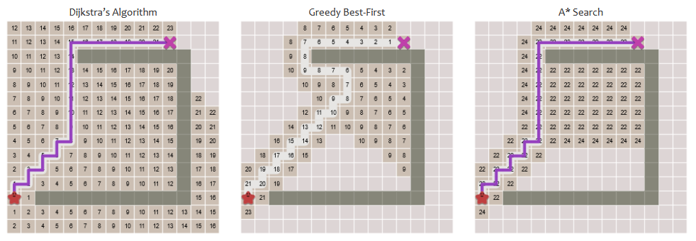

```csharp
record Node
{
    Vector3 Position;
    List<Node> Neighbors = new();
    // NB: We keep both scores because the heuristic is not guaranteed to be consistent.
    float GScore = float.Infinity; // Distance from start
    float FScore = float.Infinity; // Distance from start + heuristic
    Node? CameFrom = null;
}

// NB: Assumes all nodes are initialized as above.
List<Node> AStar(Node start, Node goal) {
    var toVisit = new PriorityQueue<Node, float>();
    start.GScore = 0;
    start.FScore = 0;
    toVisit.Enqueue(start, 0);

    Node current = start;
    while (current != goal) {
        var (current, gCurrent) = toVisit.Dequeue();

        foreach (var neighbor in current.Neighbors) {
            var gNeighbor = gCurrent + Distance(current, neighbor);
            if (gNeighbor < neighbor.GScore) {
                neighbor.GScore = gNeighbor;
            }

            var fNeighbor = neighbor.GScore + Heuristic(neighbor, goal);
            if (fNeighbor < neighbor.FScore) {
                neighbor.FScore = fNeighbor;
                neighbor.CameFrom = current;
                toVisit.Enqueue(neighbor, fNeighbor);
            }
        }
    }

    return null;
}

float Heuristic(Node a, Node b) {
    // Example: Euclidean distance
    return Vector3.Distance(a.Position, b.Position);
}
```

Nejkratší cestu lze pak zrekonstruovat takto:

```csharp
List<Node> ReconstructPath(Node goal) {
    var path = new List<Node> { goal };
    var current = goal;
    while (current.CameFrom is not null) {
        current = current.CameFrom
        path.Add(current);
    }
    path.Reverse();
    return path;
}
```

- **Datové struktury pro A\***
  A\* vyžaduje priority queue, která umí rychle vybírat prvek s nejnižší prioritou. Nejjednodušší je implementovat ji pomocí binární haldy. Pokud je však prohledávání na velmi velkém grafu (millions of nodes), lze pro urychlení použít například Bucketed Priority Queue (PBQ). Ta rozdělí uzly do bucketů podle jejich priority - buckety jsou seřazené, ale jejich obsah ne. Pro velký počet uzlů může být PBQ rychlejší díky menšímu počtu operací s pamětí.

- **Volba heuristiky**

  - Čím přesnější bude odhad vzdálenosti k cíli, tím rychlejší A\* bude.
  - Pokud heuristika **podceňuje** vzdálenost k cíli, bude algoritmus pomalejší.
  - Pokud heuristika **přeceňuje** vzdálenost k cíli, algoritmus nemusí najít nejkratší cestu.
  - Heuristika je _admissible_ pokud nepřeceňuje.

- **Heuristika -- Euklidovská vzdálenost**\
  Poskytuje poměrně přesný nebo podceněný odhad vzdálenosti k cíli. Funguje dobře v exteriérech, ale v interiérech dává kvůli stěnám a dalším překážkám silně podhodnocené odhady. [^pa217]

  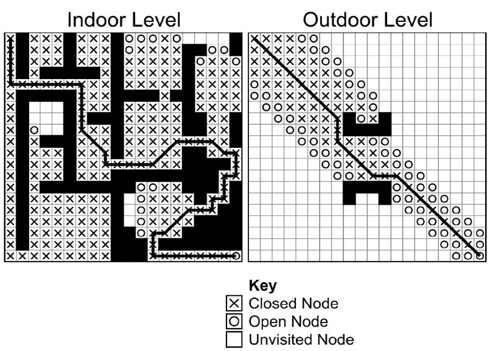

- **Clusterová (shluková) heuristika**

  - Shlukuje uzly blízko sebe (např. v rámci místnosti).
  - V rámci clusteru aplikuje Euklidovskou vzdálenost.
  - Pro vzdálenosti mezi clustery si udržuje look-up table (LUT).

    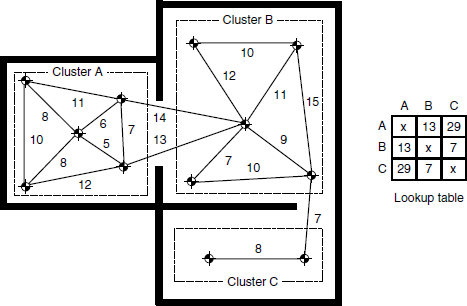

    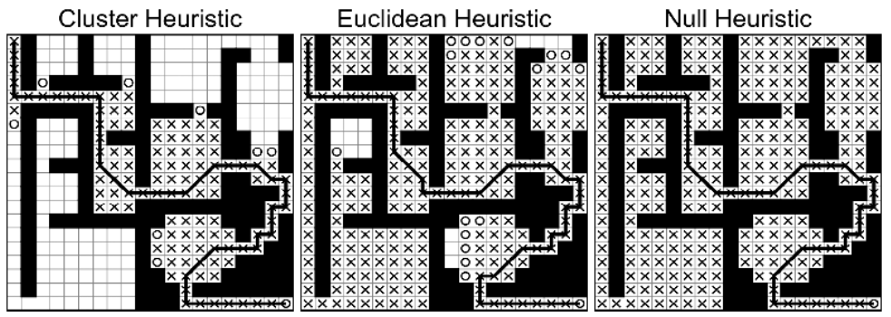

- **D** algoritmus*\
  Varianta A*, která se umí vyrovnat s dynamickými změnami v grafu.
- **Iterative Deepening A** (IDA*)*\
  Depth-first search s heuristikou. Iterative deepening znamená, že se postupně zvyšuje maximální hloubka prohledávání. [^ida-star]
- **Simplified Memory Bounded A** (SMA*)*\
  A\* co má nižší paměťové nároky.

### Reprezentace herního světa

Agenti nevidí herní svět stejně jako hráči, vidí ho spíš jako graf s uzly a hranami.

- **Division scheme**\
  Popisuje, jak je level rozdělen na uzly a hrany. Má vlastnosti:

  - _Kvantizace_: metoda převodu pozice na uzel.
  - _Lokalizace_: metoda převodu uzlu na pozici.
  - _Generace_: metoda vytvoření uzlů a hran. Může být manuální (třeba Dirichletovy domény) nebo automatická (třeba Visibility points).
  - _Validita_: všechny uzly, mezi kterými je cesta, musí být vzájemně dosažitelné ve hře.

- **Tile-based / dlaždicové**\
  Některé hry, např real-time strategie (RTS), mají svět rozdělen do čtvercových / hexagonálních dlaždic. Díky tomu je jednoduché je převést na graf, neboť co dlaždice to uzel.

  **Sid Meier’s Civilization V [^civ5]**

  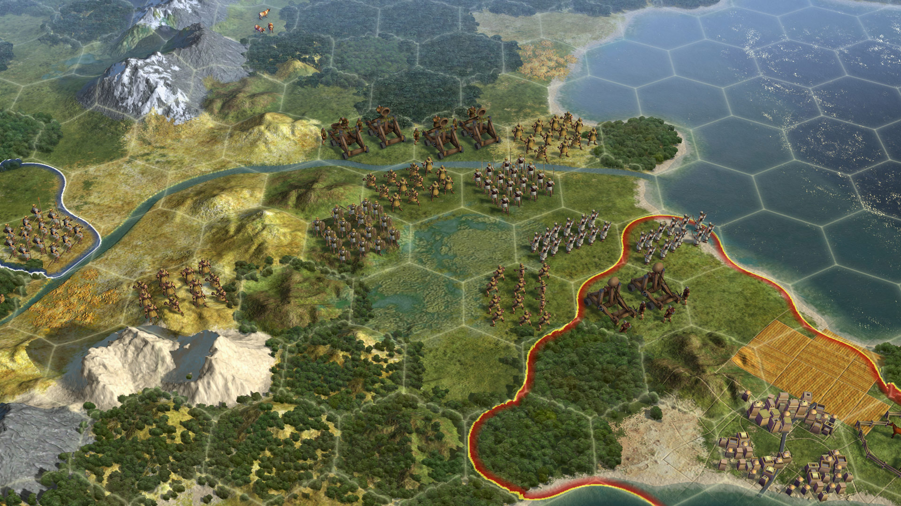

- **Dirichletova doména / Voronoiův diagram**\
  Level designer určí _charakteristické body_. Vytvořené regiony jsou složeny z bodů nejbližších danému charakteristickému bodu.

  **20 points and their Voronoi cells by [Balu Ertl](https://commons.wikimedia.org/w/index.php?curid=38534275)**

  

- **Points of visibility**\
  Je automatická metoda generování charakteristických bodů (typicky pro generování Voronoiova diagramu). Generuje je v místech, kde se geometrie levelu mění z konvexní na konkávní a naopak (např. v rozích místností). Posouvá je o šířku hráče.

  V praxi může generovat příliš mnoho bodů, ale může sloužit jako užitečný základ pro manuální úpravy.

  **Points of visibility [^ai-for-games]**

  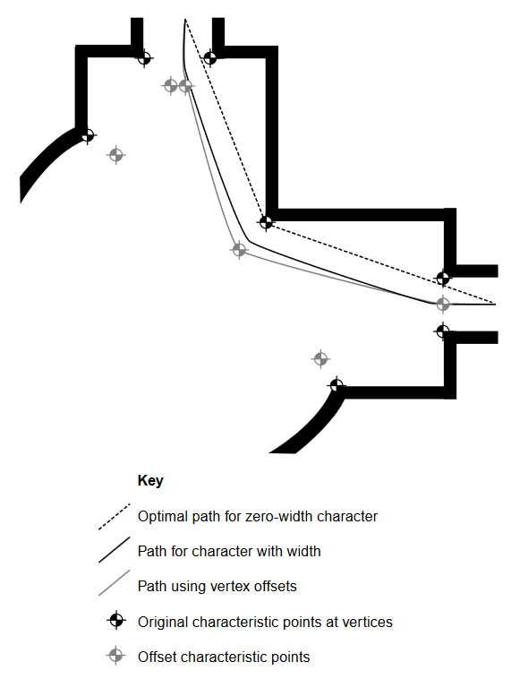

- **Navmesh / navigation mesh / navigační sítě**\
  Populární technika, kdy level designer popíše podlahové polygony. Agenti mohou chodit kamkoliv v rámci těchto polygonů a přecházet mezi těmi, které jsou spojené. Využívá geometrii už přítomnou v levelu nebo svoji vlastní.

  **Navigation System in Unity [^navmesh]**

  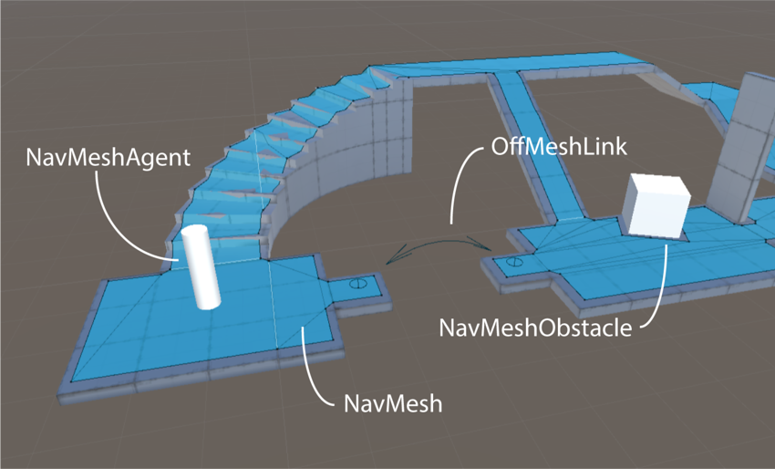

  **Polygonal mesh graph [^ai-for-games]**

  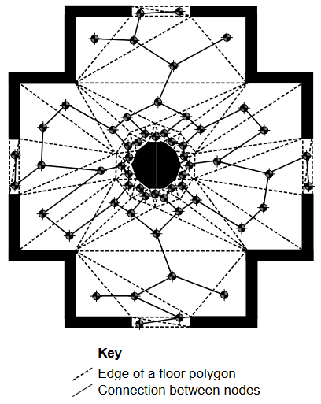

### Hierarchické hledání cest

> Nejdřív najde cestu mezi domy, pak teprve cestu od vchodových dveří k ledničce.

Nejprve hledá cestu na vysoké úrovni (mezi clustery), pak v rámci clusteru.

> [!IMPORTANT]
> Výhodou je, že zrychluje hledání cest.

Nevýhodou je, že vzdálenost mezi clustery se blbě měří, protože hráč do něj mohl vstoupit z různých míst. V praxi se používá třeba:

- nejkratší vzdálenost,
- nejdelší vzdálenost,
- průměrná minimální vzdálenost.

## Rozhodování

Agenti obvykle musí činit rozhodnutí ohledně toho, co budou dělat dál: zaútočit, ukrýt se, prchat, atd.

### Decision trees / rozhodovací stromy

Rozhodnutí jsou reprezentována jako strom. Vniřní uzly jsou podmínky, listy jsou akce, hrany reprezentují možnosti. Rozhodovací proces začíná u kořene a postupuje dolů stromem, dokud nenarazí na list -- ta akce se následně provede.

**Průchod rozhodovacím stromem [^ai-for-games]**

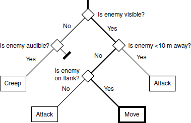

### State machines / stavové automaty

Reprezentuje aktuální chování agenta pomocí stavů ve stavovém automatu. Každý stav zahrnuje nějaké akce. Přechody mezi stavy jsou spojeny s podmínkami a akcemi.

**State machine [^ai-for-games]**


- **Hierarchické stavové automaty**\
  Stavy mohou obsahovat celé další stavové automaty. To umožňuje rozdělit chování agenta na části.

  **Hierarchical state machine [^ai-for-games]**

  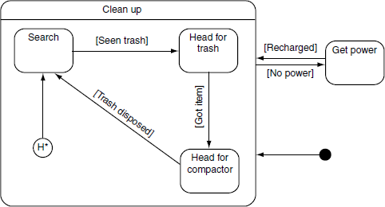

- **Stavový automat s rozhodovacími stromy v přechodech**\
  V přechodech mezi stavy jsou decision trees. Listy jsou další stavy.

  **State machine with decision tree transitions [^ai-for-games]**

  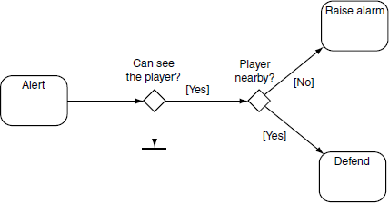

### Behavior trees / stromy chování

- Návrhový vzor používáný v herním vývoji.
- Je orientovaný na _úkoly_ (tasks) spíš než na _stav_ (state).
- Kombinuje množství jiných technik.
- Dá se vyrobit modulárně a znovupoužitelně.
- Často pro něj existují i custom editory s GUI.

**Behavior tree [^ai-for-games]**

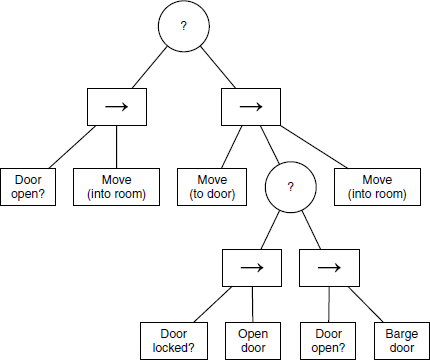

**Parallel behavior tree [^pa217]**

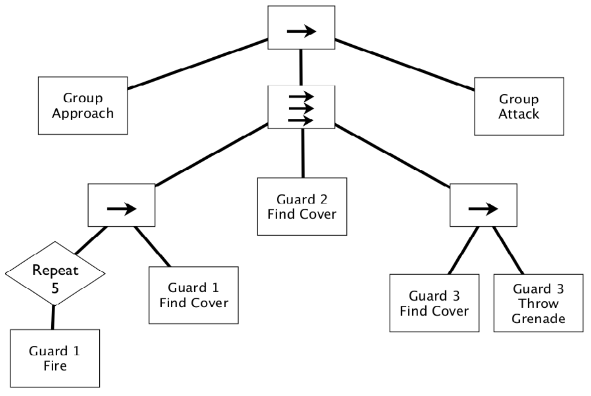

- **Listy**
- _Conditions_ (podmínky): vyhodnocují nějakou podmínku vůči postavě, hráči nebo hře. Mohou uspět nebo selhat.
- _Actions_ (akce): mění stav hry, pouští animace, interagují s hráčem. Obvykle uspějí, ale mohou selhat (např. pokud jsou přerušeny).

- **Vnitřní uzly**
- _Sequences_ (sekvence) $\to$: vykonávají své potomky po řadě, dokud _první_ **neselže**. Uspěje jen pokud uspějí všichni. Je to takový `AND`.
- _Selectors_ (selektory) $?$: vykonávají své potomky po řadě, dokud _první_ není **úspěšný**. Selže, pokud neuspěje žádný. Je to takový `OR`.
- _Parallel sequence/selector_ $\rightrightarrows$ / $???$: pouští všechny potomky najednou. Vyhodnocení zůstavá stejné.

- **Decorator / dekorátor**\
  Obaluje nějaký uzel a mění jeho chování (např. inverze výsledku, opakování).
- **Filtery**\
  Rozhodují, jestli akci provedou nebo ne, případně až po nějakém čase či s nějakou pravděpodobností. Např. nemusí být žádoucí, aby se agent pořád dokola snažil otevřít dveře.

### Cílem orientované chování

Charakter má své cíle a snaží se jich dosáhnout za pomoci mnoha různých akcí.

- Množina cílů, každý cíl má různou prioritu.
- Množina akcí závyslích na stavu světa (např. podle oběktů v okolí).
  - Akce mohou být atomické (např. sněz jídlo) nebo složené (např. jdi do supermarketu, kup jídlo, vrať se domů, sněz jídlo).
  - Provedené akce ovlivňují cíle (např. když sníme jídlo, změní se priorita cíle "sníst jídlo" na 0).
- Vybrání nejlepší akce není tak jednoduché.
  - Nejjednodušší je vybrat akci s nejvyšší prioritou. To ale může mít nevyžádané vedlejší efekty (např. mám žízeň, vypiju vodu, počůrám se, protože jsem měl i potřebu jít na záchod).
  - Můžeme určit celkovou nespokojenost na základě všech potřeb a vybrat akci, která ji nejvíce sníží. (Počůrání by zvýšilo nespokojenost, proto se charakter rozhodne jít první na záchod.)
  - Výběr akce by měl zohledňovat i délky jednotlivých akcí a jak se v průběhu času mění priority cílů.
  - Jednou akcí můžu znemožnit jinou. Proto je potřeba plánovat akce dopředu.

## Strategie a taktika

Řeší rozhodování při nedostatku informací, koordinaci více agentů, plánování, atd.

### Waypoints / navigační body

Waypoint je pozice v levelu, která je něčím zajímavá.

- **Pathfinding nodes**\
  Místa kudy se dá projít.
- **Tactical locations / rally points**\
  Místa kde se skrýt před útokem, místa ke snipení, místa pro ambush, atd. Do scény je může přidat přímo level designer nebo se mohou generovat automaticky.

  **Tactical locations [^ai-for-games]**

  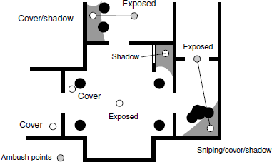

- **Context sensitive locations / závislost na kontextu**\
  Tactical locations mohou záviset na kontextu, třeba pozici protihráčů a jejich chování. Závislost na kontextu je implementována tak, že hodnota waypointu je předpočítána pro několik různých situací, či dodatečnou prací (např. ray castem) za běhu hry.
- **Cover points**\
  Místa, kde se agent může schovat před nepřítelem. Kvalita je závyslá na množství a směru krytí a aktuální pozici nepřítele.
- **Visibility points**\
  Místa s dobrým výhledem na důležité body v levelu. Visibility point může být zároveň i cover point, ale ne vždy.
- **Shadow points**\
  Místa ve stínu.

### Taktická analýza

Vyskytuje se primárně ve real-time strategických (RTS) hrách.

- **Influence maps**

  - Reprezentují aktuální vojenské působení agentů v dané oblasti.
  - Může být např. dán počtem jednotek a budov a jejich silou.
  - Upadá se vzdáleností od jednotek.
  - Používají se k určení toho, které oblasti jsou bezpečné a kterým je lepší se vyhnout, nebo kde jsou nepřátelské hranice nejslabší.
  - Pokud strana nemá všechny informace, můžeme vytvořit dvě influence mapy - každou pro jednoho hráče dle jemu dostupných informací.

    **Influence map by [gamedev.net](https://www.gamedev.net/tutorials/programming/artificial-intelligence/the-core-mechanics-of-influence-mapping-r2799/)**

    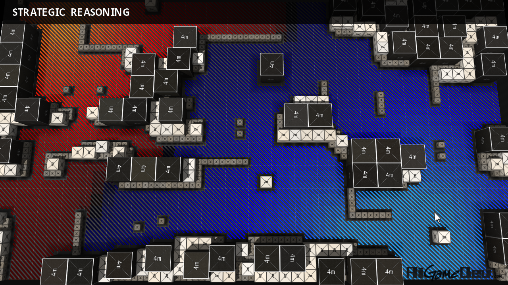

- **Terrain analyses**\
  Podobné waypointům ale pro vnější prostředí. Popisují, jak težké je daným terénem projít, jaká je na něm viditelnost, cover, možnost útect, potenciál ke snipení, atd.
- **Frag-map**\
  Mapa, která obsahuje hodnoty zabití - pokud agent dostane hit, hodnota klesne, pokud zasáhne nepřítele hodnota stoupne. Dá se předpočátat offline při testování a poté adaptovat za běhu hry.
- **Multi-layer analyses**\
  Informace v taktických analýzách lze rozdělit do tří kategorií:

  - _Statické_: např. pozice budov, terén, atd. Dají se předpočítat.
  - _Vyvíjející se / evolving_: např. vojenský vliv, zdroje. Počítají se průběžně, ale analýzu lze přerušit.
  - _Dynamické_: např. urgentní nebezpečí, dynamické stíny. Počítají se ad hoc za běhu.

**Umístění radaru**

Zajímá nás:

- Bezpečnost lokace. _Nechceme, aby ho hned zničili._
- Viditelnost lokace. _Čím viditelnější, tím lépší. Je to radar; chce vidět._
- Vzdálenost od jiných radarů. _Nemá smysl je stavět blízko sebe._

Možné řešení:

```math
\begin{aligned}

\text{Vhodnost} &= \text{Bezpečnost} \cdot \text{Viditelnost} \cdot \text{Vzdálenost}

\end{aligned}
```

## Deskové hry

Typicky turn-based hry pro dva hráče, často s perfektní informací.

- **Perfect information**\
  Od začátku hry jsou známe všechny možnosti a jejich následky.
- **Imperfect information**\
  Některé informace jsou skryté nebo náhodné, např. karty v ruce, hod kostkou.
- **Zero-sum games**\
  Hra, kde výhra jednoho hráče je prohrou druhého (např. šachy).
- **Non-zero-sum games**\
  Výhra jednoho hráče nemusí být prohra druhého, stejně tak prohra jednoho hráče nemusí být výhra druhého (např. kooperativní hry, prisoner’s dilemma).

### AI turn-based algoritmy

Algoritmy pro hledání nejlepšího tahu v tahových zero-sum deskových hrách pro dva hráče s perfektní informací.

- **Game tree**\
  Hru lze reprezentovat jako strom, kde uzly jsou stavy hry a hrany jednotlivé tahy. Listy jsou koncové stavy hry a mají hodnotu (výhru, prohru, remízu). Prohledáváním stromu lze najít nejlepší tah.

  - Branching factor: dán počtem možných tahů v daném stavu.
  - Depth: počet tahů do konce hry.
  - Transposition: do některých stavů se dá dostat více cestami.

#### Minimax algoritmus

Projdi strom a vyber nejlepší možný tah pro nás s ohledem na to, že soupeř bude volit nejlepší tah pro sebe.

- Vybíráme nejlepší pozici pro nás - výběr maximální hodnoty.
- Oponent vybírá nejhorší pozici pro nás - výběr minimální hodnoty.
- Výběr se opakuje až do listu stromu - koncový stav s danou hodnotou. V případě, že nejsme schopní z časových důvodů prohledat celý strom, můžeme použít heuristiku pro ohodnocení nody (třeba počet a ohodnocení bílích figurek - černých figurek).
  - **Alpha-beta pruning**\
    Stromy pro hry jsou obvykle příliš velké na to, aby se daly prohledat celé (tic-tac-toe 9! stavů, šachy > 10^40 stavů). Zároveň ale nepotřebujeme prohledávat části, u kterých víme, že se určitě nestanou. Např. pokud najdeme v maxovi větev s hodnotou 5, nemusíme prohledávat podstrom mina, o kterém víme, že vybere menší hodnotu než 3. Této optimalizaci se říká _alpha-beta pruning_.

Minmax i alpha-beta pruning se chápe nejlíp s vizualizací. Můžete kouknout například na [Algorithms Explained – minimax and alpha-beta pruning](https://youtu.be/l-hh51ncgDI?feature=shared).

#### Monte Carlo prohledávání

- **Monte Carlo**\
  Město známé pro svá casina.
- **Monte Carlo metoda**\
  Algoritmy a techniky spoléhající na náhodou, mega velké množiny vzorků a statistickou analýzu. [^monte-carlo]

- **Monte Carlo tree search (MCTS)**\
  Heuristický algoritmus pro prohledávání stromových grafů. V kontextu deskových her se používá pro hledání nejlepšího tahu.[^mcts]

  1. _Selection_: vyber uzel reprezentující stav hry, ze kterého ještě hra neskončila.
  2. _Expansion_: vytvoř možné volby ze zvoleného tahu.
  3. _Simulation_: vyber volbu náhodně a odsimuluj hru až do konce.
  4. _Backpropagation_: aktualizuj statistiky v uzlech na cestě od kořene k listu.

  **Step of Monte Carlo tree search by [Rmoss92](https://commons.wikimedia.org/w/index.php?curid=88889583)**

  

- **Tree boundary**\
  Metoda (policy), kdy v uzlech nad _MCTS tree boundary_ jsou akce voleny inteligentně. Pod touto hranicí jsou akce voleny náhodně.
- **Upper confidence bound (UCT)**\
  Metrika pro volbu nejlepšího uzlu.

  ```math
  \text{UCT} = \overline{X_j} + C \sqrt{\frac{\ln n}{n_j}}
  ```

  kde:

  - $\overline{X_j}$ je střední hodnota odměny z akce v uzlu $j$. Může být třeba počet výher / počet her.
  - $C$ je _exploration parameter_, který určuje, jak moc se má algoritmus zaměřovat na prozkoumávání nových uzlů.
  - $n$ je počet her, ve kterých byl zvolen rodičovský uzel.
  - $n_j$ je počet her, ve kterých byl zvolen uzel $j$.


[^pa217]: PA217 AI for Games
[^ai]: Ian Millington, John Funge: Artificial Intelligence for Games
[^steering]: [Steering Behaviors](https://slsdo.github.io/steering-behaviors/)
[^navmesh]: [Navigation System in Unity](https://docs.unity3d.com/Manual/nav-NavigationSystem.html)
[^astar]: [Introduction to the A\* Algorithm](https://www.redblobgames.com/pathfinding/a-star/introduction.html)
[^civ5]: [Sid Meier’s Civilization V](https://store.steampowered.com/app/8930/Sid_Meiers_Civilization_V/)
[^monte]: [Wikipedia: Monte Carlo method](https://en.wikipedia.org/wiki/Monte_Carlo_method)
[^mcts]: [Wikipedia: Monte Carlo tree search](https://en.wikipedia.org/wiki/Monte_Carlo_tree_search)
[^ida]: [Wikipedia: Iterative deepening A\*](https://en.wikipedia.org/wiki/Iterative_deepening_A*)
