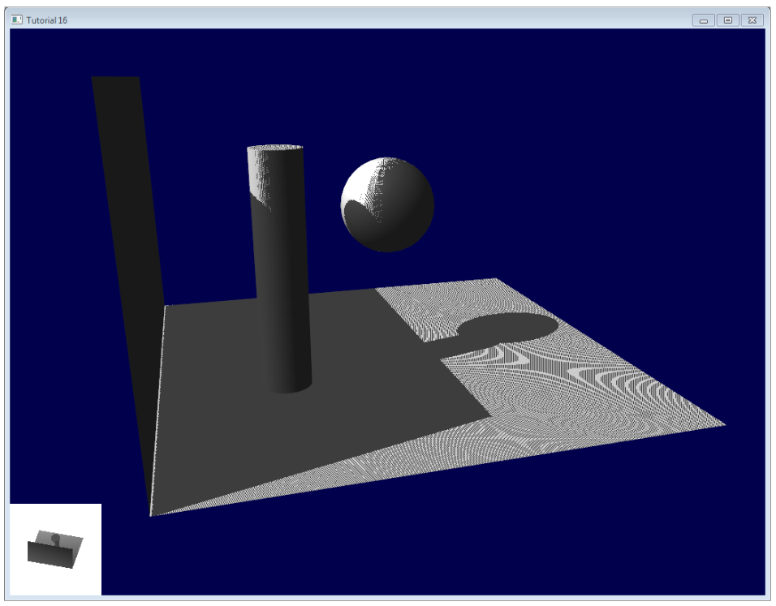
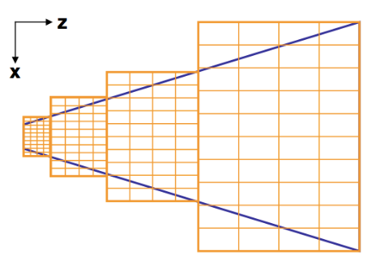
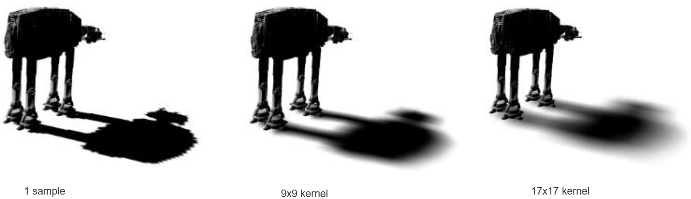
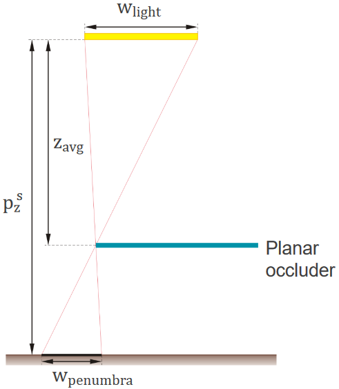
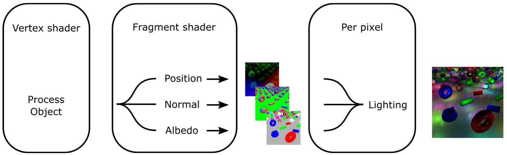
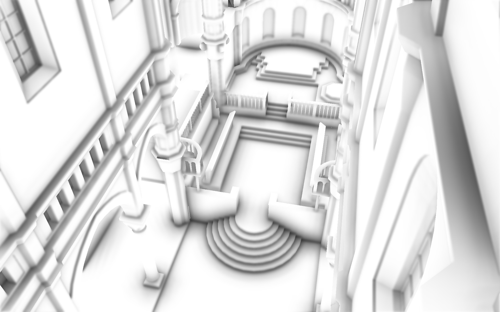

> [!WARNING]
> Tato otázka zatím nebyla aktualizována. Nová varze obsahuje pár termínů navíc!

> [!NOTE]
> Principy OpenGL, souřadnicové systémy (prostor světa, prostor kamery, prostor objektů), typy shaderů a jejich použití (vertex, fragment, compute, teselační). Technika stínových map. Principy odloženého stínování a jejich použití. Efekty prostoru obrazu (anti-alias, ambientní okluze).
> <br>
> _PV227_


- **OpenGL**\
  API pro (nejen) vykreslování grafiky na GPU.

  > OpenGL® is the most widely adopted 2D and 3D graphics API in the industry, bringing thousands of applications to a wide variety of computer platforms. It is window-system and operating-system independent as well as network-transparent.
  >
  > — Khronos

  OpenGL je velký state machine, něco jako telefonní ústředna. Má bambilion funkcí, které mění globální stav, a jen několik funkcí (jako jsou `glDraw*`), které i něco doopravdy dělají. OpenGL je proto poměrně tolerantní k pořadí, v jakém jsou funkce volány.

  **A large Bell System international switchboard in 1943**

  

- **OpenGL Shading Language (GLSL)**\
  Jazyk, ne nepodobný C, který se používá na psaní shaderů v OpenGL, WebGL a Vulkanu. Programy v něm (většinou) nejsou kompilované dopředu. Teprve za běhu programu jsou skrze OpenGL API ve zdrojové podobě předány GPU driveru, který je zkompiluje a spustí na GPU.
- **Primitives**\
  Způsob interpretace vertexových dat, která aplikace předává OpenGL.

  - Trojúhelníky (`GL_TRIANGLES`, `GL_TRIANGLE_STRIP`, `GL_TRIANGLE_FAN`),
  - čáry (`GL_LINES`, `GL_LINE_STRIP`, `GL_LINE_LOOP`),
  - body (`GL_POINTS`),
  - patche (`GL_PATCH`) -- pro teselaci.

## Souřadnicové systémy

> [!IMPORTANT]
> Tahle část otázky má značný překryv s otázkou [Modelování a projekce](../szp08_modelovani_a_projekce/).

**Coordinate Systems [^coordinate-systems]**


- **Model space / local space / prostor objektu**\
  Každý vykreslený objekt má svůj lokální souřadnicový prostor daný editorem, ve kterém byl vytvořen, nastavením exportu a formátem, ve kterém byl vyexportován: [^sw-coordinates]

  | Editor    | Handedness   | $X$     | $Y$        | $Z$        |
  | --------- | ------------ | ------- | ---------- | ---------- |
  | _Blender_ | right-handed | doprava | dopředu    | **nahoru** |
  | 3ds Max   | right-handed | doprava | dopředu    | **nahoru** |
  | Maya      | right-handed | doprava | **nahoru** | dopředu    |

- **World space / prostor světa**\
  Globální prostor, ve kterém se objekty nachází. Měřítko je dáno aplikací.

  Z model space do world space převádíme souřadnice pomocí **model** matice ($M$). Ta nám umožňuje objekt nejen posunout ale i otočit a změnit jeho měřítko.

- **Camera space / view space / eye space / prostor kamery**\
  Prostor, který je viděn z pozice kamery.

  _View_ matice ($V$) slouží k otočení, posunutí a případnému zvětšení nebo zmenšení prostoru světa tak, aby se objekty nacházely v prostoru před kamerou.

- **Clip space**\
  OpenGL očekává, že všechno, co bude vykresleno se nachází v jistém objemu -- clip space. Všechny souřadnice musíme do tohoto objemu převést a zároveň (pokud je to žádané) na ně aplikovat nějakou projekci (perspektivní, ortogonální, atd).

  Pro převod do clip space slouží _projection_ matice ($P$). Ta nám umožňuje objekt nejen posunout ale i otočit a změnit jeho měřítko. [^coordinate-systems]

  Tento prostor stále používá 4-dimenzionální homogenní souřadnice.

- **Normalized Device Coordinates (NDC)**\
  NDC je jako clip space, ale po převodu z homogenních souřadnic do kartézských pomocí _perspective divide_ (dělení $w$).

  V OpenGL je to kostka $x \in (-1.0, 1.0), y \in (-1.0, 1.0), z \in (-1.0, 1.0)$.

- **Window / viewport space**\
  Má velikost danou rozlišením okna a `glDepthRange`. Ve _výchozím nastavení_ je to $x \in (0, width), y \in (0, height), z \in (0, 1)$.

  OpenGL převádí NDC do window space pomocí _viewport_ transformace.

  > [!WARNING]
  > Počátek (origin) viewport space je **vlevo dole** a má ve výchozím nastavení má souřadnice $(0, 0)$. [^viewport]

- **OpenGL handedness**\
  NDC v OpenGL je **left-handed**. Nicméně v OpenGL panuje konvence, že world space a camera space jsou **right-handed** (např. s `glm`). K přechodu dochází překlopením směru osy $Z$ použitím projekční matice ($P$). [^coordinate-systems] V OpenGL tedy platí:

  | Space    | Handedness             | $X$     | $Y$    | $Z$                        |
  | -------- | ---------------------- | ------- | ------ | -------------------------- |
  | _Local_  | záleží na modelu       | --      | --     | --                         |
  | _World_  | typicky _right-handed_ | doprava | nahoru | **dozadu**                 |
  | _View_   | typicky _right-handed_ | doprava | nahoru | **dozadu** (**do** kamery) |
  | _Clip_   | _left-handed_          | doprava | nahoru | **dopředu**                |
  | _NDC_    | _left-handed_          | doprava | nahoru | **dopředu**                |
  | _Window_ | _left-handed_          | doprava | nahoru | **dopředu**                |

  > [!TIP]
  > Fun-fact: ve Vulkanu je NDC $x \in (-1.0, 1.0), y \in (-1.0, 1.0), z \in (\textcolor{red}{0.0}, 1.0)$. A navíc je **right-handed**, takže souřadnice $(-1.0, -1.0, 0.0)$ je vlevo **nahoře**, kdežto v OpenGL je vlevo **dole**. [^vulkan-coords]

## Pipeline (typy shaderů)

Při zvolání `glDraw*` se používá OpenGL pipeline, která se skládá z několika fází: [^pipeline]

**Diagram of the Rendering Pipeline [^pipeline]**


- **Vertex specification**\
  Fáze, kdy aplikace vytvoří popis vertexových dat, která posléze předá OpenGL. V téhle fázi se uplatňují _Vertex Array Objecty_ (VAO) a _Vertex Buffer Objecty_ (VBO).
- **Vertex shader (VS)**\
  Umožňuje programátorovi upravit data per vertex. Je spuštěn **jednou**, **paralelně** pro každý vertex.
- **Tesselation**\
  Volitelně umožňuje předaný patch rozdělit na více menších patchů (subdivision). Skládá se z:

  - _Tesselation Control Shader_ (TSC): spuštěn jednou per patch a definuje míru, do jaké je patch rozdělen.
  - _Tesselation Evaluation Shader_ (TES): je pak zodpovědný za interpolaci dat pro každý nový vertex.

- **Geometry shader (GS)**\
  Volitně umožňuje upravit / dogenerovat (teselovat) data per primitive. Je spušten jednou per primitive. Je mocnější než tesselation, ale tím pádem i méně efektivní.
- **Vertex post-processing**\
  OpenGL následně: [^post-process]

  1. sestaví primitives,
  2. ořeže je podle **user** clip space (nastavené programátorem v VS nebo GS pomocí `gl_ClipDistance`),
  3. provede perspective divide -- převede je do NDC:

     ```math
     (x_{ndc}, y_{ndc}, z_{ndc}) = \left( \frac{x_{clip}}{w_{clip}}, \frac{y_{clip}}{w_{clip}}, \frac{z_{clip}}{w_{clip}} \right)
     ```

  4. převede je do window / viewport space:

     ```cpp
     void glViewport(GLint x, GLint y, GLsizei width, GLsizei height);
     void glDepthRange(GLdouble nearVal, GLdouble farVal);
     void glDepthRangef(GLfloat nearVal, GLfloat farVal);
     ```

     ```math
     \begin{pmatrix}
         x_{\textit{viewport}} \\
         y_{\textit{viewport}} \\
         z_{\textit{viewport}}
     \end{pmatrix}
     =
     \begin{pmatrix}
         \frac{\textit{width}}{2} \cdot x_{ndc} + x + \frac{\textit{width}}{2} \\
         \frac{\textit{height}}{2} \cdot y_{ndc} + y + \frac{\textit{height}}{2} \\
         \frac{\textit{farVal} - \textit{nearVal}}{2} \cdot z_{ndc} + \frac{\textit{farVal} + \textit{nearVal}}{2}
     \end{pmatrix}
     ```

  5. předá je do fragment shaderu.

- **Rasterization**\
  Proces, kdy si OpenGL musí uvědomit, které fragmenty (jeden nebo více pixelů, pokud je zapnutý multisampling) jsou pokryty primitivem.
- **Fragment shader (FS)**\
  Umožňuje programátorovi nastavit, co se stane s každým fragmentem -- nastavit mu barvu, hloubku, atd. Je spuštěn **jednou**, **paralelně** pro každý fragment. Data z VS jsou interpolována.
- **Per-sample operations**\
  Řada operací, která rozhoduje jak a jestli vůbec bude fragment vykreslen. Patří sem:

  - test "vlastnictví" -- OpenGL nebude vykreslovat před cizí okna,
  - scissor test -- zahodí fragmenty, které nejsou ve vytyčené oblasti,
  - stencil test -- zahodí fragmenty, které neprojdou testem na stencil buffer -- umožňuje např. implementovat Portal effect,
  - test hloubky -- zahodí fragmenty, které jsou zakryty jinými fragmenty,

    > [!TIP]
    > Tenhle test se nemusí nutně stát až po FS. OpenGL se dá nastavit tak, aby provedlo _early depth test_ před spuštěním FS.

  - color blending a bitwise operace.

---

- **Compute shader**\
  Shader, který není součástí vykreslovácí pipeline, neboť neslouží k vykreslování ale obecným výpočtům na GPU.

## Shadow mapy

> [!IMPORTANT]
> Renderování stínů se věnuje také otázka [Pokročilá počítačová grafika](../vph01_pokrocila_grafika/).

1. Vytvoř shadow mapu -- vyrenderuj scénu z pohledu světla a ulož hloubku do Z-bufferu.
2. Stínování -- vyrenderuj scénu jako obvykle, ale aplikuj shadow mapu
   1. Transformuj aktuální pixel do light-space souřadnic.
   2. Porovnej aktuální hloubku s hloubkou v shadow mapě.
   3. Změň osvětlení na základě porovnání.

**The Shadow Mapping Depth Comparison [^shadow-maps]**


- Jednoduché na implementaci, ale v základu má artefakty, které je potřeba vyřešit.
- Vyžaduje alespoň dva průchody scénou.
- Rozlišení shadow mapy limituje kvalitu stínů.

- **Shadow acne**\
  Problém shadow map, kdy objekty mylně vrhají stíny samy na sebe.

  Řeší se vykreslováním jen back-sided polygonů (`glCullFace(GL_FRONT)`), a nebo biasem -- srovnáním hloubky s malým biasem / posunem (obvykle epsilon).

  

- **Peter Panning**\
  Když to s tím biasem přeženeme a objekty se začnou vznášet.

  > No tak, trošku jsem si zapřeháněl.
  >
  > — Učitel

- **Aliasing**\
  Stíny mají "schodovité" hrany.
- **Warping**\
  Když shadow mapy nejsou samplovány uniformně, ale tak aby místa blíže ke kameře byla pokryta hustěji.
- **Cascaded Shadow Maps**\
  Pokrývají blízké oblasti scény více texely pomocí textur s různými rozlišeními, ve snaze bojovat proti aliasingu.

  

- **Soft shadow maps -- Percentage-Closer Filtering (PCF)**\
  Rozmazává stíny uniformě fixním kernelem. [^pa010-2021]

  

- **Soft shadow maps -- Percentage-Closer Soft Shadows (PCSS)**\
  Počítá šíři penumbry pomocí velikosti světla, odhadu vzdálenosti blockeru (světlo-blokujícího objektu) od světla, a vzdálenosti mezi recieverem (objektem na který světlo dopadá) a blockerem. [^pa010-2021]

  ```math
  w_\text{penumbra} = \frac{p_z^s - z_\text{avg}}{z_\text{avg}} w_\text{light}
  ```

  

## Deferred shading / odložené stínování

Místo renderování přímo na obrazovku, vykreslíme scénu nejprve do textur (_geometry pass_), které označujeme jako **G-buffer** -- pozice, normály, barvy atd. Osvětlení je počítáno v odděleném průchodu (_lighting pass_) a vykresleno na obrazovku. [^pv227]

Tuto techniku použijeme např. když máme ve scéně fakt hodně světel.



> [!IMPORTANT]
> Výhody:
> <br>
> - osvětlení je počítáno jen jednou pro každý pixel,
> - můžeme mít více světel,
> - vyhodnocujeme méně různých kombinací materiálů a světel,
> - hodí se i na další post-process efekty.


> [!WARNING]
> Nevýhody:
> <br>
> - vzdáváme se multisamplingu (resp. musíme nejprve použít edge detection, aby multisampling fungoval správně),
> - ztěžuje implementaci průhledných materiálů,
> - vyžaduje více paměti,
> - materiály nesmí být příliš komplikované kvůli omezeným možnostem paměti.


## Screen space effects / efekty prostoru obrazu

### Anti-aliasing

- **Aliasing**\
  Aliasing vzniká, když je sample rate nižší než Nyquist frequency. Projevuje se jako nová nízko-frekvenční informace, která v obrazu neexistuje. Při renderování se projevuje jako "schody" na hranách objektů.

  **Aliasing [^anti-aliasing]**

  

- **Anti-aliasing**\
  Anti-aliasing jsou techniky, které zvyšují "samplovací frekvenci" renderování, a tak pomáhání eliminovat aliasing.
- **Super sample anti-aliasing (SSAA)**\
  Vyrenderujeme scénu v mnohem vyšším rozlišení a pak ji downscalujeme. Nevýhodou je, že počítáme _mnohem_ více fragmentů.
- **Multisample anti-aliasing (MSAA)**\
  Pro každý pixel máme 2/4/8/... subsamply. Každý fragment počítáme jen jednou, ale podle toho, kolik subsamplů ho pokrývá, ho blendujeme s již existují barvou.

  **MSAA [^anti-aliasing]**

  

### Ambient occlusion

Ambient occlusion approximuje, jak moc je objekt vystaven ambientním světlu. Jinými slovy jak moc by měl být objekt v daném místě tmavý kvůli okolním objektům. Pokud používáme ray-tracing máme ambient occlusion "zadarmo", jelikož paprsky narazí na okolní objekty. Pokud nemáme ray tracing, můžeme použít nějakou fintu.

**[NVidia HBAO+](https://www.nvidia.com/en-gb/geforce/technologies/hbao-plus/technology/)**



- **Screen-Space Ambient Occlusion (SSAO)**\
  Dívá se na okolí daného pixelu (v G-bufferu) a odhaduje tak jeho okluzi.

  **SSAO [^ssao]**

  


[^pipeline]: [Rendering Pipeline Overview](https://www.khronos.org/opengl/wiki/Rendering_Pipeline_Overview)
[^post-process]: [Vertex Post-Processing](https://www.khronos.org/opengl/wiki/Vertex_Post-Processing)
[^coordinate-systems]: [LearnOpenGL: Coordinate Systems](https://learnopengl.com/Getting-started/Coordinate-Systems)
[^sw-coordinates]: [Verge3D Wiki: Coordinate Systems](https://www.soft8soft.com/wiki/index.php/Coordinate_Systems)
[^viewport]: [`glViewport`](https://registry.khronos.org/OpenGL-Refpages/gl4/html/glViewport.xhtml)
[^depth-range]: [`glDepthRange`](https://registry.khronos.org/OpenGL-Refpages/gl4/html/glDepthRange.xhtml)
[^vulkan-coords]: [Vulkan’s coordinate system](http://anki3d.org/vulkan-coordinate-system/)
[^pv227]: [PV227 GPU Rendering (podzim 2022)](https://is.muni.cz/auth/el/fi/podzim2022/PV227/)
[^anti-aliasing]: [LearnOpenGL: Anti-Aliasing](https://learnopengl.com/Advanced-OpenGL/Anti-Aliasing)
[^ambient-occlusion]: [Wikipedia: Ambient occlusion](https://en.wikipedia.org/wiki/Ambient_occlusion)
[^ssao]: [LearnOpenGL: SSAO](https://learnopengl.com/Advanced-Lighting/SSAO)
[^shadow-maps]: [The Cg Tutorial: Shadow Mapping](https://developer.download.nvidia.com/CgTutorial/cg_tutorial_chapter09.html)
[^pa010-2021]: Byška, Furmanová, Kozlíková, Trtík: PA010 Intermediate Computer Graphics (podzim 2021)

## Další zdroje

- [Is OpenGL coordinate system left-handed or right-handed?](https://stackoverflow.com/questions/4124041/is-opengl-coordinate-system-left-handed-or-right-handed)
- [Cascaded Shadow Maps](https://learn.microsoft.com/en-us/windows/win32/dxtecharts/cascaded-shadow-maps)
- [Common Techniques to Improve Shadow Depth Maps](https://learn.microsoft.com/en-us/windows/win32/dxtecharts/common-techniques-to-improve-shadow-depth-maps)
