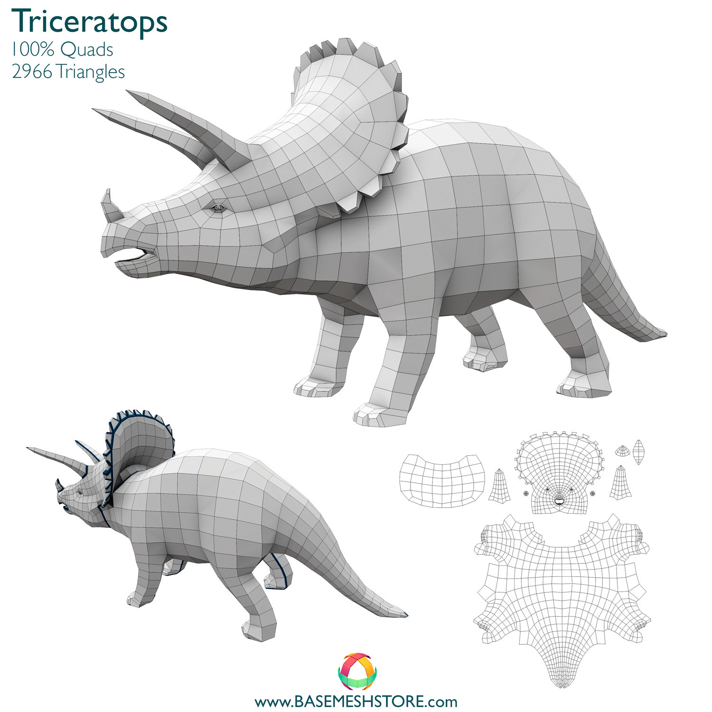
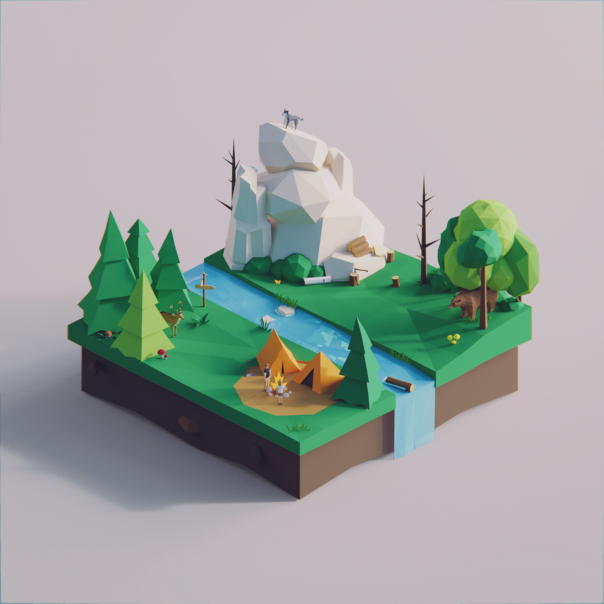
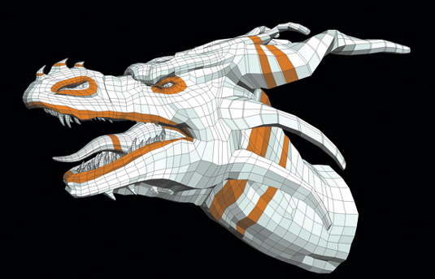
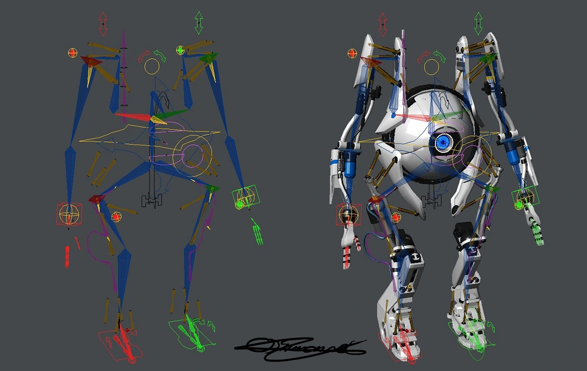
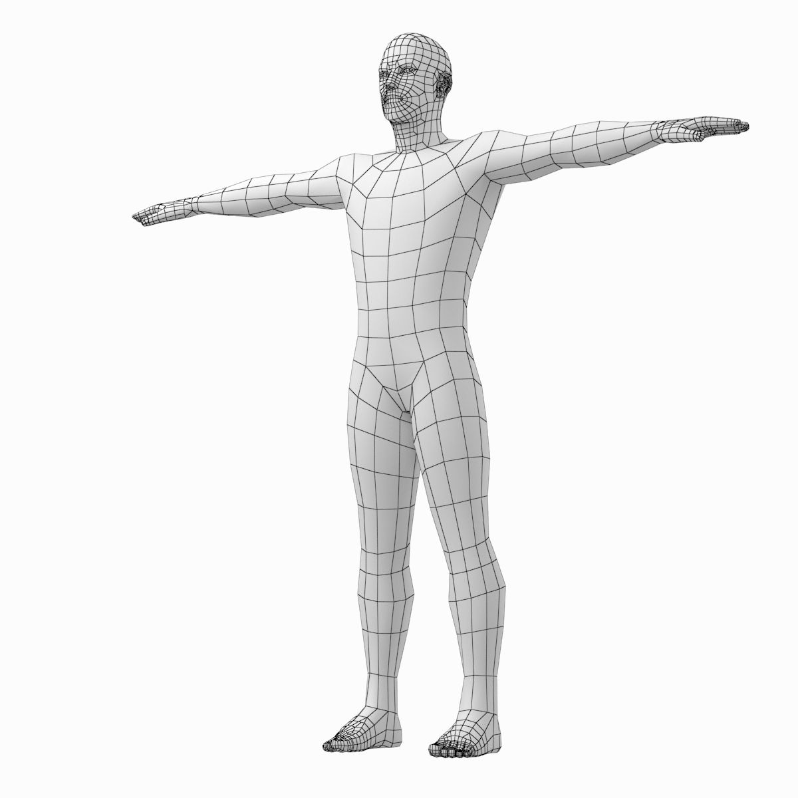

**⚠️ WARNING**\
Tato otázka zatím nebyla aktualizována. Nová varze obsahuje pár věcí navíc!

<dl><dt><strong>📌 NOTE</strong></dt><dd>

Avatar, postava, model. Modelování mnohoúhelníkových sítí (high-poly, low-poly), topologie a modifikace těchto sítí, tvorba textur (maps baking). Kostra modelu a potažení kostry (rigging, skinning).

_VV035, VV036_

</dd></dl>

- **Model**\
  Model je komplikované slovo s mnoha významy:

  > **model**, noun
  >
  > 1. a usually miniature representation of something\
  >    **also**: a pattern of something to be made
  > 2. **a**: a type or design of product (such as a car)\
  >    **b**: a type or design of clothing
  > 3. a system of postulates, data, and inferences presented as a mathematical description of an entity or state of affairs\
  >    **also**: a computer simulation based on such a system
  > 4. archetype
  > 5. an example for imitation or emulation
  > 6. one who is employed to display clothes or other merchandise
  > 7. a person or thing that serves as a pattern for an artist\
  >    **especially**: one who poses for an artist
  > 8. version
  > 9. a description or analogy used to help visualize something (such as an atom) that cannot be directly observed
  > 10. structural design
  > 11. an organism whose appearance a mimic imitates
  > 12. animal model
  > 13. (dialectal british): copy, image
  > 14. (obsolete): a set of plans for a building
  >
  > — Mirriam-Webster

  Nicméně v kontextu modelování 3D postav je model soubor (např. ve formátu `.fbx`, `.obj` či `.blend`) obsahující mesh. Nejblíže má tím pádem významu č. 1.

- **Character / postava**\
  Fiktivní osoba či jiná bytost. Typicky má nějaký background -- příběh, rysy osobnosti, vzhled, dovednosti, apod. V herních kontextech rozlišuje player character (PC) a non-player character (NPC).

  Vývojáři často zaměňují "postava" a "model".

- **Avatar**\
  Grafická reprezentace uživatele či uživatelovy postavy. [avatar](#avatar) Ve hrách je typicky implementován skrze 3D mesh (obsažený v modelu) či 2D sprite obohacený o animace, collidery, apod.

## Mnohoúhelníkové sítě

- **Polygon**\
  Mnohoúhelník.
- **(Polygon) mesh**\
  Mnohoúhelníková síť.
- **High-poly mesh**\
  Model s velkým množstvím polygonů. Typicky se jedná o model, který je určen např. pro pre-renderované cutscény a nikoliv pro hraní.

  Bývájí výsledkem **sculptingu** v programech jako je ZBrush či Mudbox.

  **Arachnid humanoid bust by [Alexander Tobler](https://yeaaa.artstation.com/projects/zRW1L)**

  

- **Low-poly mesh**\
  Model s malým množstvím polygonů. Typicky se jedná o model, který je vložen do hry a je tedy výhodné, aby bylo co možná nejjednodušší jen vykreslit.

  **Triceratops by [Base Mesh Store](https://www.artstation.com/artwork/EVzXO4)**

  

- **Low-poly stylizace**\
  Stylizace, kdy je model záměrně vytvořen s nízkým množstvím polygonů, protože to vypadá cool. Je to taková _skoro_ 3D analogie pixelartu.

  **Low Poly Worlds by [Pavel Novák](https://www.behance.net/gallery/89934319/Low-Poly-Worlds/modules/521713751)**

  

## Topologie a modifikace

**💡 TIP**\
Pro základní topologické pojmy viz [3D modelování a datové struktury](../3d-modelovani-a-datove-struktury/).

- **Meshflow**\
  Logické uspořádání hran a polygonů v mnohoúhelníkové síti.

  **📌 NOTE**\
   Nepovedlo se mi tenhle termín najít jinde než ve slidech pro VV035/VV036. Zdá se mi, že je to v zásadě synononymum pro _topologii_.

- **Quad topologie**\
  Při modelování (nejen postav) se snažíme, aby všechny polygony byly quady (čtyřúhelníky). Je to zejména proto, že subdivision na nich funguje lépe, a _3D artisti_ dokáží lépe odhadnout, co se s nimi při takových operacích stane.
- **Organic modeling**\
  Při modelování postav většinou vycházíme z nějaké anatomie z reálného světa. Snažíme se vyjít z toho, jak jsou v reálném světě kosti, svaly, apod. umístěny. V důsledku toho je například důležité mít edge loops okolo ramen, úst, a boků. [vv036-2023](#vv036-2023)

  Nejde jen o to vyrobit anatomicky věrný model, ale i o to, aby se model dobře rigoval a animoval. Správná topologie přispívá k tomu, aby se model plynule deformoval při animaci, aniž by se některé části modelu pohybovaly nerealisticky a rozbily _imerzi_.

  **Flowing edge loops and good topology are crucial for rigging and animation [organic](#organic)**

  

- **Retopologie**\
  Postup, kdy začneme s high-poly modelem, který jsme nejspíš vysculptovali bez ohledu na topologii, a ručně / automaticky na něm postavíme nový low-poly model se správnou topologií. Tohle nám umožňuje se nejprve soustředit na to, co za model chceme, a pak teprve na jeho technické provedení. [vv036-2023](#vv036-2023)
- **Box modeling**\
  Proces, kdy začneme od [default cube](https://www.youtube.com/watch?v=SDeVyxtdSUk), subdividneme ji a pokračujeme odtamtaď. [vv036-2023](#vv036-2023)
- **Point to point modeling**\
  Začneme od jediného bodu / polygonu. Tahle metoda je užitečná, když očekáváme, že retopologie modelu bude náročná, jelikož nám dává větší kontrolu nad meshflow. [vv036-2023](#vv036-2023)

## Textury

Typický 3D model se skládá nejen z meshe, ale i z materiálů, které jsou v herních enginech typicky reprezentovány texturami (mapami).

**📌 NOTE**\
Typy map souvisí s _physically based rendering_ (PBR), kterému se částečně věnuje otázka [Pokročilá počítačová grafika](../pokrocila-pocitacova-grafika/).

- **UV unwrapping**\
  Tvorba 2D reprezentace 3D modelu -- projekce jeho polygonů na 2D plochu. Toto mapování se posléze využívá při texturování. Proces zahrnuje označování _seams_ -- hran, podél kterých se bude model "rozřezávat". Nevhodná volba seams vede k deformaci textur.

  **Result of unwrapping Suzanne [uv-unwrap](#uv-unwrap)**

  

- **Diffuse / albedo map**\
  Základní barva modelu.
- **Detail map**\
  Detaily, které mají být na modelu vidět zblízka.
- **Emissive / glow / incandescence / self-illumination map**\
  Jak moc model "svítí" ve tmě. Používané pro modely, na které není aplikováno osvětlení scény.
- **Bump / displacement / height map**\
  Detaily na povrchu. Typicky se používá dohromady s teselací.
- **Normal map**\
  Normála na povrchu každého pixelu. Má podobný efekt jako displacement mapa, ale není aplikovaná na vertexy.

  **A normal mapped model, the mesh without the map, and the normal map alone (by [Eric Chadwick](https://ericchadwick.com/))**

  

- **Metallic / roughness map**\
  "Kovové" odlesky v daném místě modelu.
- **Light map**\
  Zapečené statické osvětlení. Typicky se týká spíš celých scén než postav.
- **Texture baking**\
  Proces přenosu detailů z (typicky high-poly) modelu na jiný (typicky low-poly) model. High-poly detaily jsou "zapečeny" do textur. Modelovací software typicky vrhá po modelu velké množství paprsků a výsledek ukládá do textur. [texture-baking](#texture-baking)

## Kostra modelu

- **Kostra / skeleton / rig**\
  Hierarchická struktura kostí (bones), jenž popisují, kde je možné model ohnout a animovat.

  **Rig of Atlas from Portal 2 by Oliver Simmonet**

  

- **(Skeletal) rigging**\
  Proces tvorby kostry.

  > Rigging is making our characters able to move. The process of rigging is we take that digital sculpture, and we start building the skeleton, the muscles, and we attach the skin to the character, and we also create a set of animation controls, which our animators use to push and pull the body around.
  >
  > — Josh Petty

- **Forward kinematics (FK)**\
  Animace se řetězí od parent kosti k child kosti. Pohneme-li rodičovskou kostí, pohnou se i její děcka. Klouby se hýbou po křivkách. [fk-ik](#fk-ik)
- **Inverse kinematics (IK)**\
  Animujeme jen koncové kosti. Pohyb rodičovských kostí je dopočítán. Klouby se hýbou po přímkách. [fk-ik](#fk-ik)
- **T-pose / reference pose**\
  Defaultní póza pro charakter při riggování.

  **T-pose by [vkstudio](https://free3d.com/3d-model/male-body-base-mesh-in-3-poses-with-detailed-head-and-limbs-3060.html)**

  

- **Skinning**\
  Úprava kostry tak, aby se povrch modelu správně deformoval při animaci. [vv036-2023](#vv036-2023) Například v Blenderu se skinning dá provést automaticky nebo nastavením _envelopes_ -- objemů obsahujících ovlivněné vertexy -- a jejich vah.

## Zdroje

- [[[avatar,1]]] https://en.wikipedia.org/wiki/Avatar_(computing)
- [[[vv036-2023,2]]] [VV036 3D Character Modeling (jaro 2023)](https://is.muni.cz/auth/el/fi/jaro2023/VV036/)
- [[[quads,3]]] [Why are quads used in filmmaking and triangle in gaming?](https://computergraphics.stackexchange.com/questions/5465/why-are-quads-used-in-filmmaking-and-triangle-in-gaming)
- [[[organic,4]]] [Tips and tricks for organic modelling](https://www.creativebloq.com/tips-and-tricks-organic-modelling-7123070)
- [[[texture-baking,5]]] [Texture Baking](http://wiki.polycount.com/wiki/Texture_Baking)
- [[[fk-ik,6]]] [FK and IK Explained - Which One to Use and When?](https://www.youtube.com/watch?v=0a9qIj7kwiA)
- [[[envelopes,7]]] [Blender: Deform](https://docs.blender.org/manual/en/latest/animation/armatures/bones/properties/deform.html)
- [[[uv-unwrap,8]]] [Blender: Unwrapping > Mapping Types](https://docs.blender.org/manual/en/2.79/editors/uv_image/uv/editing/unwrapping/mapping_types.html)

## Další zdroje

- [Moving and Manipulating Edge Poles](https://topologyguides.com/manipulating-edge-poles)
